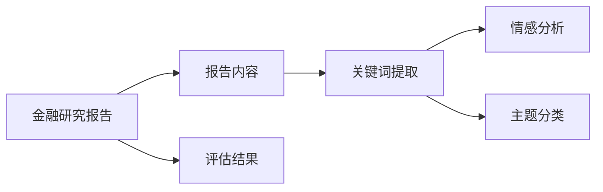
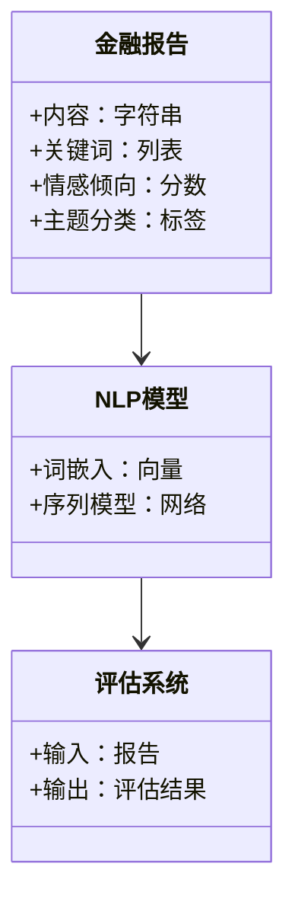
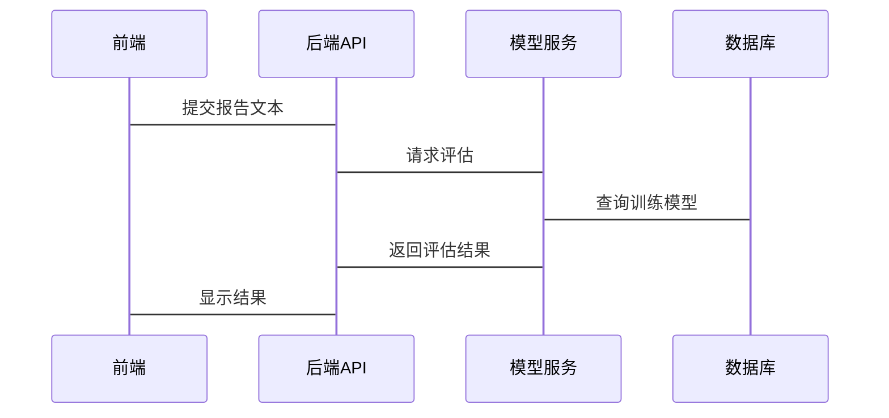

                 

# 构建基于NLP的金融研究报告质量评估系统

> 关键词：NLP, 金融研究报告, 质量评估, 机器学习, 文本挖掘

> 摘要：本文详细介绍了如何利用自然语言处理（NLP）技术构建一个高效的金融研究报告质量评估系统。通过分析金融报告的关键特征，结合先进的NLP算法，提出了一种基于深度学习的解决方案，旨在解决传统评估方法的局限性。文章从问题背景、核心概念、算法原理、系统设计到项目实战，全面阐述了系统的构建过程，并通过实际案例验证了系统的有效性和优越性。

---

# 第一部分: 背景介绍与核心概念

## 第1章: 问题背景与描述

### 1.1 问题背景
#### 1.1.1 金融研究报告的重要性
金融研究报告是金融行业中的重要工具，用于分析市场趋势、评估投资价值和制定决策策略。然而，报告的质量直接影响决策的准确性和效率。传统的报告评估方法依赖人工审查，效率低且主观性强。

#### 1.1.2 现有金融研究报告评估的痛点
- 人工评估耗时耗力，难以覆盖大量报告。
- 评估标准不统一，主观性较强。
- 报告内容复杂，涉及多领域知识，人工评估难以全面覆盖。

#### 1.1.3 NLP技术在金融领域的应用潜力
NLP技术可以通过自动化方式提取文本信息、识别关键词和情感倾向，为金融报告评估提供客观、高效的解决方案。

### 1.2 问题描述
#### 1.2.1 金融研究报告质量评估的核心要素
- 关键词提取：识别报告中的关键术语和主题。
- 情感分析：判断报告中的观点倾向。
- 主题分类：将报告分为不同的主题类别。
- 内容完整性：评估报告是否涵盖所有必要信息。

#### 1.2.2 当前评估方法的局限性
- 人工评估效率低，误差大。
- 传统评估方法缺乏客观性和一致性。
- 难以处理大量非结构化数据。

#### 1.2.3 基于NLP的评估系统的优势
- 自动化处理大量文本数据，节省时间和成本。
- 提供客观的评估结果，减少主观误差。
- 能够快速识别关键信息，提高评估效率。

## 第2章: 核心概念与联系

### 2.1 核心概念原理
#### 2.1.1 自然语言处理（NLP）的基本原理
NLP通过语言学和机器学习技术，将文本数据转化为可计算的特征，用于各种文本分析任务。

#### 2.1.2 金融研究报告的关键特征
金融报告通常包含市场分析、公司财务数据、投资建议等内容，这些内容可以通过NLP技术进行提取和分析。

#### 2.1.3 基于NLP的评估模型构建逻辑
通过提取报告中的关键词、分析情感倾向、分类主题等方式，构建评估模型，量化报告的质量。

### 2.2 核心概念对比分析
#### 2.2.1 不同NLP模型的特征对比（表格）
| 模型   | 输入类型 | 输出类型 | 优势                     |
|--------|----------|----------|--------------------------|
| Word2Vec | 文本       | 向量       | 适合关键词提取           |
| LSTM    | 序列文本   | 分类/预测 | 适合时间序列分析         |
| BERT    | 文本段落   | 分类/摘要 | 适合复杂文本理解         |

#### 2.2.2 金融报告与非金融文本的特征差异（表格）
| 特征         | 金融报告       | 非金融文本       |
|--------------|----------------|------------------|
| 专业术语      | 高             | 低               |
| 数据结构      | 结构化         | 非结构化         |
| 情感倾向      | 中性或明确      | 多样化           |

### 2.3 实体关系图

---

# 第二部分: 算法原理与数学模型

## 第3章: 算法原理讲解

### 3.1 词嵌入模型
#### 3.1.1 Word2Vec模型
Word2Vec通过上下文预测词义，生成词向量表示。

#### 3.1.2 GLOVE模型
GLOVE基于全局词向量，通过矩阵分解生成词向量。

#### 3.1.3 BERT模型
BERT利用预训练语言模型，通过自注意力机制捕捉文本上下文信息。

### 3.2 序列模型
#### 3.2.1 LSTM网络
LSTM通过循环结构处理序列数据，适合时间序列分析。

#### 3.2.2 Transformer架构
Transformer基于自注意力机制，适合处理长文本。

#### 3.2.3 BERT在文本分类中的应用
BERT通过预训练参数，直接进行文本分类任务。

## 第4章: 数学模型与公式

### 4.1 词嵌入计算公式
$$\text{Word2Vec} = \text{sum}(w_i \cdot w_j)$$

### 4.2 情感分析模型
$$P(y|x) = \frac{\exp(w \cdot x)}{\sum_{k} \exp(w_k \cdot x)}$$

### 4.3 主题分类模型
$$\text{主题概率} = \sum_{i=1}^{n} \alpha_i \cdot \beta_j$$

---

# 第三部分: 系统分析与架构设计

## 第5章: 系统分析

### 5.1 项目介绍
#### 5.1.1 项目目标
构建一个基于NLP的金融研究报告质量评估系统，提供自动化、高效的评估解决方案。

#### 5.1.2 项目范围
涵盖关键词提取、情感分析、主题分类等功能。

#### 5.1.3 项目关键成功因素
- 数据质量：确保训练数据的多样性和代表性。
- 模型选择：选择适合任务的NLP模型。
- 系统性能：优化系统运行效率。

### 5.2 系统功能设计
#### 5.2.1 领域模型

#### 5.2.2 系统架构设计

#### 5.2.3 系统接口设计
- 输入接口：接收金融报告文本。
- 输出接口：返回评估结果。

#### 5.2.4 系统交互设计

## 第6章: 系统架构设计

### 6.1 项目介绍
详细描述项目的背景、目标和范围。

### 6.2 系统功能设计
设计系统的功能模块，包括数据预处理、模型训练、评估执行等。

### 6.3 系统架构设计
展示系统的整体架构，包括前端、后端、模型服务和数据库。

### 6.4 系统接口设计
定义系统的输入输出接口，确保与其他系统的兼容性。

### 6.5 系统交互设计
通过序列图展示系统各组件之间的交互流程。

---

# 第四部分: 项目实战

## 第7章: 环境安装与系统实现

### 7.1 环境安装
安装Python、TensorFlow、Keras等必要的开发工具和库。

### 7.2 核心实现
实现关键词提取、情感分析和主题分类功能。

## 第8章: 实际案例分析

### 8.1 案例背景
选择一个实际的金融报告，描述其内容和评估需求。

### 8.2 案例实现
使用NLP模型对报告进行评估，展示具体步骤和结果。

### 8.3 案例分析
对比传统评估方法和基于NLP的评估方法，分析结果差异和优势。

## 第9章: 项目总结与优化

### 9.1 项目总结
总结项目的实现过程和取得的成果。

### 9.2 项目优化
提出系统的优化建议，如模型调优、功能扩展等。

---

# 第五部分: 结论与展望

## 第10章: 结论

### 10.1 核心结论
基于NLP的金融研究报告质量评估系统能够显著提高评估效率和准确性。

### 10.2 实践意义
本文提出的方法为金融行业提供了自动化、高效的报告评估工具，具有重要的应用价值。

## 第11章: 未来展望

### 11.1 拓展方向
- 研究更复杂的NLP模型，如大语言模型（LLM）。
- 扩展系统功能，如多语言支持、实时分析等。

### 11.2 技术发展趋势
随着NLP技术的不断进步，金融报告评估系统将更加智能化和自动化。

---

# 作者

作者：AI天才研究院/AI Genius Institute & 禅与计算机程序设计艺术 /Zen And The Art of Computer Programming

---

通过以上目录大纲，您可以按照每个章节的内容逐步展开编写详细的技术博客文章，确保每个部分都包含足够的细节和深度。

