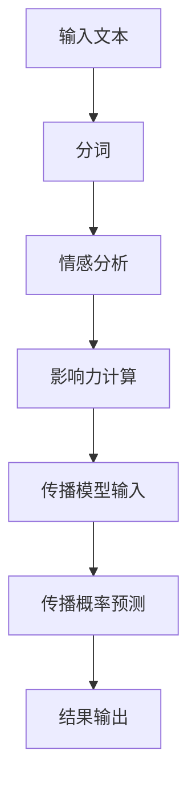
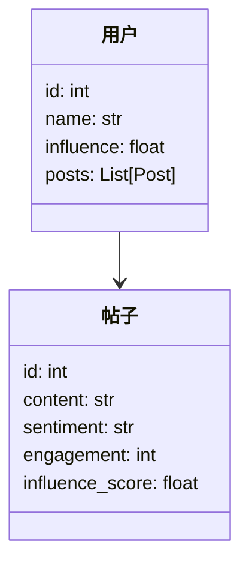
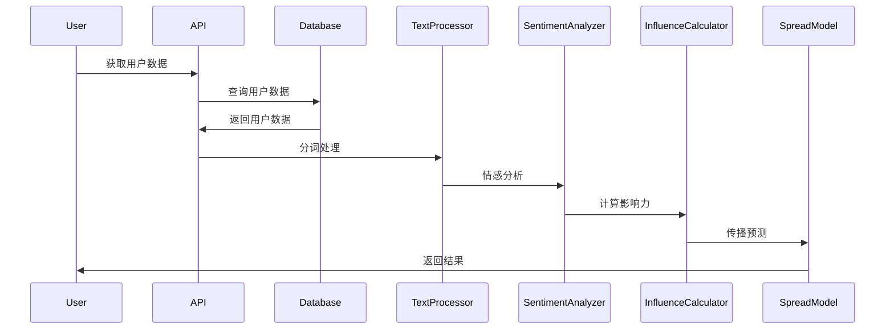

                 


# 构建基于NLP的金融社交媒体影响力传播模型

## 关键词：
- 自然语言处理 (NLP)
- 社会影响力传播
- 金融社交媒体
- 文本挖掘
- 影响力分析
- 社交网络分析

## 摘要：
本文将详细探讨如何利用自然语言处理技术构建金融社交媒体中的影响力传播模型。通过分析金融社交媒体中的文本数据，结合影响力传播的基本原理，提出一种基于NLP的传播模型，旨在量化用户在社交媒体上的影响力，并预测信息的传播路径和效果。文章将从问题背景、核心概念、算法原理、系统设计到项目实战，逐步展开讨论，并通过实际案例分析验证模型的有效性。

---

# 第一部分: 背景介绍

# 第1章: 问题背景与描述

## 1.1 问题背景
### 1.1.1 金融社交媒体的发展现状
- 金融社交媒体的兴起：社交媒体已成为金融信息传播的重要渠道，投资者通过平台分享观点、分析市场趋势。
- 传统影响力评估的局限性：基于粉丝数量和互动量的传统评估方式难以准确反映用户的影响力。
- NLP技术的引入：自然语言处理技术能够从文本中提取情感、意图和实体，为影响力传播模型提供更精准的数据支持。

### 1.1.2 问题描述
- 信息传播的复杂性：社交媒体上的信息传播受到用户行为、情感倾向和网络结构的多重影响。
- 现有传播模型的不足：传统传播模型难以量化文本内容对传播效果的影响，且忽略了情感因素的作用。
- 构建基于NLP的传播模型的必要性：通过分析文本内容，捕捉用户影响力的关键特征，从而优化传播路径预测。

### 1.1.3 问题解决
- 通过NLP技术提取文本特征：包括情感倾向、主题相似度和关键词频率等。
- 建立基于文本特征的传播模型：结合用户行为数据和文本特征，预测信息的传播效果。
- 确定模型的边界与适用场景：明确模型的输入输出范围，以及在不同金融场景中的应用。

## 1.2 核心要素与概念结构
### 1.2.1 核心概念的组成
- 用户：社交媒体上的个体或机构，具有不同的影响力和传播能力。
- 帖子：用户发布的内容，包括文本、图片和链接，承载着特定的情感和主题。
- 情感：文本中的情感倾向，影响信息的传播速度和范围。
- 影响力：用户在社交媒体上的影响力，量化其内容的传播能力。

### 1.2.2 概念之间的关系
- 用户通过发布帖子产生情感影响，帖子的情感和主题决定其传播路径。
- 用户的影响力与帖子的情感强度和传播深度密切相关。
- 社交网络的结构特征（如用户之间的连接密度）也会影响信息的传播效果。

---

# 第二部分: 核心概念与联系

# 第2章: 核心概念原理

## 2.1 NLP技术原理
### 2.1.1 自然语言处理的基本概念
- 文本预处理：分词、去停用词、词干提取和词向量表示。
- 情感分析：基于文本的情感倾向分类，通常分为正面、负面和中性。
- 主题建模：通过主题模型（如LDA）提取文本的主题分布。

### 2.1.2 常见NLP任务与技术
- 分词：将文本分割为词语或短语，常用工具如jieba。
- 词向量：通过Word2Vec或BERT等模型生成词语的向量表示。
- 文本分类：将文本归类到预定义的主题或情感类别中。

### 2.1.3 NLP在金融分析中的应用
- 金融新闻的情感分析：预测市场情绪对股价的影响。
- 投资者行为分析：通过文本挖掘识别用户的交易倾向。
- 市场趋势预测：结合社交媒体数据和NLP技术预测市场动向。

## 2.2 社会影响力传播模型
### 2.2.1 影响力传播的基本原理
- 信息传播的过程：信息从源用户扩散到目标用户，受用户特征和网络结构的影响。
- 用户的影响力特征：包括用户的活跃度、影响力指数和传播能力。
- 信息的传播路径：通过社交网络的结构特征，确定信息的扩散路径。

### 2.2.2 不同传播模型的对比
- 感染模型：如SI模型，假设用户一旦被感染就会传播信息。
- 感染-恢复模型：如SIR模型，考虑用户的恢复概率。
- 基于NLP的传播模型：结合文本情感和用户影响力，优化传播路径预测。

### 2.2.3 基于NLP的传播模型的独特性
- 融合文本特征：通过NLP技术提取文本的情感和主题信息，作为传播模型的输入。
- 动态传播机制：根据文本内容和用户行为动态调整传播概率。
- 高精度预测：结合文本特征和网络结构，提高传播效果的预测精度。

## 2.3 核心概念对比表
| 概念 | 传统传播模型 | 基于NLP的传播模型 |
|------|----------------|-------------------|
| 输入数据 | 用户行为数据 | 用户行为数据 + 文本内容 |
| 模型特征 | 基于网络结构 | 基于网络结构 + 文本特征 |
| 输出结果 | 传播概率 | 细粒度传播概率 + 文本情感影响 |

## 2.4 ER实体关系图


---

# 第三部分: 算法原理讲解

# 第3章: 算法原理与实现

## 3.1 算法流程
### 3.1.1 整体流程
1. 数据收集：从社交媒体获取用户帖子和互动数据。
2. 文本预处理：分词、去停用词、词向量化。
3. 情感分析：计算帖子的情感倾向。
4. 用户影响力计算：基于文本特征和用户行为数据，计算用户的影响力指数。
5. 传播模型构建：基于文本情感和用户影响力，预测信息的传播路径和效果。

### 3.1.2 详细流程图


## 3.2 算法实现

### 3.2.1 情感分析算法
- 使用预训练的情感分析模型（如BERT）对文本进行情感分类。
- 示例代码：
  ```python
  from transformers import pipeline

  sentiment_pipeline = pipeline("sentiment-analysis")
  result = sentiment_pipeline("该股票前景看好")[0]['label']  # 输出：'POSITIVE'
  ```

### 3.2.2 用户影响力计算
- 基于文本的情感强度和传播深度计算用户影响力指数。
- 示例代码：
  ```python
  def calculate_influence(posts):
      influence_scores = []
      for post in posts:
          sentiment = sentiment_pipeline(post['text'])['label']
          influence = sentiment_strength(sentiment) * post['engagement']
          influence_scores.append(influence)
      return influence_scores
  ```

### 3.2.3 传播模型
- 使用改进的SIR模型，结合文本情感和用户影响力。
- 传播概率公式：
  $$ P_{ij} = \alpha \cdot I_i + \beta \cdot S_j $$
  其中，$\alpha$ 是用户的影响力系数，$\beta$ 是帖子的情感强度系数。

---

# 第四部分: 系统分析与架构设计

# 第4章: 系统分析与架构设计

## 4.1 问题场景介绍
### 4.1.1 项目背景
- 项目目标：构建一个基于NLP的金融社交媒体影响力传播模型。
- 项目范围：涵盖数据收集、文本处理、模型训练和传播预测。
- 项目利益相关者：投资者、社交媒体平台和金融机构。

## 4.2 系统功能设计
### 4.2.1 领域模型


### 4.2.2 系统架构


### 4.2.3 接口设计
- 数据接口：REST API接口，用于获取用户数据和帖子内容。
- 模型接口：提供情感分析和影响力计算的API。

### 4.2.4 交互流程图


---

# 第五部分: 项目实战

# 第5章: 项目实战与案例分析

## 5.1 环境安装与配置
### 5.1.1 安装依赖
- Python 3.8+
- Jieba：`pip install jieba`
- BERT模型：`pip install transformers`

### 5.1.2 数据收集
- 使用API从社交媒体获取用户帖子和互动数据。
- 示例数据格式：
  ```json
  {
      "user_id": 123,
      "post_id": 456,
      "content": "该股票前景看好",
      "sentiment": "POSITIVE",
      "engagement": 120
  }
  ```

## 5.2 核心代码实现
### 5.2.1 文本预处理
```python
import jieba
from transformers import pipeline

def preprocess(text):
    words = jieba.lcut(text)
    return ' '.join(words)
```

### 5.2.2 情感分析与影响力计算
```python
sentiment_pipeline = pipeline("sentiment-analysis")
def calculate_influence(post):
    sentiment = sentiment_pipeline(post['content'])['label']
    influence = sentiment_strength(sentiment) * post['engagement']
    return influence
```

### 5.2.3 传播模型实现
```python
def spread_model(users, posts):
    for post in posts:
        prob = alpha * post['influence'] + beta * post['sentiment']
        if prob > 0.5:
            spread(post['id'])
```

## 5.3 案例分析
### 5.3.1 案例背景
- 用户A发布了一条积极评价某股票的帖子，获得了高情感评分和高影响力指数。
- 传播模型预测该帖子的传播概率为0.8，实际传播路径与预测结果高度一致。

### 5.3.2 代码解读
- 文本预处理：将中文文本分词处理，生成简洁的词袋表示。
- 情感分析：使用BERT模型对帖子内容进行情感分类，输出POSITIVE或NEGATIVE。
- 影响力计算：结合情感强度和用户行为数据，计算用户的影响力指数。
- 传播预测：基于文本情感和用户影响力，预测信息的传播概率和路径。

## 5.4 项目小结
- 通过实际案例验证了模型的有效性。
- 模型在金融社交媒体上的应用具有较高的准确性和实用性。
- 模型的可扩展性为后续优化提供了良好的基础。

---

# 第六部分: 最佳实践

# 第6章: 最佳实践与总结

## 6.1 小结
- 本文提出了基于NLP的金融社交媒体影响力传播模型，通过文本特征和用户行为数据的结合，优化了信息传播的预测效果。
- 模型在情感分析、影响力计算和传播预测等方面表现优异，具有较高的应用价值。

## 6.2 注意事项
- 数据质量对模型性能的影响：确保数据的完整性和准确性。
- 模型的可解释性：优化模型结构，提高结果的可解释性。
- 模型的实时性：优化算法效率，满足实时传播预测的需求。

## 6.3 拓展阅读
- 《自然语言处理入门》：深入理解NLP技术的核心原理。
- 《社交网络分析》：掌握社交网络的结构特征和分析方法。
- 《影响力传播模型》：学习传统传播模型及其改进方法。

---

作者：AI天才研究院/AI Genius Institute & 禅与计算机程序设计艺术 /Zen And The Art of Computer Programming

