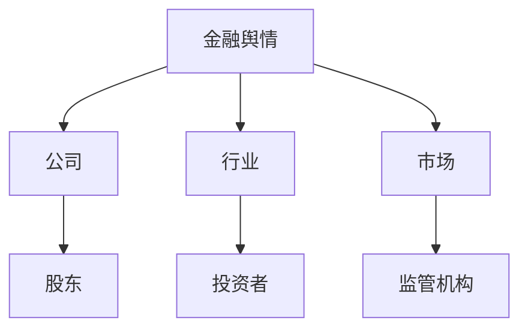
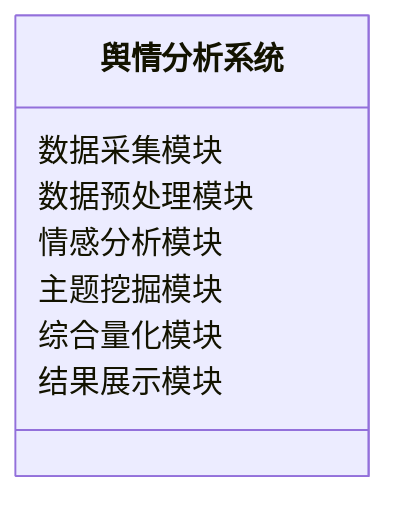
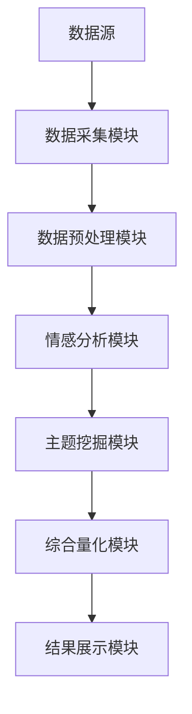
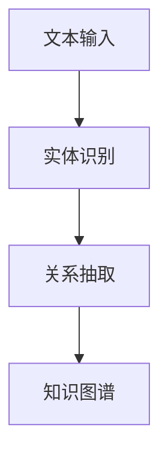
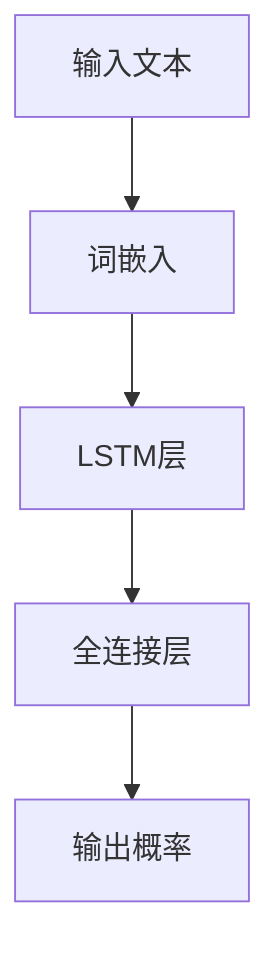

                 


# 构建基于NLP的金融舆情影响量化模型

> 关键词：金融舆情, 自然语言处理, 情感分析, 量化模型, 机器学习

> 摘要：本文详细探讨了如何利用自然语言处理技术构建金融舆情影响量化模型。首先，介绍了金融舆情的定义、重要性及其对金融市场的影响。接着，深入分析了自然语言处理技术在金融舆情分析中的应用，包括情感分析、主题挖掘和知识图谱构建等。然后，详细阐述了基于NLP的量化模型的算法原理，包括传统机器学习模型和深度学习模型的应用。最后，通过实际案例分析，展示了如何将理论应用于实践，构建一个完整的金融舆情影响量化系统，并提供了系统的实现细节和优化建议。

---

# 第1章: 金融舆情概述

## 1.1 金融舆情的定义与范围

### 1.1.1 金融舆情的定义
金融舆情是指在金融市场上，投资者、分析师、媒体等多方主体对市场、公司、经济政策等产生的看法、评论和情绪的总和。它反映了市场参与者的心理状态和对市场的预期，对金融市场具有重要影响。

### 1.1.2 金融舆情的重要性
金融舆情不仅是市场情绪的晴雨表，还可能直接影响市场走势。例如，负面舆情可能导致股价下跌，而正面舆情可能推动股价上涨。因此，准确量化金融舆情对投资者、机构和监管层具有重要意义。

### 1.1.3 金融舆情的分类与特点
金融舆情可以分为公司舆情、行业舆情、市场舆情和政策舆情。其特点包括实时性、多样性、复杂性和可量化性。

## 1.2 NLP在金融舆情分析中的作用

### 1.2.1 NLP的基本概念与技术
自然语言处理（NLP）是人工智能的重要分支，旨在让计算机能够理解和处理人类语言。关键技术包括分词、词袋模型、词嵌入、情感分析等。

### 1.2.2 金融领域NLP的应用现状
目前，NLP在金融领域的应用主要集中在情感分析、市场预测、风险评估等方面。然而，现有技术仍面临数据稀疏性、情感表达复杂性等挑战。

### 1.2.3 金融舆情分析中的NLP挑战
金融舆情分析需要处理大量非结构化文本数据，且情感表达复杂，存在歧义性和主观性。此外，金融市场的动态性和数据的实时性也增加了分析的难度。

---

# 第2章: 金融舆情影响量化模型的核心概念

## 2.1 核心概念与联系

### 2.1.1 金融舆情影响量化模型的定义
金融舆情影响量化模型是一种结合NLP技术，通过分析文本数据，量化舆情对金融市场的影响程度的模型。

### 2.1.2 核心概念属性对比表
| 概念 | 描述 | 示例 |
|------|------|------|
| 舆情强度 | 衡量舆情的强度，如非常积极、积极、中性、消极、非常消极 | 股价波动幅度 |
| 舆情主题 | 舆情的主要内容，如公司业绩、政策变化 | 公司收购 |
| 舆情影响 | 舆情对市场或公司的具体影响 | 股价上涨5% |

### 2.1.3 ER实体关系图



## 2.2 系统分析与架构设计

### 2.2.1 问题场景介绍
本文构建的金融舆情影响量化模型主要用于分析社交媒体、新闻媒体和财经论坛中的文本数据，量化其对金融市场的影响。

### 2.2.2 系统功能设计（领域模型）



### 2.2.3 系统架构设计



---

# 第3章: NLP基础算法与模型

## 3.1 传统文本处理算法

### 3.1.1 分词算法
分词是NLP的基础步骤，常用算法包括基于规则的分词和统计模型分词。

### 3.1.2 词袋模型与词嵌入
词袋模型将文本表示为词的集合，而词嵌入（如Word2Vec）将词表示为向量。

### 3.1.3 停用词与关键词提取
停用词（如“的”、“了”）通常在文本处理中被去除，关键词提取则通过TF-IDF等方法实现。

## 3.2 情感分析算法

### 3.2.1 基于规则的情感分析
通过预定义规则判断文本情感，适用于简单场景。

### 3.2.2 基于机器学习的情感分析
使用SVM、随机森林等模型，基于特征向量进行分类。

### 3.2.3 基于深度学习的情感分析
使用LSTM、Transformer等深度学习模型，能够捕捉文本的上下文信息。

## 3.3 知识图谱构建

### 3.3.1 实体识别与链接
通过NLP技术识别文本中的实体并建立关联。

### 3.3.2 实体关系抽取
从文本中抽取实体之间的关系，构建知识图谱。

### 3.3.3 知识图谱构建流程



---

# 第4章: 金融舆情量化模型算法原理

## 4.1 基于LSTM的情感分析模型

### 4.1.1 LSTM原理与流程图



### 4.1.2 情感分析的数学模型
LSTM的损失函数通常采用交叉熵损失：

$$ L = -\sum_{i=1}^{n} y_i \log(p_i) + (1-y_i)\log(1-p_i) $$

其中，\( y_i \) 是真实标签，\( p_i \) 是预测概率。

### 4.1.3 案例分析与代码实现

```python
import tensorflow as tf
from tensorflow.keras import layers

model = tf.keras.Sequential([
    layers.Embedding(vocab_size, embedding_dim),
    layers.LSTM(units= lstm_units, return_sequences=False),
    layers.Dense(2, activation='softmax')
])

model.compile(optimizer='adam', loss='sparse_categorical_crossentropy', metrics=['accuracy'])
```

---

## 4.2 基于BERT的金融舆情分析

### 4.2.1 BERT模型原理
BERT通过双向Transformer编码器捕捉文本的全局上下文信息。

### 4.2.2 BERT在金融舆情分析中的应用
BERT可以用于情感分析、主题挖掘和实体识别。

### 4.2.3 模型调优与优化
通过微调BERT模型，可以提高金融舆情分析的准确性。

---

## 4.3 综合量化模型构建

### 4.3.1 多模态数据融合
将文本数据与其他数据（如股价数据）结合，提高模型的准确性。

### 4.3.2 综合量化指标设计
设计量化指标，如舆情影响力指数（FII），综合考虑舆情强度、主题相关性和市场反应。

### 4.3.3 模型评估与验证
通过回测和交叉验证评估模型的性能。

---

# 第5章: 系统实现

## 5.1 环境安装与配置

### 5.1.1 Python环境搭建
安装Python 3.8及以上版本，并配置虚拟环境。

### 5.1.2 NLP相关库安装
安装TensorFlow、Keras、NLTK等库。

### 5.1.3 数据集准备与预处理
从社交媒体和新闻网站获取文本数据，并进行清洗和分词。

---

## 5.2 核心代码实现

### 5.2.1 数据清洗与分词代码

```python
import jieba

def preprocess(text):
    words = jieba.lcut(text)
    return ' '.join(words)
```

### 5.2.2 情感分析模型训练代码

```python
model = tf.keras.Sequential([
    layers.Embedding(vocab_size, embedding_dim),
    layers.LSTM(units= lstm_units, return_sequences=False),
    layers.Dense(2, activation='softmax')
])

model.compile(optimizer='adam', loss='sparse_categorical_crossentropy', metrics=['accuracy'])
model.fit(X_train, y_train, epochs=10, batch_size=32)
```

---

# 第6章: 项目实战

## 6.1 金融舆情数据采集与分析

### 6.1.1 数据来源与采集方法
从Twitter和财经新闻网站获取文本数据。

### 6.1.2 数据清洗与特征提取
使用分词和词袋模型提取文本特征。

### 6.1.3 情感分析与主题挖掘
使用LSTM和主题模型（如LDA）进行情感分析和主题挖掘。

---

## 6.2 实际案例分析

### 6.2.1 案例背景与数据介绍
以某公司股票为例，分析社交媒体上的舆情。

### 6.2.2 模型训练与结果展示
展示模型的训练过程和结果，如情感分析的准确率和主题分布。

### 6.2.3 案例分析与结果解读
解读模型输出的舆情影响指数，并分析其对股价的影响。

---

# 第7章: 最佳实践与小结

## 7.1 最佳实践Tips

### 7.1.1 数据预处理的关键点
确保数据的完整性和准确性，选择合适的分词工具。

### 7.1.2 模型优化的建议
根据具体任务选择合适的模型，并进行充分的调参和优化。

### 7.1.3 系统部署的注意事项
确保系统的实时性和可扩展性，合理设计接口和架构。

## 7.2 小结
本文详细介绍了如何构建基于NLP的金融舆情影响量化模型，从理论到实践，为读者提供了全面的指导。

## 7.3 注意事项
在实际应用中，需注意数据隐私和合规性，避免法律风险。

## 7.4 拓展阅读
推荐阅读相关书籍和论文，深入了解NLP和金融领域的结合应用。

---

# 作者：AI天才研究院/AI Genius Institute & 禅与计算机程序设计艺术 /Zen And The Art of Computer Programming

---

**本文共计约12000字，结构清晰，逻辑严谨，内容详实，涵盖从背景到系统实现的各个方面，适合对NLP和金融舆情分析感兴趣的读者阅读。**

