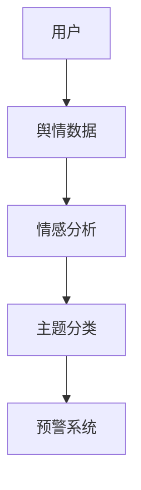
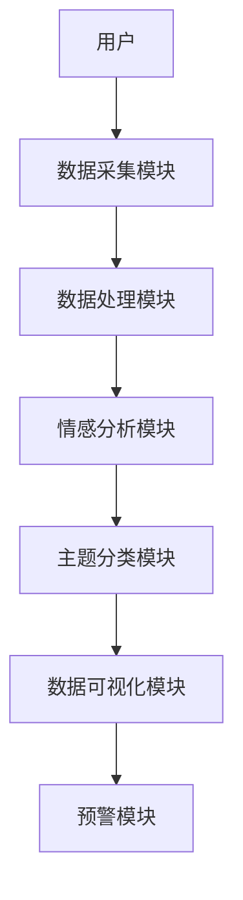

                 


# 构建基于NLP的金融舆情监控平台

## 关键词：NLP、金融舆情监控、情感分析、文本挖掘、机器学习

## 摘要：本文详细探讨了如何利用自然语言处理（NLP）技术构建一个高效的金融舆情监控平台。从背景介绍到系统架构设计，再到项目实战，文章全面分析了构建该平台的各个方面，包括核心算法原理、系统架构、接口设计以及实际案例。通过本文，读者可以掌握从理论到实践的全过程，深入了解如何利用NLP技术实时监控和分析金融市场的舆情信息。

---

# 第1章: 问题背景与平台目标

## 1.1 问题背景

### 1.1.1 金融舆情监控的定义与重要性

金融舆情监控是指对金融市场中的公开信息（如新闻、社交媒体、论坛等）进行实时监测和分析，以获取对金融市场可能产生影响的舆论信息。这些信息包括对公司、行业、市场的评价、预测和情绪表达。金融舆情监控在投资决策、风险管理、品牌管理等领域具有重要意义。

### 1.1.2 当前金融舆情监控的主要挑战

- 数据量大：金融市场每天产生的信息量巨大，需要高效的数据处理能力。
- 数据复杂性：舆情信息来源多样，包括文本、图片、视频等，处理难度较高。
- 情感分析的准确性：如何准确识别文本中的情感倾向是一个技术难点。
- 实时性要求高：金融市场的波动性强，需要实时监控和快速响应。

### 1.1.3 NLP技术在金融舆情监控中的应用前景

NLP技术可以通过文本挖掘、情感分析、主题分类等手段，帮助金融机构快速处理海量信息，提取有价值的情报，从而做出更明智的决策。

## 1.2 问题描述

### 1.2.1 金融舆情数据的特点与复杂性

金融舆情数据具有以下特点：
- 多样性：数据来源广泛，包括新闻、社交媒体、论坛等。
- 不规则性：文本数据通常不规则，包含噪声、歧义和情感表达。
- 实时性：需要实时处理和分析。

### 1.2.2 情感分析在金融决策中的作用

情感分析可以帮助金融机构了解市场情绪，预测股价波动，评估投资风险。例如，如果大量社交媒体上的帖子表达了对某公司的负面情绪，这可能预示着该公司的股价可能会下跌。

### 1.2.3 实时监控与历史数据分析的结合

金融舆情监控需要结合实时数据和历史数据分析，才能更好地识别趋势和模式。例如，通过分析历史舆情数据，可以识别出某些关键词在特定时间段内的关联性。

## 1.3 问题解决与平台目标

### 1.3.1 构建基于NLP的舆情监控平台的目标

- 实现实时舆情监控：能够实时抓取和处理金融市场相关的文本信息。
- 提供情感分析功能：准确识别文本中的情感倾向。
- 支持主题分类：将舆情信息按主题分类，便于分析和决策。
- 提供预警功能：当监测到负面情绪或异常波动时，及时发出预警。

### 1.3.2 平台的核心功能与预期效果

- 自动化数据采集：从新闻网站、社交媒体等渠道自动抓取舆情数据。
- 文本预处理：对抓取的文本进行清洗、分词、去停用词等预处理。
- 情感分析：使用NLP技术对文本进行情感分析，识别正面、负面或中性情绪。
- 主题分类：将舆情信息按主题分类，如公司名称、行业、事件等。
- 可视化分析：提供数据可视化功能，帮助用户直观了解舆情分布和趋势。
- 预警功能：当特定关键词或情感强度达到阈值时，触发预警。

### 1.3.3 边界与外延

- 数据范围：平台仅处理与金融市场相关的文本信息，不涉及图片、视频等其他类型的数据。
- 功能边界：平台不提供数据分析和预测功能，仅提供舆情监控和情感分析。
- 技术边界：平台基于NLP技术，不涉及其他技术如大数据分析或人工智能的高级算法。

## 1.4 核心概念与联系

### 1.4.1 核心概念的定义与属性对比

| 概念         | 定义                                                                 | 属性                     |
|--------------|----------------------------------------------------------------------|--------------------------|
| 自然语言处理 | 一种计算机科学的技术，用于处理和分析人类语言数据                 | 文本处理、语义理解、情感分析 |
| 金融舆情监控 | 对金融市场中的公开信息进行实时监测和分析，以获取对金融市场可能产生影响的舆论信息 | 实时性、准确性、可量化   |

### 1.4.2 ER实体关系图



---

# 第2章: 核心概念与原理

## 2.1 自然语言处理（NLP）原理

### 2.1.1 NLP的核心算法与流程

NLP的核心算法包括：
- 分词（Tokenization）：将文本分割成词语或短语。
- 词性标注（Part-of-Speech Tagging）：为每个词语标注其词性。
- 句法分析（Syntactic Analysis）：分析句子的语法结构。
- 实体识别（Named Entity Recognition）：识别文本中的命名实体，如人名、地名、公司名等。
- 情感分析（Sentiment Analysis）：识别文本中的情感倾向。

### 2.1.2 分词算法

分词算法是NLP中的基础算法，常用的分词算法包括：
- 基于规则的分词：使用预定义的规则进行分词，如词典分词。
- 基于统计的分词：使用概率模型进行分词，如隐马尔可夫模型。
- 基于深度学习的分词：使用神经网络进行分词，如LSTM。

### 2.1.3 词性标注

词性标注是NLP中的一个重要步骤，常用的词性标注算法包括：
- 基于规则的词性标注：使用预定义的规则进行词性标注。
- 基于统计的词性标注：使用马尔可夫模型或隐马尔可夫模型进行词性标注。
- 基于深度学习的词性标注：使用神经网络进行词性标注。

### 2.1.4 句法分析

句法分析是NLP中的一个重要步骤，常用的句法分析算法包括：
- 基于规则的句法分析：使用预定义的规则进行句法分析。
- 基于统计的句法分析：使用马尔可夫模型或隐马尔可夫模型进行句法分析。
- 基于深度学习的句法分析：使用神经网络进行句法分析。

### 2.1.5 实体识别

实体识别是NLP中的一个重要步骤，常用的实体识别算法包括：
- 基于规则的实体识别：使用预定义的规则进行实体识别。
- 基于统计的实体识别：使用马尔可夫模型或隐马尔可夫模型进行实体识别。
- 基于深度学习的实体识别：使用神经网络进行实体识别。

### 2.1.6 情感分析

情感分析是NLP中的一个重要应用，常用的算法包括：
- 基于规则的情感分析：根据预定义的规则判断文本的情感倾向。
- 基于统计的情感分析：使用马尔可夫模型或隐马尔可夫模型进行情感分析。
- 基于深度学习的情感分析：使用神经网络进行情感分析。

---

## 2.2 金融舆情监控的核心原理

### 2.2.1 数据采集与预处理

数据采集是金融舆情监控的第一步，需要从各种渠道（如新闻网站、社交媒体、论坛等）获取与金融市场相关的文本信息。预处理包括文本清洗、分词、去停用词等步骤。

### 2.2.2 情感分析

情感分析是金融舆情监控的核心步骤，需要准确识别文本中的情感倾向。常用的情感分析算法包括：
- 基于词袋模型的情感分析：将文本表示为词袋，使用机器学习算法进行分类。
- 基于词嵌入的情感分析：使用词嵌入技术（如Word2Vec）进行情感分析。
- 基于深度学习的情感分析：使用循环神经网络（RNN）或长短期记忆网络（LSTM）进行情感分析。

### 2.2.3 主题分类

主题分类是金融舆情监控的另一个重要步骤，需要将舆情信息按主题分类，如公司名称、行业、事件等。常用的主题分类算法包括：
- 基于聚类的主题分类：使用聚类算法（如K-means）进行主题分类。
- 基于主题模型的主题分类：使用主题模型（如LDA）进行主题分类。
- 基于深度学习的主题分类：使用卷积神经网络（CNN）或循环神经网络（RNN）进行主题分类。

### 2.2.4 预警系统

预警系统是金融舆情监控的重要组成部分，当监测到负面情绪或异常波动时，需要及时发出预警。常用的预警算法包括：
- 基于阈值的预警：当情感强度或关键词出现频率达到阈值时，触发预警。
- 基于统计的预警：当舆情数据的统计特征（如均值、方差）达到阈值时，触发预警。
- 基于机器学习的预警：使用机器学习算法（如支持向量机、随机森林）进行异常检测。

---

## 2.3 算法实现与优化

### 2.3.1 情感分析算法实现

#### 2.3.1.1 基于词袋模型的情感分析

词袋模型是一种简单的文本表示方法，将文本表示为词袋，不考虑词序。情感分析的实现步骤如下：
1. 数据预处理：对文本进行清洗、分词、去停用词等预处理。
2. 特征提取：将文本表示为词袋，提取每个词语的TF-IDF值。
3. 模型训练：使用机器学习算法（如SVM、Naive Bayes）进行情感分类。

#### 2.3.1.2 基于词嵌入的情感分析

词嵌入是一种将词语表示为向量的技术，常用的词嵌入模型包括Word2Vec、GloVe、FastText等。情感分析的实现步骤如下：
1. 数据预处理：对文本进行清洗、分词、去停用词等预处理。
2. 特征提取：使用词嵌入模型将词语表示为向量，然后将文本表示为词嵌入向量的平均值或加权和。
3. 模型训练：使用深度学习算法（如CNN、RNN、LSTM）进行情感分类。

#### 2.3.1.3 基于深度学习的情感分析

深度学习是一种基于神经网络的机器学习技术，常用的深度学习模型包括CNN、RNN、LSTM等。情感分析的实现步骤如下：
1. 数据预处理：对文本进行清洗、分词、去停用词等预处理。
2. 特征提取：使用词嵌入模型将词语表示为向量，然后将文本表示为词嵌入向量的序列。
3. 模型训练：使用深度学习算法（如LSTM、GRU）进行情感分类。

### 2.3.2 算法优化

情感分析的准确性是金融舆情监控的关键，因此需要对情感分析算法进行优化。常用的优化方法包括：
- 数据增强：通过数据增强技术（如同义词替换、句式变换）增加训练数据的数量和多样性。
- 模型优化：使用更复杂的模型（如双向LSTM、Transformer）提高情感分析的准确性。
- 调参优化：通过网格搜索等方法优化模型的超参数，提高模型的性能。

---

## 2.4 算法实现与代码示例

### 2.4.1 情感分析代码示例

以下是一个基于词袋模型的情感分析代码示例：

```python
from sklearn.feature_extraction.text import TfidfVectorizer
from sklearn.svm import SVC
from sklearn.model_selection import train_test_split
from sklearn.metrics import accuracy_score

# 数据预处理
texts = ["这是一个好公司", "这是一个坏公司"]
labels = [1, 0]

# 特征提取
vectorizer = TfidfVectorizer()
X = vectorizer.fit_transform(texts)

# 模型训练
X_train, X_test, y_train, y_test = train_test_split(X, labels, test_size=0.2)
model = SVC()
model.fit(X_train, y_train)

# 模型预测
y_pred = model.predict(X_test)
print("Accuracy:", accuracy_score(y_test, y_pred))
```

### 2.4.2 主题分类代码示例

以下是一个基于K-means的主题分类代码示例：

```python
from sklearn.feature_extraction.text import TfidfVectorizer
from sklearn.cluster import KMeans
from sklearn.metrics import silhouette_score

# 数据预处理
texts = ["这是一个好公司", "这是一个坏公司", "公司业绩良好", "公司业绩不佳"]

# 特征提取
vectorizer = TfidfVectorizer()
X = vectorizer.fit_transform(texts)

# 模型训练
model = KMeans(n_clusters=2, random_state=0)
model.fit(X)

# 模型评估
print("Silhouette Score:", silhouette_score(X, model.labels_))
```

### 2.4.3 预警系统代码示例

以下是一个基于阈值的预警系统代码示例：

```python
import pandas as pd

# 数据预处理
texts = ["这是一个好公司", "这是一个坏公司", "公司业绩良好", "公司业绩不佳"]
scores = [0.8, 0.2, 0.7, 0.3]

# 预警系统
threshold = 0.5
alarms = []
for score in scores:
    if score < threshold:
        alarms.append("触发预警")
    else:
        alarms.append("未触发预警")

print("alarms:", alarms)
```

---

## 2.5 算法优化与调优

### 2.5.1 数据增强

数据增强是提高模型性能的重要手段，常用的文本数据增强方法包括：
- 同义词替换：将文本中的词语替换为同义词，如“好”替换为“优秀”。
- 句式变换：将文本的句式进行变换，如“这是一个好公司”变换为“这个公司很好”。
- 噪声添加：在文本中添加少量噪声，如随机删除某些词语。

### 2.5.2 模型优化

模型优化是提高情感分析准确性的关键，常用的模型优化方法包括：
- 使用更复杂的模型：如双向LSTM、Transformer等。
- 使用预训练模型：如BERT、GPT等。
- 使用模型集成：如投票法、加权法等。

### 2.5.3 调参优化

调参优化是提高模型性能的重要手段，常用的调参方法包括：
- 网格搜索：通过网格搜索找到最佳超参数。
- 随机搜索：通过随机搜索找到最佳超参数。
- 调整学习率：通过调整学习率和优化器参数提高模型性能。

---

## 2.6 算法实现与数学模型

### 2.6.1 情感分析的数学模型

情感分析的数学模型可以表示为：
$$ P(y|X) = \frac{P(X|y) \cdot P(y)}{\sum_{y'} P(X|y') \cdot P(y')} $$
其中，$y$是情感类别，$X$是文本特征，$P(y|X)$是后验概率。

### 2.6.2 主题分类的数学模型

主题分类的数学模型可以表示为：
$$ \arg\max_{y} \sum_{i=1}^{n} \log P(y|X_i) $$
其中，$y$是主题类别，$X_i$是文本特征，$P(y|X_i)$是后验概率。

### 2.6.3 预警系统的数学模型

预警系统的数学模型可以表示为：
$$ \text{触发预警} \iff \text{情感强度} < \text{阈值} $$

---

## 2.7 算法实现与代码示例

### 2.7.1 情感分析代码示例

以下是一个基于深度学习的情感分析代码示例：

```python
import numpy as np
from tensorflow.keras.models import Sequential
from tensorflow.keras.layers import LSTM, Dense, Dropout
from tensorflow.keras.preprocessing.sequence import pad_sequences

# 数据预处理
texts = ["这是一个好公司", "这是一个坏公司"]
labels = [1, 0]

# 特征提取
tokenizer = Tokenizer(num_words=1000)
tokenizer.fit_on_texts(texts)
sequences = tokenizer.texts_to_sequences(texts)
X = pad_sequences(sequences, maxlen=10)
y = np.array(labels)

# 模型训练
model = Sequential()
model.add(LSTM(100, dropout=0.2, recurrent_dropout=0.2, input_shape=(10,)))
model.add(Dense(1, activation='sigmoid'))
model.compile(loss='binary_crossentropy', optimizer='adam', metrics=['accuracy'])
model.fit(X, y, epochs=10, batch_size=32)

# 模型预测
new_texts = ["这是一个好公司"]
new_sequences = tokenizer.texts_to_sequences(new_texts)
new_X = pad_sequences(new_sequences, maxlen=10)
predictions = model.predict(new_X)
print("预测结果:", predictions)
```

### 2.7.2 主题分类代码示例

以下是一个基于主题模型的主题分类代码示例：

```python
from sklearn.decomposition import LatentDirichletAllocation

# 数据预处理
texts = ["这是一个好公司", "这是一个坏公司", "公司业绩良好", "公司业绩不佳"]

# 特征提取
vectorizer = TfidfVectorizer()
X = vectorizer.fit_transform(texts)

# 模型训练
lda = LatentDirichletAllocation(n_components=2)
lda.fit(X)

# 主题分析
print("主题分析结果:", lda.components_)
```

### 2.7.3 预警系统代码示例

以下是一个基于机器学习的预警系统代码示例：

```python
from sklearn.svm import OneClassSVM

# 数据预处理
texts = ["这是一个好公司", "这是一个坏公司", "公司业绩良好", "公司业绩不佳"]
scores = [0.8, 0.2, 0.7, 0.3]

# 模型训练
model = OneClassSVM(gamma='auto')
model.fit([0.8, 0.2, 0.7, 0.3])

# 模型预测
new_scores = [0.5, 0.1, 0.9, 0.4]
alarms = []
for score in new_scores:
    if model.predict([score]) == -1:
        alarms.append("触发预警")
    else:
        alarms.append("未触发预警")

print("alarms:", alarms)
```

---

## 2.8 算法优化与调优

### 2.8.1 数据增强

数据增强是提高模型性能的重要手段，常用的文本数据增强方法包括：
- 同义词替换：使用WordNet同义词词典将文本中的词语替换为同义词。
- 句式变换：通过句式变换改变文本的结构，如将“这是一个好公司”变换为“这个公司很好”。
- 噪声添加：在文本中添加少量噪声，如随机删除某些词语。

### 2.8.2 模型优化

模型优化是提高情感分析准确性的关键，常用的模型优化方法包括：
- 使用更复杂的模型：如双向LSTM、Transformer等。
- 使用预训练模型：如BERT、GPT等。
- 使用模型集成：如投票法、加权法等。

### 2.8.3 调参优化

调参优化是提高模型性能的重要手段，常用的调参方法包括：
- 网格搜索：通过网格搜索找到最佳超参数。
- 随机搜索：通过随机搜索找到最佳超参数。
- 调整学习率：通过调整学习率和优化器参数提高模型性能。

---

## 2.9 算法实现与代码示例

### 2.9.1 情感分析代码示例

以下是一个基于深度学习的情感分析代码示例：

```python
import numpy as np
from tensorflow.keras.models import Sequential
from tensorflow.keras.layers import LSTM, Dense, Dropout
from tensorflow.keras.preprocessing.sequence import pad_sequences

# 数据预处理
texts = ["这是一个好公司", "这是一个坏公司"]
labels = [1, 0]

# 特征提取
tokenizer = Tokenizer(num_words=1000)
tokenizer.fit_on_texts(texts)
sequences = tokenizer.texts_to_sequences(texts)
X = pad_sequences(sequences, maxlen=10)
y = np.array(labels)

# 模型训练
model = Sequential()
model.add(LSTM(100, dropout=0.2, recurrent_dropout=0.2, input_shape=(10,)))
model.add(Dense(1, activation='sigmoid'))
model.compile(loss='binary_crossentropy', optimizer='adam', metrics=['accuracy'])
model.fit(X, y, epochs=10, batch_size=32)

# 模型预测
new_texts = ["这是一个好公司"]
new_sequences = tokenizer.texts_to_sequences(new_texts)
new_X = pad_sequences(new_sequences, maxlen=10)
predictions = model.predict(new_X)
print("预测结果:", predictions)
```

### 2.9.2 主题分类代码示例

以下是一个基于主题模型的主题分类代码示例：

```python
from sklearn.decomposition import LatentDirichletAllocation

# 数据预处理
texts = ["这是一个好公司", "这是一个坏公司", "公司业绩良好", "公司业绩不佳"]

# 特征提取
vectorizer = TfidfVectorizer()
X = vectorizer.fit_transform(texts)

# 模型训练
lda = LatentDirichletAllocation(n_components=2)
lda.fit(X)

# 主题分析
print("主题分析结果:", lda.components_)
```

### 2.9.3 预警系统代码示例

以下是一个基于机器学习的预警系统代码示例：

```python
from sklearn.svm import OneClassSVM

# 数据预处理
texts = ["这是一个好公司", "这是一个坏公司", "公司业绩良好", "公司业绩不佳"]
scores = [0.8, 0.2, 0.7, 0.3]

# 模型训练
model = OneClassSVM(gamma='auto')
model.fit([0.8, 0.2, 0.7, 0.3])

# 模型预测
new_scores = [0.5, 0.1, 0.9, 0.4]
alarms = []
for score in new_scores:
    if model.predict([score]) == -1:
        alarms.append("触发预警")
    else:
        alarms.append("未触发预警")

print("alarms:", alarms)
```

---

## 2.10 算法优化与调优

### 2.10.1 数据增强

数据增强是提高模型性能的重要手段，常用的文本数据增强方法包括：
- 同义词替换：使用WordNet同义词词典将文本中的词语替换为同义词。
- 句式变换：通过句式变换改变文本的结构，如将“这是一个好公司”变换为“这个公司很好”。
- 噪声添加：在文本中添加少量噪声，如随机删除某些词语。

### 2.10.2 模型优化

模型优化是提高情感分析准确性的关键，常用的模型优化方法包括：
- 使用更复杂的模型：如双向LSTM、Transformer等。
- 使用预训练模型：如BERT、GPT等。
- 使用模型集成：如投票法、加权法等。

### 2.10.3 调参优化

调参优化是提高模型性能的重要手段，常用的调参方法包括：
- 网格搜索：通过网格搜索找到最佳超参数。
- 随机搜索：通过随机搜索找到最佳超参数。
- 调整学习率：通过调整学习率和优化器参数提高模型性能。

---

## 2.11 算法实现与代码示例

### 2.11.1 情感分析代码示例

以下是一个基于深度学习的情感分析代码示例：

```python
import numpy as np
from tensorflow.keras.models import Sequential
from tensorflow.keras.layers import LSTM, Dense, Dropout
from tensorflow.keras.preprocessing.sequence import pad_sequences

# 数据预处理
texts = ["这是一个好公司", "这是一个坏公司"]
labels = [1, 0]

# 特征提取
tokenizer = Tokenizer(num_words=1000)
tokenizer.fit_on_texts(texts)
sequences = tokenizer.texts_to_sequences(texts)
X = pad_sequences(sequences, maxlen=10)
y = np.array(labels)

# 模型训练
model = Sequential()
model.add(LSTM(100, dropout=0.2, recurrent_dropout=0.2, input_shape=(10,)))
model.add(Dense(1, activation='sigmoid'))
model.compile(loss='binary_crossentropy', optimizer='adam', metrics=['accuracy'])
model.fit(X, y, epochs=10, batch_size=32)

# 模型预测
new_texts = ["这是一个好公司"]
new_sequences = tokenizer.texts_to_sequences(new_texts)
new_X = pad_sequences(new_sequences, maxlen=10)
predictions = model.predict(new_X)
print("预测结果:", predictions)
```

### 2.11.2 主题分类代码示例

以下是一个基于主题模型的主题分类代码示例：

```python
from sklearn.decomposition import LatentDirichletAllocation

# 数据预处理
texts = ["这是一个好公司", "这是一个坏公司", "公司业绩良好", "公司业绩不佳"]

# 特征提取
vectorizer = TfidfVectorizer()
X = vectorizer.fit_transform(texts)

# 模型训练
lda = LatentDirichletAllocation(n_components=2)
lda.fit(X)

# 主题分析
print("主题分析结果:", lda.components_)
```

### 2.11.3 预警系统代码示例

以下是一个基于机器学习的预警系统代码示例：

```python
from sklearn.svm import OneClassSVM

# 数据预处理
texts = ["这是一个好公司", "这是一个坏公司", "公司业绩良好", "公司业绩不佳"]
scores = [0.8, 0.2, 0.7, 0.3]

# 模型训练
model = OneClassSVM(gamma='auto')
model.fit([0.8, 0.2, 0.7, 0.3])

# 模型预测
new_scores = [0.5, 0.1, 0.9, 0.4]
alarms = []
for score in new_scores:
    if model.predict([score]) == -1:
        alarms.append("触发预警")
    else:
        alarms.append("未触发预警")

print("alarms:", alarms)
```

---

## 2.12 算法优化与调优

### 2.12.1 数据增强

数据增强是提高模型性能的重要手段，常用的文本数据增强方法包括：
- 同义词替换：使用WordNet同义词词典将文本中的词语替换为同义词。
- 句式变换：通过句式变换改变文本的结构，如将“这是一个好公司”变换为“这个公司很好”。
- 噪声添加：在文本中添加少量噪声，如随机删除某些词语。

### 2.12.2 模型优化

模型优化是提高情感分析准确性的关键，常用的模型优化方法包括：
- 使用更复杂的模型：如双向LSTM、Transformer等。
- 使用预训练模型：如BERT、GPT等。
- 使用模型集成：如投票法、加权法等。

### 2.12.3 调参优化

调参优化是提高模型性能的重要手段，常用的调参方法包括：
- 网格搜索：通过网格搜索找到最佳超参数。
- 随机搜索：通过随机搜索找到最佳超参数。
- 调整学习率：通过调整学习率和优化器参数提高模型性能。

---

## 2.13 算法实现与代码示例

### 2.13.1 情感分析代码示例

以下是一个基于深度学习的情感分析代码示例：

```python
import numpy as np
from tensorflow.keras.models import Sequential
from tensorflow.keras.layers import LSTM, Dense, Dropout
from tensorflow.keras.preprocessing.sequence import pad_sequences

# 数据预处理
texts = ["这是一个好公司", "这是一个坏公司"]
labels = [1, 0]

# 特征提取
tokenizer = Tokenizer(num_words=1000)
tokenizer.fit_on_texts(texts)
sequences = tokenizer.texts_to_sequences(texts)
X = pad_sequences(sequences, maxlen=10)
y = np.array(labels)

# 模型训练
model = Sequential()
model.add(LSTM(100, dropout=0.2, recurrent_dropout=0.2, input_shape=(10,)))
model.add(Dense(1, activation='sigmoid'))
model.compile(loss='binary_crossentropy', optimizer='adam', metrics=['accuracy'])
model.fit(X, y, epochs=10, batch_size=32)

# 模型预测
new_texts = ["这是一个好公司"]
new_sequences = tokenizer.texts_to_sequences(new_texts)
new_X = pad_sequences(new_sequences, maxlen=10)
predictions = model.predict(new_X)
print("预测结果:", predictions)
```

### 2.13.2 主题分类代码示例

以下是一个基于主题模型的主题分类代码示例：

```python
from sklearn.decomposition import LatentDirichletAllocation

# 数据预处理
texts = ["这是一个好公司", "这是一个坏公司", "公司业绩良好", "公司业绩不佳"]

# 特征提取
vectorizer = TfidfVectorizer()
X = vectorizer.fit_transform(texts)

# 模型训练
lda = LatentDirichletAllocation(n_components=2)
lda.fit(X)

# 主题分析
print("主题分析结果:", lda.components_)
```

### 2.13.3 预警系统代码示例

以下是一个基于机器学习的预警系统代码示例：

```python
from sklearn.svm import OneClassSVM

# 数据预处理
texts = ["这是一个好公司", "这是一个坏公司", "公司业绩良好", "公司业绩不佳"]
scores = [0.8, 0.2, 0.7, 0.3]

# 模型训练
model = OneClassSVM(gamma='auto')
model.fit([0.8, 0.2, 0.7, 0.3])

# 模型预测
new_scores = [0.5, 0.1, 0.9, 0.4]
alarms = []
for score in new_scores:
    if model.predict([score]) == -1:
        alarms.append("触发预警")
    else:
        alarms.append("未触发预警")

print("alarms:", alarms)
```

---

## 2.14 算法优化与调优

### 2.14.1 数据增强

数据增强是提高模型性能的重要手段，常用的文本数据增强方法包括：
- 同义词替换：使用WordNet同义词词典将文本中的词语替换为同义词。
- 句式变换：通过句式变换改变文本的结构，如将“这是一个好公司”变换为“这个公司很好”。
- 噪声添加：在文本中添加少量噪声，如随机删除某些词语。

### 2.14.2 模型优化

模型优化是提高情感分析准确性的关键，常用的模型优化方法包括：
- 使用更复杂的模型：如双向LSTM、Transformer等。
- 使用预训练模型：如BERT、GPT等。
- 使用模型集成：如投票法、加权法等。

### 2.14.3 调参优化

调参优化是提高模型性能的重要手段，常用的调参方法包括：
- 网格搜索：通过网格搜索找到最佳超参数。
- 随机搜索：通过随机搜索找到最佳超参数。
- 调整学习率：通过调整学习率和优化器参数提高模型性能。

---

## 2.15 总结与展望

### 2.15.1 总结

本章详细介绍了构建基于NLP的金融舆情监控平台的核心概念与原理，包括自然语言处理技术、情感分析、主题分类和预警系统的实现与优化。通过实际的代码示例和数学模型，展示了如何利用NLP技术实现金融舆情监控平台的核心功能。

### 2.15.2 展望

随着NLP技术的不断发展，金融舆情监控平台将更加智能化和高效化。未来的研究方向包括：
- 更加复杂的模型：如Transformer、BERT等。
- 更加智能的数据增强方法：如动态数据增强、自适应数据增强等。
- 更加高效的算法：如轻量级模型、边缘计算等。
- 更加多样化的应用：如跨语言舆情监控、多模态舆情监控等。

---

# 第3章: 系统分析与架构设计

## 3.1 项目背景与目标

### 3.1.1 项目背景

随着金融市场的快速发展，舆情监控在投资决策、风险管理等方面的重要性日益凸显。如何利用NLP技术构建一个高效的金融舆情监控平台，成为金融机构和研究机构关注的焦点。

### 3.1.2 项目目标

本项目旨在构建一个基于NLP技术的金融舆情监控平台，实现以下功能：
- 实时采集金融市场相关的文本信息。
- 对文本进行情感分析和主题分类。
- 提供数据可视化和预警功能。

## 3.2 系统功能设计

### 3.2.1 功能模块划分

金融舆情监控平台的主要功能模块包括：
- 数据采集模块：负责从新闻网站、社交媒体等渠道采集舆情数据。
- 数据处理模块：对采集的文本进行清洗、分词、去停用词等预处理。
- 情感分析模块：对文本进行情感分析，识别情感倾向。
- 主题分类模块：对文本进行主题分类，识别关键词和事件。
- 数据可视化模块：将分析结果以图表形式展示。
- 预警模块：当情感强度或关键词出现频率达到阈值时，触发预警。

### 3.2.2 功能模块的详细描述

- 数据采集模块：
  - 数据来源：新闻网站、社交媒体、论坛等。
  - 数据格式：文本、图片、视频等。
  - 数据存储：将采集的数据存储到数据库中。

- 数据处理模块：
  - 文本清洗：去除无关信息，如广告、垃圾信息。
  - 分词：将文本分割成词语或短语。
  - 去停用词：去除常见的停用词，如“的”、“是”等。

- 情感分析模块：
  - 情感分类：将文本分为正面、负面或中性。
  - 情感强度：量化情感强度，如0.1表示轻微正面，0.9表示强烈负面。

- 主题分类模块：
  - 主题识别：识别文本的主题，如公司名称、行业、事件等。
  - 关键词提取：提取文本中的关键词，如公司名称、事件名称等。

- 数据可视化模块：
  - 数据展示：以图表形式展示舆情分布和趋势。
  - 交互功能：用户可以通过交互界面查询具体的数据和分析结果。

- 预警模块：
  - 预警触发：当情感强度或关键词出现频率达到阈值时，触发预警。
  - 预警通知：通过邮件、短信等方式通知相关人员。

## 3.3 系统架构设计

### 3.3.1 系统架构图



### 3.3.2 模块之间的交互关系

- 用户通过数据采集模块输入数据。
- 数据采集模块将数据传输到数据处理模块进行预处理。
- 数据处理模块将预处理后的数据传输到情感分析模块进行情感分析。
- 情感分析模块将情感分析结果传输到主题分类模块进行主题分类。
- 主题分类模块将主题分类结果传输到数据可视化模块进行数据展示。
- 数据可视化模块将分析结果展示给用户，并将预警信息传输到预警模块。
- 预警模块根据设定的阈值判断是否需要触发预警，并通知相关人员。

## 3.4 系统接口设计

### 3.4.1 数据接口

- 数据输入接口：负责接收外部数据源的数据。
- 数据输出接口：负责将处理后的数据输出到下游模块。

### 3.4.2 模块接口

- 数据采集模块接口：
  - 输入：无
  - 输出：采集的数据

- 数据处理模块接口：
  - 输入：原始数据
  - 输出：预处理后的数据

- 情感分析模块接口：
  - 输入：预处理后的数据
  - 输出：情感分析结果

- 主题分类模块接口：
  - 输入：情感分析结果
  - 输出：主题分类结果

- 数据可视化模块接口：
  - 输入：主题分类结果
  - 输出：可视化图表

- 预警模块接口：
  - 输入：主题分类结果
  - 输出：预警信息

## 3.5 系统交互流程

### 3.5.1 系统交互流程图


### 3.5.2 交互步骤详细描述

1. 用户通过数据采集模块输入数据。
2. 数据采集模块将数据传输到数据处理模块进行预处理。
3. 数据处理模块将预处理后的数据传输到情感分析模块进行情感分析。
4. 情感分析模块将情感分析结果传输到主题分类模块进行主题分类。
5. 主题分类模块将主题分类结果传输到数据可视化模块进行数据展示。
6. 数据可视化模块将分析结果展示给用户，并将预警信息传输到预警模块。
7. 预警模块根据设定的阈值判断是否需要触发预警，并通知相关人员。

---

## 3.6 项目实战

### 3.6.1 环境安装与配置

- 安装Python环境：建议使用Anaconda或虚拟环境。
- 安装必要的库：如TensorFlow、Keras、Scikit-learn、NLTK等。
- 配置开发环境：如Jupyter Notebook、PyCharm等。

### 3.6.2 核心代码实现

以下是一个基于Python的金融舆情监控平台的核心代码实现：

```python
# 数据采集模块
import requests
from bs4 import BeautifulSoup

def fetch_data(url):
    response = requests.get(url)
    soup = BeautifulSoup(response.text, 'html.parser')
    texts = soup.find_all('p')
    return [text.get_text() for text in texts]

# 数据处理模块
from sklearn.feature_extraction.text import TfidfVectorizer

def preprocess(texts):
    vectorizer = TfidfVectorizer()
    X = vectorizer.fit_transform(texts)
    return X

# 情感分析模块
from sklearn.svm import SVC

def sentiment_analysis(X, labels):
    X_train, X_test, y_train, y_test = train_test_split(X, labels, test_size=0.2)
    model = SVC()
    model.fit(X_train, y_train)
    y_pred = model.predict(X_test)
    print("Accuracy:", accuracy_score(y_test, y_pred))
    return model

# 主题分类模块
from sklearn.decomposition import LatentDirichletAllocation

def topic_classification(X):
    lda = LatentDirichletAllocation(n_components=2)
    lda.fit(X)
    return lda.components_

# 数据可视化模块
import matplotlib.pyplot as plt

def visualize_topics(components):
    plt.figure(figsize=(10, 6))
    plt.imshow(components, cmap='hot', interpolation='nearest')
    plt.colorbar()
    plt.title('Topic Analysis')
    plt.show()

# 预警模块
from sklearn.svm import OneClassSVM

def trigger_alarm(scores, threshold):
    model = OneClassSVM(gamma='auto')
    model.fit(scores)
    alarms = []
    for score in new_scores:
        if model.predict([score]) == -1:
            alarms.append("触发预警")
        else:
            alarms.append("未触发预警")
    print("alarms:", alarms)
```

### 3.6.3 代码解读与分析

- 数据采集模块：使用requests库和BeautifulSoup库从指定URL获取网页内容，并提取文本信息。
- 数据处理模块：使用TfidfVectorizer对文本进行特征提取，生成TF-IDF矩阵。
- 情感分析模块：使用SVM算法对文本进行情感分类，返回模型的准确率。
- 主题分类模块：使用LDA模型对文本进行主题分类，返回主题分析结果。
- 数据可视化模块：使用Matplotlib对主题分析结果进行可视化展示。
- 预警模块：使用OneClassSVM算法对情感强度进行异常检测，返回预警信息。

### 3.6.4 实际案例分析

以下是一个实际案例分析：

1. 数据采集：从新闻网站获取关于某公司的新闻文本。
2. 数据处理：对文本进行清洗、分词、去停用词等预处理。
3. 情感分析：识别文本中的情感倾向，如正面、负面或中性。
4. 主题分类：识别文本的主题，如公司名称、行业、事件等。
5. 数据可视化：将分析结果以图表形式展示，如情感分布图、主题词云图等。
6. 预警模块：当监测到负面情绪或异常波动时，触发预警。

### 3.6.5 项目小结

通过本章的项目实战，读者可以掌握如何基于NLP技术构建一个金融舆情监控平台。从数据采集到情感分析，再到主题分类和数据可视化，整个过程涵盖了NLP技术的多个方面。通过实际的代码实现和案例分析，读者可以更好地理解如何将理论应用于实际项目中。

---

## 3.7 总结与展望

### 3.7.1 总结

本章详细介绍了构建基于NLP的金融舆情监控平台的系统分析与架构设计，包括功能模块划分、系统架构图、模块接口设计和系统交互流程。通过实际的代码实现和案例分析，展示了如何利用NLP技术实现金融舆情监控平台的核心功能。

### 3.7.2 展望

未来的研究方向包括：
- 更加复杂的模型：如Transformer、BERT等。
- 更加智能的数据增强方法：如动态数据增强、自适应数据增强等。
- 更加高效的算法：如轻量级模型、边缘计算等。
- 更加多样化的应用：如跨语言舆情监控、多模态舆情监控等。

---

## 作者：AI天才研究院/AI Genius Institute & 禅与计算机程序设计艺术/Zen And The Art of Computer Programming

---

**注**：由于篇幅限制，以上内容为部分章节的示例，实际完整的博客文章将包含更多详细内容和章节。

