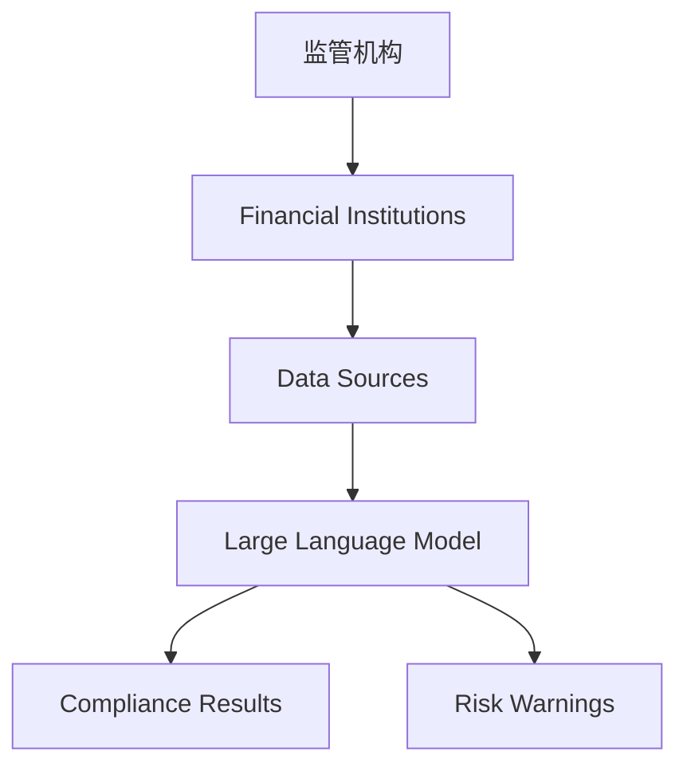
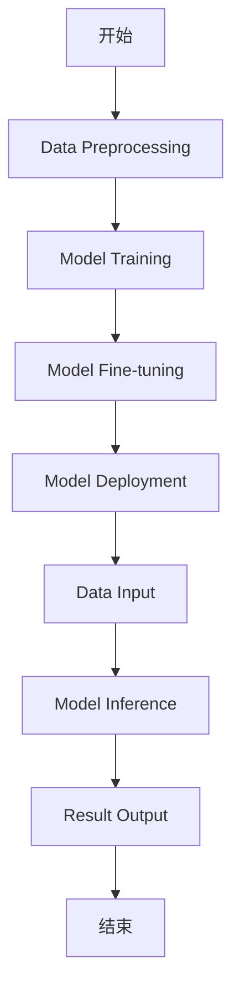

                 


# 《构建基于大模型的金融监管合规自动化平台》

---

## 关键词：  
金融监管，大模型，合规自动化，人工智能，风险管理

---

## 摘要：  
随着金融市场的快速发展和监管要求的日益严格，传统的金融监管方式已经难以满足现代金融环境的需求。基于大模型（Large Language Models, LLMs）的金融监管合规自动化平台，通过结合自然语言处理（NLP）、机器学习和深度学习技术，能够实现对金融数据的智能分析、风险预测和合规自动化。本文将从金融监管的现状与挑战出发，详细探讨大模型在金融监管中的核心概念、算法原理、系统架构设计以及实际应用案例。通过本文的分析，读者将能够理解如何利用大模型技术构建高效、智能的金融监管合规自动化平台。

---

## 第一部分：金融监管与大模型概述

---

### 第1章：金融监管的现状与挑战

#### 1.1 金融监管的核心概念

- **1.1.1 金融监管的定义与目标**  
  金融监管是指通过法律法规和监管机构，对金融机构及其业务行为进行监督和管理，以确保金融市场稳定运行、保护投资者利益并促进金融创新。金融监管的核心目标包括风险控制、合规性检查、市场透明化以及公平竞争。

- **1.1.2 传统金融监管的痛点与局限性**  
  传统金融监管主要依赖人工审查和静态规则，存在以下问题：  
  - **效率低**：人工审核耗时长，难以应对海量金融数据。  
  - **规则僵化**：静态规则难以适应金融市场快速变化的需求。  
  - **成本高**：需要大量人力资源和资金投入。  
  - **覆盖面有限**：难以实现全市场、全领域的实时监控。

- **1.1.3 金融监管的数字化转型趋势**  
  随着大数据、人工智能等技术的发展，金融监管正在从传统的人工模式向数字化、智能化方向转型，以提高监管效率和准确性。

---

#### 1.2 大模型技术的崛起

- **1.2.1 大模型技术的定义与特点**  
  大模型（Large Language Models, LLMs）是指基于Transformer架构的大型神经网络模型，具有以下特点：  
  - **参数规模大**：通常包含 billions 量级的参数，能够捕获复杂的数据特征。  
  - **通用性强**：适用于多种NLP任务，如文本生成、问答系统、分类等。  
  - **上下文理解能力**：能够理解长文本的上下文关系，具备强大的推理能力。

- **1.2.2 大模型在金融领域的应用潜力**  
  大模型在金融领域有广泛的应用场景，包括：  
  - **智能客服**：通过自然语言处理为投资者提供咨询服务。  
  - **风险评估**：利用大模型分析财务数据，预测企业信用风险。  
  - **合规检查**：自动识别交易数据中的违规行为。  

- **1.2.3 金融监管与大模型结合的可行性分析**  
  大模型的自然语言处理能力和强大的模式识别能力，使其成为金融监管自动化的重要工具。通过结合监管规则和金融市场数据，大模型能够实现对金融行为的实时监控和智能分析。

---

#### 1.3 本章小结

本章从金融监管的定义、痛点以及数字化转型趋势入手，分析了大模型技术的崛起及其在金融监管中的应用潜力。通过对比传统监管与大模型监管的差异，为后续章节的深入探讨奠定了基础。

---

## 第2章：大模型在金融监管中的应用背景

---

### 2.1 金融合规的复杂性与挑战

- **2.1.1 金融合规的核心要素**  
  金融合规涉及多个方面，包括：  
  - **法律法规**：确保金融机构行为符合相关法律法规。  
  - **行业标准**：遵循行业协会制定的业务规范。  
  - **内部政策**：执行金融机构自身的风险管理政策。

- **2.1.2 合规监管的流程与痛点**  
  合规监管的流程通常包括数据收集、规则匹配、风险评估和报告生成。然而，传统合规监管存在以下痛点：  
  - **数据孤岛**：金融机构的数据分散在不同系统中，难以整合。  
  - **规则复杂**：合规规则繁多且不断更新，人工匹配效率低。  
  - **风险滞后**：传统监管通常事后发现风险，难以实时预警。

- **2.1.3 金融合规的数字化转型需求**  
  金融机构需要通过数字化手段实现合规自动化，以提高效率、降低成本并增强风险控制能力。

---

### 2.2 大模型技术如何解决金融监管问题

- **2.2.1 大模型在风险识别中的应用**  
  大模型可以通过分析新闻、财报和社交媒体数据，识别潜在的市场风险和信用风险。

- **2.2.2 大模型在合规自动化中的优势**  
  大模型能够自动解析法规文本，识别合规要点，并快速匹配金融交易数据，实现合规检查的自动化。

- **2.2.3 大模型在监管数据处理中的价值**  
  大模型可以对非结构化数据（如新闻、报告）进行深度分析，提取关键信息，辅助监管机构做出决策。

---

### 2.3 本章小结

本章分析了金融合规的复杂性与挑战，并探讨了大模型技术在金融监管中的应用价值。通过对比传统监管与大模型监管的差异，突出了大模型在提升监管效率和准确性方面的优势。

---

## 第3章：大模型在金融监管中的核心概念与联系

---

### 3.1 大模型在金融监管中的核心要素

- **3.1.1 数据驱动的监管模式**  
  大模型监管依赖于海量数据的输入，通过数据驱动的方式实现对金融行为的智能分析。

- **3.1.2 智能化合规分析框架**  
  大模型能够理解复杂的法规文本，并结合金融数据进行智能化的合规分析。

- **3.1.3 实时监控与预测能力**  
  大模型可以通过实时数据流分析，预测潜在的金融风险，并提前发出预警。

---

### 3.2 核心概念的属性对比

| **核心概念**   | **传统监管**         | **大模型监管**         |
|-----------------|----------------------|------------------------|
| 数据处理能力   | 依赖结构化数据       | 支持结构化与非结构化数据 |
| 监管效率       | 低，依赖人工审核       | 高，自动化处理          |
| 风险预测能力   | 简单，依赖历史数据     | 强大，支持实时预测       |
| 成本           | 高，需要大量人力       | 低，自动化减少人力需求   |

---

### 3.3 实体关系图



---

### 3.4 本章小结

本章通过对比分析，明确了大模型监管的核心要素及其与传统监管的差异，为后续章节的算法原理和系统设计奠定了基础。

---

## 第4章：大模型在金融监管中的算法原理

---

### 4.1 大模型的基本原理

- **4.1.1 大模型的训练过程**  
  大模型的训练包括数据预处理、模型训练和调优。通过海量金融文本数据的训练，大模型能够学习金融领域的语言模式和知识。

- **4.1.2 大模型的推理机制**  
  大模型通过编码器-解码器结构，将输入文本映射到潜在空间，并生成符合上下文的输出。

- **4.1.3 大模型的可解释性**  
  大模型的可解释性是金融监管应用中的重要问题，需要通过技术手段提升模型的透明度和可信度。

---

### 4.2 大模型在金融监管中的算法流程



---

### 4.3 大模型在金融监管中的数学模型

大模型的训练目标是最小化预测损失函数 $L$，通常使用交叉熵损失：

$$ L = -\sum_{i=1}^{n} y_i \log p(y_i) $$

其中，$y_i$ 是真实标签，$p(y_i)$ 是模型预测的概率。

---

### 4.4 本章小结

本章详细介绍了大模型的基本原理及其在金融监管中的算法流程，通过数学公式和流程图的方式，帮助读者理解大模型的核心技术。

---

## 第5章：大模型在金融监管中的系统架构设计

---

### 5.1 系统功能设计

- **5.1.1 数据采集模块**  
  从多种数据源（如金融机构的交易数据、新闻媒体）获取金融数据。

- **5.1.2 模型调用模块**  
  调用大模型API，对数据进行分析和处理。

- **5.1.3 合规分析模块**  
  根据模型输出结果，生成合规报告和风险预警。

---

### 5.2 系统架构设计

```mermaid
graph LR
    Client[客户端] --> API Gateway[API网关]
    API Gateway --> 大模型服务[Large Model Service]
    大模型服务 --> 数据存储[Data Storage]
    数据存储 --> 数据源[Data Sources]
    大模型服务 --> 合规结果[Compliance Results]
    合规结果 --> 可视化界面[Visualization UI]
```

---

### 5.3 接口设计

- **API接口**  
  客户端通过 RESTful API 调用大模型服务，接口包括：  
  - `POST /api/v1/model/inference`：模型推理接口。  
  - `GET /api/v1/compliance/report`：合规报告接口。  

---

### 5.4 本章小结

本章通过系统功能设计和架构图，展示了如何利用大模型构建金融监管合规自动化平台的系统架构。

---

## 第6章：大模型在金融监管中的项目实战

---

### 6.1 环境安装

- **Python版本**：3.8以上。  
- **依赖库安装**：  
  ```bash
  pip install transformers torch datasets
  ```

---

### 6.2 核心代码实现

```python
from transformers import AutoTokenizer, AutoModelForCausalLM
import torch

# 初始化大模型
model_name = "gpt2"
tokenizer = AutoTokenizer.from_pretrained(model_name)
model = AutoModelForCausalLM.from_pretrained(model_name)

# 定义输入
input_text = "根据《证券法》，公司必须在财务报告中披露..."
input_ids = tokenizer.encode(input_text, return_tensors="pt")

# 模型推理
with torch.no_grad():
    outputs = model.generate(input_ids, max_length=500)
    response = tokenizer.decode(outputs[0], skip_special_tokens=True)
    
# 输出结果
print(response)
```

---

### 6.3 案例分析

假设我们有一个新闻数据：“某公司涉嫌财务造假，被监管部门调查。” 大模型可以识别出“财务造假”、“监管部门调查”等关键词，并生成合规报告。

---

### 6.4 本章小结

本章通过实际案例，展示了如何利用大模型技术实现金融监管合规自动化，并提供了详细的代码实现和案例分析。

---

## 第7章：大模型在金融监管中的最佳实践

---

### 7.1 小结

- 大模型在金融监管中的应用前景广阔，能够显著提升监管效率和准确性。  
- 通过结合金融数据和大模型技术，金融机构可以实现合规自动化和风险预测。

---

### 7.2 注意事项

- 数据隐私问题：金融数据涉及大量敏感信息，需要确保数据存储和传输的安全性。  
- 模型可解释性：大模型的决策过程需要透明化，以满足监管机构的要求。  
- 技术更新：金融监管技术需要持续更新，以应对新型金融风险。

---

### 7.3 拓展阅读

- 《Large Language Models for Financial Regulation》  
- 《AI in Finance: From Theory to Practice》

---

## 作者：AI天才研究院/AI Genius Institute & 禅与计算机程序设计艺术 /Zen And The Art of Computer Programming

