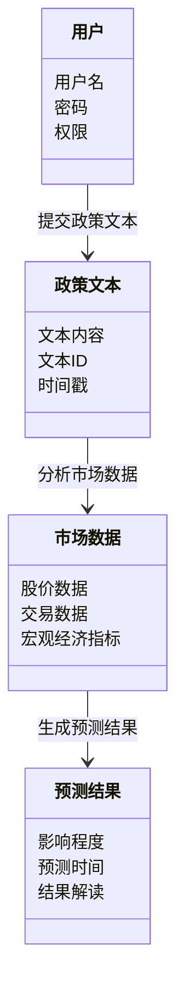
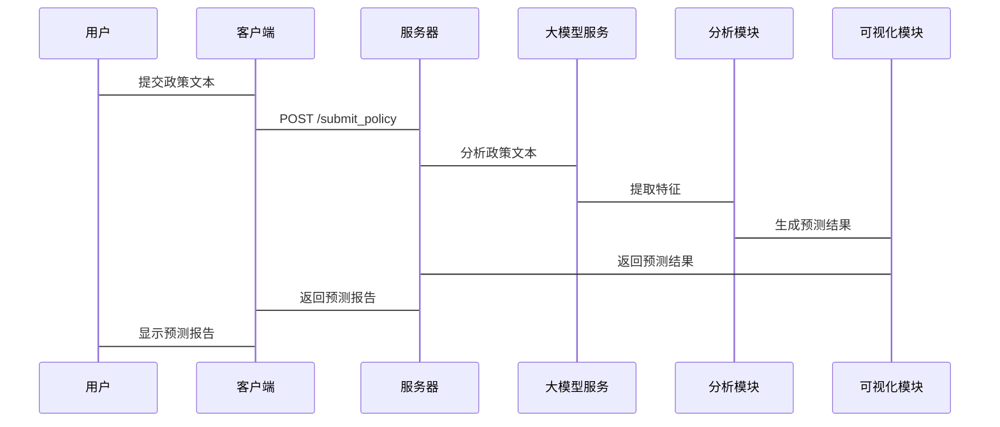

                 


# 构建基于大模型的金融监管政策影响预测平台

> 关键词：大模型技术，金融监管，政策影响预测，自然语言处理，机器学习，深度学习

> 摘要：本文详细探讨了如何利用大模型技术构建一个高效的金融监管政策影响预测平台。从背景介绍到系统架构设计，再到算法实现和项目实战，本文为读者提供了一个全面的技术指南。通过结合自然语言处理、机器学习和深度学习等技术，我们展示了如何利用大模型对政策文本进行特征提取、情感分析和结果预测，从而帮助政策制定者更好地理解和应对金融市场的变化。

---

## 第一部分: 金融监管政策影响预测平台的背景与需求

### 第1章: 金融监管与政策影响预测的背景

#### 1.1 金融监管的定义与重要性
- **1.1.1 金融监管的定义**  
  金融监管是指通过法律法规和监管机构对金融市场、金融机构及其行为进行监督和管理，以维护金融市场的稳定和健康发展。  
- **1.1.2 金融监管的核心目标**  
  - 维护金融体系的稳定性和安全性。  
  - 防范金融风险，保护投资者利益。  
  - 促进金融市场公平、透明和高效运行。  
- **1.1.3 金融监管的现状与挑战**  
  - 当前，金融市场的复杂性和全球化使得监管难度不断增大。  
  - 监管机构需要及时捕捉市场变化，快速响应政策调整。  

#### 1.2 政策影响预测的定义与意义
- **1.2.1 政策影响预测的定义**  
  政策影响预测是指通过分析政策文本和市场数据，预测政策实施后对金融市场可能产生的影响。  
- **1.2.2 政策影响预测的重要性**  
  - 帮助政策制定者更好地理解政策的潜在效果。  
  - 为金融机构提供决策支持，提前应对政策变化。  
  - 提高监管效率，优化资源配置。  
- **1.2.3 政策影响预测的应用场景**  
  - 货币政策调整对股市的影响。  
  - 金融监管政策对银行行为的影响。  
  - 财税政策对企业融资的影响。  

#### 1.3 大模型技术在金融监管中的应用前景
- **1.3.1 大模型技术的定义与特点**  
  大模型技术是指基于深度学习的大型神经网络模型，具有强大的文本处理和理解能力。  
- **1.3.2 大模型技术在金融监管中的优势**  
  - 高精度的文本分析能力。  
  - 快速处理大量非结构化数据。  
  - 实时监控市场动态。  
- **1.3.3 大模型技术面临的挑战与机遇**  
  - 数据隐私和安全问题。  
  - 模型的可解释性问题。  
  - 技术与业务的深度融合需求。  

### 第2章: 基于大模型的金融监管政策影响预测平台的需求分析

#### 2.1 平台的目标与功能
- **2.1.1 平台的目标**  
  构建一个智能化的金融监管政策影响预测平台，利用大模型技术对政策文本进行分析，预测政策实施后的市场影响。  
- **2.1.2 平台的核心功能**  
  - 政策文本的自动分析与理解。  
  - 市场数据的实时采集与处理。  
  - 政策影响的预测与可视化。  
- **2.1.3 平台的用户需求**  
  - 监管机构：快速评估政策效果。  
  - 金融机构：提前应对政策变化。  
  - 研究人员：深入分析政策影响。  

#### 2.2 平台的技术要求
- **2.2.1 大模型技术的要求**  
  - 高性能的计算能力。  
  - 强大的文本理解和生成能力。  
  - 支持多语言和多领域的模型训练。  
- **2.2.2 数据处理的要求**  
  - 支持结构化和非结构化数据的处理。  
  - 数据清洗、预处理和标注能力。  
  - 数据安全与隐私保护。  
- **2.2.3 系统架构的要求**  
  - 高可用性和扩展性。  
  - 灵活的模块化设计。  
  - 支持实时数据流处理。  

#### 2.3 平台的预期效果
- **2.3.1 政策影响预测的准确性**  
  通过大模型技术提高政策影响预测的准确率，为政策制定者提供可靠的参考。  
- **2.3.2 平台的可扩展性**  
  平台应具备良好的扩展性，支持未来更多的政策分析需求。  
- **2.3.3 平台的用户体验**  
  提供友好的用户界面，方便用户快速上手和使用。  

---

## 第二部分: 大模型技术的核心概念与原理

### 第3章: 大模型技术的基本原理

#### 3.1 自然语言处理（NLP）的基本原理
- **3.1.1 词嵌入算法（如Word2Vec）**  
  Word2Vec通过将词语映射到高维向量空间，捕捉词语之间的语义关系。  
- **3.1.2 语言模型（如Transformer）**  
  Transformer模型通过自注意力机制，捕捉文本中的长距离依赖关系。  
- **3.1.3 文本分类算法**  
  利用文本特征进行分类，如情感分析、主题分类等。  

#### 3.2 机器学习的基本原理
- **3.2.1 线性回归**  
  通过最小二乘法拟合数据，预测目标变量。  
- **3.2.2 支持向量机（SVM）**  
  将数据映射到高维空间，利用超平面进行分类。  
- **3.2.3 随机森林**  
  通过集成学习提高模型的准确性和鲁棒性。  

#### 3.3 深度学习的基本原理
- **3.3.1 卷积神经网络（CNN）**  
  通过卷积操作提取局部特征，常用于图像识别和文本处理。  
- **3.3.2 循环神经网络（RNN）**  
  通过循环结构处理序列数据，捕捉时间依赖关系。  
- **3.3.3 变量自注意力机制（Transformer）**  
  利用自注意力机制捕捉全局上下文信息，提高模型的表达能力。  

### 第4章: 大模型技术在金融监管中的应用原理

#### 4.1 文本数据的处理与分析
- **4.1.1 政策文本的特征提取**  
  通过分词、实体识别等技术提取政策文本中的关键信息。  
- **4.1.2 政策文本的情感分析**  
  判断政策文本中隐含的情感倾向，如积极、消极或中性。  
- **4.1.3 政策文本的主题分类**  
  根据政策内容将其分类到特定的主题或领域。  

#### 4.2 政策影响预测的模型构建
- **4.2.1 数据预处理**  
  清洗数据、分词、去停用词等。  
- **4.2.2 模型训练**  
  利用大模型技术对政策文本进行训练，提取特征并预测影响。  
- **4.2.3 模型评估**  
  通过准确率、召回率、F1值等指标评估模型的性能。  

### 第5章: 大模型技术的数学模型与公式

#### 5.1 自然语言处理的数学模型
- **5.1.1 词嵌入的数学公式**  
  $$ \text{Word2Vec: } \log P(w_i | w_j) = \mathbf{w_j}^T \mathbf{w_i} $$  

#### 5.2 语言模型的数学公式
- **5.2.1 Transformer模型的自注意力机制**  
  $$ \text{Attention}(Q, K, V) = \text{softmax}(\frac{QK^T}{\sqrt{d}})V $$  

---

## 第三部分: 金融监管政策影响预测平台的系统分析与架构设计方案

### 第6章: 系统功能设计

#### 6.1 领域模型设计


#### 6.2 系统架构设计


#### 6.3 系统接口设计
- **API接口1: 提交政策文本**  
  - 输入：政策文本内容。  
  - 输出：任务ID。  
- **API接口2: 获取预测结果**  
  - 输入：任务ID。  
  - 输出：预测结果报告。  

#### 6.4 系统交互设计


---

## 第四部分: 项目实战

### 第7章: 项目实战

#### 7.1 环境配置
- **安装Python环境**  
  ```bash
  python --version
  ```
- **安装依赖库**  
  ```bash
  pip install numpy pandas tensorflow transformers
  ```

#### 7.2 系统核心实现源代码

##### 7.2.1 数据预处理
```python
import pandas as pd

def preprocess_policy_text(text):
    # 分词
    words = word_tokenize(text)
    # 去停用词
    filtered_words = [word for word in words if word not in STOP_WORDS]
    return ' '.join(filtered_words)
```

##### 7.2.2 模型训练
```python
import tensorflow as tf
from tensorflow.keras import layers

def build_model(max_sequence_length, vocab_size):
    model = tf.keras.Sequential()
    model.add(layers.Embedding(vocab_size, 100, input_length=max_sequence_length))
    model.add(layers.LSTM(128, return_sequences=True))
    model.add(layers.Dense(64, activation='relu'))
    model.add(layers.Dense(1, activation='sigmoid'))
    model.compile(loss='binary_crossentropy', optimizer='adam', metrics=['accuracy'])
    return model
```

##### 7.2.3 结果分析
```python
from sklearn.metrics import accuracy_score, precision_score, recall_score

def evaluate_model(y_true, y_pred):
    accuracy = accuracy_score(y_true, y_pred)
    precision = precision_score(y_true, y_pred)
    recall = recall_score(y_true, y_pred)
    print(f"Accuracy: {accuracy:.4f}")
    print(f"Precision: {precision:.4f}")
    print(f"Recall: {recall:.4f}")
```

#### 7.3 案例分析与详细讲解
- **案例背景**  
  假设我们有一个政策文本数据集，包含近年来的货币政策调整文本和对应的市场反应数据。  
- **数据准备**  
  - 文本数据：政策文本内容。  
  - 标签数据：政策实施后的市场反应（如股价波动）。  
- **模型训练**  
  - 使用预处理后的文本数据训练模型，预测政策对市场的影响程度。  
- **结果分析**  
  - 通过准确率、召回率等指标评估模型性能。  
  - 分析模型在不同政策文本上的表现。  

#### 7.4 项目小结
- **小结**  
  通过本项目的实践，我们掌握了从数据预处理到模型训练再到结果分析的全过程。  
- **注意事项**  
  - 数据质量和数量直接影响模型性能。  
  - 模型的可解释性需要进一步优化。  
  - 需要结合具体业务场景进行调整和优化。  
- **拓展阅读**  
  - 《深度学习入门：基于Python和Keras》  
  - 《自然语言处理实战：基于Python的文本分析》  

---

## 第五部分: 总结与展望

### 第8章: 总结与展望

#### 8.1 平台的总结
- **核心价值**  
  基于大模型的金融监管政策影响预测平台为政策制定者和金融机构提供了智能化的决策支持工具。  
- **技术创新**  
  利用大模型技术实现高效的文本分析和预测，提高了政策影响预测的准确性和效率。  

#### 8.2 未来的发展方向
- **模型优化**  
  提高模型的可解释性和泛化能力。  
- **数据扩展**  
  增加多语言、多领域的政策文本数据，提升模型的通用性。  
- **应用场景拓展**  
  将平台应用于更多金融领域，如风险管理、投资决策等。  

---

## 作者

**作者：AI天才研究院/AI Genius Institute & 禅与计算机程序设计艺术 /Zen And The Art of Computer Programming**

---

通过以上目录结构，您可以逐步完成从背景介绍到系统实现的完整技术博客文章。每章内容都详细展开，确保读者能够深入理解如何构建基于大模型的金融监管政策影响预测平台。

