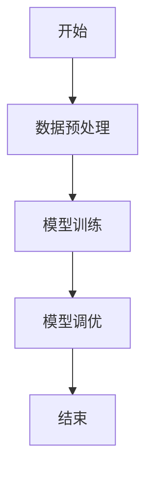
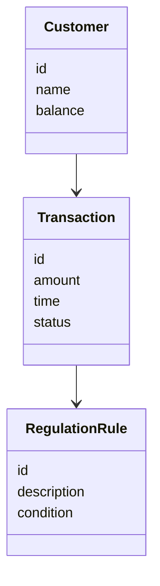
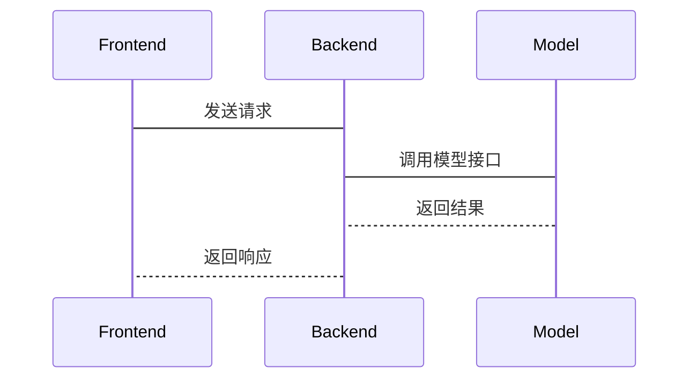

                 


# 构建基于大模型的金融监管沙盒模拟平台

> **关键词**：大模型，金融监管，沙盒模拟，系统架构，算法原理  
>
> **摘要**：本文详细介绍了如何构建基于大模型的金融监管沙盒模拟平台，从背景、核心概念、算法原理到系统架构和项目实战，层层深入，为读者提供全面的技术指导。通过分析大模型在金融监管中的应用，结合实际案例，帮助读者理解如何利用大模型技术优化金融监管流程，提升监管效率。

---

## 第一章：背景介绍

### 1.1 问题背景

#### 1.1.1 金融监管的复杂性与挑战
- 金融市场的复杂性和不确定性对监管提出了更高的要求。
- 传统监管手段的局限性：人工审核效率低、风险预测能力有限。

#### 1.1.2 大模型在金融监管中的潜力
- 大模型技术在自然语言处理、风险预测、智能分析等方面的优势。
- 沙盒模拟平台的提出为金融监管提供了新的思路。

### 1.2 问题描述

#### 1.2.1 传统金融监管的局限性
- 人工监管的低效性和主观性。
- 数据孤岛和信息不对称的问题。

#### 1.2.2 沙盒模拟平台的定义与目标
- 沙盒模拟平台的定义：在一个虚拟环境中模拟金融交易和监管过程。
- 目标：提高监管效率、降低风险、优化监管策略。

### 1.3 问题解决

#### 1.3.1 大模型如何赋能金融监管
- 大模型在风险预测、异常检测、智能分析中的应用。
- 提高监管的实时性和精准性。

#### 1.3.2 沙盒模拟平台的核心价值
- 提供一个安全的实验环境，用于测试监管策略。
- 优化监管流程，降低实际操作中的风险。

### 1.4 边界与外延

#### 1.4.1 金融监管的边界
- 监管的范围和限度。
- 沙盒模拟平台的应用范围。

#### 1.4.2 沙盒模拟平台的适用范围
- 适用于金融创新产品的测试。
- 适用于监管政策的模拟验证。

### 1.5 核心要素组成

#### 1.5.1 大模型的输入输出
- 输入：金融数据、市场信息、监管规则。
- 输出：风险评估、监管建议、模拟结果。

#### 1.5.2 沙盒模拟的核心模块
- 数据模拟模块、模型训练模块、监管规则引擎、结果分析模块。

---

## 第二章：核心概念与联系

### 2.1 大模型的定义与特点

#### 2.1.1 大模型的核心原理
- 基于深度学习的模型，具有强大的特征提取和模式识别能力。
- 大模型的优势：处理复杂任务、高精度预测。

#### 2.1.2 大模型的特征对比
- 对比传统机器学习模型，大模型在处理复杂数据和任务上的优势。

### 2.2 金融监管沙盒的定义与属性

#### 2.2.1 沙盒模拟的核心概念
- 沙盒模拟的定义：在一个隔离的环境中进行金融交易和监管的模拟。
- 沙盒模拟的属性：安全性、可控性、可扩展性。

#### 2.2.2 沙盒模拟的属性特征对比
- 对比传统监管环境，沙盒模拟在灵活性、实验性方面的优势。

### 2.3 两者的联系与区别

#### 2.3.1 大模型与沙盒模拟的联系
- 大模型为沙盒模拟提供技术支持。
- 沙盒模拟为大模型的应用提供实验环境。

#### 2.3.2 两者在金融监管中的差异
- 大模型的应用范围广，沙盒模拟聚焦于监管实验。
- 大模型注重数据分析，沙盒模拟注重环境模拟。

### 2.4 核心概念属性对比表

| 对比维度 | 大模型 | 沙盒模拟 |
|----------|--------|----------|
| 核心目标 | 数据分析与预测 | 监管策略模拟与测试 |
| 应用场景 | 风险预测、智能客服 | 创新产品测试、监管政策验证 |
| 优势 | 高精度预测、强泛化能力 | 安全实验、快速迭代 |

### 2.5 ER实体关系图

```mermaid
erDiagram
    customer[CUSTOMER] o-|{m:1} trans[TRANSACTION]
    trans o-|{1:1} rule[REGULATION_RULE]
    trans o-|{1:1} model[LARGE_MODEL]
```

---

## 第三章：算法原理讲解

### 3.1 大模型的训练与优化

#### 3.1.1 数据预处理
- 数据清洗：去除噪声数据，处理缺失值。
- 数据增强：通过数据增强技术提升数据多样性。

#### 3.1.2 模型训练
- 网络结构设计：基于Transformer的模型架构。
- 损失函数：交叉熵损失函数。
  $$ \text{Loss} = -\sum_{i=1}^{n} y_i \log(p_i) + (1-y_i)\log(1-p_i) $$
- 优化器：Adam优化器，学习率调整。

#### 3.1.3 模型调优
- 超参数调优：学习率、批量大小、Dropout率。
- 模型评估：准确率、召回率、F1分数。

#### 3.1.4 代码实现示例

```python
import torch
import torch.nn as nn
import torch.optim as optim

class LargeModel(nn.Module):
    def __init__(self, input_dim, hidden_dim, output_dim):
        super(LargeModel, self).__init__()
        self.fc1 = nn.Linear(input_dim, hidden_dim)
        self.fc2 = nn.Linear(hidden_dim, output_dim)
        self.relu = nn.ReLU()
    
    def forward(self, x):
        x = self.fc1(x)
        x = self.relu(x)
        x = self.fc2(x)
        return x

# 初始化模型
input_dim = 100
hidden_dim = 200
output_dim = 1
model = LargeModel(input_dim, hidden_dim, output_dim)

# 定义损失函数和优化器
criterion = nn.BCEWithLogitsLoss()
optimizer = optim.Adam(model.parameters(), lr=0.001)
```

#### 3.1.5 数学模型与公式

- 损失函数：
  $$ \text{Loss} = \text{binary\_cross_entropy}(y_{\text{pred}}, y_{\text{true}}) $$
- 优化器：
  $$ \theta_{t+1} = \theta_t - \eta \cdot \nabla_{\theta_t} \text{Loss} $$

### 3.2 算法流程图



---

## 第四章：系统分析与架构设计

### 4.1 问题场景介绍

#### 4.1.1 金融监管沙盒的模拟环境
- 模拟金融市场的交易环境。
- 提供多种金融产品的测试场景。

#### 4.1.2 系统功能设计
- 数据模拟模块：生成虚拟交易数据。
- 模型训练模块：训练大模型进行风险预测。
- 监管规则引擎：制定和执行监管规则。
- 结果分析模块：分析模拟结果并生成报告。

### 4.2 系统架构设计

#### 4.2.1 领域模型（Mermaid类图）



#### 4.2.2 系统架构图（Mermaid架构图）

```mermaid
docker
    frontend
    backend
    database
    model
    api_gateway
    load_balancer
```

#### 4.2.3 接口设计与交互序列图（Mermaid序列图）



---

## 第五章：项目实战

### 5.1 环境安装

#### 5.1.1 安装依赖
- Python 3.8+
- PyTorch
- Transformers
- Mermaid CLI

#### 5.1.2 安装命令
```bash
pip install torch transformers mermaid-cli
```

### 5.2 核心实现

#### 5.2.1 模型实现
- 使用PyTorch实现大模型。
- 定义模型类和训练循环。

#### 5.2.2 模拟环境实现
- 编写数据生成器。
- 实现监管规则引擎。

#### 5.2.3 代码实现示例

```python
import torch
import torch.nn as nn
import torch.optim as optim

class LargeModel(nn.Module):
    def __init__(self, input_dim, hidden_dim, output_dim):
        super(LargeModel, self).__init__()
        self.fc1 = nn.Linear(input_dim, hidden_dim)
        self.fc2 = nn.Linear(hidden_dim, output_dim)
        self.relu = nn.ReLU()
    
    def forward(self, x):
        x = self.fc1(x)
        x = self.relu(x)
        x = self.fc2(x)
        return x

# 初始化模型
input_dim = 100
hidden_dim = 200
output_dim = 1
model = LargeModel(input_dim, hidden_dim, output_dim)

# 定义损失函数和优化器
criterion = nn.BCEWithLogitsLoss()
optimizer = optim.Adam(model.parameters(), lr=0.001)

# 训练循环
for epoch in range(num_epochs):
    for inputs, labels in dataloader:
        outputs = model(inputs)
        loss = criterion(outputs, labels)
        loss.backward()
        optimizer.step()
```

#### 5.2.4 模拟实验

```python
# 生成虚拟交易数据
import numpy as np

def generate_transaction_data(n):
    return np.random.rand(n, 100)

# 调用大模型进行风险预测
def predict_risk(model, data):
    with torch.no_grad():
        outputs = model(torch.from_numpy(data))
        return outputs.numpy()

data = generate_transaction_data(1000)
predicted_risk = predict_risk(model, data)
```

### 5.3 案例分析

#### 5.3.1 案例背景
- 某金融产品测试场景。

#### 5.3.2 实验步骤
- 数据生成。
- 模型预测。
- 结果分析。

#### 5.3.3 结果解读
- 预测结果与实际数据对比。
- 监管规则的效果评估。

### 5.4 项目小结

---

## 第六章：最佳实践与总结

### 6.1 最佳实践 tips

#### 6.1.1 模型优化
- 调整超参数，优化网络结构。
- 使用迁移学习提升模型性能。

#### 6.1.2 系统优化
- 优化数据生成效率。
- 提高系统可扩展性。

### 6.2 小结

#### 6.2.1 核心内容回顾
- 大模型在金融监管中的应用。
- 沙盒模拟平台的构建流程。

#### 6.2.2 未来展望
- 大模型技术的进一步发展。
- 沙盒模拟平台的更多应用场景。

### 6.3 注意事项

#### 6.3.1 数据隐私
- 注意数据隐私保护，确保合规性。

#### 6.3.2 系统安全性
- 确保系统安全，防止数据泄露。

### 6.4 拓展阅读

#### 6.4.1 推荐书籍
- 《大模型技术与应用》
- 《金融监管与风险管理》

#### 6.4.2 技术博客
- 大模型技术博客链接。
- 金融监管相关技术博客链接。

---

## 附录：参考文献与工具资源

### 附录A：参考文献

1. [1] 金融监管相关文献。
2. [2] 大模型技术相关文献。

### 附录B：工具资源

1. [1] PyTorch官方文档。
2. [2] Mermaid官方文档。

---

## 作者：AI天才研究院 & 禅与计算机程序设计艺术

