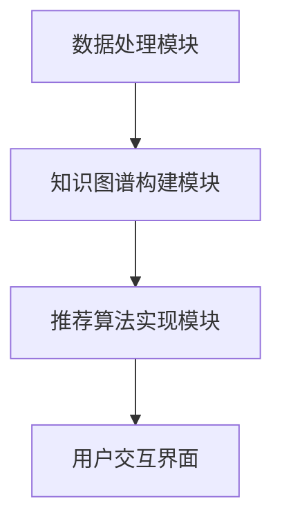

                 


# 构建基于知识图谱的金融产品关联推荐引擎

**关键词**：知识图谱、金融产品推荐、关联推荐、深度学习、图嵌入、推荐系统

**摘要**：本文详细探讨了如何构建基于知识图谱的金融产品关联推荐引擎，通过结合知识图谱和推荐系统的核心原理，分析了金融产品之间的关联性，并提出了高效的推荐算法和系统架构设计方案。文章从背景介绍、知识图谱构建、推荐算法实现、系统架构设计到项目实战和优化，逐步深入，为读者提供了一个全面的技术指南。

---

## 第1章: 知识图谱与推荐系统概述

### 1.1 知识图谱的基本概念

#### 1.1.1 知识图谱的定义与特点
知识图谱是一种以图结构形式表示知识的语义网络，由节点（实体）和边（关系）组成。其特点包括：
- **语义丰富**：节点代表实体或概念，边表示实体间的关系。
- **结构化**：通过形式化的方法描述知识，便于计算机理解和推理。
- **动态更新**：能够实时更新，以反映数据的变化。

#### 1.1.2 知识图谱的构建流程
构建知识图谱的步骤包括：
1. 数据采集：从多种数据源（如文本、数据库）获取数据。
2. 数据清洗：去除噪声数据，提取有用信息。
3. 实体识别与关系抽取：通过NLP技术识别实体及其关系。
4. 知识融合：将不同来源的数据整合到统一的知识库中。
5. 存储与管理：使用图数据库（如Neo4j）存储知识图谱。

#### 1.1.3 知识图谱在金融领域的应用
在金融领域，知识图谱可以用于：
- **风险评估**：通过分析实体之间的关系，识别潜在风险。
- **产品推荐**：基于知识图谱中的关联性推荐相关金融产品。

### 1.2 推荐系统的基本原理

#### 1.2.1 推荐系统的定义与分类
推荐系统通过分析用户行为和产品属性，向用户推荐个性化的产品。主要分类包括：
- **基于协同过滤的推荐**：基于用户行为相似性进行推荐。
- **基于内容的推荐**：基于产品本身的属性进行推荐。
- **基于深度学习的推荐**：利用神经网络学习高维特征。

#### 1.2.2 基于协同过滤的推荐算法
协同过滤是一种经典的推荐算法，分为用户协同和物品协同两种。其基本公式为：
$$ sim(u, v) = \frac{\sum_{i \in I_u \cap I_v} (r_i^u - \bar{r}^u)(r_i^v - \bar{r}^v)}{\sqrt{\sum_{i \in I_u} (r_i^u - \bar{r}^u)^2} \cdot \sqrt{\sum_{i \in I_v} (r_i^v - \bar{r}^v)^2}} $$
其中，$sim(u, v)$ 表示用户 $u$ 和用户 $v$ 之间的相似度，$r_i^u$ 和 $r_i^v$ 分别是用户 $u$ 和 $v$ 对物品 $i$ 的评分，$\bar{r}^u$ 和 $\bar{r}^v$ 分别是用户 $u$ 和 $v$ 的平均评分。

#### 1.2.3 基于内容的推荐算法
基于内容的推荐通过分析产品的属性（如金融产品的风险等级、收益类型）进行推荐。例如，使用 TF-IDF 提取关键词，计算产品之间的相似度。

### 1.3 本章小结
本章介绍了知识图谱和推荐系统的基本概念，并分析了它们在金融产品推荐中的应用。

---

## 第2章: 知识图谱的构建与应用

### 2.1 知识图谱构建的基本流程

#### 2.1.1 数据采集与预处理
数据采集包括从金融数据库、新闻网站等多源数据获取相关信息。预处理步骤包括清洗、去重和格式转换。

#### 2.1.2 实体识别与关系抽取
使用 NLP 技术（如实体识别工具）提取金融产品（实体）及其关系（如“属于”、“关联”）。

#### 2.1.3 知识图谱存储与管理
使用图数据库存储知识图谱，并设计查询接口以便后续推荐系统使用。

### 2.2 知识图谱在金融产品推荐中的应用

#### 2.2.1 金融产品关联分析
通过知识图谱分析产品的关联性，例如，分析不同金融产品的收益类型和风险等级。

#### 2.2.2 用户行为分析与知识图谱结合
将用户行为数据（如点击、购买）与知识图谱中的产品关系结合，提升推荐精度。

#### 2.2.3 金融知识图谱的构建与优化
通过领域专家知识优化知识图谱，确保其准确性和完整性。

### 2.3 本章小结
本章详细讲解了知识图谱的构建流程，并分析了其在金融产品推荐中的具体应用。

---

## 第3章: 基于知识图谱的推荐算法

### 3.1 基于知识图谱的推荐算法概述

#### 3.1.1 知识图谱增强的推荐系统
通过知识图谱提取产品之间的语义关系，增强推荐系统的关联性。

#### 3.1.2 图嵌入方法在推荐中的应用
图嵌入（如 Word2Vec、GloVe）将图结构转化为低维向量，用于推荐系统。

#### 3.1.3 知识图谱中的路径分析与推荐
通过分析知识图谱中的路径，发现产品之间的隐含关联性。

### 3.2 知识图谱推荐算法的实现

#### 3.2.1 基于图嵌入的推荐算法
使用图嵌入方法将产品节点表示为向量，计算向量相似度进行推荐。

#### 3.2.2 基于知识图谱的注意力机制
通过注意力机制（如自注意力网络）捕捉产品之间的语义关系。

#### 3.2.3 知识图谱中的相似性计算
使用余弦相似度计算产品节点的向量相似度：
$$ sim(v_i, v_j) = \frac{v_i \cdot v_j}{\|v_i\| \|v_j\|} $$

### 3.3 本章小结
本章介绍了基于知识图谱的推荐算法，并分析了其优势和实现细节。

---

## 第4章: 系统架构与设计

### 4.1 系统架构设计

#### 4.1.1 系统功能模块划分
- **数据处理模块**：负责数据采集和预处理。
- **知识图谱构建模块**：构建并存储知识图谱。
- **推荐算法实现模块**：基于知识图谱进行推荐。

#### 4.1.2 系统架构图


#### 4.1.3 系统接口设计
- 数据接口：提供 RESTful API 供其他模块调用。
- 推荐接口：返回推荐结果。

### 4.2 系统实现细节

#### 4.2.1 数据处理模块
实现数据的采集和清洗，使用 Python 的 requests 库进行 HTTP 请求。

#### 4.2.2 知识图谱构建模块
使用Neo4j图数据库存储知识图谱，并通过Cypher语言进行查询。

#### 4.2.3 推荐算法实现模块
实现基于图嵌入的推荐算法，并通过 Flask 搭建 API 接口。

### 4.3 本章小结
本章详细讲解了系统的架构设计和实现细节。

---

## 第5章: 项目实战与优化

### 5.1 项目环境搭建

#### 5.1.1 开发环境配置
安装Python、Neo4j、Flask等工具。

#### 5.1.2 数据集准备
从金融数据库获取产品数据，并进行预处理。

#### 5.1.3 工具安装与配置
安装必要的Python库，如 `neo4j`、`flask`、`networkx`。

### 5.2 系统核心实现

#### 5.2.1 数据处理代码实现
```python
import requests
from neo4j import GraphDatabase

def fetch_data():
    response = requests.get("http://api.example.com/products")
    return response.json()

def process_data(data):
    # 数据清洗和预处理
    return processed_data

if __name__ == "__main__":
    data = fetch_data()
    processed_data = process_data(data)
    # 存储到Neo4j
    driver = GraphDatabase.driver("bolt://localhost:7687")
    with driver.session() as session:
        session.run("CREATE (p:Product {name: $name})", processed_data)
```

#### 5.2.2 知识图谱构建代码实现
```python
from neo4j.exceptions import CypherError

def create_graph(product_data):
    driver = GraphDatabase.driver("bolt://localhost:7687")
    with driver.session() as session:
        session.run("MATCH (p:Product) DELETE p")
        for product in product_data:
            session.run("CREATE (p:Product {name: $name})", product)
    driver.close()

create_graph(processed_data)
```

#### 5.2.3 推荐算法实现代码
```python
from sklearn.metrics.pairwise import cosine_similarity

def recommend_products(user_id):
    # 获取用户行为数据
    user_data = fetch_user_data(user_id)
    # 获取产品嵌入向量
    product_embeddings = get_product_embeddings()
    # 计算相似度
    similarities = cosine_similarity(user_data, product_embeddings)
    return sorted(range(len(similarities)), key=lambda i: similarities[i], reverse=True)[:5]

recommend_products(123)
```

### 5.3 系统优化与调优

#### 5.3.1 算法优化策略
使用分布式训练和批次处理提升算法效率。

#### 5.3.2 系统性能调优
优化数据库查询速度和API接口响应时间。

### 5.3.3 本章小结
本章通过实战项目详细讲解了系统的核心实现和优化策略。

---

## 第6章: 算法优化与调优

### 6.1 算法优化策略

#### 6.1.1 增量式更新
实时更新知识图谱，确保推荐结果的及时性。

#### 6.1.2 稀疏性处理
处理用户行为数据的稀疏性，提升推荐精度。

#### 6.1.3 深度学习模型优化
使用预训练语言模型（如BERT）进行文本表示。

### 6.2 算法调优技巧

#### 6.2.1 超参数调优
通过网格搜索优化模型参数。

#### 6.2.2 模型融合
结合多种推荐算法，提升推荐效果。

### 6.3 本章小结
本章分析了算法优化策略和调优技巧。

---

## 第7章: 案例分析与总结

### 7.1 案例分析

#### 7.1.1 系统实现
通过实际案例展示系统的功能实现和运行效果。

#### 7.1.2 性能分析
分析系统的推荐准确率和响应时间。

### 7.2 本章总结
总结全文内容，强调知识图谱在金融产品推荐中的重要性。

---

## 第8章: 总结与展望

### 8.1 全文总结
总结文章的核心内容和主要贡献。

### 8.2 未来展望
展望知识图谱和推荐系统在金融领域的未来发展方向。

---

## 作者：AI天才研究院 & 禅与计算机程序设计艺术

---

**注意**：以上内容仅为示例，实际撰写时需要根据具体需求进一步扩展和调整，以确保文章内容的完整性和专业性。

