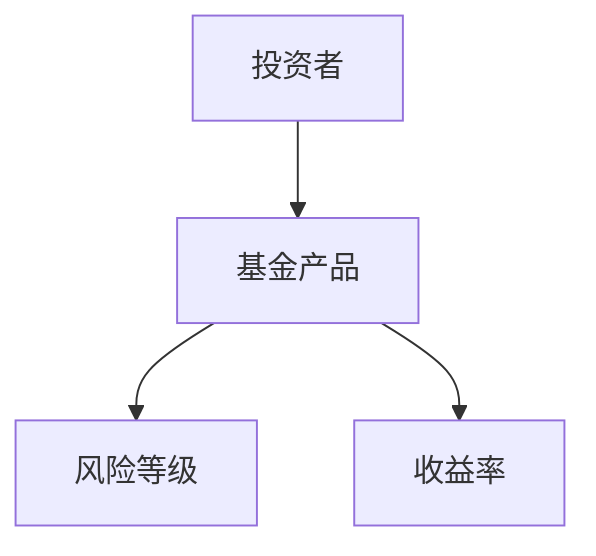
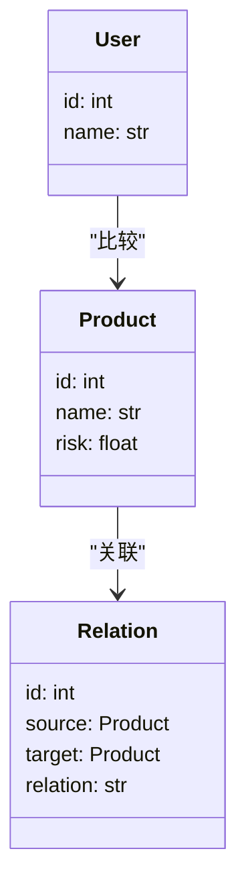
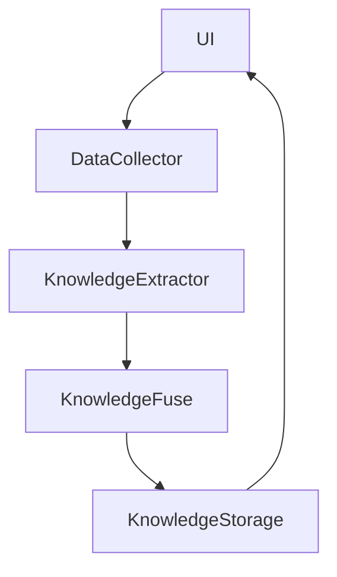
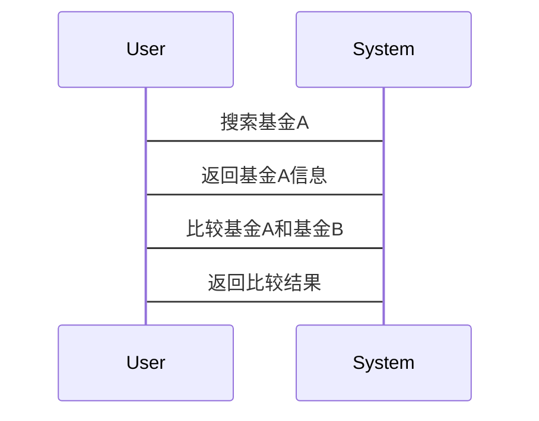

                 


# 构建基于知识图谱的金融产品比较平台

## 关键词
知识图谱，金融产品，比较平台，实体识别，关系抽取，系统架构，项目实战

## 摘要
构建基于知识图谱的金融产品比较平台，旨在利用知识图谱的强大语义理解和关联能力，为用户提供更加智能、精准的金融产品比较服务。本文从知识图谱的基本概念出发，详细探讨其在金融产品比较中的应用，涵盖知识图谱构建的核心算法、系统架构设计、项目实战实现以及最佳实践等方面，为读者提供全面的技术指导。

---

# 第一部分: 知识图谱与金融产品比较平台概述

## 第1章: 知识图谱与金融产品比较平台概述

### 1.1 知识图谱的定义与特点
#### 1.1.1 知识图谱的定义
知识图谱是一种以图结构形式表示知识的语义网络，由节点（实体）和边（关系）组成，能够描述实体之间的语义关系。

#### 1.1.2 知识图谱的核心特点
- **语义理解**：通过实体和关系描述，提供丰富的语义信息。
- **关联性**：能够发现实体之间的隐含关系，支持跨领域的关联分析。
- **可扩展性**：支持动态更新和扩展，适应数据变化。

#### 1.1.3 知识图谱与传统数据库的区别
| 特性                | 知识图谱              | 传统数据库          |
|---------------------|----------------------|--------------------|
| 数据结构            | 图结构（节点和边）    | 行列式结构          |
| 数据关系            | 强调语义关系          | 强调属性关系        |
| 查询能力            | 支持复杂关联查询      | 支持简单条件查询    |

### 1.2 金融产品比较平台的背景与意义
#### 1.2.1 金融产品的多样性与复杂性
金融市场中的产品种类繁多，包括基金、股票、保险等，每类产品的特性和风险指标各不相同。

#### 1.2.2 现有金融产品比较工具的局限性
传统比较工具通常基于简单的属性对比，难以捕捉产品之间的深层关联和语义信息。

#### 1.2.3 知识图谱在金融产品比较中的优势
- 提供语义理解能力，帮助用户发现产品之间的隐含关系。
- 支持复杂的关联查询，提升比较的精准度和深度。

### 1.3 本章小结
本章介绍了知识图谱的基本概念和特点，并分析了其在金融产品比较中的应用价值。

---

# 第二部分: 知识图谱构建的核心概念与原理

## 第2章: 知识图谱构建的核心概念

### 2.1 知识图谱构建的基本流程
#### 2.1.1 数据收集与预处理
从多种数据源（如金融报告、产品文档）收集数据，并进行清洗和标准化处理。

#### 2.1.2 实体识别与关系抽取
使用自然语言处理技术从文本中提取实体及其关系。

#### 2.1.3 知识融合与优化
将提取的知识进行合并和优化，消除冗余和矛盾。

### 2.2 知识图谱的核心要素
#### 2.2.1 实体与属性
- **实体**：金融产品（如基金、保险）。
- **属性**：产品的具体特征（如收益率、风险等级）。

#### 2.2.2 关系与语义
- **关系**：产品之间的关联（如“基金A的风险高于基金B”）。
- **语义**：关系所表达的语义信息。

### 2.3 知识图谱的表示与存储
#### 2.3.1 图结构表示
使用节点和边表示实体及其关系。

#### 2.3.2 数据流Mermaid图


### 2.4 实体识别与关系抽取的算法
#### 2.4.1 实体识别
- 使用spaCy库进行实体识别，代码示例：
  ```python
  import spacy
  nlp = spacy.load("en_core_web_sm")
  doc = nlp("基金A的风险高于基金B")
  for token in doc:
      if token.ent_type_:
          print(token.text)
  ```

#### 2.4.2 关系抽取
- 使用spaCy的`matcher`模块进行关系抽取，代码示例：
  ```python
  matcher = spacy.matcher.Matcher(nlp.vocab)
  patterns = [
      [{'POS': 'ADJ'}, {'POS': 'VERB'}]
  ]
  matcher.add("risk_relation", patterns)
  matches = matcher(doc)
  ```

---

# 第三部分: 系统架构与实现

## 第3章: 系统架构设计

### 3.1 系统功能设计
#### 3.1.1 领域模型Mermaid类图


### 3.2 系统架构设计
#### 3.2.1 模块化架构
- **数据采集模块**：从金融数据库中获取产品数据。
- **知识抽取模块**：提取实体和关系。
- **知识融合模块**：合并知识并优化。
- **知识存储模块**：存储图结构数据。
- **用户界面模块**：展示比较结果。

#### 3.2.2 系统架构Mermaid图


### 3.3 系统接口设计
- **数据接口**：提供REST API用于数据交互。
- **用户接口**：提供搜索和比较功能的界面。

### 3.4 系统交互Mermaid序列图


---

# 第四部分: 项目实战与案例分析

## 第4章: 项目实战

### 4.1 环境配置
- 安装Python和相关库（如networkx、spaCy）。

### 4.2 核心实现
#### 4.2.1 知识图谱构建
- 使用networkx库构建图结构，代码示例：
  ```python
  import networkx as nx
  G = nx.DiGraph()
  G.add_node("基金A")
  G.add_node("基金B")
  G.add_edge("基金A", "基金B", label="风险高于")
  ```

#### 4.2.2 数据存储与查询
- 使用Neo4j存储图数据，查询语句示例：
  ```cypher
  MATCH (a:Product {name: "基金A"})-[r:RISK]->(b:Product {name: "基金B"}) RETURN r.relation;
  ```

### 4.3 案例分析
#### 4.3.1 风险比较
- 比较基金A和基金B的风险等级，输出结果：基金A的风险高于基金B。

#### 4.3.2 收益比较
- 计算基金A和基金B的历史收益率，输出结果：基金A的收益率为5%，基金B的收益率为4%。

### 4.4 项目小结
本章通过实际案例展示了知识图谱在金融产品比较中的应用，验证了其有效性和实用性。

---

# 第五部分: 最佳实践与总结

## 第5章: 最佳实践

### 5.1 数据质量的重要性
- 确保数据的准确性和完整性。

### 5.2 算法选择的影响
- 根据具体需求选择合适的实体识别和关系抽取算法。

### 5.3 系统优化建议
- 使用高效的存储和查询技术，优化系统性能。

### 5.4 小结与注意事项
- 注意数据隐私和安全问题。
- 定期更新知识图谱，保持数据的时效性。

### 5.5 扩展阅读
- 推荐学习知识图谱相关的书籍和论文。

---

# 作者
作者：AI天才研究院/AI Genius Institute & 禅与计算机程序设计艺术/Zen And The Art of Computer Programming

---

通过以上目录结构，文章将系统地介绍基于知识图谱的金融产品比较平台的构建过程，从理论到实践，全面覆盖相关技术细节，为读者提供深度的指导和启发。

