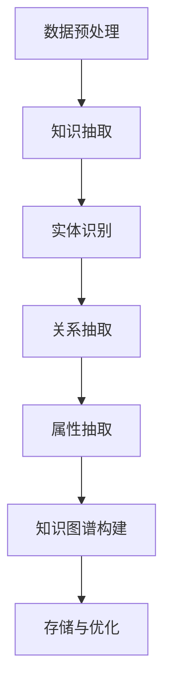
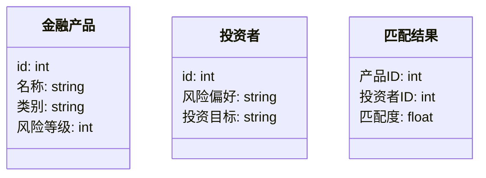
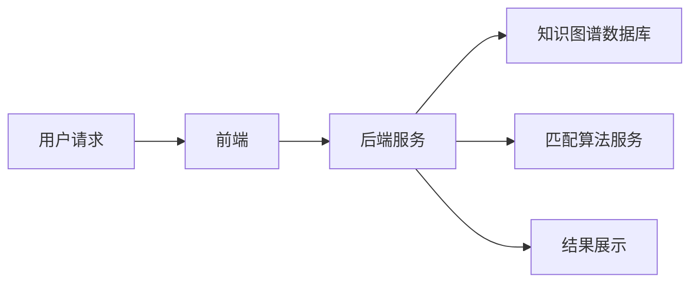

                 


# 构建基于知识图谱的金融产品适当性匹配引擎

> 关键词：知识图谱、金融产品、适当性匹配、推荐系统、语义理解、深度学习、系统架构

> 摘要：本文将深入探讨如何利用知识图谱构建金融产品适当性匹配引擎。通过分析知识图谱的核心概念、算法原理、系统架构以及项目实战，本文将为读者提供从理论到实践的全面指导。文章旨在解决金融产品匹配中的语义理解难题，提升匹配效率和准确性，为投资者和金融机构提供更智能的服务。

---

# 目录大纲

# 第一部分: 背景介绍

# 第1章: 金融产品适当性匹配的背景与问题

## 1.1 问题背景
### 1.1.1 金融产品适当性匹配的定义
### 1.1.2 当前金融产品匹配的主要挑战
### 1.1.3 知识图谱在金融领域的应用潜力

## 1.2 知识图谱的基本概念
### 1.2.1 知识图谱的定义与特点
### 1.2.2 知识图谱的核心要素
### 1.2.3 知识图谱与传统推荐系统的区别

## 1.3 金融产品适当性匹配的核心问题
### 1.3.1 金融产品的属性与分类
### 1.3.2 投资者的风险偏好与需求
### 1.3.3 产品-投资者匹配的核心逻辑

## 1.4 本章小结

---

# 第二部分: 核心概念与联系

# 第2章: 知识图谱与金融产品适当性匹配的核心概念

## 2.1 知识图谱构建的核心原理
### 2.1.1 知识图谱的构建流程
### 2.1.2 知识抽取与实体识别
### 2.1.3 关系抽取与属性抽取

## 2.2 金融产品适当性匹配的核心原理
### 2.2.1 产品属性的语义表示
### 2.2.2 投资者需求的语义表示
### 2.2.3 产品-投资者匹配的语义推理

## 2.3 知识图谱与金融产品适当性匹配的联系
### 2.3.1 知识图谱在产品属性建模中的作用
### 2.3.2 知识图谱在需求分析中的应用
### 2.3.3 知识图谱在匹配推理中的优势

## 2.4 本章小结

---

# 第三部分: 算法原理讲解

# 第3章: 知识图谱构建算法

## 3.1 知识图谱构建的算法原理
### 3.1.1 基于规则的知识抽取
### 3.1.2 基于统计的实体识别
### 3.1.3 基于深度学习的关系抽取

## 3.2 知识图谱构建的流程图


## 3.3 金融产品知识图谱的构建案例
### 3.3.1 数据来源与预处理
### 3.3.2 实体识别与关系抽取的实现
### 3.3.3 知识图谱存储与优化

## 3.4 本章小结

---

# 第4章: 金融产品适当性匹配算法

## 4.1 知识图谱匹配的核心算法
### 4.1.1 基于向量相似度的产品匹配
### 4.1.2 基于图结构的推理匹配
### 4.1.3 基于知识图谱的语义匹配

## 4.2 匹配算法的数学模型
### 4.2.1 向量相似度计算公式
$$\text{similarity}(v_1, v_2) = \frac{v_1 \cdot v_2}{\|v_1\| \|v_2\|}$$

### 4.2.2 基于图结构的推理算法
$$P(A \text{与} B \text{匹配}) = \prod_{i=1}^{n} p_i$$

## 4.3 算法实现与优化
### 4.3.1 算法实现的代码示例
```python
def compute_similarity(v1, v2):
    return (v1.dot(v2)) / (np.linalg.norm(v1) * np.linalg.norm(v2))
```

### 4.3.2 算法优化策略
### 4.3.3 算法在金融场景中的应用

## 4.4 本章小结

---

# 第四部分: 系统分析与架构设计

# 第5章: 系统分析与架构设计

## 5.1 问题场景介绍
### 5.1.1 系统目标与功能
### 5.1.2 系统的输入与输出
### 5.1.3 系统的性能要求

## 5.2 系统功能设计
### 5.2.1 领域模型设计


### 5.2.2 系统架构设计


## 5.3 系统架构设计
### 5.3.1 分层架构设计
### 5.3.2 模块划分与交互
### 5.3.3 系统接口设计

## 5.4 本章小结

---

# 第五部分: 项目实战

# 第6章: 项目实战

## 6.1 环境安装与配置
### 6.1.1 环境搭建
### 6.1.2 工具安装
### 6.1.3 数据准备

## 6.2 系统核心实现
### 6.2.1 知识图谱构建的实现
```python
def build_knowledge_graph(data):
    # 数据预处理
    # 实体识别
    # 关系抽取
    # 返回知识图谱
    pass
```

### 6.2.2 匹配算法的实现
```python
def matching_algorithm(products, investors):
    # 产品表示
    # 投资者表示
    # 计算匹配度
    return results
```

## 6.3 项目案例分析
### 6.3.1 案例背景
### 6.3.2 数据分析与处理
### 6.3.3 算法实现与解读
### 6.3.4 实验结果与分析

## 6.4 本章小结

---

# 第六部分: 总结与展望

# 第7章: 总结与展望

## 7.1 全文总结
### 7.1.1 核心内容回顾
### 7.1.2 知识图谱在金融领域的应用价值
### 7.1.3 本文的创新点与局限性

## 7.2 未来展望
### 7.2.1 知识图谱的优化方向
### 7.2.2 金融产品适当性匹配的未来发展
### 7.2.3 技术落地与产业化应用

## 7.3 本章小结

---

# 作者：AI天才研究院/AI Genius Institute & 禅与计算机程序设计艺术 /Zen And The Art of Computer Programming

