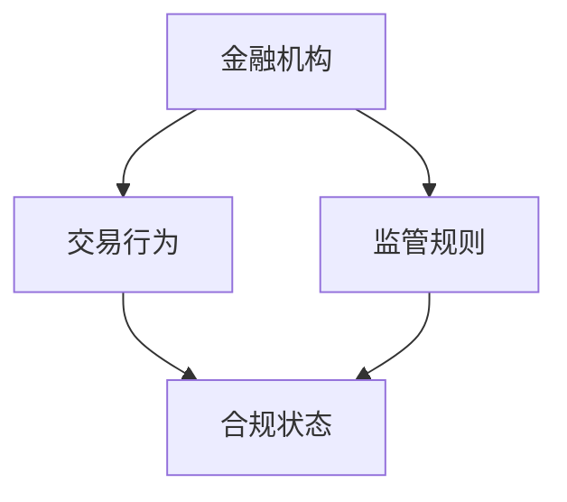
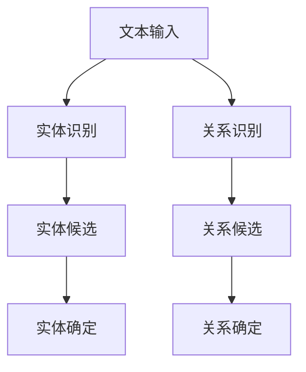
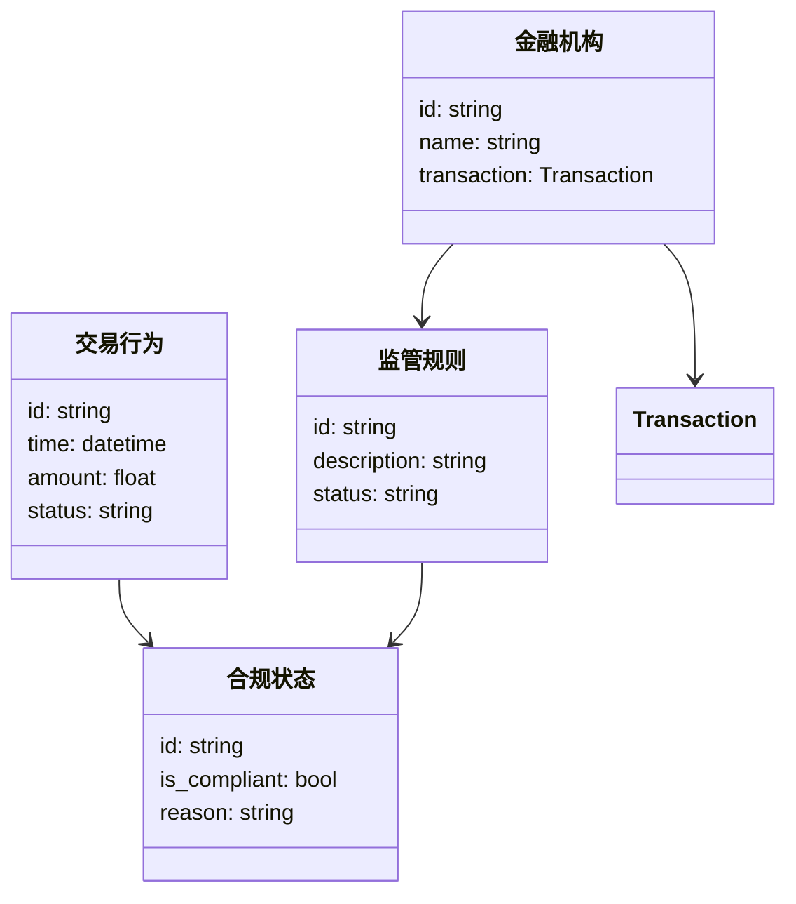
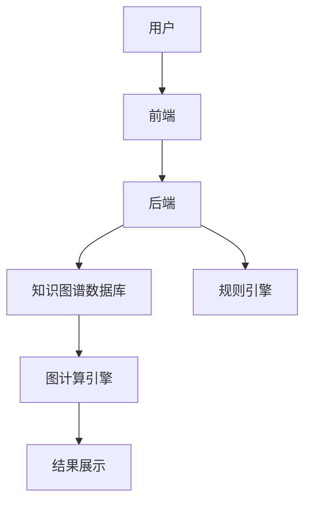
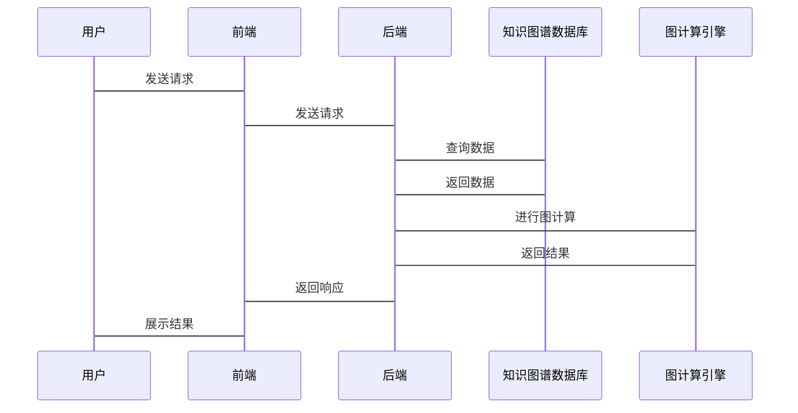

                 


# 构建基于知识图谱的金融监管合规追踪系统

> 关键词：知识图谱、金融监管、合规追踪、实体识别、关系抽取、系统架构、实时监控

> 摘要：本文详细探讨了如何利用知识图谱构建金融监管合规追踪系统，涵盖系统背景、核心概念、算法原理、系统架构、项目实战以及最佳实践。通过结合知识图谱的语义表示能力和图数据结构，系统能够实现对金融交易行为的实时监控、合规判断与风险预警，为金融机构和监管机构提供高效、智能的合规管理解决方案。

---

# 第一部分: 知识图谱与金融监管合规追踪系统背景

# 第1章: 知识图谱与金融监管合规追踪系统概述

## 1.1 知识图谱的背景与概念

### 1.1.1 知识图谱的定义与特点

知识图谱是一种用于表示实体及其关系的图结构，通过将分散在不同数据源中的实体和关系连接起来，形成一个语义丰富的网络。其主要特点包括：

- **语义丰富性**：通过实体和关系的组合，能够表示复杂的语义信息。
- **可扩展性**：支持动态添加新实体和关系，便于系统扩展。
- **关联性**：能够发现实体之间的隐含关系，支持关联分析。

### 1.1.2 知识图谱在金融领域的应用

在金融领域，知识图谱主要应用于以下场景：

- **风险控制**：通过分析实体之间的关系，识别潜在风险。
- **合规管理**：帮助金融机构追踪合规行为，识别违规操作。
- **智能投顾**：基于知识图谱提供个性化的投资建议。

### 1.1.3 知识图谱的核心要素与结构

知识图谱的核心要素包括实体、关系和属性。其结构通常由节点（实体）和边（关系）组成。例如，一个简单的知识图谱可以表示为：

```
机构A - 股权关系 - 机构B
```

## 1.2 金融监管合规追踪的背景

### 1.2.1 金融监管的定义与目标

金融监管是指对金融机构的经营行为进行监督和管理，确保其合规性。其主要目标包括：

- **合规性**：确保金融机构遵守相关法律法规。
- **透明性**：提高金融交易的透明度，便于监管。
- **风险控制**：识别和防范金融风险。

### 1.2.2 合规追踪的必要性与挑战

合规追踪是金融监管的重要组成部分，其必要性体现在：

- **实时性**：需要实时监控金融机构的交易行为。
- **准确性**：确保追踪结果的准确性，避免误判。
- **可追溯性**：能够追溯违规行为的来源和影响范围。

合规追踪的挑战包括：

- 数据分散：金融数据可能分布在多个系统中，难以统一管理。
- 数据复杂性：金融数据类型多样，处理复杂。
- 实时性要求高：需要快速处理大量数据。

### 1.2.3 知识图谱在合规追踪中的作用

知识图谱能够通过语义表示和关联分析，帮助金融机构和监管机构实现高效合规追踪。具体作用包括：

- **关联分析**：发现实体之间的隐含关系，识别潜在风险。
- **语义理解**：通过语义分析，提高合规判断的准确性。
- **动态更新**：支持实时更新，确保数据的及时性。

## 1.3 系统构建的背景与意义

### 1.3.1 问题背景与问题描述

随着金融市场的快速发展，金融机构的交易行为日益复杂，传统的合规追踪系统难以应对以下问题：

- 数据分散：金融机构的数据分布在多个系统中，难以统一管理。
- 数据复杂性：金融数据类型多样，处理复杂。
- 实时性要求高：需要快速处理大量数据。

### 1.3.2 系统构建的目标与解决思路

系统构建的目标是通过知识图谱技术，实现对金融机构交易行为的实时监控和合规判断。解决思路包括：

- **数据集成**：整合分散的金融数据，构建统一的知识图谱。
- **关联分析**：利用图结构进行关联分析，发现潜在风险。
- **实时更新**：支持数据的实时更新，确保系统的及时性。

### 1.3.3 系统的边界与外延

系统的边界包括：

- 数据来源：金融机构的交易数据、监管规则数据等。
- 用户角色：金融机构、监管机构。
- 功能范围：合规追踪、风险预警、数据可视化。

系统的外延包括：

- 数据扩展：支持更多数据源的接入。
- 功能扩展：增加智能分析、预测等功能。

## 1.4 核心概念与联系

### 1.4.1 核心概念的定义与属性对比

以下是核心概念的定义与属性对比：

| 概念 | 定义 | 属性 |
|------|------|------|
| 知识图谱 | 用于表示实体及其关系的图结构 | 可扩展性、语义丰富性、关联性 |
| 金融监管 | 对金融机构的监管与合规要求 | 合规性、透明性、风险控制 |
| 合规追踪 | 追踪合规行为与违规行为 | 实时性、准确性、可追溯性 |

### 1.4.2 ER实体关系图

以下是ER实体关系图：



## 1.5 本章小结

本章主要介绍了知识图谱和金融监管合规追踪系统的背景与概念，明确了系统的构建目标和意义，并通过核心概念与实体关系图展示了系统的主要组成部分。

---

# 第2章: 知识图谱构建算法原理

## 2.1 知识图谱构建的核心算法

### 2.1.1 实体识别与抽取

实体识别是知识图谱构建的第一步，其核心是将文本中的实体（如机构名称、人员姓名）提取出来。常用算法包括：

- **基于规则的方法**：通过正则表达式匹配特定模式。
- **基于统计的方法**：利用词语的共现频率进行实体识别。
- **基于深度学习的方法**：使用预训练模型（如BERT）进行实体识别。

### 2.1.2 关系抽取与推理

关系抽取是知识图谱构建的关键步骤，其核心是识别实体之间的关系。常用算法包括：

- **基于模板的方法**：通过预定义的模板匹配关系。
- **基于语义角色标注的方法**：通过语义分析提取关系。
- **基于深度学习的方法**：使用预训练模型（如BERT）进行关系抽取。

## 2.2 算法实现与代码示例

### 2.2.1 实体识别代码示例

以下是实体识别的代码示例：

```python
def entity_extraction(text):
    # 示例代码：使用预训练模型进行实体识别
    model = AutoModelForTokenClassification.from_pretrained("dbmdz/bert-base-dbmdz-ner")
    tokenizer = AutoTokenizer.from_pretrained("dbmdz/bert-base-dbmdz-ner")
    inputs = tokenizer(text, return_tensors="np")
    outputs = model(**inputs)
    predictions = np.argmax(outputs.logits, axis=1)
    return [tokenizer.decode(input_ids[0][i]) for i in range(len(input_ids[0])) if predictions[0][i] == 1]
```

### 2.2.2 关系抽取代码示例

以下是关系抽取的代码示例：

```python
def relation_extraction(text):
    # 示例代码：使用预训练模型进行关系抽取
    model = AutoModelForTokenClassification.from_pretrained("microsoft/layoutlm-base-merged-uncased")
    tokenizer = AutoTokenizer.from_pretrained("microsoft/layoutlm-base-merged-uncased")
    inputs = tokenizer(text, return_tensors="np")
    outputs = model(**inputs)
    predictions = np.argmax(outputs.logits, axis=1)
    return [tokenizer.decode(input_ids[0][i]) for i in range(len(input_ids[0])) if predictions[0][i] == 1]
```

## 2.3 数学模型与公式

### 2.3.1 实体识别的数学模型

实体识别的数学模型可以通过概率论进行表示。设文本中的一个词为$w_i$，其属于实体的概率为$p(w_i)$。概率$p(w_i)$可以通过预训练模型计算得到。

### 2.3.2 关系抽取的数学模型

关系抽取的数学模型可以通过图论进行表示。设实体$e_1$和$e_2$之间的关系为$r$，则关系$r$可以通过边$e_1 - r - e_2$表示。

## 2.4 算法流程图

以下是实体识别和关系抽取的算法流程图：



## 2.5 本章小结

本章详细介绍了知识图谱构建的核心算法，包括实体识别和关系抽取，并通过代码示例和数学模型展示了算法的实现过程。

---

# 第3章: 系统分析与架构设计方案

## 3.1 项目背景与介绍

本项目旨在构建一个基于知识图谱的金融监管合规追踪系统，通过整合金融机构的交易数据和监管规则数据，实现对合规行为的实时监控和风险预警。

## 3.2 系统功能设计

### 3.2.1 领域模型设计

以下是领域模型设计的类图：



### 3.2.2 系统架构设计

以下是系统架构设计的架构图：



### 3.2.3 接口设计

以下是系统接口设计的序列图：



## 3.3 本章小结

本章详细介绍了系统的架构设计方案，包括领域模型设计、系统架构设计和接口设计，并通过类图、架构图和序列图展示了系统的组成部分。

---

# 第4章: 项目实战

## 4.1 环境安装与配置

### 4.1.1 安装Python环境

```bash
python --version
pip install --upgrade pip
```

### 4.1.2 安装知识图谱相关库

```bash
pip install networkx
pip install neo4j
pip install spacy
```

## 4.2 核心代码实现

### 4.2.1 数据预处理代码

```python
import spacy
nlp = spacy.load("en_core_web_sm")
text = "Goldman Sachs acquired JPMorgan Chase in 2020."
doc = nlp(text)
for ent in doc.ents:
    print(ent.text, ent.label_)
```

### 4.2.2 知识图谱构建代码

```python
from networkx import *
G = Graph()
G.add_nodes_from(["Goldman Sachs", "JPMorgan Chase", "acquired"])
G.add_edges_from([("Goldman Sachs", "acquired"), ("acquired", "JPMorgan Chase")])
draw(G)
```

## 4.3 案例分析与结果解读

### 4.3.1 案例分析

假设我们有一笔交易数据：

```python
transaction = {
    "id": "123",
    "time": "2023-01-01",
    "amount": 1000000,
    "status": "completed"
}
```

通过知识图谱构建，我们可以识别出该交易涉及的机构和监管规则。

### 4.3.2 结果解读

通过图计算引擎，我们可以识别出该交易的合规状态，并生成相应的报告。

## 4.4 项目总结

本项目通过知识图谱技术，实现了对金融交易行为的实时监控和合规判断，为金融机构和监管机构提供了高效的合规管理解决方案。

---

# 第5章: 最佳实践与注意事项

## 5.1 最佳实践

### 5.1.1 数据质量管理

- 数据清洗：确保数据的准确性和完整性。
- 数据标注：对数据进行标注，提高实体识别的准确性。

### 5.1.2 系统优化

- 索引优化：通过索引优化查询性能。
- 并行计算：利用并行计算提高处理效率。

## 5.2 注意事项

- 数据隐私：确保数据的安全性和隐私性。
- 系统稳定性：保证系统的高可用性和稳定性。
- 法律合规：确保系统符合相关法律法规。

## 5.3 拓展阅读

- 知识图谱相关书籍：《Knowledge Graphs: From Research to Practice》
- 图计算相关书籍：《Graph Theory and Its Applications》

---

# 第6章: 总结与展望

## 6.1 总结

通过本文的详细讲解，我们了解了如何利用知识图谱构建金融监管合规追踪系统，包括系统的背景、核心算法、架构设计、项目实战和最佳实践。

## 6.2 展望

未来，随着人工智能和大数据技术的不断发展，知识图谱在金融监管中的应用将更加广泛。我们可以进一步研究如何结合区块链和深度学习技术，提升系统的智能化水平。

---

# 作者

作者：AI天才研究院/AI Genius Institute & 禅与计算机程序设计艺术 /Zen And The Art of Computer Programming

