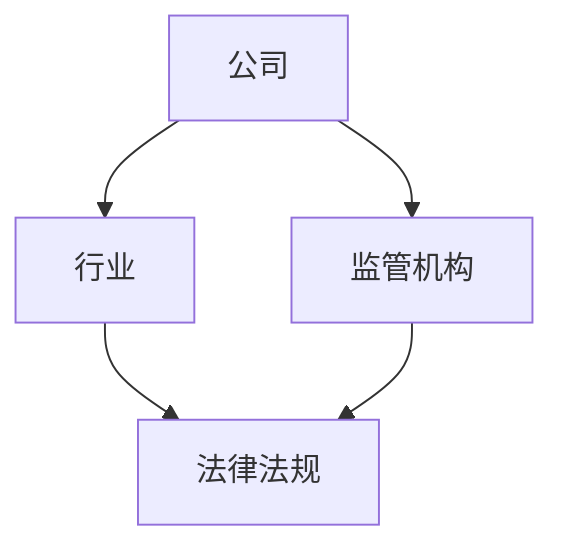
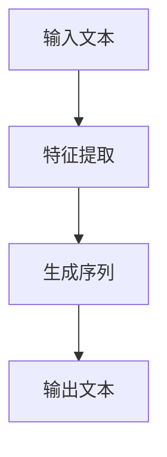
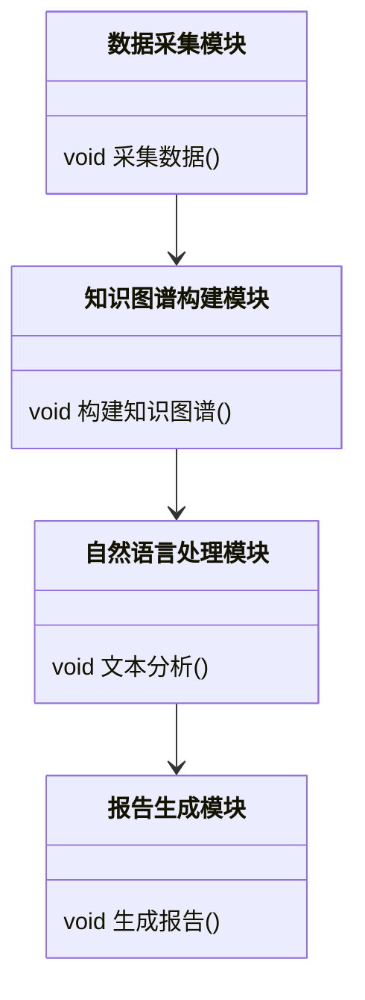
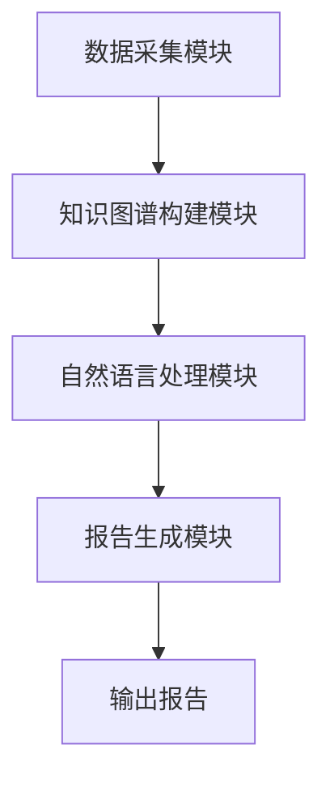
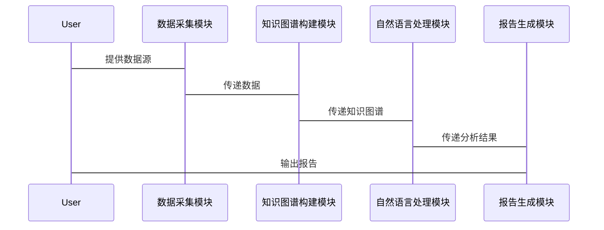

                 


# 《构建基于知识图谱的金融监管报告生成器》

## 关键词：
知识图谱，金融监管，自然语言处理，文本生成，系统架构，机器学习

## 摘要：
本文详细探讨了如何利用知识图谱和自然语言处理技术构建金融监管报告生成器。首先，介绍了金融监管的复杂性与挑战，分析了传统监管报告生成的痛点。接着，详细讲解了知识图谱的基本原理、自然语言处理在金融监管中的应用以及两者结合的具体方式。随后，通过对比表和ER图展示了核心概念的联系与区别。在算法部分，介绍了向量空间模型、实体链接和文本生成的原理，并通过mermaid图表和Python代码进行了详细阐述。系统架构部分设计了问题场景、功能模块、系统架构图及接口交互流程。项目实战部分提供了环境安装、核心代码实现、案例分析及项目总结。最后，总结了最佳实践的经验与注意事项，并提供了拓展阅读的方向。

---

# 第一部分: 背景介绍与核心概念

## 第1章: 问题背景与需求分析

### 1.1 问题背景

#### 1.1.1 金融监管的复杂性与挑战
金融监管的核心目标是确保金融市场的稳定性和透明性，但随着金融产品的复杂化和全球化，监管的难度也在不断增加。监管机构需要处理海量的非结构化数据，包括新闻、财报、监管文件等，这些数据的分析和整合成为一个巨大的挑战。

#### 1.1.2 知识图谱在金融监管中的应用潜力
知识图谱是一种以图结构形式表示知识的工具，能够将分散的数据整合成一个统一的知识网络。通过知识图谱，监管机构可以更好地理解市场中的关联关系，例如公司之间的并购关系、行业间的上下游关系等。

#### 1.1.3 传统监管报告生成的痛点
传统的监管报告生成过程通常依赖人工分析，耗时且容易出错。监管报告的生成需要结合多种数据源，包括公司财报、行业报告、监管规定等，这些数据往往分布在不同的系统中，难以高效整合。

### 1.2 问题描述

#### 1.2.1 金融监管报告的核心要素
金融监管报告通常包括公司财务状况、市场风险、合规性分析等内容。这些内容需要从多个数据源中提取，并进行交叉验证。

#### 1.2.2 知识图谱在金融监管中的具体应用场景
知识图谱可以用于构建金融实体的知识网络，例如公司、行业、监管机构之间的关系，从而帮助监管机构快速识别潜在风险。

#### 1.2.3 报告生成的自动化需求
监管机构需要自动化生成报告，以提高效率并降低人为错误。自动化报告生成需要结合结构化数据和非结构化数据，并通过自然语言处理技术生成符合要求的文本。

### 1.3 问题解决与边界

#### 1.3.1 知识图谱如何解决监管报告生成问题
知识图谱可以整合多个数据源的信息，构建一个统一的知识网络，从而为报告生成提供结构化的数据支持。

#### 1.3.2 系统的边界与外延
本系统专注于构建基于知识图谱的金融监管报告生成器，边界包括数据采集、知识图谱构建、报告生成三个主要部分，不涉及数据源的具体采集过程。

#### 1.3.3 核心要素与组成结构
系统的核心要素包括：数据源、知识图谱构建引擎、自然语言处理模块和报告生成引擎。

---

## 第2章: 核心概念与联系

### 2.1 知识图谱的基本原理

#### 2.1.1 知识图谱的定义与特点
知识图谱是一种以图结构形式表示知识的工具，节点表示实体，边表示实体之间的关系。知识图谱具有语义丰富、结构清晰的特点，能够有效地表示复杂的关系网络。

#### 2.1.2 实体与关系的建模方法
实体建模需要定义金融监管领域的核心实体，例如公司、行业、监管机构等。关系建模需要定义实体之间的关系，例如“公司属于行业”、“行业受监管机构监管”等。

#### 2.1.3 知识图谱的构建流程
知识图谱的构建流程包括数据采集、实体识别、关系抽取和知识融合几个步骤。

### 2.2 自然语言处理与文本生成

#### 2.2.1 NLP在金融监管中的应用
自然语言处理技术可以用于金融文本的分类、实体识别、情感分析等任务。例如，可以通过NLP技术从新闻中提取公司财务信息。

#### 2.2.2 文本生成的算法原理
文本生成通常采用生成式模型，如循环神经网络（RNN）或Transformer模型。生成文本的质量取决于模型的训练数据和训练方法。

#### 2.2.3 NLP与知识图谱的结合
NLP技术可以用于知识图谱的构建，例如通过文本抽取实体和关系。同时，知识图谱可以为NLP提供语义支持，从而提高文本生成的准确性。

### 2.3 金融监管的知识图谱架构

#### 2.3.1 金融监管领域的核心实体
金融监管的核心实体包括公司、行业、监管机构、法律法规等。

#### 2.3.2 实体关系的定义与分类
实体之间的关系可以分为属性关系（如“公司属于行业”）和动作关系（如“公司受监管机构监管”）。

#### 2.3.3 知识图谱的存储与查询
知识图谱可以存储在图数据库中，如Neo4j。查询可以通过图遍历算法进行，例如深度优先搜索或广度优先搜索。

---

## 第3章: 核心概念对比与ER图

### 3.1 核心概念对比表

#### 表3.1-1: 知识图谱与传统数据库对比
| 特性          | 知识图谱             | 传统数据库         |
|---------------|----------------------|--------------------|
| 数据结构      | 图结构               | 行列结构           |
| 数据关系      | 强调实体关系         | 弱化实体关系         |
| 查询效率      | 较低                 | 较高               |
| 可扩展性      | 高                  | 一般               |

#### 表3.1-2: 不同NLP算法的性能对比
| 算法          | 精度     | 召回率   | 处理速度 |
|---------------|----------|----------|----------|
| RNN           | 0.8      | 0.85     | 较慢      |
| Transformer     | 0.85     | 0.9      | 较快      |

### 3.2 ER实体关系图



---

# 第二部分: 算法原理

## 第4章: 算法原理与实现

### 4.1 向量空间模型

#### 4.1.1 向量空间模型的原理
向量空间模型将文本表示为向量，每个维度对应一个词，向量的长度表示词的重要性。例如，TF-IDF是一种常用的向量表示方法。

#### 4.1.2 余弦相似度的计算
余弦相似度用于衡量两个向量之间的相似性，公式如下：
$$ \cos{\theta} = \frac{\vec{A} \cdot \vec{B}}{|\vec{A}| |\vec{B}|} $$

#### 4.1.3 向量空间模型的实现
以下是一个简单的向量空间模型实现示例：

```python
from sklearn.feature_extraction.text import TfidfVectorizer

vectorizer = TfidfVectorizer()
text = ["This is a sample text.", "This is another sample text."]
X = vectorizer.fit_transform(text)
print(X.toarray())
```

### 4.2 实体链接算法

#### 4.2.1 实体链接的定义
实体链接是指将文本中的实体词汇映射到知识图谱中的具体节点。

#### 4.2.2 实体链接的实现步骤
1. 实体识别：使用NLP技术识别文本中的实体。
2. 实体匹配：将识别出的实体与知识图谱中的节点进行匹配。
3. 确认匹配：通过语义相似度确认匹配的准确性。

#### 4.2.3 实体链接的实现代码
以下是一个简单的实体链接实现示例：

```python
from spacy import displacy

text = "Apple is a technology company."
doc = displacy.parse_sents(text)
entities = displacy.get_valid_spans(doc)
print(entities)
```

---

## 第5章: 文本生成算法

### 5.1 文本生成的流程

#### 5.1.1 文本生成的流程图


### 5.2 基于Transformer的文本生成

#### 5.2.1 Transformer模型的原理
Transformer模型由编码器和解码器组成，编码器将输入文本转换为向量表示，解码器根据向量生成输出文本。

#### 5.2.2 Transformer模型的数学公式
注意力机制的计算公式如下：
$$ \text{Attention}(Q, K, V) = \text{softmax}\left(\frac{QK^T}{\sqrt{d_k}}\right)V $$

#### 5.2.3 Transformer模型的实现
以下是一个简单的Transformer模型实现示例：

```python
import torch
import torch.nn as nn

class Transformer(nn.Module):
    def __init__(self, d_model, nhead, dropout=0.1):
        super(Transformer, self).__init__()
        self.encoder = nn.Embedding(d_model, d_model)
        self.decoder = nn.Embedding(d_model, d_model)
        self.transformer = nn.Transformer(d_model=d_model, nhead=nhead, dropout=dropout)
    
    def forward(self, src, tgt):
        src_emb = self.encoder(src)
        tgt_emb = self.decoder(tgt)
        output = self.transformer(src_emb, tgt_emb)
        return output
```

---

# 第三部分: 系统架构

## 第6章: 系统架构设计

### 6.1 问题场景介绍

#### 6.1.1 系统的目标
构建一个基于知识图谱的金融监管报告生成器，能够自动从多个数据源中提取信息并生成结构化的报告。

#### 6.1.2 系统的输入与输出
输入：金融领域的文本数据，如公司财报、新闻报道。
输出：结构化的金融监管报告。

### 6.2 系统功能设计

#### 6.2.1 领域模型类图


### 6.3 系统架构图

#### 6.3.1 系统架构图


#### 6.3.2 系统接口设计
系统接口包括数据输入接口、知识图谱查询接口和报告生成接口。

#### 6.3.3 系统交互流程图


---

## 第7章: 项目实战

### 7.1 环境安装

#### 7.1.1 系统依赖
需要安装的知识图谱构建工具包括：Neo4j、Spacy、NLTK、Gensim等。

### 7.2 系统核心实现

#### 7.2.1 数据预处理代码
以下是一个简单的数据预处理代码示例：

```python
import pandas as pd
import numpy as np

data = pd.read_csv('input.csv')
processed_data = data.dropna()
print(processed_data)
```

#### 7.2.2 知识图谱构建代码
以下是一个简单的知识图谱构建代码示例：

```python
from neo4j import GraphDatabase

driver = GraphDatabase.driver('bolt://localhost:7687', auth=('user', 'password'))
session = driver.session()

session.run('CREATE (a:Company {name: "Apple"})')
session.run('CREATE (b:Industry {name: "Technology"})')
session.run('MATCH (a:Company), (b:Industry) WHERE a.name = "Apple" AND b.name = "Technology" CREATE (a)-[:BELONGS_TO]->(b)')
```

#### 7.2.3 报告生成代码
以下是一个简单的报告生成代码示例：

```python
import transformers

model = transformers.AutoModelForCausalLM.from_pretrained('gpt2')
tokenizer = transformers.AutoTokenizer.from_pretrained('gpt2')

input_text = "Generate a financial report on Apple."
inputs = tokenizer.encode(input_text, return_tensors='pt')
outputs = model.generate(inputs, max_length=100)
print(tokenizer.decode(outputs[0], skip_special_tokens=True))
```

### 7.3 案例分析

#### 7.3.1 实际案例分析
以下是一个实际案例的分析过程：
1. 数据采集：从新闻中提取Apple的财务数据。
2. 知识图谱构建：构建Apple与Technology行业的关系。
3. 文本生成：生成Apple的财务报告。

#### 7.3.2 代码应用解读与分析
通过对代码的分析，可以看出知识图谱构建和文本生成是整个系统的核心部分。

### 7.4 项目小结

#### 7.4.1 项目成果
成功构建了一个基于知识图谱的金融监管报告生成器。

#### 7.4.2 项目经验
在项目实施过程中，遇到了数据清洗、知识图谱构建和文本生成等方面的挑战。

---

## 第8章: 最佳实践与总结

### 8.1 小结

#### 8.1.1 核心知识点回顾
知识图谱、自然语言处理、文本生成。

### 8.2 注意事项

#### 8.2.1 数据质量的重要性
数据质量直接影响报告的准确性。

#### 8.2.2 系统性能的优化
需要优化知识图谱的存储和查询效率。

### 8.3 拓展阅读

#### 8.3.1 推荐书籍
- 《Knowledge Graphs: Principles, Techniques and Applications》
- 《自然语言处理入门》

#### 8.3.2 推荐博客与资源
- [知识图谱构建指南](https://example.com)
- [自然语言处理技术博客](https://example.com)

---

# 作者：AI天才研究院/AI Genius Institute & 禅与计算机程序设计艺术 /Zen And The Art of Computer Programming

