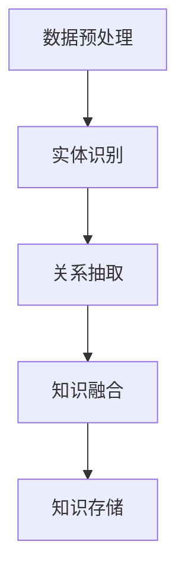

                 


# 构建基于知识图谱的金融监管政策影响链追踪系统

> 关键词：知识图谱，金融监管，政策影响链，系统构建，算法原理，金融风险

> 摘要：本文详细探讨了基于知识图谱的金融监管政策影响链追踪系统的构建方法。首先，从知识图谱和金融监管政策的基本概念出发，分析了两者结合的必要性和可行性。接着，详细阐述了知识图谱在金融监管中的应用，特别是政策影响链的构建与分析。通过链式推理和图嵌入等算法，结合系统架构设计和项目实战，展示了如何利用知识图谱技术实现政策影响链的追踪与可视化。最后，总结了本文的主要内容，并提出了未来的研究方向和实际应用建议。

---

# 第一部分: 知识图谱与金融监管政策影响链概述

## 第1章: 知识图谱与金融监管政策概述

### 1.1 知识图谱的基本概念

#### 1.1.1 知识图谱的定义与特点

知识图谱是一种以图结构形式表示知识的技术，其核心是通过实体（node）和关系（edge）构建语义网络。知识图谱的特点包括：

1. **语义性**：通过实体和关系描述真实世界的语义联系。
2. **结构化**：知识以结构化的形式存储，便于计算机理解和推理。
3. **可扩展性**：支持大规模数据的存储和分析。

知识图谱的基本组成要素包括实体、属性和关系。例如，实体可以是“公司”或“政策”，属性可以是“公司名称”或“政策类型”，关系可以是“公司受政策影响”或“政策影响市场”。

#### 1.1.2 知识图谱的核心要素

知识图谱的核心要素包括：

- **实体（Entity）**：代表现实世界中的具体事物或概念，例如“金融监管政策”、“金融机构”。
- **属性（Property）**：描述实体的特征或性质，例如“政策类型”、“机构规模”。
- **关系（Relation）**：描述实体之间的关联，例如“政策影响市场”、“机构遵守政策”。

#### 1.1.3 知识图谱在金融领域的应用前景

在金融领域，知识图谱可以用于金融监管、风险评估、市场分析等场景。例如，通过构建金融监管政策的知识图谱，可以实现政策影响链的追踪和可视化。

### 1.2 金融监管政策的基本概念

#### 1.2.1 金融监管的定义与目标

金融监管是指通过法律法规和制度对金融市场参与者的行为进行规范和监督，以维护金融市场的稳定和健康发展。金融监管的目标包括：

1. **保护投资者利益**：防止金融欺诈和不公平交易。
2. **维护市场秩序**：确保金融市场的公平、透明和高效。
3. **防范系统性风险**：避免金融市场的系统性崩溃。

#### 1.2.2 金融监管政策的主要类型

金融监管政策的主要类型包括：

- **市场准入监管**：对金融机构的设立和运营进行监管。
- **资本充足性监管**：要求金融机构保持足够的资本以应对潜在风险。
- **业务活动监管**：对金融机构的业务范围和操作进行规范。
- **信息披露监管**：要求金融机构公开相关信息，提高市场透明度。

#### 1.2.3 金融监管政策的实施机制

金融监管政策的实施机制包括：

1. **法律法规制定**：通过立法和规章制度明确监管要求。
2. **监督检查**：通过现场检查和非现场监控确保政策执行。
3. **行政处罚**：对违规行为进行处罚，维护市场秩序。

### 1.3 金融监管政策影响链的概念

#### 1.3.1 政策影响链的定义

政策影响链是指政策的制定、实施和效果之间的关联关系。具体来说，政策影响链描述了政策如何通过金融机构、市场参与者等中介因素，最终影响金融市场和经济主体的行为。

#### 1.3.2 政策影响链的构成要素

政策影响链的构成要素包括：

- **政策节点**：政策的制定和发布。
- **中介因素**：金融机构、市场参与者等。
- **影响结果**：政策对市场、经济和社会的影响。

#### 1.3.3 政策影响链在金融监管中的作用

政策影响链在金融监管中的作用包括：

1. **政策效果评估**：通过分析政策影响链，可以评估政策的实施效果。
2. **风险预警**：通过分析政策影响链，可以识别潜在的金融风险。
3. **政策优化**：通过分析政策影响链，可以优化政策设计和实施。

---

## 第2章: 知识图谱与金融监管的结合

### 2.1 知识图谱在金融监管中的应用背景

#### 2.1.1 传统金融监管的局限性

传统金融监管主要依赖于法律法规和监督检查，存在以下局限性：

1. **信息分散**：金融机构和市场参与者众多，信息分散且难以整合。
2. **效率低下**：传统监管方式效率较低，难以应对复杂的金融市场环境。
3. **缺乏系统性**：缺乏系统性分析工具，难以全面评估政策效果。

#### 2.1.2 知识图谱技术的优势

知识图谱技术的优势包括：

1. **数据整合能力**：能够将分散的金融监管数据整合成统一的知识网络。
2. **语义理解能力**：能够通过语义分析技术理解金融监管政策的含义和影响。
3. **可扩展性**：支持大规模数据的存储和分析，适用于复杂的金融市场环境。

#### 2.1.3 知识图谱在金融监管中的潜在价值

知识图谱在金融监管中的潜在价值包括：

1. **政策影响链的构建**：通过知识图谱技术构建政策影响链，实现政策效果的可视化和分析。
2. **风险预警**：通过知识图谱技术分析政策风险，提前预警潜在的金融风险。
3. **政策优化**：通过知识图谱技术优化政策设计和实施，提高金融监管效率。

### 2.2 知识图谱构建的基本方法

#### 2.2.1 实体识别与抽取

实体识别与抽取是知识图谱构建的基础，主要步骤包括：

1. **数据预处理**：对文本数据进行清洗和分词。
2. **实体识别**：通过自然语言处理技术识别文本中的实体。
3. **实体标准化**：对识别出的实体进行标准化处理，确保实体的一致性。

例如，识别“公司”这一实体时，需要确保所有提到“公司”的地方都统一为“公司”这一实体。

#### 2.2.2 关系抽取与建模

关系抽取与建模是知识图谱构建的关键步骤，主要步骤包括：

1. **关系识别**：通过自然语言处理技术识别文本中的关系。
2. **关系建模**：将识别出的关系建模为图结构，例如“公司A受政策B影响”。

例如，识别“政策B影响公司A”这一关系时，需要将“政策B”和“公司A”通过关系“影响”连接起来。

#### 2.2.3 知识图谱的存储与管理

知识图谱的存储与管理是知识图谱构建的重要环节，常用的技术包括：

1. **图数据库**：如Neo4j，支持大规模图数据的存储和查询。
2. **知识图谱构建工具**：如Ubergraph，支持知识图谱的可视化构建和管理。

例如，使用Neo4j存储知识图谱，可以通过Cypher查询语言进行复杂关系的查询和分析。

### 2.3 知识图谱在政策影响链中的应用

#### 2.3.1 政策影响链的构建方法

政策影响链的构建方法包括：

1. **数据收集**：收集相关的金融监管政策和市场数据。
2. **实体识别**：识别政策和市场的实体。
3. **关系抽取**：抽取政策与实体之间的关系。
4. **知识图谱构建**：将政策和实体通过关系连接起来，形成政策影响链。

例如，收集政策“资本充足性监管”，识别实体“银行”，抽取关系“资本充足性监管影响银行资本结构”，构建政策影响链。

#### 2.3.2 知识图谱在政策影响链中的作用

知识图谱在政策影响链中的作用包括：

1. **政策效果的可视化**：通过知识图谱可视化政策影响链，帮助监管机构理解政策的实施效果。
2. **政策风险的预警**：通过分析政策影响链，识别潜在的政策风险，提前采取措施。
3. **政策优化的依据**：通过分析政策影响链，优化政策设计和实施，提高金融监管效率。

#### 2.3.3 政策影响链的可视化与分析

政策影响链的可视化与分析可以通过知识图谱可视化工具实现，例如：

1. **图谱可视化工具**：如Gephi，支持复杂图结构的可视化和分析。
2. **数据可视化工具**：如Tableau，支持政策影响链的数据可视化和分析。

例如，使用Gephi可视化政策影响链，可以通过节点和边的布局，直观展示政策与实体之间的关系。

---

## 第3章: 金融监管政策影响链的核心概念

### 3.1 政策影响链的结构与组成

#### 3.1.1 政策节点

政策节点是政策影响链的核心，包括政策的制定、发布和实施等环节。例如，政策“资本充足性监管”是政策节点。

#### 3.1.2 实体节点

实体节点是政策影响的对象，包括金融机构、市场参与者等。例如，实体“银行”是政策“资本充足性监管”的影响对象。

#### 3.1.3 关系节点

关系节点是政策与实体之间的关系，例如“政策影响市场”、“市场影响企业”等。例如，关系“资本充足性监管影响银行资本结构”是政策与实体之间的关系。

### 3.2 政策影响链的核心要素

#### 3.2.1 政策目标

政策目标是政策的核心目标，例如“维护金融稳定”、“保护投资者利益”等。

#### 3.2.2 政策主体

政策主体是政策的制定者和实施者，例如政府、监管机构等。

#### 3.2.3 政策客体

政策客体是政策影响的对象，例如金融机构、市场参与者等。

### 3.3 政策影响链的构建流程

#### 3.3.1 数据收集与预处理

数据收集与预处理是政策影响链构建的基础，包括：

1. **数据收集**：收集相关的金融监管政策和市场数据。
2. **数据清洗**：对收集到的数据进行清洗和预处理，确保数据的准确性和完整性。

例如，收集政策“资本充足性监管”和市场数据“银行资本结构”，并对数据进行清洗和预处理。

#### 3.3.2 实体识别与关系抽取

实体识别与关系抽取是政策影响链构建的关键步骤，包括：

1. **实体识别**：识别政策和市场的实体。
2. **关系抽取**：抽取政策与实体之间的关系。

例如，识别政策“资本充足性监管”和实体“银行”，抽取关系“资本充足性监管影响银行资本结构”。

#### 3.3.3 知识图谱构建与存储

知识图谱构建与存储是政策影响链构建的最后一步，包括：

1. **知识图谱构建**：将政策和实体通过关系连接起来，形成政策影响链。
2. **知识图谱存储**：将构建好的知识图谱存储到图数据库中，例如Neo4j。

例如，将政策“资本充足性监管”和实体“银行”通过关系“影响”连接起来，存储到Neo4j中。

---

## 第4章: 知识图谱构建与政策影响链分析

### 4.1 知识图谱构建算法与实现

#### 4.1.1 实体识别算法

实体识别算法包括：

1. **基于规则的方法**：通过预定义的规则进行实体识别。
2. **基于统计的方法**：通过统计语言模型进行实体识别。
3. **基于深度学习的方法**：通过神经网络模型进行实体识别。

例如，使用深度学习模型BERT进行实体识别，识别文本中的实体。

#### 4.1.2 关系抽取算法

关系抽取算法包括：

1. **基于规则的方法**：通过预定义的规则进行关系抽取。
2. **基于统计的方法**：通过统计语言模型进行关系抽取。
3. **基于深度学习的方法**：通过神经网络模型进行关系抽取。

例如，使用深度学习模型BERT进行关系抽取，识别文本中的关系。

#### 4.1.3 知识融合算法

知识融合算法包括：

1. **实体对齐**：将不同来源的实体进行对齐，例如将“公司”和“企业”统一为“公司”。
2. **关系融合**：将不同来源的关系进行融合，例如将“政策影响市场”和“市场影响企业”融合为“政策影响企业”。

例如，通过知识对齐技术将不同来源的实体和关系进行融合，构建统一的知识图谱。

### 4.2 知识图谱构建的数学模型与公式

#### 4.2.1 实体表示模型

实体表示模型可以使用向量表示，例如：

$$
E_i = \text{表示实体} i \text{的向量}
$$

#### 4.2.2 关系表示模型

关系表示模型可以使用边表示，例如：

$$
R_{ij} = \text{表示实体} i \text{和实体} j \text{之间的关系}
$$

#### 4.2.3 知识图谱的嵌入表示

知识图谱的嵌入表示可以通过图嵌入算法实现，例如：

$$
\text{嵌入向量} = \text{通过图嵌入算法生成}
$$

### 4.3 知识图谱构建的流程图

以下是一个知识图谱构建的流程图：



---

## 第5章: 政策影响链的分析与追踪

### 5.1 政策影响链的分析方法

#### 5.1.1 基于知识图谱的路径分析

路径分析是通过知识图谱中的路径来分析政策影响链。例如，分析政策“资本充足性监管”如何通过“银行”影响“市场”。

#### 5.1.2 基于链式推理的政策影响追踪

链式推理是通过链式推理算法追踪政策影响链。例如，通过链式推理分析政策“资本充足性监管”如何影响“银行资本结构”。

#### 5.1.3 基于图嵌入的相似政策识别

图嵌入是通过图嵌入算法识别相似政策。例如，识别与政策“资本充足性监管”相似的其他政策。

### 5.2 政策影响链的追踪算法

#### 5.2.1 链式推理算法

链式推理算法是一种通过链式推理进行政策影响链追踪的算法。例如，通过链式推理算法分析政策“资本充足性监管”如何影响“银行资本结构”。

#### 5.2.2 图嵌入算法

图嵌入算法是一种通过图嵌入技术识别相似政策的算法。例如，通过图嵌入算法识别与政策“资本充足性监管”相似的其他政策。

#### 5.2.3 关系网络分析算法

关系网络分析算法是一种通过关系网络分析技术分析政策影响链的算法。例如，通过关系网络分析算法分析政策“资本充足性监管”与“银行”之间的关系。

### 5.3 政策影响链的可视化

#### 5.3.1 政策影响链的可视化方法

政策影响链的可视化方法包括：

1. **图谱可视化**：通过图谱可视化工具展示政策影响链。
2. **网络可视化**：通过网络可视化工具展示政策影响链。

例如，使用Gephi可视化政策影响链，通过节点和边的布局展示政策与实体之间的关系。

#### 5.3.2 基于知识图谱的政策影响网络可视化

基于知识图谱的政策影响网络可视化是一种通过知识图谱技术展示政策影响网络的可视化方法。例如，通过知识图谱技术展示政策“资本充足性监管”如何影响“银行资本结构”。

#### 5.3.3 政策影响链的动态可视化

政策影响链的动态可视化是一种通过动态可视化技术展示政策影响链变化的可视化方法。例如，通过动态可视化技术展示政策“资本充足性监管”在不同时期的影响链变化。

---

## 第6章: 系统架构与设计

### 6.1 系统功能设计

#### 6.1.1 数据采集模块

数据采集模块负责采集相关的金融监管政策和市场数据。例如，通过网络爬虫采集政策文本和市场数据。

#### 6.1.2 知识图谱构建模块

知识图谱构建模块负责构建金融监管政策影响链的知识图谱。例如，通过实体识别、关系抽取和知识融合技术构建知识图谱。

#### 6.1.3 政策影响链分析模块

政策影响链分析模块负责分析政策影响链。例如，通过链式推理和图嵌入技术分析政策影响链。

#### 6.1.4 可视化展示模块

可视化展示模块负责展示政策影响链的分析结果。例如，通过图谱可视化工具展示政策影响链。

### 6.2 系统架构设计

系统架构设计包括：

1. **分层架构**：系统分为数据层、知识图谱构建层、分析层和展示层。
2. **模块化设计**：系统功能模块化，便于维护和扩展。

例如，数据层存储政策和市场数据，知识图谱构建层构建知识图谱，分析层分析政策影响链，展示层展示分析结果。

### 6.3 系统接口设计

系统接口设计包括：

1. **数据接口**：与数据源对接，采集数据。
2. **分析接口**：与分析模块对接，提供分析结果。
3. **展示接口**：与展示模块对接，展示分析结果。

### 6.4 系统交互设计

系统交互设计包括：

1. **用户界面**：设计友好的用户界面，方便用户操作。
2. **交互流程**：设计清晰的交互流程，确保用户能够顺利使用系统。

例如，用户通过用户界面输入政策名称，系统通过交互流程展示政策影响链的分析结果。

---

## 第7章: 项目实战

### 7.1 环境安装与配置

项目实战需要以下环境和工具：

1. **Python**：编程语言。
2. **Neo4j**：图数据库。
3. **Gephi**：图谱可视化工具。
4. **BERT**：实体识别和关系抽取模型。

### 7.2 核心代码实现

以下是一个简单的知识图谱构建代码示例：

```python
from neo4j import GraphDatabase
from bert import BertTokenizer, BertModel

# 初始化图数据库
def init_graph_db():
    driver = GraphDatabase.driver("bolt://localhost:7687", auth=("neo4j", "password"))
    return driver

# 实体识别与关系抽取
def extract_entities_and_relations(text):
    tokenizer = BertTokenizer.from_pretrained('bert-base-uncased')
    model = BertModel.from_pretrained('bert-base-uncased')
    # 实体识别
    entities = []
    # 关系抽取
    relations = []
    return entities, relations

# 知识图谱构建
def build_knowledge_graph(driver, entities, relations):
    # 创建实体
    for entity in entities:
        driver.session().write_transaction(lambda tx: tx.run("CREATE (n:Entity {name: $name})", name=entity))
    # 创建关系
    for relation in relations:
        head, relation_type, tail = relation
        driver.session().write_transaction(lambda tx: tx.run("MATCH (a), (b) WHERE a.name = $head AND b.name = $tail CREATE (a)-[r:%s]->(b)" % relation_type, head=head, tail=tail))

# 主程序
def main():
    driver = init_graph_db()
    text = "资本充足性监管影响银行资本结构"
    entities, relations = extract_entities_and_relations(text)
    build_knowledge_graph(driver, entities, relations)

if __name__ == "__main__":
    main()
```

### 7.3 案例分析与解读

以下是一个简单的案例分析：

假设我们有政策“资本充足性监管”和市场数据“银行资本结构”。通过知识图谱构建技术，我们可以将政策和市场数据连接起来，形成政策影响链。例如：

- 政策“资本充足性监管”影响实体“银行”。
- 实体“银行”资本结构变化影响市场“银行股价格”。

通过可视化工具Gephi，我们可以将政策影响链可视化，直观展示政策如何影响市场。

### 7.4 项目小结

项目小结包括：

1. **项目目标**：构建基于知识图谱的金融监管政策影响链追踪系统。
2. **项目成果**：实现政策影响链的构建、分析和可视化。
3. **项目意义**：为金融监管提供有力的技术支持，提高政策实施效果。

---

## 第8章: 最佳实践与总结

### 8.1 最佳实践

最佳实践包括：

1. **数据质量管理**：确保数据的准确性和完整性。
2. **算法优化**：通过优化算法提高知识图谱构建和政策影响链分析的效率。
3. **系统维护**：定期维护系统，确保系统的稳定性和安全性。

### 8.2 系统小结

系统小结包括：

1. **系统优势**：系统通过知识图谱技术实现政策影响链的构建和分析，提高金融监管效率。
2. **系统不足**：系统需要进一步优化算法和提高数据处理能力。
3. **未来方向**：未来可以进一步研究知识图谱在金融监管中的其他应用。

### 8.3 注意事项

注意事项包括：

1. **数据隐私**：注意数据隐私问题，确保数据的安全性。
2. **系统稳定性**：确保系统的稳定性和可靠性。
3. **算法可解释性**：提高算法的可解释性，便于理解和优化。

### 8.4 拓展阅读

拓展阅读包括：

1. **知识图谱技术**：深入学习知识图谱技术，了解其在其他领域的应用。
2. **金融监管政策**：研究更多的金融监管政策，了解其实施效果和影响。
3. **链式推理算法**：深入学习链式推理算法，提高政策影响链分析的准确性。

---

# 结论

本文详细探讨了基于知识图谱的金融监管政策影响链追踪系统的构建方法。通过知识图谱技术，我们可以实现政策影响链的构建、分析和可视化，为金融监管提供有力的技术支持。未来，随着知识图谱技术的不断发展，我们可以进一步研究其在金融监管中的其他应用，为金融市场的稳定和健康发展提供更多的技术支持。

---

**作者：AI天才研究院/AI Genius Institute & 禅与计算机程序设计艺术 /Zen And The Art of Computer Programming**

---

**版权声明：本文版权归作者所有，未经授权，不得转载。**

