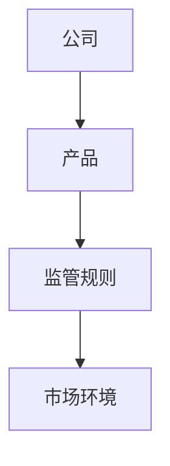

                 


# 构建基于知识图谱的金融监管沙盒测试结果预测平台

> 关键词：知识图谱，金融监管，沙盒测试，结果预测，人工智能，系统架构

> 摘要：本文将探讨如何利用知识图谱构建一个金融监管沙盒测试结果预测平台。通过分析知识图谱的核心概念、算法原理和系统架构，本文将详细阐述该平台的构建过程，并通过实际案例分析展示其应用价值。最终，本文将为读者提供一套完整的解决方案，助力金融监管领域的智能化发展。

---

# 第一部分: 背景介绍

## 第1章: 知识图谱与金融监管沙盒概述

### 1.1 知识图谱的背景与重要性

知识图谱是一种将实体及其关系以图结构表示的技术，广泛应用于搜索引擎、自然语言处理和金融分析等领域。其核心在于通过结构化的数据表示，实现对复杂知识的高效管理和推理。在金融领域，知识图谱能够帮助我们更好地理解市场参与者、产品和监管规则之间的关系。

#### 1.1.1 知识图谱的定义与特点

知识图谱通过实体（节点）和关系（边）构建图结构，具有语义丰富、可扩展性强和易于推理的特点。例如，实体可以是公司、产品或监管规则，关系可以是“属于”、“影响”或“涉及”。

#### 1.1.2 知识图谱在金融领域的应用

在金融领域，知识图谱可以用于风险评估、欺诈检测和监管合规等场景。例如，通过分析公司之间的关联关系，可以帮助识别潜在的关联交易风险。

#### 1.1.3 知识图谱的核心要素与结构

知识图谱的核心要素包括实体、关系和属性。实体是现实世界中的具体事物，关系描述实体之间的关联，属性则用于进一步描述实体的特征。

### 1.2 金融监管沙盒的背景与意义

金融监管沙盒是一种创新监管工具，允许金融机构在受控环境中测试新产品和服务，同时确保消费者权益和市场稳定。通过知识图谱，可以更高效地管理和分析沙盒中的测试数据，预测测试结果。

#### 1.2.1 金融监管沙盒的定义与目标

金融监管沙盒是一个虚拟环境，允许金融机构在受控条件下测试创新产品。其目标是通过实时监控和分析，确保测试活动的安全性和合规性。

#### 1.2.2 金融监管沙盒与知识图谱的结合

通过知识图谱，可以将沙盒中的测试数据结构化，建立实体之间的关联关系。例如，可以分析测试产品与相关监管规则之间的关系，预测潜在的合规风险。

---

## 第2章: 问题背景与需求分析

### 2.1 金融监管中的痛点与挑战

传统金融监管方式依赖人工审核和静态规则，难以应对复杂多变的金融创新。知识图谱可以帮助我们更高效地理解和分析监管数据，解决以下痛点：

- 数据分散：金融机构的业务数据分布在不同系统中，难以统一管理。
- 关系复杂：金融产品与监管规则之间的关系复杂，难以快速分析。
- 预测能力不足：传统监管方式难以预测测试结果，导致风险控制能力有限。

#### 2.1.1 传统金融监管的局限性

传统监管方式依赖人工审核，效率低且容易出错。此外，监管规则的复杂性使得手动分析成本高昂。

#### 2.1.2 知识图谱在金融监管中的优势

知识图谱能够将分散的数据结构化，建立实体之间的关联关系，从而提高监管效率和准确性。

#### 2.1.3 金融监管沙盒测试的复杂性

沙盒测试涉及多种产品和服务，测试结果的预测需要综合分析多个因素，包括产品特性、监管规则和市场环境等。

### 2.2 平台建设的需求与目标

为了有效解决上述问题，我们需要构建一个基于知识图谱的金融监管沙盒测试结果预测平台。

#### 2.2.1 平台建设的核心目标

平台的核心目标是通过知识图谱技术，预测金融监管沙盒中的测试结果，提高监管效率和准确性。

#### 2.2.2 平台建设的关键需求

- 数据整合：整合金融机构的业务数据和监管规则。
- 实体识别：识别沙盒中的关键实体，例如公司、产品和监管规则。
- 关系抽取：建立实体之间的关联关系，例如“产品涉及的监管规则”。
- 预测模型：基于知识图谱构建预测模型，预测测试结果。

#### 2.2.3 平台建设的边界与范围

平台的边界包括数据整合、实体识别和关系抽取，不涉及具体的产品测试和市场操作。

---

# 第二部分: 核心概念与联系

## 第3章: 知识图谱的核心概念与原理

### 3.1 知识图谱的构建原理

知识图谱的构建包括数据收集、实体识别、关系抽取和图谱存储四个步骤。

#### 3.1.1 实体识别与抽取

实体识别是通过自然语言处理技术，从文本中提取关键实体。例如，从公司公告中提取公司名称和高管信息。

#### 3.1.2 关系抽取与建模

关系抽取是通过模式匹配或机器学习方法，识别实体之间的关系。例如，识别“公司A的产品涉及监管规则X”。

#### 3.1.3 知识图谱的存储与管理

知识图谱通常存储在图数据库中，例如Neo4j。存储结构包括节点（实体）和边（关系）。

### 3.2 知识图谱的属性特征对比

以下是知识图谱中实体和关系的属性特征对比表：

| 属性 | 实体 | 关系 |
|------|------|------|
| 类型 | 公司、产品、监管规则 | 涉及、属于、影响 |
| 示例 | 公司A、产品B | 产品B涉及监管规则X |
| 示例描述 | 公司A的产品B涉及监管规则X |

### 3.3 ER实体关系图架构

以下是知识图谱的ER实体关系图：



---

## 第4章: 金融监管沙盒的系统架构与核心功能

### 4.1 金融监管沙盒的系统架构

以下是金融监管沙盒的系统架构图：


### 4.2 系统功能设计

系统功能设计包括数据整合、实体识别、关系抽取和结果预测。

#### 4.2.1 数据整合

数据整合模块负责将金融机构的业务数据和监管规则整合到知识图谱中。

#### 4.2.2 实体识别

实体识别模块通过自然语言处理技术，从文本中提取关键实体。

#### 4.2.3 关系抽取

关系抽取模块通过模式匹配或机器学习方法，识别实体之间的关系。

#### 4.2.4 结果预测

结果预测模块基于知识图谱构建预测模型，预测测试结果。

### 4.3 系统架构设计

系统架构设计包括前端界面、业务逻辑层、知识图谱层和数据存储层。

#### 4.3.1 前端界面

前端界面负责接收用户的输入和展示结果。

#### 4.3.2 业务逻辑层

业务逻辑层负责处理用户的请求，调用知识图谱层的服务。

#### 4.3.3 知识图谱层

知识图谱层负责存储和管理知识图谱，提供查询和推理服务。

#### 4.3.4 数据存储层

数据存储层负责存储知识图谱和测试数据。

### 4.4 系统接口设计

系统接口设计包括API接口和数据库接口。

#### 4.4.1 API接口

API接口用于前端界面和业务逻辑层之间的通信。

#### 4.4.2 数据库接口

数据库接口用于知识图谱层和数据存储层之间的通信。

### 4.5 系统交互设计

系统交互设计包括用户登录、数据上传、测试运行和结果展示。

#### 4.5.1 用户登录

用户登录后进入系统。

#### 4.5.2 数据上传

用户上传金融机构的业务数据和监管规则。

#### 4.5.3 测试运行

系统根据知识图谱构建预测模型，运行测试并预测结果。

#### 4.5.4 结果展示

系统将测试结果展示给用户。

---

## 第5章: 项目实战

### 5.1 环境安装

需要安装的知识图谱相关工具包括Neo4j和Python库（如networkx和py2neo）。

### 5.2 核心代码实现

以下是知识图谱构建的核心代码：

```python
import neo4j
from py2neo import Graph, Node, Relationship

# 连接到Neo4j数据库
graph = Graph("http://localhost:7474", auth=("username", "password"))

# 创建实体节点
company = Node("Company", name="公司A")
product = Node("Product", name="产品B")
regulation = Node("Regulation", name="监管规则X")

# 创建关系
relation = Relationship(company, "HAS", product)
relation2 = Relationship(product, "INVOLVES", regulation)

# 将节点和关系添加到图数据库
graph.create(relation)
graph.create(relation2)
```

### 5.3 代码解读与分析

上述代码通过Py2Neo库连接到Neo4j数据库，创建公司、产品和监管规则的实体节点，并建立它们之间的关系。

### 5.4 案例分析与详细讲解

以下是一个实际案例：

假设我们有一个金融机构，其产品涉及多个监管规则。通过知识图谱，我们可以分析产品与监管规则之间的关系，预测潜在的合规风险。

### 5.5 项目小结

通过上述步骤，我们可以构建一个基于知识图谱的金融监管沙盒测试结果预测平台，实现数据整合、实体识别、关系抽取和结果预测功能。

---

## 第6章: 最佳实践

### 6.1 小结

通过知识图谱技术，我们可以更高效地构建金融监管沙盒测试结果预测平台，提高监管效率和准确性。

### 6.2 注意事项

在实际应用中，需要注意数据隐私和安全问题，确保平台的安全性和合规性。

### 6.3 未来展望

未来，随着人工智能和大数据技术的发展，知识图谱在金融监管领域的应用将更加广泛和深入。

### 6.4 拓展阅读

推荐阅读以下书籍和资源：
- 《知识图谱：概念、方法与应用》
- 《图数据挖掘：方法与应用》
-Neo4j官方文档

---

# 结语

通过本文的详细讲解，我们了解了如何利用知识图谱构建金融监管沙盒测试结果预测平台。从核心概念到系统架构，再到实际案例分析，我们为读者提供了一套完整的解决方案。希望本文能为金融监管领域的智能化发展提供有益的参考。

作者：AI天才研究院/AI Genius Institute & 禅与计算机程序设计艺术 /Zen And The Art of Computer Programming

