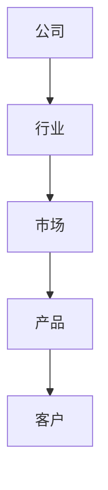
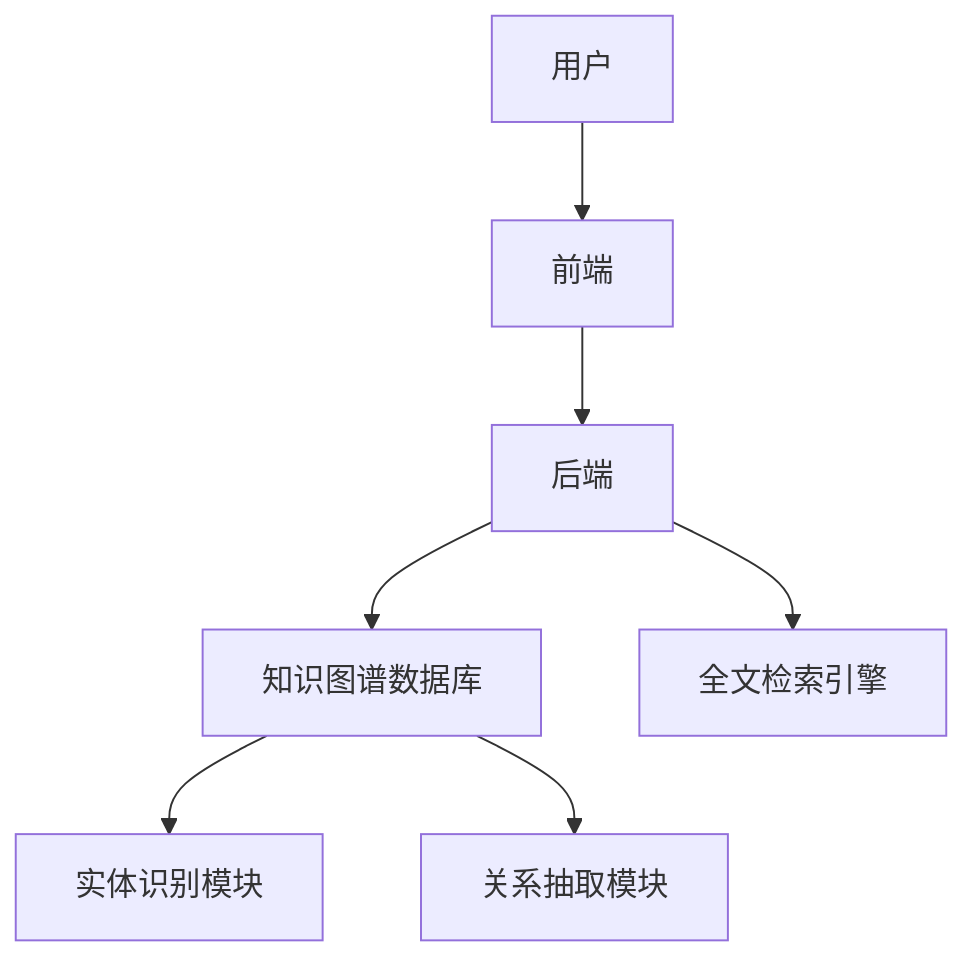

                 


```markdown
# 构建基于知识图谱的金融研报智能检索系统

> 关键词：知识图谱、金融研报、智能检索、自然语言处理、系统架构设计

> 摘要：本文详细介绍了构建基于知识图谱的金融研报智能检索系统的全过程，从知识图谱的基本概念到系统的实际实现，涵盖了数据预处理、知识抽取、知识表示、系统架构设计、系统实现与优化等关键环节。通过本文的学习，读者可以掌握如何利用知识图谱技术提升金融研报的智能检索效率和准确性。

---

# 第一部分: 知识图谱与金融研报智能检索系统概述

## 第1章: 知识图谱的基本概念与应用

### 1.1 知识图谱的定义与特点
#### 1.1.1 知识图谱的定义
知识图谱是一种用于描述实体及其关系的图结构数据，由节点（实体）和边（关系）组成。节点代表具体的概念或对象，边表示节点之间的关系。

#### 1.1.2 知识图谱的核心特点
- **结构化**：知识图谱将实体和关系以结构化的形式表示，便于计算机理解和推理。
- **语义丰富**：通过实体和关系的组合，知识图谱能够表达复杂的语义信息。
- **可扩展性**：知识图谱可以通过不断添加新的实体和关系进行扩展。

#### 1.1.3 知识图谱与传统数据库的区别
传统数据库主要存储结构化或半结构化的数据，而知识图谱通过图结构将数据的关系化表达能力提升到一个新的高度，能够更好地支持语义检索和关联分析。

### 1.2 金融研报的特点与需求
#### 1.2.1 金融研报的定义与类型
金融研报是金融机构或分析师对金融市场的分析报告，通常包括行业分析、公司分析、市场趋势等内容。

#### 1.2.2 金融研报检索的痛点与挑战
- 数据量大：金融研报数量庞大，检索效率低下。
- 语义复杂：金融研报内容涉及复杂的金融术语和行业知识，检索需要考虑语义。
- 实时性要求高：金融市场变化快，检索系统需要实时更新。

#### 1.2.3 知识图谱在金融研报检索中的优势
- 语义理解：通过知识图谱可以更好地理解金融研报的内容和语义。
- 关联分析：知识图谱能够支持跨文档的关联分析，提高检索的准确性。

### 1.3 知识图谱在金融领域的应用前景
#### 1.3.1 知识图谱在金融分析中的应用
通过知识图谱可以分析公司之间的关联、行业趋势等，为投资决策提供支持。

#### 1.3.2 知识图谱在金融风险控制中的应用
通过分析企业之间的关系，识别潜在的金融风险，如供应链风险。

#### 1.3.3 知识图谱在金融信息检索中的应用
通过知识图谱可以实现语义检索，提高检索的准确性和效率。

## 第2章: 知识图谱构建的核心概念与联系

### 2.1 知识图谱的核心概念原理
#### 2.1.1 实体与关系的定义
- 实体：知识图谱中的基本单元，代表具体的概念或对象。
- 关系：实体之间的联系，表示实体之间的关联方式。

#### 2.1.2 知识图谱的属性特征
- 实体属性：描述实体的特征，如公司名称、成立时间等。
- 关系属性：描述关系的特征，如收购、投资等。

#### 2.1.3 知识图谱的构建流程
1. 数据采集：从各种数据源获取数据。
2. 数据预处理：清洗数据，提取有用的信息。
3. 实体识别：从文本中识别出实体。
4. 关系抽取：从文本中识别出实体之间的关系。
5. 知识图谱存储：将提取的实体和关系存储到知识图谱中。

### 2.2 知识图谱的ER实体关系图


### 2.3 知识图谱的构建方法
#### 2.3.1 数据采集与预处理
- 数据源：可以从金融数据库、新闻网站、公司年报等获取数据。
- 数据清洗：去除重复数据、噪声数据，提取有用的信息。

#### 2.3.2 实体识别与关系抽取
- 实体识别：使用自然语言处理技术从文本中识别出实体。
- 关系抽取：通过模式匹配或深度学习模型识别实体之间的关系。

#### 2.3.3 知识图谱的存储与管理
- 数据存储：使用图数据库（如Neo4j）存储知识图谱。
- 数据管理：通过版本控制和更新机制，保持知识图谱的最新性。

## 第3章: 知识图谱构建的算法原理

### 3.1 实体识别算法
#### 3.1.1 基于规则的实体识别
- 使用正则表达式匹配特定模式的文本，识别出实体。
- 例如：识别公司名称时，可以匹配“公司”后的具体名称。

#### 3.1.2 基于统计的实体识别
- 使用统计模型，如马尔可夫链，根据上下文概率识别实体。
- 例如：在金融文本中，某些词语通常出现在特定的位置，可以利用这种模式识别实体。

#### 3.1.3 基于深度学习的实体识别
- 使用预训练的语言模型（如BERT）进行实体识别。
- 通过微调模型，使其适应金融领域的实体识别任务。

### 3.2 关系抽取算法
#### 3.2.1 基于模式匹配的关系抽取
- 使用预定义的模式匹配文本，识别实体之间的关系。
- 例如：在句子“公司A收购了公司B”中，可以匹配“收购”这个动词，识别出公司A和公司B之间的收购关系。

#### 3.2.2 基于语义角色标注的关系抽取
- 通过语义角色标注技术，识别句子中的谓词和角色。
- 例如：在句子“公司A收购了公司B”中，谓词是“收购”，主语是“公司A”，宾语是“公司B”。

#### 3.2.3 基于深度学习的关系抽取
- 使用深度学习模型（如LSTM、BERT）进行关系抽取。
- 通过训练模型，使其能够自动识别句子中实体之间的关系。

### 3.3 知识图谱的存储与查询
#### 3.3.1 图数据库的选择
- 常见的图数据库有Neo4j、RDF4J等。
- 选择图数据库时，需要考虑性能、扩展性和易用性。

#### 3.3.2 知识图谱的查询语言
- 使用SPARQL查询语言进行知识图谱的查询。
- SPARQL是一种基于HTTP的协议，用于查询和更新RDF数据。

#### 3.3.3 知识图谱的索引优化
- 通过建立索引，提高知识图谱的查询效率。
- 常见的索引技术包括倒排索引、哈希索引等。

---

# 第二部分: 金融研报智能检索系统的实现

## 第4章: 金融研报智能检索系统的需求分析

### 4.1 系统功能需求
- 文档管理：支持上传、存储和管理金融研报。
- 智能检索：支持基于关键词、实体和关系的检索。
- 语义分析：支持对检索结果的语义分析和关联分析。

### 4.2 系统性能需求
- 检索速度：确保快速响应用户查询。
- 查询效率：优化查询算法，提高检索效率。
- 扩展性：支持数据量的扩展和功能的扩展。

### 4.3 系统边界与接口
- 用户接口：提供用户友好的检索界面。
- 数据接口：与知识图谱数据库进行交互。
- 日志接口：记录系统运行日志和用户查询记录。

## 第5章: 金融研报智能检索系统的架构设计

### 5.1 系统架构设计


### 5.2 前端设计
- 用户界面：提供搜索框、结果展示、结果分析等功能。
- 响应式设计：适配不同终端设备。

### 5.3 后端设计
- 业务逻辑处理：接收用户查询，调用知识图谱数据库和全文检索引擎进行查询。
- 接口设计：提供RESTful API，供前端调用。

### 5.4 知识图谱数据库设计
- 数据存储：存储金融研报中的实体和关系。
- 索引优化：通过建立索引提高查询效率。

## 第6章: 金融研报智能检索系统的实现

### 6.1 环境搭建
- 安装图数据库：如Neo4j。
- 安装全文检索引擎：如Elasticsearch。
- 安装编程语言：如Python。

### 6.2 数据预处理
- 数据清洗：去除重复数据、噪声数据。
- 文本分词：将文本分割成词语或短语。

### 6.3 知识图谱构建
- 实体识别：使用NLP技术识别文本中的实体。
- 关系抽取：识别实体之间的关系。
- 知识图谱存储：将实体和关系存储到图数据库中。

### 6.4 系统实现
- 前端开发：使用React等框架开发用户界面。
- 后端开发：使用Python的Flask框架开发RESTful API。
- 数据查询：调用图数据库和全文检索引擎进行查询。

## 第7章: 系统优化与扩展

### 7.1 系统优化
- 查询优化：优化SPARQL查询语句，提高查询效率。
- 索引优化：在图数据库中建立索引，提高查询速度。

### 7.2 功能扩展
- 多语言支持：支持多种语言的金融研报检索。
- 情感分析：分析金融研报中的情感倾向。
- 时间维度检索：支持按时间范围检索金融研报。

## 第8章: 项目实战

### 8.1 项目概述
- 项目目标：构建一个基于知识图谱的金融研报智能检索系统。
- 项目团队：由数据工程师、软件开发人员、NLP工程师组成。

### 8.2 项目实施步骤
1. 数据采集：收集金融研报数据。
2. 数据预处理：清洗数据，提取实体和关系。
3. 知识图谱构建：使用NLP技术构建知识图谱。
4. 系统开发：开发前端和后端，集成知识图谱数据库和全文检索引擎。
5. 系统测试：测试系统功能，优化系统性能。

### 8.3 项目成果
- 成功构建一个基于知识图谱的金融研报智能检索系统。
- 提高了金融研报检索的效率和准确性。

## 第9章: 总结与展望

### 9.1 总结
本文详细介绍了构建基于知识图谱的金融研报智能检索系统的全过程，从知识图谱的基本概念到系统的实际实现，涵盖了数据预处理、知识抽取、知识表示、系统架构设计、系统实现与优化等关键环节。

### 9.2 展望
未来，随着人工智能技术的不断发展，知识图谱在金融领域的应用将更加广泛。可以进一步研究如何结合深度学习模型，提高知识图谱的构建和检索效率，同时探索知识图谱在金融风险控制、投资决策等领域的更多应用。

---

# 作者：AI天才研究院/AI Genius Institute & 禅与计算机程序设计艺术 /Zen And The Art of Computer Programming
```

