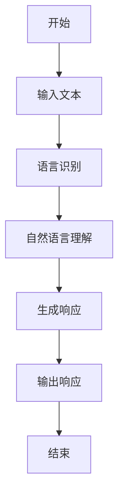
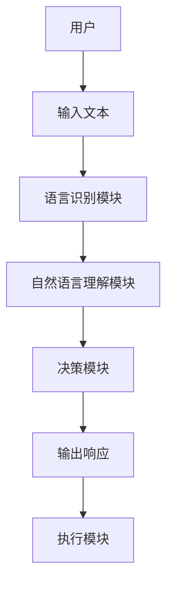
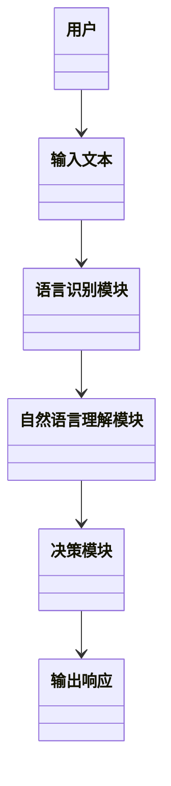

                 


# 构建多语言支持的AI Agent

> 关键词：AI Agent，多语言支持，自然语言处理，机器学习，跨语言通信

> 摘要：本文详细探讨了如何构建一个多语言支持的AI Agent。通过分析多语言支持的重要性，介绍AI Agent的核心概念与原理，讲解相关算法与数学模型，并通过系统设计与项目实战，提供一个完整的解决方案。最后，总结了最佳实践和注意事项，帮助读者高效地构建多语言AI Agent。

---

## 第1章 多语言支持的AI Agent背景与概念

### 1.1 多语言支持的AI Agent背景介绍

#### 1.1.1 问题背景与问题描述
随着全球化的推进，跨语言交流变得越来越频繁。传统的AI Agent往往只能支持单一语言，无法满足全球用户的需求。例如，一个在线客服系统需要能够同时处理英语、中文、西班牙语等多种语言的用户请求。因此，构建一个多语言支持的AI Agent显得尤为重要。

#### 1.1.2 多语言支持的必要性
- **用户需求多样性**：不同地区的用户可能使用不同的语言进行交流。
- **跨语言服务**：企业或开发者希望提供全球化服务，覆盖更多用户群体。
- **提高用户体验**：支持多语言可以让用户在母语环境中更自然地与AI交互。

#### 1.1.3 AI Agent的核心目标与应用场景
AI Agent的核心目标是通过多语言支持，实现跨语言的自然语言处理与交互。应用场景包括：
- **在线客服**：支持多种语言的用户咨询。
- **智能助手**：如Siri、Google Assistant等，支持多语言指令。
- **跨语言翻译与对话**：支持用户在不同语言间进行实时对话。

### 1.2 多语言支持的AI Agent核心概念

#### 1.2.1 多语言支持的定义与实现方式
多语言支持是指AI Agent能够理解、生成并处理多种语言的文本或语音输入。实现方式包括：
- **多语言模型**：训练一个多语言模型，使其能够同时处理多种语言。
- **语言切换机制**：根据输入语言自动切换处理语言。

#### 1.2.2 AI Agent的基本原理与功能模块
AI Agent的基本原理是通过感知环境、理解用户输入、生成响应并执行操作。核心功能模块包括：
- **感知模块**：接收用户输入，进行语言识别。
- **理解模块**：解析用户意图，进行自然语言理解。
- **决策模块**：基于理解生成响应。
- **执行模块**：执行相应操作，如调用API或生成文本。

#### 1.2.3 多语言支持与AI Agent的结合
多语言支持通过在感知和理解模块中引入跨语言处理能力，使AI Agent能够支持多种语言的交互。例如：
- 使用多语言词嵌入模型（如mBert）进行跨语言表示。
- 结合语言识别模型（如语言检测API）自动切换语言。

### 1.3 多语言支持的AI Agent边界与外延

#### 1.3.1 多语言支持的范围与限制
- **范围**：支持的语言种类、处理能力（如翻译、问答）。
- **限制**：某些语言的数据量不足，可能影响模型性能。

#### 1.3.2 AI Agent的功能边界与应用场景
- **功能边界**：专注于多语言支持的核心功能，如语言识别和翻译。
- **应用场景**：包括客服、助手、教育等领域。

#### 1.3.3 多语言支持与AI Agent的结合方式
通过模块化设计，将多语言支持功能集成到AI Agent的各个模块中，确保各模块协同工作。

### 1.4 多语言支持的AI Agent概念结构与核心要素

#### 1.4.1 多语言支持的核心要素
- **语言识别**：识别输入语言。
- **跨语言处理**：支持多种语言的自然语言处理。

#### 1.4.2 AI Agent的功能模块与交互流程
- **感知模块**：接收输入，识别语言。
- **理解模块**：解析意图。
- **决策模块**：生成多语言响应。
- **执行模块**：执行操作。

#### 1.4.3 多语言支持与AI Agent的结合模型
- **模型共享**：多语言模型共享底层表示。
- **模块集成**：将多语言支持模块嵌入AI Agent各功能模块。

### 1.5 本章小结
本章介绍了多语言支持的AI Agent的背景、核心概念与实现方式，明确了其在不同场景中的应用价值。

---

## 第2章 多语言支持的AI Agent核心原理

### 2.1 多语言支持的核心原理

#### 2.1.1 多语言模型的原理
- **多语言词嵌入模型**：如mBert，能够在多语言之间共享嵌入表示。
- **跨语言迁移学习**：利用一种语言的数据来提升其他语言的性能。

#### 2.1.2 AI Agent的自然语言理解与生成
- **自然语言理解**：通过NLP技术理解用户意图。
- **自然语言生成**：生成符合用户需求的多语言响应。

#### 2.1.3 多语言支持的实现机制
- **语言检测**：识别输入语言。
- **翻译与转换**：将一种语言转换为另一种语言。
- **多语言推理**：在多种语言中进行推理和决策。

### 2.2 多语言支持的AI Agent核心算法与数学模型

#### 2.2.1 多语言模型的训练方法
- **多任务学习**：在多个语言任务上同时训练模型。
- **预训练与微调**：利用大规模多语言数据进行预训练，再在特定任务上微调。

#### 2.2.2 AI Agent的决策机制
- **基于规则的决策**：根据预定义规则生成响应。
- **基于模型的决策**：利用机器学习模型生成最优响应。

#### 2.2.3 数学模型与公式
- **语言模型的概率分布**：
  $$ P(word|language) $$
- **损失函数**：
  $$ L = -\sum_{i=1}^{n} \log P(y_i|x_i) $$

#### 2.2.4 算法实现的流程图
使用mermaid绘制算法流程图：



### 2.3 多语言支持的AI Agent系统架构

#### 2.3.1 系统功能模块
- **语言识别模块**：识别输入语言。
- **自然语言理解模块**：理解用户意图。
- **决策模块**：生成多语言响应。
- **执行模块**：执行操作。

#### 2.3.2 系统架构设计
使用mermaid绘制系统架构图：



### 2.4 本章小结
本章详细讲解了多语言支持的AI Agent的核心原理，包括多语言模型的训练方法、自然语言理解与生成的实现机制，以及系统架构设计。

---

## 第3章 多语言支持的AI Agent系统分析与架构设计

### 3.1 项目背景介绍
本项目旨在构建一个多语言支持的AI Agent，能够处理多种语言的用户请求，提升用户体验。

### 3.2 系统功能设计

#### 3.2.1 领域模型类图
使用mermaid绘制领域模型类图：



#### 3.2.2 系统架构设计
使用mermaid绘制系统架构图：


#### 3.2.3 接口与交互设计
- **输入接口**：接收多语言文本输入。
- **输出接口**：生成多语言文本输出。
- **交互流程**：用户输入 -> 语言识别 -> 自然语言理解 -> 生成响应 -> 输出。

### 3.3 本章小结
本章通过系统分析与架构设计，明确了AI Agent的系统组成与功能模块。

---

## 第4章 多语言支持的AI Agent项目实战

### 4.1 环境安装与配置

#### 4.1.1 安装Python
```bash
# 安装Python 3.8及以上版本
# 在Linux/MacOS：
sudo apt-get install python3.8
# 在Windows：
# 下载并安装Python 3.8
```

#### 4.1.2 安装依赖库
```bash
pip install -r requirements.txt
```
requirements.txt内容：
```
python>=3.8
tensorflow>=2.0
transformers>=4.0
```

### 4.2 核心代码实现

#### 4.2.1 语言识别模块
```python
from langdetect import detect

def detect_language(text):
    return detect(text)
```

#### 4.2.2 自然语言理解模块
```python
from transformers import BertTokenizer, BertModel

tokenizer = BertTokenizer.from_pretrained('bert-base-multilingual-cased')
model = BertModel.from_pretrained('bert-base-multilingual-cased')
```

#### 4.2.3 决策模块
```python
def generate_response(text, language):
    inputs = tokenizer(text, language=language, return_tensors='np')
    outputs = model(**inputs)
    # 处理输出以生成响应
    return response
```

### 4.3 代码解读与分析
- **语言识别模块**：使用langdetect库检测输入文本的语言。
- **自然语言理解模块**：使用多语言BERT模型进行文本表示。
- **决策模块**：基于模型输出生成多语言响应。

### 4.4 实际案例分析
```python
text = "What is your name?"
language = detect_language(text)
response = generate_response(text, language)
print(response)
```

### 4.5 项目小结
本章通过实际案例展示了如何构建一个多语言支持的AI Agent，涵盖了环境配置、代码实现与案例分析。

---

## 第5章 多语言支持的AI Agent最佳实践

### 5.1 核心经验总结
- **选择合适的多语言模型**：如mBert、XLM。
- **处理语言切换**：确保模块之间无缝切换。

### 5.2 注意事项
- **数据多样性**：确保训练数据包含多种语言。
- **模型调优**：针对不同语言进行微调以提升性能。

### 5.3 拓展阅读
- [多语言NLP综述](https://arxiv.org/abs/2005.00723)
- [Transformers模型](https://huggingface.co/transformers)

### 5.4 本章小结
本章总结了构建多语言支持AI Agent的经验与注意事项，为读者提供了宝贵的参考。

---

## 附录

### 附录A 术语表
- **AI Agent**：人工智能代理。
- **多语言支持**：支持多种语言的处理能力。

### 附录B 工具安装指南
- [langdetect](https://pypi.org/project/langdetect/)
- [Transformers库](https://huggingface.co/transformers)

### 附录C API文档
- [语言检测API](https://pypi.org/project/langdetect/)
- [多语言NLP模型](https://huggingface.co/transformers)

---

## 作者信息

作者：AI天才研究院/AI Genius Institute & 禅与计算机程序设计艺术/Zen And The Art of Computer Programming

---

通过以上目录和内容，文章系统地介绍了构建多语言支持的AI Agent的各个方面，从背景到实现，从理论到实践，为读者提供了一个全面的指导。

