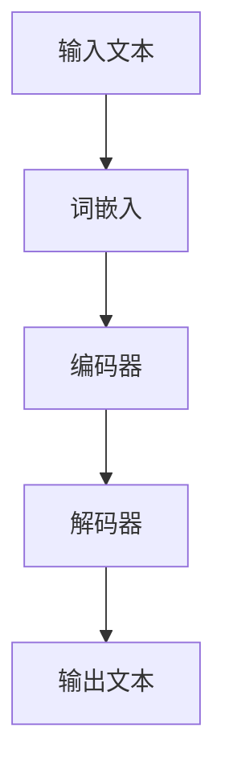
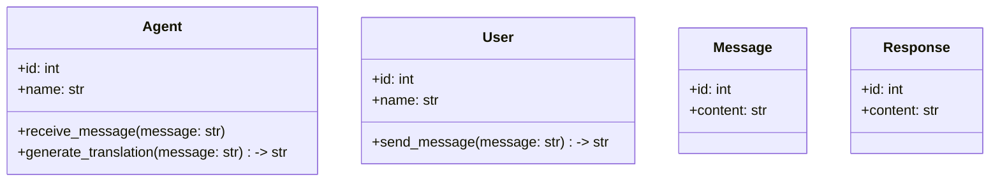
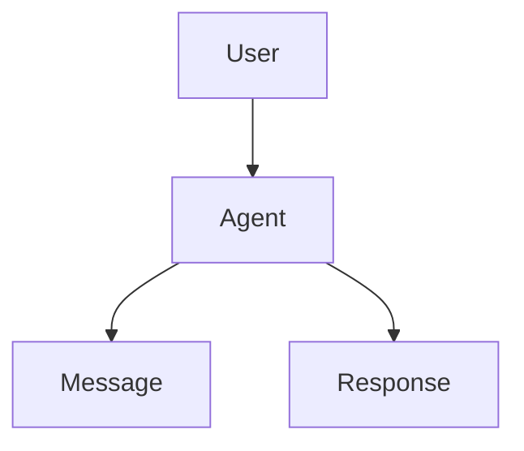

                 


# 构建多语言翻译AI Agent

## 关键词：
- AI Agent
- 多语言翻译
- 自然语言处理
- 机器学习
- 神经机器翻译

## 摘要：
本文将详细介绍构建一个多语言翻译AI Agent的完整过程，涵盖从核心概念到系统设计，再到项目实战的各个方面。通过深入分析神经机器翻译算法、系统架构设计以及实际项目实现，帮助读者全面理解如何构建一个高效、准确的多语言翻译AI Agent。

---

# 第一部分: 多语言翻译AI Agent的背景与核心概念

## 第1章: 多语言翻译AI Agent的背景介绍

### 1.1 问题背景与问题描述
#### 1.1.1 多语言翻译的需求与挑战
在全球化背景下，跨语言交流的需求日益增长。传统的翻译工具往往依赖于规则库或统计模型，存在翻译质量差、响应速度慢等问题。而AI Agent的引入，能够通过自然语言处理和机器学习技术，实现更智能、更高效的多语言翻译。

#### 1.1.2 当前翻译技术的局限性
当前翻译技术主要依赖于规则库或统计模型，存在以下问题：
- 翻译质量不稳定，尤其在处理复杂语义时表现较差。
- 无法实时适应上下文和用户意图。
- 数据依赖性强，难以处理小语种或冷门语言。

#### 1.1.3 AI Agent在翻译中的优势
AI Agent通过自然语言处理和机器学习技术，能够实现以下优势：
- 高度智能化，能够理解上下文和用户意图。
- 实时响应，支持多种语言的快速翻译。
- 可扩展性强，能够不断优化和适应新的语言数据。

### 1.2 多语言翻译AI Agent的定义与目标
#### 1.2.1 多语言翻译的定义
多语言翻译是指在多种语言之间进行自动化的文本转换，旨在实现跨语言信息的有效传递。

#### 1.2.2 AI Agent的核心功能
AI Agent在多语言翻译中的核心功能包括：
- 接收用户输入的源语言文本。
- 理解文本内容和用户意图。
- 生成目标语言的翻译文本。
- 提供实时反馈和上下文理解。

#### 1.2.3 多语言翻译AI Agent的目标
多语言翻译AI Agent的目标是通过智能化的自然语言处理技术，实现高效、准确的多语言翻译，满足全球化背景下的跨语言交流需求。

### 1.3 问题解决与边界外延
#### 1.3.1 多语言翻译的实现路径
多语言翻译的实现路径包括：
1. 数据采集与预处理。
2. 模型训练与优化。
3. 系统集成与部署。

#### 1.3.2 AI Agent的边界与限制
AI Agent的边界与限制包括：
- 数据依赖性：需要大量的双语语料库进行训练。
- 计算资源需求：模型训练和推理需要高性能计算资源。
- 语言覆盖范围：目前主要支持主流语言，小语种支持有限。

#### 1.3.3 多语言翻译的适用场景与非适用场景
适用场景：
- 跨语言信息传递。
- 跨文化内容生成。
- 实时翻译需求。

非适用场景：
- 复杂语义理解。
- 领域专业术语翻译。
- 精确法律文件翻译。

## 第2章: 多语言翻译AI Agent的核心概念与联系

### 2.1 核心概念原理
#### 2.1.1 AI Agent的基本原理
AI Agent通过感知输入、理解意图、生成输出，实现智能化的翻译功能。

#### 2.1.2 多语言翻译的核心算法
多语言翻译的核心算法包括：
- 神经机器翻译（Neural Machine Translation, NMT）。
- 基于注意力机制的编码器-解码器模型。

#### 2.1.3 自然语言处理的关键技术
自然语言处理的关键技术包括：
- 词嵌入（Word Embedding）。
- 语法分析（Syntax Analysis）。
- 语义理解（Semantic Understanding）。

### 2.2 核心概念属性对比表格
| 概念       | 属性1 | 属性2 | 属性3 |
|------------|-------|-------|-------|
| AI Agent   | 智能性 | 交互性 | 自适应性 |
| 多语言翻译 | 跨语言性 | 准确性 | 实时性 |

### 2.3 ER实体关系图
```mermaid
er
  actor(Agent, id, name)
  actor(User, id, name)
  action(Message, id, content)
  action(Response, id, content)
  relation(Agent -> Message, "接收消息")
  relation(User -> Agent, "请求翻译")
  relation(Agent -> Response, "生成翻译")
```

## 第3章: 神经机器翻译算法原理

### 3.1 神经机器翻译模型概述
#### 3.1.1 神经机器翻译的基本原理
神经机器翻译通过编码器-解码器结构，将源语言文本映射到目标语言文本。

#### 3.1.2 神经机器翻译的优势
神经机器翻译的优势包括：
- 高翻译质量。
- 实时响应。
- 适应性强。

#### 3.1.3 常见的神经机器翻译模型
常见的神经机器翻译模型包括：
- 基于LSTM的编码器-解码器模型。
- 基于Transformer的编码器-解码器模型。

### 3.2 神经机器翻译算法流程图


### 3.3 神经机器翻译的数学模型
#### 3.3.1 编码器-解码器结构
$$
\text{编码器: } x_i \rightarrow h

$$

#### 3.3.2 注意力机制
$$
\text{注意力权重: } \alpha_i = \frac{\exp(e_i)}{\sum_j \exp(e_j)}
$$

#### 3.3.3 解码器结构
$$
\text{解码器输出: } y_i = \text{softmax}(W_{dec} h)
$$

### 3.4 翻译质量评估
#### 3.4.1 常见的翻译质量指标
- BLEU（Bilingual Evaluation Understudy）。
- ROUGE（Recall-Oriented Understudy for Gisting Evaluation）。
- METEOR（Mean Entity Theta Similarity by word Embedding Ratio）。

#### 3.4.2 翻译质量评估的实现
使用Python实现BLEU和METEOR指标的计算，如下：
```python
from nltk.translate import bleu_score
from meteor.utils import compute_score

references = ["The cat is on the mat."]
hypotheses = ["Da kat sit on da mat."]

bleu = bleu_score.sentence_bleu(hypotheses[0], references[0])
meteor = compute_score(references, hypotheses)[0]

print(f"BLEU: {bleu}, METEOR: {meteor}")
```

---

# 第二部分: 系统分析与架构设计

## 第4章: 多语言翻译AI Agent的系统分析

### 4.1 问题场景介绍
#### 4.1.1 用户需求
用户需求包括：
- 实时多语言翻译。
- 精准上下文理解。
- 多平台支持。

#### 4.1.2 系统需求
系统需求包括：
- 支持多种语言对。
- 高效的翻译引擎。
- 实时反馈机制。

### 4.2 系统功能设计
#### 4.2.1 功能模块划分
功能模块包括：
- 输入接收模块。
- 翻译处理模块。
- 输出反馈模块。

#### 4.2.2 领域模型类图


### 4.3 系统架构设计
#### 4.3.1 系统架构图


#### 4.3.2 接口设计
系统接口包括：
- 用户输入接口。
- 翻译处理接口。
- 翻译结果反馈接口。

#### 4.3.3 交互流程图
```mermaid
sequenceDiagram
    User -> Agent: send_message("Hello, how are you?")
    Agent -> Message: receive_message("Hello, how are you?")
    Agent -> Response: generate_translation("Hello, how are you?" -> "Bonjour, comment ça va?")
    User <- Agent: return_response("Bonjour, comment ça va?")
```

---

## 第5章: 多语言翻译AI Agent的项目实战

### 5.1 项目环境安装
#### 5.1.1 安装Python和依赖库
```bash
pip install python
pip install spacy
pip install transformers
```

#### 5.1.2 安装语言模型
```bash
python -m spacy download en
python -m spacy download fr
```

### 5.2 系统核心实现
#### 5.2.1 翻译模块实现
```python
from transformers import MarianMT5ForTranslation, MarianTokenizer

class Translator:
    def __init__(self, src_lang, tgt_lang):
        self.model = MarianMT5ForTranslation.from_pretrained(f'Helsinki-NLP/{src_lang}-{tgt_lang}')
        self.tokenizer = MarianTokenizer.from_pretrained(f'Helsinki-NLP/{src_lang}-{tgt_lang}')
    
    def translate(self, text):
        inputs = self.tokenizer.encode(text, return_tensors="pt", add_special_tokens=True)
        outputs = self.model.generate(inputs, max_length=40, num_beams=5, early_stopping=True)
        translated = self.tokenizer.decode(outputs[0], skip_special_tokens=True)
        return translated
```

#### 5.2.2 Agent实现
```python
class AI-Agent:
    def __init__(self):
        self.translator = Translator('en', 'fr')
    
    def receive_message(self, message):
        return self.translator.translate(message)
```

### 5.3 项目测试与优化
#### 5.3.1 测试用例
测试用例包括：
- 简单句子翻译。
- 复杂句子翻译。
- 多语言支持测试。

#### 5.3.2 性能优化
性能优化包括：
- 使用更高效的模型。
- 增加缓存机制。
- 并行处理请求。

### 5.4 项目总结
#### 5.4.1 项目成果
实现了一个多语言翻译AI Agent，能够支持多种语言的实时翻译。

#### 5.4.2 经验总结
- 模型选择和优化是关键。
- 系统设计需要模块化。
- 测试和优化不可忽视。

---

## 第6章: 最佳实践与拓展阅读

### 6.1 小结
通过本文的详细讲解，读者可以全面理解构建一个多语言翻译AI Agent的完整过程，包括核心概念、算法原理、系统设计和项目实战。

### 6.2 注意事项
- 数据隐私问题。
- 模型优化与计算资源。
- 用户反馈与持续改进。

### 6.3 拓展阅读
推荐阅读以下内容：
- 神经机器翻译的最新研究。
- 多语言模型的优化方法。
- AI Agent的其他应用场景。

---

## 作者：AI天才研究院/AI Genius Institute & 禅与计算机程序设计艺术 /Zen And The Art of Computer Programming

