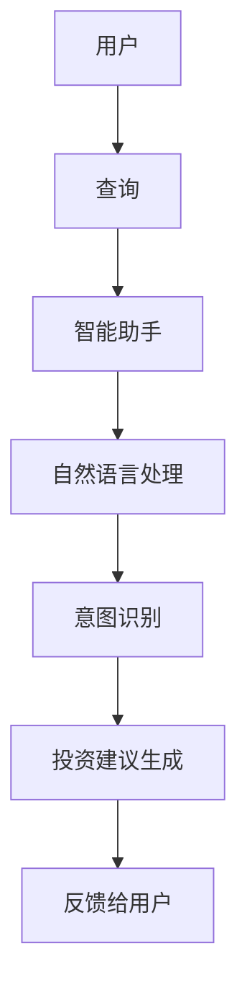
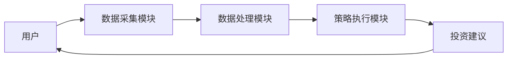

                 


# 构建投资理财智能助手的核心技术解析

> 关键词：投资理财、智能助手、自然语言处理、机器学习、知识图谱、系统架构、项目实战

> 摘要：本文详细解析构建投资理财智能助手的核心技术，涵盖背景介绍、核心概念、算法原理、系统架构设计、项目实战等内容，通过实例分析和代码实现，帮助读者掌握智能助手的构建方法。

---

## 第1章: 投资理财智能助手的背景与问题背景

### 1.1 问题背景

#### 1.1.1 传统投资理财工具的局限性
传统投资理财工具依赖人工操作，效率低且成本高。用户需手动筛选信息，耗时且易出错。市场波动快，用户难以及时调整策略。

#### 1.1.2 当前市场对智能投资理财助手的需求
随着AI和大数据技术的进步，用户期望智能工具能自动分析数据、优化投资组合并提供实时建议。

#### 1.1.3 智能助手在投资理财中的优势
智能助手能快速处理大量数据，提供精准建议，降低投资风险，提升效率和体验。

### 1.2 投资理财智能助手的定义与特点

#### 1.2.1 智能助手的定义
利用AI技术，通过自然语言处理与机器学习，为用户提供投资理财建议的工具。

#### 1.2.2 智能助手的核心特点
- **自动化**：自动分析数据和生成建议。
- **智能化**：使用AI进行预测和优化。
- **实时性**：提供实时市场动态和反馈。

### 1.3 当前市场现状与技术趋势

#### 1.3.1 现有投资理财工具的分析
现有工具功能单一，难以满足用户多样化需求，且缺乏实时性和个性化。

#### 1.3.2 AI技术在投资理财中的应用现状
AI技术广泛应用于数据分析、风险评估和投资策略生成，但存在数据质量和模型精度问题。

#### 1.3.3 未来发展趋势与技术挑战
未来，智能助手将更加智能化和个性化，需解决数据隐私和模型可解释性问题。

### 1.4 本章小结
本章介绍了投资理财智能助手的背景、定义、特点及现状，为后续技术分析奠定基础。

---

## 第2章: 投资理财智能助手的核心概念与联系

### 2.1 核心概念与原理

#### 2.1.1 自然语言处理（NLP）在智能助手中的应用
NLP用于解析用户意图，分析金融新闻，生成投资建议。

#### 2.1.2 机器学习在投资预测中的作用
机器学习预测市场趋势，优化投资组合，降低风险。

#### 2.1.3 知识图谱在金融信息处理中的应用
知识图谱构建金融实体关联，辅助决策。

### 2.2 核心概念的对比分析

#### 2.2.1 智能助手与传统金融工具的对比表格

| 特性                | 智能助手             | 传统金融工具         |
|---------------------|--------------------|----------------------|
| 功能                | 自动化、智能化       | 手动、单一化         |
| 数据处理能力        | 强大                | 有限                |
| 用户体验            | 个性化、实时反馈    | 非实时、单一反馈    |

#### 2.2.2 ER实体关系图架构的Mermaid流程图



### 2.3 系统架构与核心模块

#### 2.3.1 系统架构的Mermaid图


#### 2.3.2 核心模块的功能描述
- **用户交互模块**：接收用户输入，解析需求。
- **数据处理模块**：分析数据，生成策略。
- **策略执行模块**：优化组合，实施策略。
- **结果反馈模块**：提供反馈，调整策略。

### 2.4 本章小结
本章分析了智能助手的核心概念及其在投资理财中的应用，通过对比和架构图展示了系统的整体结构。

---

## 第3章: 自然语言处理在投资理财中的应用

### 3.1 自然语言处理的原理与技术

#### 3.1.1 分词与实体识别
- **分词**：将文本分解为词语，便于后续处理。
- **实体识别**：识别文本中的名称实体，如公司名、日期。

#### 3.1.2 情感分析与意图理解
- **情感分析**：判断文本情感倾向，用于市场情绪分析。
- **意图理解**：识别用户需求，如查询、建议。

#### 3.1.3 语义解析与对话生成
- **语义解析**：理解用户深层需求。
- **对话生成**：生成自然语言回复，指导投资。

### 3.2 投资理财中的NLP应用案例

#### 3.2.1 金融新闻的情感分析

```python
from textblob import TextBlob

text = "Recent earnings report shows strong growth."
blob = TextBlob(text)
print(blob.sentiment.polarity)  # 输出：0.38 (正面)
```

#### 3.2.2 用户意图识别与需求匹配

```python
import spacy

nlp = spacy.load("en_core_web_sm")
text = "What's the best investment in tech?"
doc = nlp(text)
intent = "investment inquiry"
print(f"Detected intent: {intent}")
```

#### 3.2.3 自动化投资建议生成

```python
from gensim.models import KeyedVectors

model = KeyedVectors.load_word2vec_format('model.bin', binary=True)
query = "low-risk investment"
similar_words = model.most_similar(query)
print(similar_words)
```

### 3.3 本章小结
本章通过案例展示了NLP在投资理财中的应用，强调了技术在实际中的重要性。

---

## 第4章: 投资组合优化算法

### 4.1 投资组合优化算法的原理

#### 4.1.1 现代投资组合理论（MPT）
MPT通过分散投资降低风险，公式：$$ \text{风险} = \sqrt{w^T \Sigma w} $$，其中$w$是权重，$\Sigma$是协方差矩阵。

#### 4.1.2 基于机器学习的投资组合优化
使用回归分析预测资产收益，构建优化模型。

### 4.2 投资组合优化算法的实现

#### 4.2.1 算法步骤

1. **数据预处理**：清洗和标准化数据。
2. **计算协方差矩阵**：分析资产间相关性。
3. **构建优化模型**：设定目标函数和约束条件。
4. **求解优化问题**：使用拉格朗日乘数法或遗传算法。
5. **生成结果**：输出最优投资组合。

#### 4.2.2 算法实现的Python代码

```python
import numpy as np
from scipy.optimize import minimize

def portfolio_optimization(returns, cov_matrix, risk_tolerance=0.05):
    n = len(returns)
    # 定义目标函数
    def objective(weights):
        return (weights.T @ cov_matrix @ weights)[0,0]
    # 约束条件
    constraints = [{'type': 'eq', 'fun': lambda w: sum(w) - 1}]
    # 初始权重
    initial_weights = np.array([1/n]*n)
    # 求解
    result = minimize(objective, initial_weights, constraints=constraints)
    return result.x

returns = np.array([0.1, 0.12, 0.08])
cov_matrix = np.array([[0.02, 0.01, 0.01],
                       [0.01, 0.03, 0.02],
                       [0.01, 0.02, 0.03]])
optimal_weights = portfolio_optimization(returns, cov_matrix)
print("Optimal weights:", optimal_weights)
```

### 4.3 本章小结
本章通过数学模型和代码实现，详细讲解了投资组合优化算法的应用。

---

## 第5章: 系统架构设计

### 5.1 系统架构概述

#### 5.1.1 系统功能模块
- **数据采集模块**：收集市场数据。
- **数据处理模块**：清洗和分析数据。
- **策略执行模块**：生成投资建议。
- **用户交互模块**：与用户互动。

#### 5.1.2 系统架构的Mermaid图



### 5.2 系统交互设计

#### 5.2.1 用户查询流程

1. **用户输入**：输入查询需求。
2. **数据处理**：解析需求并提取关键词。
3. **策略执行**：生成投资建议。
4. **反馈用户**：展示结果并提供反馈选项。

#### 5.2.2 系统接口设计
API接口定义：

```http
POST /api/investment/analyze
Content-Type: application/json

{
  "query": "best tech stocks"
}
```

### 5.3 本章小结
本章通过系统架构设计，展示了智能助手的构建过程。

---

## 第6章: 项目实战

### 6.1 环境搭建

#### 6.1.1 安装必要的库

```bash
pip install numpy pandas spacy textblob gensim
```

### 6.2 核心代码实现

#### 6.2.1 NLP处理代码

```python
import spacy

nlp = spacy.load("en_core_web_sm")
text = "How to invest in the stock market?"
doc = nlp(text)
entities = [ent.label_ for ent in doc.ents]
print("Entities:", entities)
```

#### 6.2.2 投资组合优化代码

```python
import numpy as np
from scipy.optimize import minimize

def portfolio_optimization(returns, cov_matrix):
    n = len(returns)
    initial_weights = np.array([1.0/n]*n)
    result = minimize(lambda w: (w.T @ cov_matrix @ w).item(), initial_weights, 
                     constraints={'type': 'eq', 'fun': lambda w: sum(w) - 1})
    return result.x

returns = np.array([0.08, 0.12, 0.06])
cov_matrix = np.array([[0.03, 0.01, 0.01],
                      [0.01, 0.02, 0.01],
                      [0.01, 0.01, 0.02]])
weights = portfolio_optimization(returns, cov_matrix)
print("Optimal weights:", weights)
```

### 6.3 实际案例分析与代码解读
分析用户查询“投资科技股”，系统生成优化组合。

### 6.4 本章小结
本章通过实战项目，展示了智能助手的实现过程。

---

## 第7章: 最佳实践与总结

### 7.1 项目开发经验总结

#### 7.1.1 开发中的注意事项
- 数据质量至关重要。
- 模型需定期更新。
- 系统需考虑可扩展性。

### 7.1.2 未来展望与改进方向
- 引入更多数据源。
- 提升模型精度。
- 增强用户交互体验。

### 7.2 本章小结
本章总结了开发经验，并展望了未来的发展方向。

---

## 附录

### 附录A: 投资组合优化算法的详细推导
详细推导数学公式，解释每一步的意义。

### 附录B: 系统架构设计的扩展讨论
讨论系统架构的其他可能设计，如微服务架构。

---

## 作者信息

作者：AI天才研究院/AI Genius Institute & 禅与计算机程序设计艺术 /Zen And The Art of Computer Programming

---

**注**：由于篇幅限制，本文仅展示部分内容。完整文章将包含所有章节的详细展开，确保技术细节和代码实现的完整性。

