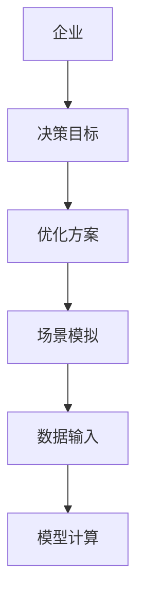
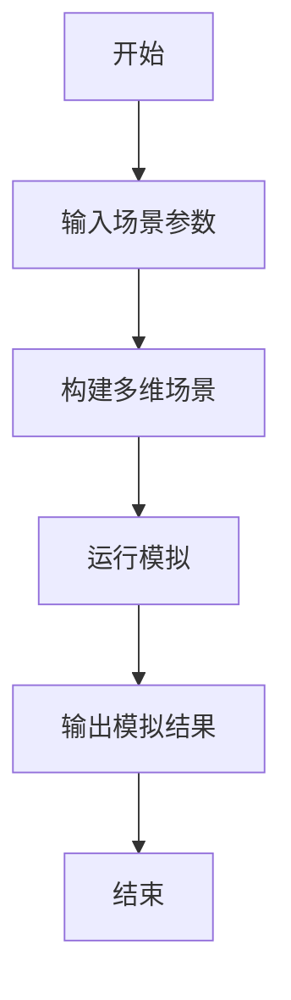
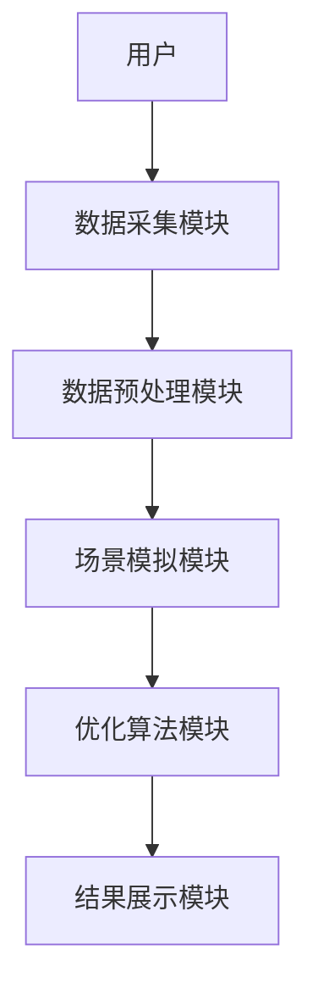

                 


# 构建智能企业决策支持系统：多维场景模拟与优化

---

## 关键词：
智能决策支持系统、多维场景模拟、优化算法、系统架构、企业决策

---

## 摘要：
智能企业决策支持系统通过多维场景模拟与优化算法，为企业提供高效、智能的决策解决方案。本文从问题背景、核心概念、算法原理、系统架构到项目实战，全面解析智能决策支持系统的构建过程，深入探讨多维场景模拟与优化算法的应用场景和实现方法。

---

## 第一部分：智能企业决策支持系统概述

### 第1章：企业决策支持系统背景与需求

#### 1.1 问题背景
企业决策支持系统的传统方法存在数据量大、维度复杂、决策效率低等问题。引入人工智能技术，通过多维场景模拟与优化算法，能够显著提升企业的决策效率和准确性。

#### 1.2 问题描述
企业决策支持系统需要解决以下问题：
- 如何在多维场景中模拟决策过程？
- 如何通过优化算法找到最优解？
- 如何设计高效的系统架构以支持实时决策？

#### 1.3 问题解决与边界
智能决策支持系统的实现路径包括：
1. 数据采集与预处理
2. 场景建模与模拟
3. 优化算法设计与实现
4. 系统集成与部署

系统边界包括企业内部数据、外部市场数据、用户行为数据等，确保数据来源的多样性和可靠性。

#### 1.4 本章小结
本章通过分析企业决策支持系统的背景与需求，明确了多维场景模拟与优化的核心价值，为后续章节的展开奠定了基础。

---

## 第二部分：多维场景模拟与优化的核心概念

### 第2章：核心概念与联系

#### 2.1 核心概念原理
- **多维场景模拟**：通过构建多维度的决策场景，模拟不同条件下的决策结果。
- **优化算法**：利用数学优化方法，找到最优的决策方案。

#### 2.2 核心概念属性对比
| 属性       | 多维场景模拟         | 优化算法             |
|------------|--------------------|--------------------|
| 核心目标    | 模拟决策过程         | 找到最优解           |
| 实现方式    | 场景建模与仿真       | 数学建模与求解       |
| 输入输出    | 多维度数据输入       | 优化目标输出         |

#### 2.3 ER实体关系图


#### 2.4 本章小结
本章通过对比分析和ER图，明确了多维场景模拟与优化算法的核心概念及其相互关系。

---

## 第三部分：多维场景模拟与优化算法原理

### 第3章：多维场景模拟算法

#### 3.1 算法原理
多维场景模拟算法的基本流程包括：
1. 数据采集与预处理
2. 场景建模
3. 模拟运行
4. 结果分析

#### 3.2 算法流程图


---

## 第四部分：系统分析与架构设计

### 第4章：系统分析与架构设计

#### 4.1 问题场景介绍
企业决策支持系统的典型场景包括市场预测、资源配置、风险评估等。

#### 4.2 系统功能设计
- 数据采集模块：负责数据的采集与预处理。
- 场景模拟模块：实现多维场景的模拟。
- 优化算法模块：执行优化算法，输出最优解。
- 结果展示模块：以可视化的方式展示模拟结果。

#### 4.3 系统架构图


#### 4.4 系统接口设计
- 数据接口：与企业数据库对接。
- 用户接口：提供友好的操作界面。

#### 4.5 本章小结
本章通过系统架构设计，明确了各模块的功能与交互关系。

---

## 第五部分：项目实战

### 第5章：项目实战

#### 5.1 环境安装
- 安装Python、numpy、pandas、scipy等依赖库。

#### 5.2 核心代码实现
```python
import numpy as np
from scipy.optimize import minimize

def objective_function(x):
    return np.sum(x**2)

def constraint_function(x):
    return np.sum(x) - 1

x0 = np.array([1, 1])
result = minimize(objective_function, x0, constraints={'type': 'eq', 'fun': constraint_function})
print(result.x)
```

#### 5.3 案例分析
通过优化算法，帮助企业找到资源配置的最优解，提升决策效率。

#### 5.4 本章小结
本章通过实际项目案例，展示了智能决策支持系统的实现过程。

---

## 第六部分：总结与展望

### 第6章：总结与展望

#### 6.1 最佳实践
- 数据质量是关键。
- 选择合适的优化算法。
- 系统架构设计要注重扩展性。

#### 6.2 小结
本文全面解析了智能企业决策支持系统的构建过程，从理论到实践，为企业提供了一套完整的解决方案。

#### 6.3 注意事项
- 数据隐私保护
- 系统性能优化
- 用户培训与支持

#### 6.4 未来展望
随着人工智能技术的发展，智能决策支持系统将更加智能化和自动化。

---

## 作者：AI天才研究院 & 禅与计算机程序设计艺术

---

这篇文章通过系统化的分析与实践，全面探讨了智能企业决策支持系统的构建过程，为企业提供了多维场景模拟与优化的解决方案。

