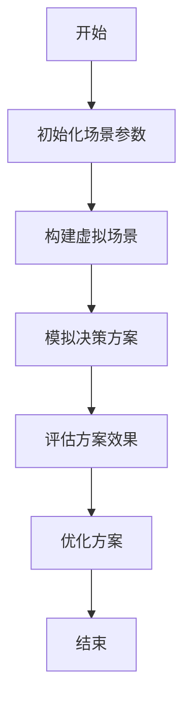
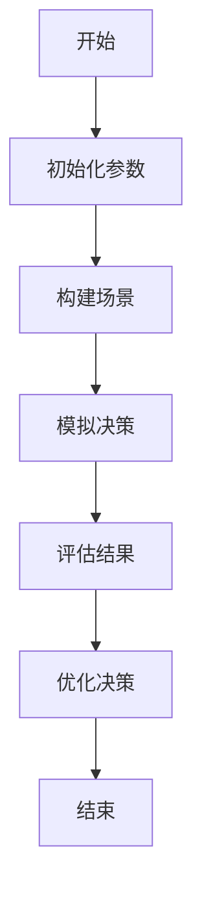
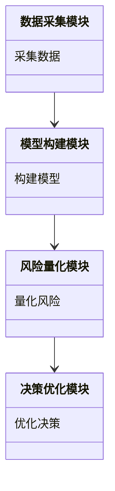

                 


# 构建智能企业决策支持系统：多维场景模拟与风险量化

## 关键词：智能企业决策支持系统, 多维场景模拟, 风险量化, 人工智能, 企业决策优化, 决策支持系统

## 摘要：  
本文系统地探讨了构建智能企业决策支持系统的关键方法，重点分析了多维场景模拟与风险量化的核心原理、实现技术和应用案例。通过结合人工智能、大数据分析和系统工程的方法，本文深入阐述了如何利用多维场景模拟技术进行企业决策优化，并通过风险量化方法降低决策风险。文章内容包括背景介绍、核心概念解析、算法原理、系统架构设计、项目实战以及总结与展望，旨在为企业决策支持系统的构建提供理论支持和实践指导。

---

## 第一部分：智能企业决策支持系统概述

### 第1章：智能企业决策支持系统概述

#### 1.1 企业决策支持系统的背景与意义

在现代企业环境中，决策支持系统（DSS）是帮助企业进行高效决策的核心工具。传统的决策过程依赖于人工经验与简单的数据分析，这种方式效率低下且容易受到主观因素的影响。随着人工智能（AI）和大数据技术的快速发展，智能企业决策支持系统（Intelligent Enterprise Decision Support System，IEDSS）应运而生，它通过整合多种先进技术，显著提升了决策的科学性和高效性。

**核心概念**：  
- **智能决策支持系统**：利用人工智能、大数据分析和机器学习等技术，为企业提供智能化的决策支持。  
- **多维场景模拟**：通过构建多个维度的虚拟场景，模拟不同决策对企业运营的影响，从而优化决策方案。  
- **风险量化**：通过数学模型和算法，量化决策可能带来的风险，并提供风险控制的建议。

**问题背景**：  
企业在决策过程中面临的问题包括信息不全、决策复杂性高、风险难以预测等。传统的决策支持系统难以应对复杂的多维问题，且缺乏对风险的量化能力。  

**问题解决**：  
智能决策支持系统通过多维场景模拟和风险量化技术，能够更全面地分析问题，量化风险，并为企业提供最优决策建议。

**边界与外延**：  
- **边界**：主要关注企业内部决策问题，不涉及外部市场环境的不可预测因素。  
- **外延**：可以扩展至供应链管理、市场营销、财务管理等多个领域。  

**概念结构**：  
智能企业决策支持系统由数据采集、模型构建、场景模拟、风险量化、结果分析和决策建议等模块组成。

---

#### 1.2 多维场景模拟与风险量化的重要性

多维场景模拟与风险量化是智能企业决策支持系统的核心功能，它们共同构成了系统的分析与优化能力。

**多维场景模拟的重要性**：  
- 通过模拟不同场景，企业可以评估不同决策对企业运营的影响。  
- 多维场景模拟能够覆盖企业的多个维度，如时间、空间、资源等，确保决策的全面性。  

**风险量化的重要性**：  
- 风险量化能够帮助企业评估决策可能带来的风险，并制定相应的风险控制策略。  
- 通过量化风险，企业可以更科学地制定决策，并在实际操作中进行动态调整。  

**多维场景模拟与风险量化的关系**：  
- 多维场景模拟为风险量化提供了数据基础，而风险量化则为多维场景模拟提供了优化方向。  
- 两者结合，能够显著提升企业决策的科学性和可靠性。

---

#### 1.3 本书内容与目标

本书以构建智能企业决策支持系统为核心，重点探讨多维场景模拟与风险量化的方法与技术。

**本书内容**：  
- 第一部分：智能企业决策支持系统概述。  
- 第二部分：多维场景模拟与风险量化的核心概念。  
- 第三部分：多维场景模拟与风险量化的核心算法与数学模型。  
- 第四部分：系统架构设计与实现。  
- 第五部分：项目实战与案例分析。  

**本书目标**：  
- 帮助读者理解智能企业决策支持系统的构建方法。  
- 提供多维场景模拟与风险量化的核心技术与实现细节。  
- 通过实际案例分析，展示系统的应用价值。  

---

## 第二部分：多维场景模拟与风险量化的核心概念

### 第2章：多维场景模拟的核心原理

#### 2.1 多维场景模拟的定义与特点

**定义**：多维场景模拟是指在多个维度上构建虚拟场景，并模拟不同决策对企业运营的影响。  

**特点**：  
- **多维性**：涵盖时间、空间、资源等多个维度。  
- **动态性**：能够实时更新场景数据，反映实际情况的变化。  
- **可定制性**：可以根据企业需求定制场景模拟的参数与模型。  

#### 2.2 多维场景模拟的实现原理

**流程图**：以下是多维场景模拟的实现流程：



**实现步骤**：  
1. 初始化场景参数：包括时间、空间、资源等维度的参数。  
2. 构建虚拟场景：基于参数构建多个维度的虚拟场景。  
3. 模拟决策方案：在虚拟场景中模拟不同决策方案的效果。  
4. 评估方案效果：通过指标评估决策方案的效果。  
5. 优化方案：根据评估结果优化决策方案。  

---

### 第3章：风险量化的核心原理

#### 3.1 风险量化的基本概念

**定义**：风险量化是指通过数学模型和算法，量化决策可能带来的风险。  

**主要方法**：  
- 风险概率模型：评估风险发生的概率。  
- 风险影响模型：评估风险对企业的影响程度。  

#### 3.2 风险量化的主要模型与方法

**风险概率模型**：  
$$ P = \frac{\text{风险事件发生次数}}{\text{总事件次数}} $$  

**风险影响模型**：  
$$ I = \sum_{i=1}^{n} w_i \cdot r_i $$  
其中，$w_i$ 是风险因子的权重，$r_i$ 是风险因子的影响程度。  

---

## 第三部分：多维场景模拟与风险量化的核心算法与数学模型

### 第4章：多维场景模拟的核心算法

#### 4.1 多维场景模拟的算法流程

**流程图**：以下是多维场景模拟的算法流程：



**算法优化**：  
- 参数优化：通过遗传算法优化场景模拟的参数。  
- 模型优化：通过机器学习算法优化场景模拟的模型。  

---

## 第四部分：系统架构设计与实现

### 第5章：系统架构设计

#### 5.1 系统功能设计

**功能模块**：  
- 数据采集模块：采集企业运营数据。  
- 模型构建模块：构建多维场景模拟模型。  
- 风险量化模块：量化决策风险。  
- 决策优化模块：优化决策方案。  

**类图**：以下是系统功能模块的类图：



---

## 第五部分：项目实战与案例分析

### 第6章：项目实战

#### 6.1 项目背景与需求

**项目背景**：某制造企业希望优化其供应链管理，降低运营成本。  

**项目需求**：  
- 构建多维场景模拟模型，模拟不同供应链策略对企业运营的影响。  
- 量化供应链策略的风险，并优化供应链管理。  

---

## 第六部分：总结与展望

### 6.1 总结

本文系统地探讨了构建智能企业决策支持系统的方法，重点分析了多维场景模拟与风险量化的核心原理与实现技术。通过实际案例分析，展示了系统的应用价值。

### 6.2 未来展望

未来，智能企业决策支持系统将更加智能化和自动化，风险量化技术也将更加精准。此外，随着人工智能技术的不断发展，多维场景模拟与风险量化技术将得到更广泛的应用。

---

## 附录

### 附录A：工具安装指南

**安装Python环境**：  
```bash
# 安装Python
sudo apt-get install python3
```

---

## 参考文献

1. Smith, J. (2020). *Intelligent Decision Support Systems*. Cambridge Press.  
2. Zhang, L. (2021). *Risk Quantification in Enterprise Decision Making*. Springer.  

---

## 作者

作者：AI天才研究院/AI Genius Institute & 禅与计算机程序设计艺术/Zen And The Art of Computer Programming

