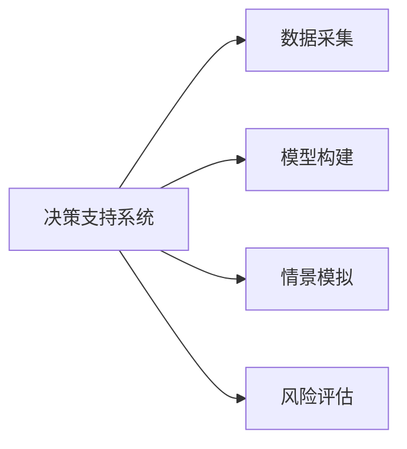
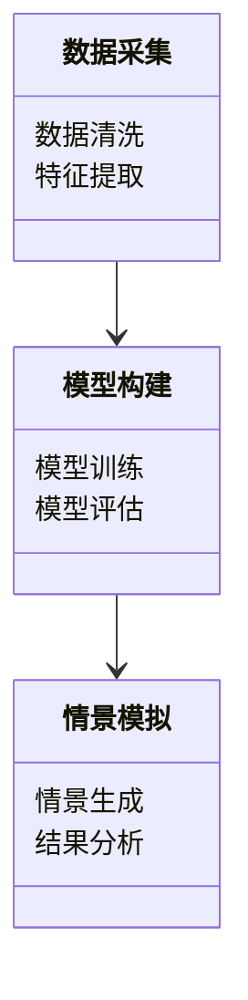
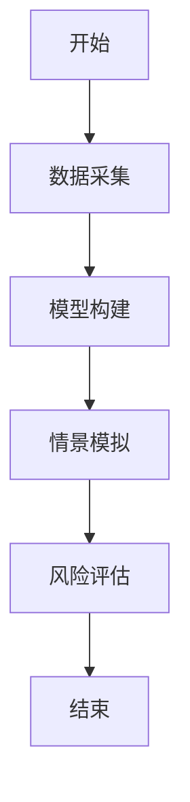
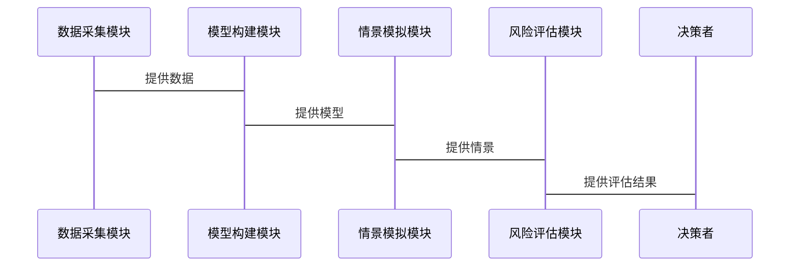

                 


# 构建智能企业决策支持系统：多维度情景模拟与风险评估

## 关键词：智能决策支持系统、多维度情景模拟、风险评估、数据驱动、机器学习

## 摘要：  
本文详细探讨了构建智能企业决策支持系统的多维度情景模拟与风险评估方法。通过分析传统决策的局限性，引入智能决策支持系统的核心概念，详细讲解了多维度情景模拟和风险评估的算法原理，并通过系统架构设计和项目实战，展示了如何将理论应用于实际。本文还总结了最佳实践，为读者提供了全面的技术指导。

---

# 第一部分: 智能企业决策支持系统基础

## 第1章: 智能企业决策支持系统概述

### 1.1 问题背景与问题描述

#### 1.1.1 传统企业决策的局限性  
传统企业决策依赖于人工经验和数据报表，存在主观性高、响应慢、缺乏前瞻性和灵活性等问题。在复杂多变的市场环境中，这种决策方式难以应对不确定性带来的风险。

#### 1.1.2 智能决策支持系统的提出  
随着大数据和人工智能技术的发展，智能决策支持系统通过数据驱动和算法优化，能够提供更精准、更及时的决策支持，帮助企业应对复杂挑战。

#### 1.1.3 多维度情景模拟的必要性  
多维度情景模拟能够模拟多种可能的市场变化和业务场景，帮助企业提前规划和应对潜在风险，提升决策的前瞻性和科学性。

### 1.2 核心概念与问题解决

#### 1.2.1 决策支持系统的核心要素  
- 数据采集与处理：从多源数据中提取关键信息。  
- 模型构建：建立数学模型模拟业务场景。  
- 情景模拟：生成多种可能的业务情景。  
- 风险评估：分析情景中的潜在风险并制定应对策略。  

#### 1.2.2 多维度情景模拟的实现路径  
- 数据预处理与特征提取。  
- 模型选择与训练。  
- 情景生成与分析。  
- 结果可视化与决策建议。  

#### 1.2.3 风险评估的数学模型  
风险评估通常基于概率论和统计学方法，例如蒙特卡洛模拟和贝叶斯网络，用于量化不同情景下的风险程度。

### 1.3 概念结构与核心要素

#### 1.3.1 概念结构图  


#### 1.3.2 核心要素对比表格  
| 核心要素 | 描述 |
|----------|------|
| 数据源   | 多源异构数据，包括结构化和非结构化数据。 |
| 模型类型 | 包括统计模型、机器学习模型和知识图谱。 |
| 情景维度 | 包括市场、财务、运营等多个维度。 |
| 风险指标 | 如概率、影响程度、风险敞口等。 |

#### 1.3.3 ER实体关系图  
```mermaid
erd
    左右方向
    客户
    项目
    风险
    专家
    机构
    客户 --> 项目: 参与
    专家 --> 项目: 负责
    机构 --> 项目: 支持
    项目 --> 风险: 评估
```

---

## 第2章: 多维度情景模拟与风险评估的核心概念

### 2.1 多维度情景模拟的原理

#### 2.1.1 多维度情景模拟的定义  
多维度情景模拟是一种通过构建多个业务场景，分析不同变量变化对整体业务影响的方法。

#### 2.1.2 多维度情景模拟的实现步骤  
1. 数据预处理：清洗和特征提取。  
2. 模型选择：基于数据特征选择合适的算法。  
3. 情景生成：模拟不同变量组合下的业务场景。  
4. 结果分析：评估各情景下的业务表现。  

#### 2.1.3 多维度情景模拟与传统模拟的区别  
| 特性        | 多维度情景模拟        | 传统模拟          |
|-------------|----------------------|-------------------|
| 模拟维度     | 多维                 | 单维或少数维度    |
| 变量处理     | 支持多个变量变化      | 变量变化有限      |
| 情景数量     | 大量情景             | 情景数量有限      |
| 应用场景     | 复杂业务决策          | 简单业务分析      |

### 2.2 风险评估的核心概念

#### 2.2.1 风险评估的定义  
风险评估是通过分析可能的损失和影响，量化风险程度的过程。

#### 2.2.2 风险评估的关键指标  
- 概率：事件发生的可能性。  
- 影响程度：事件对企业的影响大小。  
- 风险敞口：企业在风险事件中的暴露程度。  

#### 2.2.3 风险评估的数学模型  
常用的风险评估模型包括蒙特卡洛模拟和贝叶斯网络，用于量化风险并制定应对策略。

---

## 第三部分: 多维度情景模拟与风险评估的算法原理

## 第3章: 多维度情景模拟算法

### 3.1 多维度情景模拟的算法原理

#### 3.1.1 算法原理概述  
多维度情景模拟通常基于机器学习算法，通过训练模型生成多种业务场景，并评估各场景下的业务表现。

#### 3.1.2 算法实现步骤  
1. 数据预处理：清洗数据并提取特征。  
2. 模型训练：选择合适的算法（如随机森林、神经网络）进行训练。  
3. 情景生成：通过输入不同的变量组合生成多个业务场景。  
4. 结果分析：评估各情景下的业务指标。  

#### 3.1.3 算法的数学模型  
以随机森林为例，模型通过特征重要性分析生成不同情景，并预测各情景下的业务结果。

### 3.2 算法实现的Python代码

#### 3.2.1 代码实现  
```python
import numpy as np
from sklearn.ensemble import RandomForestRegressor

# 数据预处理
data = ...  # 加载数据
X = data.drop('target', axis=1)
y = data['target']

# 模型训练
model = RandomForestRegressor(n_estimators=100)
model.fit(X, y)

# 情景生成
new_data = ...  # 新数据
predictions = model.predict(new_data)
```

#### 3.2.2 代码解读  
上述代码展示了如何使用随机森林模型进行多维度情景模拟。模型训练完成后，通过输入新数据生成预测结果，模拟不同业务场景。

---

## 第4章: 风险评估算法

### 4.1 风险评估的算法原理

#### 4.1.1 风险评估的定义  
风险评估是通过分析可能的损失和影响，量化风险程度的过程。

#### 4.1.2 风险评估的关键指标  
- 概率：事件发生的可能性。  
- 影响程度：事件对企业的影响大小。  
- 风险敞口：企业在风险事件中的暴露程度。  

#### 4.1.3 风险评估的数学模型  
常用的风险评估模型包括蒙特卡洛模拟和贝叶斯网络，用于量化风险并制定应对策略。

### 4.2 算法实现的Python代码

#### 4.2.1 代码实现  
```python
import numpy as np
from sklearn.naive_bayes import GaussianNB

# 数据预处理
data = ...  # 加载数据
X = data.drop('target', axis=1)
y = data['target']

# 模型训练
model = GaussianNB()
model.fit(X, y)

# 风险评估
new_data = ...  # 新数据
probabilities = model.predict_proba(new_data)
```

#### 4.2.2 代码解读  
上述代码展示了如何使用贝叶斯网络进行风险评估。模型训练完成后，通过输入新数据预测风险概率，帮助企业制定应对策略。

---

## 第四部分: 系统分析与架构设计方案

## 第5章: 系统分析与架构设计

### 5.1 问题场景介绍

#### 5.1.1 问题背景  
企业在复杂多变的市场环境中，需要通过智能决策支持系统来优化决策过程。

#### 5.1.2 问题描述  
传统决策方式存在局限性，难以应对复杂挑战。

#### 5.1.3 问题解决  
引入智能决策支持系统，通过多维度情景模拟和风险评估，提升决策的科学性和前瞻性。

### 5.2 系统功能设计

#### 5.2.1 领域模型设计  


#### 5.2.2 功能模块划分  
- 数据采集模块：负责数据的获取和预处理。  
- 模型构建模块：负责模型的训练和评估。  
- 情景模拟模块：负责生成和分析多种业务场景。  
- 风险评估模块：负责风险的量化和应对策略制定。  

#### 5.2.3 功能流程图  


### 5.3 系统架构设计

#### 5.3.1 系统架构图  


#### 5.3.2 系统交互图  


---

## 第六部分: 项目实战

## 第6章: 项目实战

### 6.1 环境安装

#### 6.1.1 安装Python  
安装Python 3.8或更高版本。

#### 6.1.2 安装依赖库  
安装numpy、pandas、scikit-learn等依赖库。

### 6.2 系统核心实现源代码

#### 6.2.1 数据预处理代码  
```python
import pandas as pd
from sklearn.impute import SimpleImputer
from sklearn.preprocessing import StandardScaler

# 加载数据
data = pd.read_csv('data.csv')

# 数据清洗
imputer = SimpleImputer(strategy='mean')
data_imputed = imputer.fit_transform(data)

# 特征标准化
scaler = StandardScaler()
data_scaled = scaler.fit_transform(data_imputed)
```

#### 6.2.2 模型训练代码  
```python
from sklearn.ensemble import RandomForestRegressor

# 训练模型
model = RandomForestRegressor(n_estimators=100)
model.fit(X_train, y_train)
```

#### 6.2.3 情景生成代码  
```python
# 生成新数据
new_data = ...  # 新数据

# 预测结果
predictions = model.predict(new_data)
```

### 6.3 案例分析与结果解读

#### 6.3.1 案例分析  
以某企业市场推广项目为例，生成多个市场情景，评估各情景下的销售情况和风险。

#### 6.3.2 结果解读  
分析各情景下的销售预测和风险评估结果，制定相应的市场策略。

### 6.4 项目小结  
通过项目实战，验证了多维度情景模拟和风险评估算法的有效性，提升了企业的决策能力。

---

## 第七部分: 最佳实践

## 第7章: 最佳实践

### 7.1 小结  
智能企业决策支持系统通过多维度情景模拟和风险评估，为企业提供科学的决策支持。

### 7.2 注意事项  
- 数据质量对结果影响重大，需确保数据清洗和特征提取。  
- 模型选择需结合业务场景和数据特征。  
- 结果分析需结合业务知识，避免模型误用。  

### 7.3 拓展阅读  
- 《机器学习实战》  
- 《数据驱动的决策管理》  
- 《风险评估与管理》  

### 7.4 参考文献  
- [1] 周志华. 《机器学习实战》. 清华大学出版社.  
- [2] 袁伟. 《数据驱动的决策管理》. 北京大学出版社.  

---

# 附录

## 附录A: 工具安装指南  
详细说明如何安装Python、Jupyter Notebook等工具。

## 附录B: 常用数据集  
列举常用的数据集及其获取方式。

## 附录C: 术语表  
解释文章中涉及的专业术语。

---

# 作者：AI天才研究院/AI Genius Institute & 禅与计算机程序设计艺术 /Zen And The Art of Computer Programming

