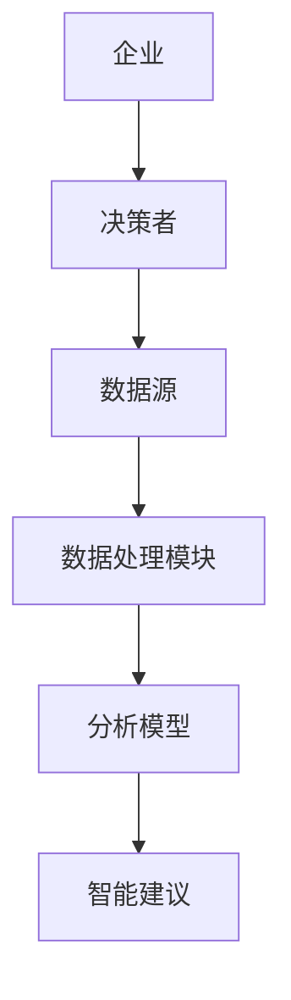
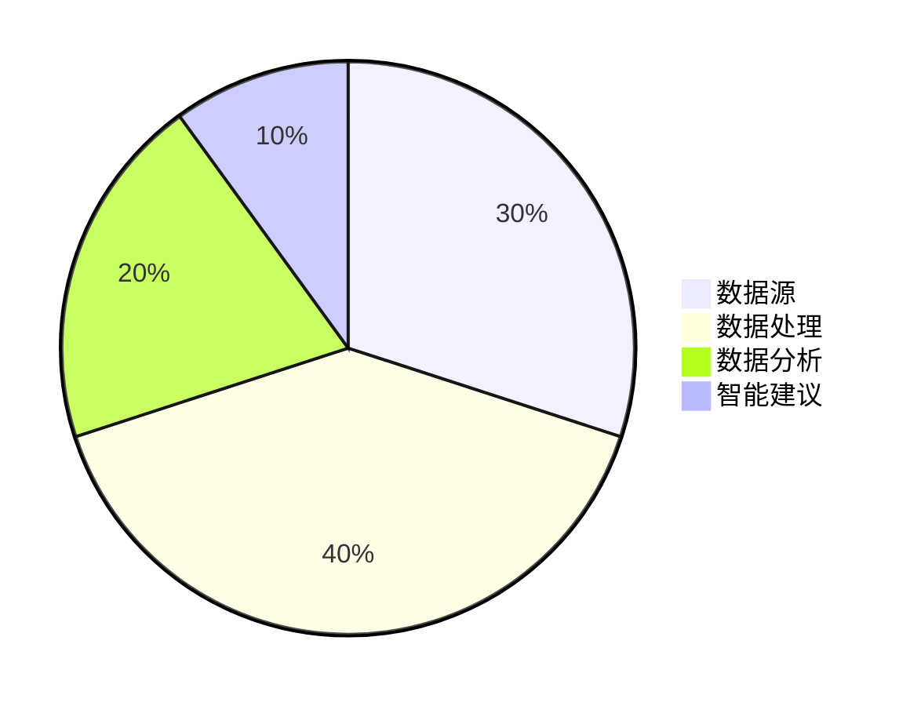

                 

<think>
好的，我将按照您的要求，构建一个详细的《构建智能企业决策支持系统：多维度数据分析与建议》的目录大纲。首先，我会从背景介绍开始，逐步分析核心概念，深入探讨算法原理，展示系统架构设计，然后进行项目实战，最后总结最佳实践。

## 目录大纲

### 第一部分：智能企业决策支持系统概述

#### 第1章：问题背景与目标

##### 1.1 问题背景
- 1.1.1 传统企业决策的挑战
  - 数据孤岛问题
  - 信息不透明
  - 决策效率低下
- 1.1.2 数据驱动决策的必要性
  - 数据的重要性
  - 数据如何影响决策
- 1.1.3 智能决策支持系统的定义
  - 系统的功能
  - 系统的目标

##### 1.2 问题描述
- 1.2.1 企业决策中的信息孤岛问题
  - 数据分散在不同部门
  - 数据格式不统一
- 1.2.2 数据分析与决策的效率瓶颈
  - 数据量大，分析时间长
  - 需要专业人员进行分析
- 1.2.3 传统决策支持系统的局限性
  - 功能单一
  - 可扩展性差

##### 1.3 问题解决思路
- 1.3.1 数据驱动决策的核心思想
  - 以数据为基础，科学决策
  - 利用数据分析技术
- 1.3.2 智能化决策支持的关键技术
  - 人工智能
  - 大数据分析
- 1.3.3 多维度数据分析的实现路径
  - 数据采集
  - 数据处理
  - 数据分析
  - 决策建议

#### 第2章：核心概念与联系

##### 2.1 核心概念原理
- 2.1.1 数据采集与处理
  - 数据来源
  - 数据清洗
  - 数据转换
- 2.1.2 数据分析与建模
  - 描述性分析
  - 预测性分析
  - 诊断性分析
- 2.1.3 智能建议生成
  - 生成规则
  - 生成模型
  - 输出方式

##### 2.2 核心概念对比表
| 概念          | 属性      | 描述内容                                                                 |
|---------------|-----------|--------------------------------------------------------------------------|
| 数据采集      | 来源      | 结构化数据、非结构化数据、实时数据                                         |
| 数据分析      | 方法      | 描述性分析、预测性分析、诊断性分析                                         |
| 智能建议      | 技术      | 机器学习、自然语言处理、知识图谱                                           |

##### 2.3 实体关系图


#### 第3章：算法原理与数学模型

##### 3.1 算法原理
- 3.1.1 机器学习算法
  - 线性回归
    - 简单线性回归和多元线性回归
    - 优缺点分析
  - 支持向量机
    - 分类和回归的应用
    - 优缺点分析
  - 随机森林
    - 集成学习方法
    - 优缺点分析
- 3.1.2 深度学习算法
  - 神经网络
    - 前馈神经网络和反馈神经网络
    - 优缺点分析
  - 长短期记忆网络
    - 应用于时间序列数据
    - 优缺点分析

##### 3.2 数学模型与公式
- 3.2.1 线性回归模型
  $$ y = \beta_0 + \beta_1x + \epsilon $$
- 3.2.2 支持向量机
  $$ \text{目标函数} = \sum_{i=1}^n \xi_i + \frac{1}{2}||\theta||^2 $$
- 3.2.3 神经网络
  $$ a^{(l)} = \sigma(w^{(l)} a^{(l-1)} + b^{(l)}) $$

#### 第4章：系统分析与架构设计

##### 4.1 系统架构设计
- 4.1.1 系统功能模块
  - 数据采集模块
  - 数据处理模块
  - 数据分析模块
  - 智能建议模块
- 4.1.2 模块交互关系
  ```mermaid
  graph TD
      A[数据采集模块] --> B[数据处理模块]
      B --> C[数据分析模块]
      C --> D[智能建议模块]
  ```

##### 4.2 系统架构图


#### 第5章：项目实战

##### 5.1 环境安装
- 安装Python
- 安装必要的库（如pandas、numpy、scikit-learn）
- 安装可视化工具（如Matplotlib、Seaborn）

##### 5.2 核心代码实现
- 数据采集模块
  ```python
  import pandas as pd

  data = pd.read_csv('data.csv')
  ```
- 数据处理模块
  ```python
  from sklearn.preprocessing import StandardScaler

  scaler = StandardScaler()
  data_scaled = scaler.fit_transform(data)
  ```
- 数据分析模块
  ```python
  from sklearn.linear_model import LinearRegression

  model = LinearRegression()
  model.fit(X, y)
  ```
- 智能建议模块
  ```python
  import numpy as np

  predictions = model.predict(X_new)
  ```

##### 5.3 案例分析
- 数据分析案例
  - 分析销售数据，预测未来销售额
- 智能建议案例
  - 根据分析结果，提供优化建议

##### 5.4 项目小结
- 项目总结
- 成果展示
- 经验分享

#### 第6章：最佳实践

##### 6.1 小结
- 系统建设的总结
- 关键点回顾
- 成功经验

##### 6.2 注意事项
- 数据质量的重要性
- 算法选择的注意事项
- 系统维护的重要性

##### 6.3 拓展阅读
- 推荐书籍
- 推荐在线资源
- 推荐研究方向

### 附录

- 附录A：常用的数据分析工具
- 附录B：常用机器学习算法总结
- 附录C：参考文献

---

### 作者：AI天才研究院/AI Genius Institute & 禅与计算机程序设计艺术 /Zen And The Art of Computer Programming

希望这个大纲能为您提供一个清晰的构建智能企业决策支持系统的指导。每个部分都详细地展开，帮助您系统地理解和实施相关的技术和方法。

