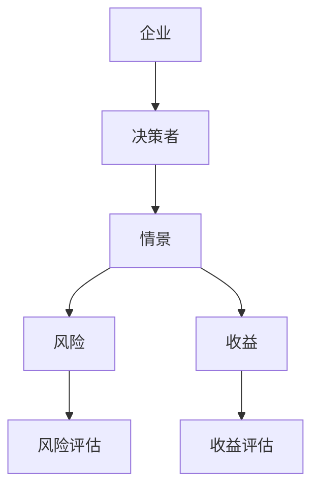
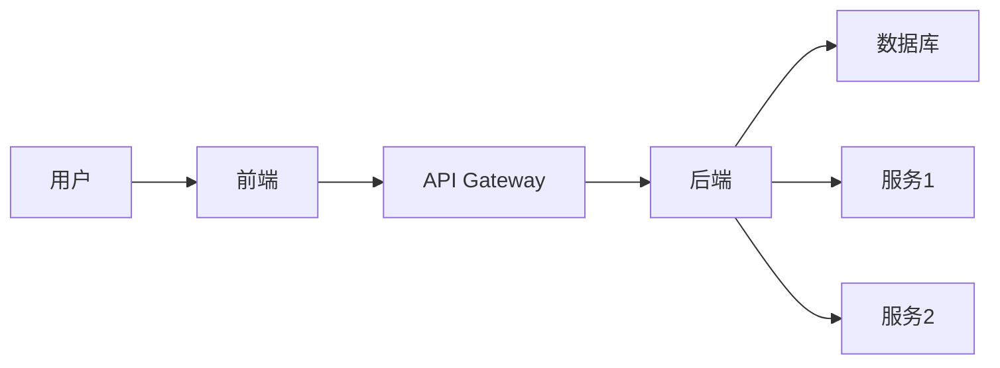

                 


# 构建智能企业决策模拟系统：多维度情景分析与风险评估

## 关键词：智能决策模拟，多维度情景分析，风险评估，企业决策系统，算法原理，系统架构，项目实战

## 摘要

在当今快速变化的商业环境中，企业决策的复杂性和不确定性日益增加。传统的决策方法已难以应对多维度的情景分析和风险评估的需求。本文将详细介绍如何构建一个智能企业决策模拟系统，通过多维度情景分析与风险评估的方法，帮助企业做出更科学、更高效的决策。本文将从问题背景、核心概念、算法原理、系统架构到项目实战，逐步展开，深入分析如何构建这样一个系统，并通过实际案例展示其应用价值。

---

## 第一部分: 智能企业决策模拟系统概述

### 第1章: 问题背景与目标

#### 1.1 问题背景

企业在经营过程中面临着复杂的决策问题，如市场拓展、产品开发、资源配置等。传统的决策方法依赖于经验判断和简单的数据分析，难以应对多变的市场环境和复杂的业务场景。随着人工智能和大数据技术的发展，企业需要一种更高效、更精确的决策方法。

#### 1.2 问题描述

企业决策的多维度性使得传统的单维度分析方法难以满足需求。例如，在市场拓展决策中，企业需要考虑市场环境、竞争对手、内部资源等多个因素。此外，风险评估是决策过程中不可忽视的一部分，传统的风险评估方法往往过于简化，无法准确反映实际情况。

#### 1.3 问题解决思路

智能决策模拟系统通过整合多维度的情景分析和风险评估，提供了一种更全面的决策支持方法。系统利用机器学习、数据挖掘等技术，对多种情景进行模拟和预测，从而帮助企业制定更科学的决策。

#### 1.4 系统边界与外延

智能决策模拟系统的边界包括企业的核心业务流程和相关数据源。系统外延则涉及与企业外部环境的交互，如市场数据、政策变化等。系统需要与企业的其他系统（如ERP、CRM）进行集成，以获取必要的数据支持。

#### 1.5 核心概念与组成

智能决策模拟系统的核心概念包括情景分析、风险评估、决策模拟等。系统由数据采集模块、情景分析模块、风险评估模块和决策输出模块组成，各模块协同工作，完成决策支持任务。

---

## 第二部分: 核心概念与原理

### 第2章: 多维度情景分析与风险评估的核心原理

#### 2.1 核心概念原理

多维度情景分析通过构建多个可能的业务场景，分析不同情景下的业务表现。风险评估则基于这些情景，量化潜在风险，并制定应对策略。

#### 2.2 核心概念属性对比

以下是多维度情景分析与单维度分析的对比：

| 对比维度 | 多维度情景分析 | 单维度分析 |
|----------|----------------|------------|
| 分析深度 | 全面、细致 | 简单、片面 |
| 数据需求 | 多源、多维度 | 单一、有限 |
| 应用场景 | 复杂决策问题 | 简单决策问题 |

#### 2.3 ER实体关系图

以下是企业决策模拟系统的ER实体关系图：



---

## 第三部分: 算法原理与实现

### 第3章: 多维度情景分析算法

#### 3.1 算法原理

多维度情景分析算法通过构建多个业务场景，评估不同情景下的业务表现。以下是算法的流程：

1. 数据预处理：清洗和整合多源数据。
2. 情景生成：基于历史数据和专家意见，生成多个可能的业务情景。
3. 情景评估：计算每个情景下的关键指标，如收益、风险等。
4. 情景排序：根据评估结果，对情景进行排序和优先级划分。

#### 3.2 算法实现

以下是Python代码实现：

```python
import pandas as pd

def multi_dimensional_scenario_analysis(data):
    # 数据预处理
    processed_data = preprocess(data)
    # 计算情景评分
    scenario_scores = calculate_scores(processed_data)
    # 生成情景报告
    report = generate_report(scenario_scores)
    return report

def preprocess(data):
    # 数据清洗和特征工程
    processed = data.dropna().astype(float)
    return processed

def calculate_scores(data):
    # 计算情景评分
    scores = data.mean(axis=0)
    return scores

def generate_report(scores):
    # 生成情景报告
    report = scores.sort_values(ascending=False)
    return report

# 示例数据
data = pd.DataFrame({
    'Scenario': ['S1', 'S2', 'S3'],
    'Revenue': [100, 150, 120],
    'Cost': [50, 60, 70]
})

result = multi_dimensional_scenario_analysis(data)
print(result)
```

#### 3.3 算法的数学模型

以下是算法的数学模型：

$$ \text{Scenario Score} = \frac{\sum_{i=1}^{n} w_i x_i}{\sum_{i=1}^{n} w_i} $$

其中，\( w_i \) 是指标 \( i \) 的权重，\( x_i \) 是指标 \( i \) 的实际值。

---

## 第四部分: 系统分析与架构设计

### 第4章: 系统分析与架构设计

#### 4.1 系统功能设计

以下是系统的功能模块划分：

- 数据采集模块：负责数据的采集和预处理。
- 情景分析模块：生成和评估多个业务情景。
- 风险评估模块：量化潜在风险，并制定应对策略。
- 决策输出模块：生成决策报告，并输出最优方案。

#### 4.2 系统架构设计

以下是系统的架构图：



---

## 第五部分: 项目实战

### 第5章: 项目实战

#### 5.1 环境安装

以下是项目所需的环境配置：

- Python 3.8+
- Pandas、NumPy、Scikit-learn等库。

#### 5.2 核心代码实现

以下是核心代码实现：

```python
from sklearn import preprocessing

def normalize_data(data):
    # 数据归一化
    scaler = preprocessing.MinMaxScaler()
    normalized_data = scaler.fit_transform(data)
    return normalized_data

# 示例数据
data = pd.DataFrame({
    'Scenario': ['S1', 'S2', 'S3'],
    'Revenue': [100, 150, 120],
    'Cost': [50, 60, 70]
})

normalized_data = normalize_data(data)
print(normalized_data)
```

#### 5.3 案例分析

以下是案例分析：

假设某企业计划进入一个新市场，通过多维度情景分析，生成三个情景：乐观、中性、悲观。通过对每个情景的评估，企业可以选择最优的市场进入策略。

---

## 第六部分: 扩展与展望

### 第6章: 扩展与展望

#### 6.1 最佳实践 tips

- 数据质量是系统的核心，确保数据的准确性和完整性。
- 定期更新模型，以适应市场环境的变化。
- 结合业务实际，灵活调整模型参数。

#### 6.2 小结

本文详细介绍了如何构建智能企业决策模拟系统，从问题背景到系统架构，再到项目实战，全面覆盖了系统的构建过程。

#### 6.3 注意事项

- 系统的复杂性可能会影响性能，需进行优化。
- 数据隐私和安全问题需重点关注。

#### 6.4 拓展阅读

- 《机器学习实战》
- 《数据驱动的决策分析》

---

## 作者

作者：AI天才研究院/AI Genius Institute & 禅与计算机程序设计艺术 /Zen And The Art of Computer Programming

