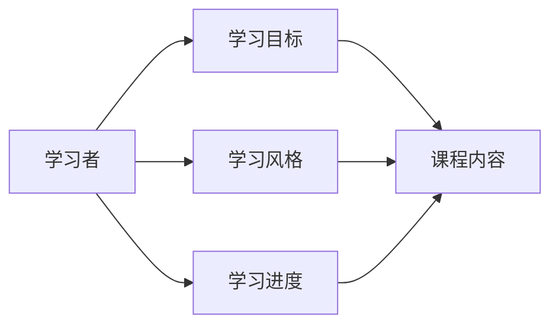
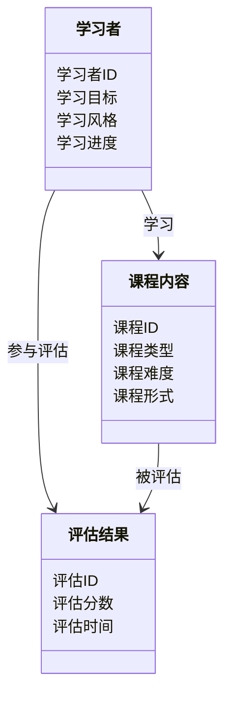
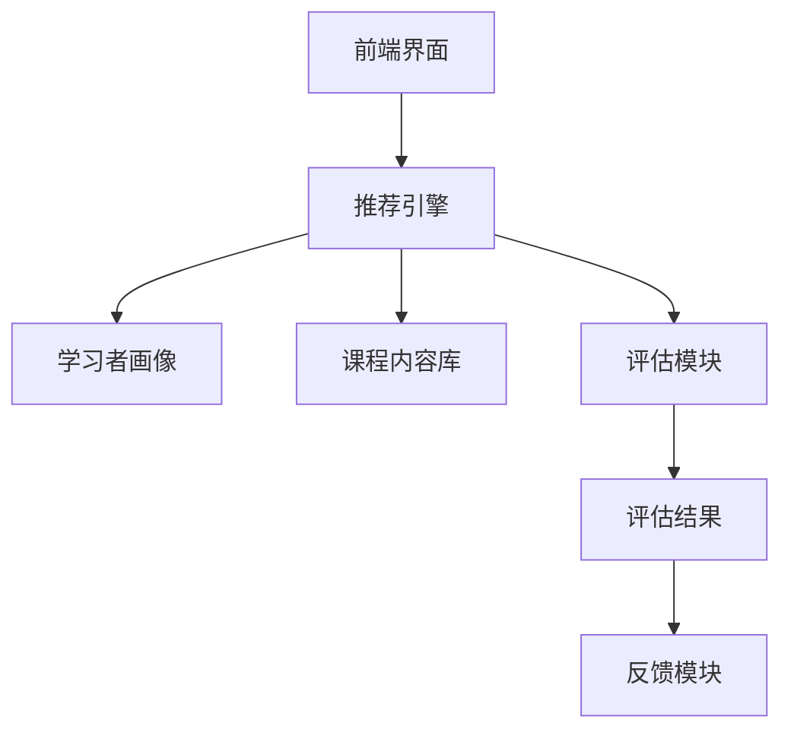
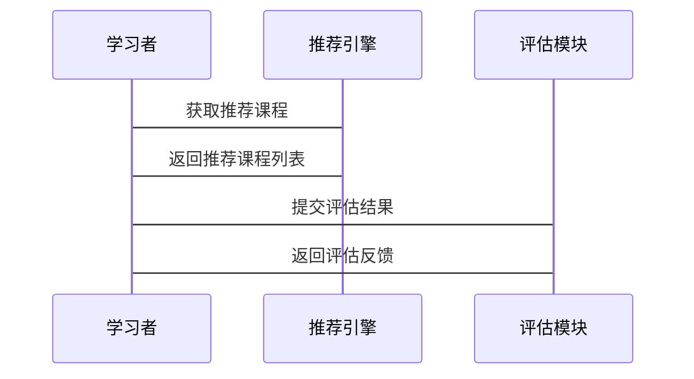

                 


# 构建智能企业合规培训系统：个性化学习内容与评估

> 关键词：企业合规培训，个性化学习，智能评估系统，推荐算法，学习效果评估

> 摘要：随着企业合规培训需求的不断增加，传统的培训方式已经难以满足个性化学习和高效评估的需求。本文将详细探讨如何利用人工智能技术构建智能企业合规培训系统，通过个性化学习内容和智能化评估，提升企业的合规培训效果。文章将从背景介绍、核心概念、算法原理、系统架构设计、项目实战到最佳实践进行全面解析，为读者提供一个全面的解决方案。

---

# 第1章: 企业合规培训系统背景与需求

## 1.1 企业合规培训的重要性

### 1.1.1 合规培训的定义与目标

合规培训是指企业为确保员工遵守相关法律法规、行业标准以及企业内部规章制度而进行的培训。其目标是通过培训使员工了解并遵守相关规范，降低企业的法律风险，提升企业的合规性。

### 1.1.2 企业合规培训的现状与挑战

随着全球化和数字化的发展，企业面临的法律法规日益复杂，合规培训的需求也不断增加。然而，传统的合规培训方式存在以下问题：

1. **内容单一**：传统的合规培训内容通常千篇一律，无法满足不同岗位、不同层次员工的个性化需求。
2. **效率低下**：大规模的培训往往效果不佳，员工参与度低，难以确保培训效果。
3. **缺乏反馈**：传统的培训方式难以实时收集和分析员工的学习效果，无法提供有效的反馈和改进措施。

### 1.1.3 智能化合规培训的需求与趋势

为了应对上述挑战，智能化合规培训系统应运而生。通过人工智能技术，系统可以根据员工的个性化需求推荐学习内容，并通过智能化评估手段实时反馈学习效果，从而提升培训的效率和效果。

---

## 1.2 个性化学习与评估的必要性

### 1.2.1 个性化学习的定义与优势

个性化学习是指根据学习者的个性特征、学习目标、学习风格等因素，量身定制学习内容和学习路径。其优势在于能够提高学习者的参与度和学习效果，减少学习者的疲劳感和抵触情绪。

### 1.2.2 个性化评估的核心作用

个性化评估是指根据学习者的个性化需求，设计相应的评估方式和评估指标。其核心作用在于能够准确反映学习者的学习效果，为后续的学习内容推荐和调整提供依据。

### 1.2.3 企业合规培训中的个性化需求

在企业合规培训中，不同岗位的员工可能需要学习不同的合规内容。例如，销售人员需要了解销售合规知识，而技术人员需要了解技术合规要求。因此，个性化学习和评估在企业合规培训中具有重要的应用价值。

---

## 1.3 智能企业合规培训系统的概念

### 1.3.1 智能化合规培训的定义

智能化合规培训系统是指利用人工智能技术，通过分析学习者的学习行为、学习目标和学习需求，智能化地推荐学习内容和评估方式，从而实现个性化的合规培训。

### 1.3.2 系统的核心功能与特点

智能化合规培训系统的核心功能包括：

1. **学习者画像**：通过收集和分析学习者的行为数据，构建学习者画像，了解学习者的学习习惯、兴趣和能力水平。
2. **内容推荐**：根据学习者画像，推荐适合的学习内容和学习路径。
3. **评估与反馈**：通过智能化评估手段，评估学习者的学习效果，并提供实时反馈。

### 1.3.3 系统的边界与外延

智能化合规培训系统的边界主要在于合规培训的内容和范围。其外延则可以扩展到其他类型的学习和培训领域，如技能培训、领导力培训等。

---

## 1.4 系统构建的背景与目标

### 1.4.1 当前企业合规培训的痛点

1. **内容同质化**：传统合规培训内容千篇一律，难以满足个性化需求。
2. **效率低下**：大规模培训难以确保每位员工的学习效果。
3. **缺乏反馈**：传统评估方式难以提供实时反馈和个性化建议。

### 1.4.2 智能化解决方案的提出

通过引入人工智能技术，构建智能化合规培训系统，可以实现个性化学习内容推荐和智能化评估，解决传统合规培训的痛点。

### 1.4.3 系统构建的目标与价值

智能化合规培训系统的目标是通过个性化学习和智能化评估，提升企业的合规培训效果。其价值在于：

1. **提高学习效率**：通过个性化推荐，减少无效学习时间，提高学习效果。
2. **降低合规风险**：通过精准的学习内容推荐和评估，确保员工掌握必要的合规知识，降低企业的合规风险。
3. **提升员工满意度**：通过个性化学习和评估，提升员工的学习体验和满意度。

---

## 1.5 本章小结

本章从企业合规培训的重要性、个性化学习与评估的必要性以及智能化合规培训系统的概念等方面进行了详细阐述。通过分析传统合规培训的痛点，提出了智能化合规培训系统的解决方案，并总结了其目标与价值。

---

# 第2章: 核心概念与系统组成

## 2.1 系统核心概念

### 2.1.1 学习者角色与属性

学习者是系统的核心用户，其角色和属性包括：

- **学习者ID**：唯一标识符，用于区分不同的学习者。
- **学习目标**：学习者希望通过学习实现的目标，如“掌握数据隐私合规知识”。
- **学习风格**：学习者偏好哪种学习方式，如“视觉型”、“听觉型”等。
- **学习进度**：学习者在学习过程中的进展情况。

### 2.1.2 课程内容的分类与特征

课程内容可以根据以下分类进行划分：

1. **课程类型**：合规知识、技能培训、案例分析等。
2. **课程难度**：初级、中级、高级。
3. **课程形式**：视频、文档、互动练习等。

### 2.1.3 评估方式的多样性与关联性

评估方式可以包括：

1. **知识测试**：通过在线测试评估学习者对知识的掌握程度。
2. **行为观察**：通过观察学习者的行为，评估其实际应用能力。
3. **反馈评估**：通过学习者的反馈，评估其对学习内容的满意度。

---

## 2.2 系统核心要素

### 2.2.1 数据采集与处理

系统需要采集以下数据：

- **学习者数据**：包括学习者的基本信息、学习目标、学习风格等。
- **学习内容数据**：包括课程内容的分类、难度、形式等。
- **学习行为数据**：包括学习者的点击行为、浏览时间、互动频率等。

### 2.2.2 算法实现与优化

系统需要实现以下算法：

- **推荐算法**：根据学习者画像推荐个性化学习内容。
- **评估算法**：根据学习者的学习行为和测试结果，评估学习效果。

### 2.2.3 系统交互与反馈

系统需要设计良好的交互界面，方便学习者进行学习和评估，并根据评估结果提供实时反馈。

---

## 2.3 核心概念的联系与对比

### 2.3.1 实体关系图（ER图）分析

以下是核心概念的实体关系图：



### 2.3.2 核心概念属性对比表

| 概念       | 属性       | 描述                                   |
|------------|------------|----------------------------------------|
| 学习者     | 学习者ID    | 唯一标识符                             |
|            | 学习目标    | 学习者希望通过学习实现的目标           |
|            | 学习风格    | 学习者偏好哪种学习方式                 |
|            | 学习进度    | 学习者在学习过程中的进展情况           |
| 课程内容   | 课程类型    | 课程的主题和内容分类                   |
|            | 课程难度    | 课程的难度级别                         |
|            | 课程形式    | 课程的呈现形式                         |
| 评估方式   | 知识测试    | 通过在线测试评估学习者的知识掌握程度   |
|            | 行为观察    | 通过观察学习者的行为评估其实际应用能力 |
|            | 反馈评估    | 通过学习者的反馈评估其满意度           |

---

## 2.4 本章小结

本章详细阐述了智能企业合规培训系统的核心概念，包括学习者角色、课程内容分类和评估方式的多样性，并通过实体关系图和对比表展示了系统的核心要素及其联系。

---

# 第3章: 算法原理与实现

## 3.1 推荐算法原理

### 3.1.1 协同过滤推荐

协同过滤推荐是一种基于用户行为相似性的推荐算法。其基本思想是：如果两个用户在过去的购买或浏览行为上相似，那么他们未来的行为也会相似。

数学公式：
$$
similarity(u_i, u_j) = \frac{\sum_{k=1}^{n} (r_{i,k} - \bar{r_i})(r_{j,k} - \bar{r_j})}{\sqrt{\sum_{k=1}^{n} (r_{i,k} - \bar{r_i})^2} \cdot \sqrt{\sum_{k=1}^{n} (r_{j,k} - \bar{r_j})^2}}
$$

### 3.1.2 基于内容的推荐

基于内容的推荐是通过分析学习内容的特征，推荐与学习者兴趣相似的内容。

数学公式：
$$
similarity(content_i, content_j) = \frac{\sum_{k=1}^{n} w_k \cdot (t_i,k \cdot t_j,k)}{\sqrt{\sum_{k=1}^{n} w_k^2 \cdot t_i,k^2} \cdot \sqrt{\sum_{k=1}^{n} w_k^2 \cdot t_j,k^2}}
$$

### 3.1.3 混合推荐

混合推荐是将协同过滤推荐和基于内容的推荐结合起来，利用两者的优势，提高推荐的准确性。

---

## 3.2 评估模型的数学模型

### 3.2.1 回归分析模型

回归分析模型用于预测学习者的评估分数。

数学公式：
$$
y = \beta_0 + \beta_1x_1 + \beta_2x_2 + \ldots + \beta_nx_n + \epsilon
$$

### 3.2.2 分类模型

分类模型用于将学习者分为不同的评估等级。

数学公式：
$$
P(y=k|x) = \frac{e^{\beta_k + \beta_0x_0 + \ldots + \beta_nx_n}}{\sum_{j=1}^{K} e^{\beta_j + \beta_0x_0 + \ldots + \beta_nx_n}}
$$

---

## 3.3 算法实现与优化

### 3.3.1 推荐算法的实现

以下是协同过滤推荐算法的Python实现示例：

```python
def collaborative_filtering(user_id, user_similarities, user_items):
    similar_users = user_similarities[user_id]
    recommended_items = set()
    for user in similar_users:
        recommended_items.update(user_items[user])
    return recommended_items
```

### 3.3.2 评估模型的优化

通过交叉验证和网格搜索优化模型参数，提高评估的准确性。

---

## 3.4 本章小结

本章详细介绍了推荐算法和评估模型的原理和实现，并通过Python代码示例展示了算法的实现过程。

---

# 第4章: 系统分析与架构设计

## 4.1 问题场景介绍

本章将从问题场景出发，分析智能化合规培训系统的需求。

---

## 4.2 项目介绍

### 4.2.1 项目目标

通过构建智能化合规培训系统，实现个性化学习内容推荐和智能化评估。

### 4.2.2 项目范围

系统将覆盖企业内部所有员工的合规培训需求。

---

## 4.3 系统功能设计

### 4.3.1 领域模型设计

以下是领域模型的Mermaid类图：



### 4.3.2 系统架构设计

以下是系统的架构图：



### 4.3.3 系统接口设计

系统需要实现以下接口：

1. `get_recommendations(user_id)`：根据用户ID返回推荐的课程内容。
2. `submit_assessment(user_id, assessment_results)`：提交评估结果并更新学习者画像。

### 4.3.4 系统交互设计

以下是系统的交互序列图：



---

## 4.4 本章小结

本章通过问题场景分析和系统架构设计，详细阐述了智能化合规培训系统的功能设计和架构实现。

---

# 第5章: 项目实战与案例分析

## 5.1 项目实战

### 5.1.1 环境安装

需要安装以下工具：

1. Python 3.8+
2. scikit-learn
3. Flask

### 5.1.2 核心功能实现

以下是推荐引擎的实现代码：

```python
from sklearn.metrics.pairwise import cosine_similarity

def build_recommender(user_items):
    user_similarity = cosine_similarity(user_items)
    return user_similarity
```

### 5.1.3 代码应用解读与分析

通过分析代码，可以了解推荐引擎的实现方式及其优化策略。

---

## 5.2 案例分析

### 5.2.1 案例背景

某企业希望通过智能化合规培训系统提升员工的合规意识和技能。

### 5.2.2 实施步骤

1. 数据采集与处理。
2. 推荐算法实现。
3. 评估模型优化。
4. 系统上线与测试。

---

## 5.3 本章小结

本章通过项目实战和案例分析，展示了智能化合规培训系统的实际应用和实施步骤。

---

# 第6章: 最佳实践与注意事项

## 6.1 小结

通过本文的详细阐述，我们可以得出以下结论：

1. 智能化合规培训系统是解决传统合规培训痛点的有效手段。
2. 个性化学习和智能化评估是提升系统效果的关键。

## 6.2 注意事项

1. 数据隐私保护：在采集和处理学习者数据时，需严格遵守数据隐私保护法规。
2. 算法优化：定期优化推荐算法和评估模型，提高系统的推荐准确率和评估效果。
3. 系统维护：定期更新课程内容和评估标准，确保系统的持续有效性和适用性。

## 6.3 拓展阅读

1. 《推荐系统导论》
2. 《机器学习实战》
3. 《企业合规培训指南》

---

# 作者

作者：AI天才研究院/AI Genius Institute & 禅与计算机程序设计艺术 /Zen And The Art of Computer Programming

