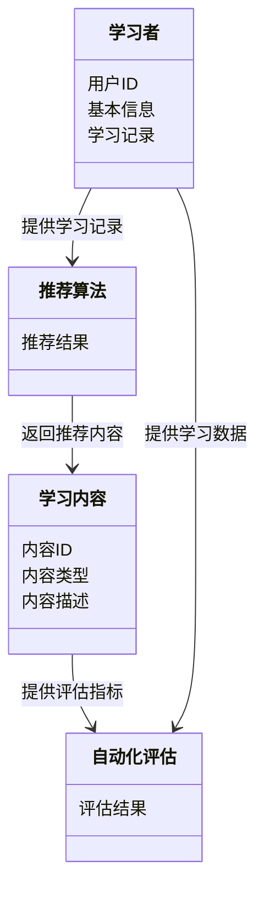
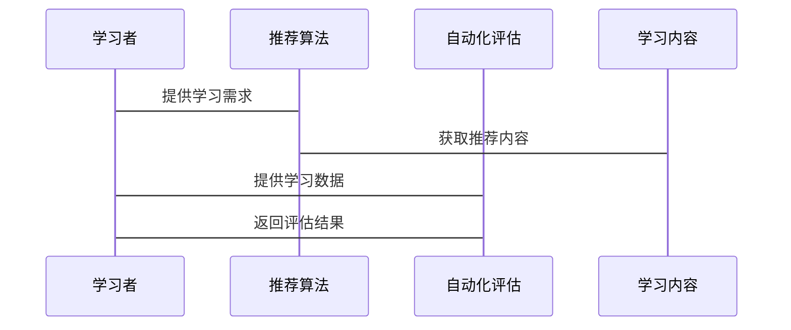

                 


# 构建智能企业合规培训系统：个性化学习内容与评估的自动化

> 关键词：智能合规培训，个性化学习，自动化评估，人工智能，机器学习

> 摘要：本文探讨如何利用人工智能和机器学习技术构建智能企业合规培训系统，实现个性化学习内容推荐和自动化评估。通过详细分析系统架构、算法原理和项目实现，提供一套高效的企业合规培训解决方案。

---

# 第1章: 智能企业合规培训系统的背景与挑战

## 1.1 企业合规培训的重要性
### 1.1.1 合规培训的定义与目标
合规培训是指企业为员工提供法律法规、行业规范及相关政策的培训，确保员工行为符合法律规定和企业要求。其目标是降低法律风险、提升员工专业能力和企业合规文化。

### 1.1.2 企业合规培训的现状与问题
传统合规培训存在以下问题：
- 培训内容千篇一律，缺乏针对性。
- 员工参与度低，学习效果不佳。
- 评估方式单一，难以量化学习成果。

### 1.1.3 智能化合规培训的必要性
通过引入人工智能和大数据技术，实现个性化学习内容推荐和自动化评估，提升培训效果和效率。

## 1.2 个性化学习与自动化评估的需求
### 1.2.1 个性化学习的定义与优势
个性化学习是根据员工的特点（如岗位需求、知识水平、学习风格）提供定制化的学习内容，提高学习效果。

### 1.2.2 自动化评估的定义与优势
自动化评估是通过算法自动分析学习数据，生成评估结果和反馈，减少人工干预，提高评估效率。

### 1.2.3 企业合规培训中的个性化与自动化需求
企业需要结合员工的特点和需求，提供个性化的学习内容，并通过自动化评估确保培训效果。

## 1.3 本章小结
本章介绍了企业合规培训的重要性及智能化合规培训的必要性，强调了个性化学习和自动化评估的需求。

---

# 第2章: 智能企业合规培训系统的核心概念

## 2.1 合规培训系统的业务流程
### 2.1.1 传统合规培训流程
1. 确定培训需求。
2. 制定培训计划。
3. 实施培训。
4. 评估培训效果。

### 2.1.2 智能化合规培训流程
1. 收集员工数据。
2. 分析学习需求。
3. 推荐个性化学习内容。
4. 自动化评估学习效果。
5. 生成反馈报告。

## 2.2 个性化学习与评估的核心要素
### 2.2.1 学习者画像
- 基本信息：岗位、职责、技能水平。
- 学习风格：主动型、被动型、视觉型等。
- 学习需求：知识缺口、技能提升目标。

### 2.2.2 学习内容分类
- 法律法规类：合同法、劳动法等。
- 行业规范类：金融行业规范、医疗行业规范等。
- 企业政策类：员工手册、合规政策等。

### 2.2.3 评估指标与反馈机制
- 评估指标：学习进度、掌握程度、考试成绩。
- 反馈机制：即时反馈、阶段性反馈、总结反馈。

## 2.3 系统目标与范围
### 2.3.1 系统目标
- 提供个性化的学习内容推荐。
- 实现自动化评估和反馈。
- 提高员工合规知识掌握率。

### 2.3.2 系统范围
- 学习内容管理模块。
- 学员信息管理模块。
- 推荐算法模块。
- 自动化评估模块。

### 2.3.3 边界与外延
- 系统不包括线下培训活动。
- 系统仅适用于企业内部员工。

## 2.4 本章小结
本章详细阐述了智能企业合规培训系统的核心概念，包括业务流程、核心要素和系统范围。

---

# 第3章: 智能企业合规培训系统的算法原理

## 3.1 个性化学习推荐算法
### 3.1.1 协同过滤算法
- **基于用户的协同过滤**：通过相似用户的偏好推荐内容。
- **基于物品的协同过滤**：通过相似内容推荐给用户。

### 3.1.2 基于内容的推荐算法
- 使用文本挖掘技术分析学习内容，根据内容相似度推荐。

### 3.1.3 深度学习推荐算法
- 使用神经网络模型（如BERT）进行推荐。

## 3.2 自动化评估算法
### 3.2.1 基于规则的评估算法
- 根据预设规则评估学习成果。

### 3.2.2 基于回归的评估算法
- 使用线性回归模型预测评估结果。

### 3.2.3 基于分类的评估算法
- 使用随机森林或神经网络进行分类评估。

## 3.3 算法实现与优化
### 3.3.1 算法实现
- 使用Python编写推荐和评估算法。
- 示例代码：协同过滤算法实现。

```python
def collaborative_filtering(user_id):
    # 获取用户历史行为
    user_history = get_user_history(user_id)
    # 计算相似用户
    similar_users = find_similar_users(user_id, user_history)
    # 推荐内容
    recommended_content = get_recommendations(similar_users)
    return recommended_content
```

### 3.3.2 算法优化
- 离线学习与在线学习结合。
- 处理数据稀疏性问题。

## 3.4 本章小结
本章介绍了推荐算法和评估算法的原理与实现，并提供了协同过滤算法的示例代码。

---

# 第4章: 智能企业合规培训系统的系统设计

## 4.1 系统架构设计
### 4.1.1 总体架构
- **前端**：Web界面、移动端。
- **后端**：API接口、业务逻辑处理。
- **数据库**：存储学习者信息、学习内容、评估数据。

### 4.1.2 模块划分
- 学习者信息模块。
- 学习内容模块。
- 推荐算法模块。
- 自动化评估模块。

## 4.2 系统功能设计
### 4.2.1 领域模型设计
- 使用Mermaid图展示系统类图。



### 4.2.2 系统接口设计
- 接口1：获取学习者画像。
- 接口2：推荐学习内容。
- 接口3：自动化评估。

### 4.2.3 系统交互设计
- 使用Mermaid图展示交互流程。



## 4.3 本章小结
本章详细阐述了智能企业合规培训系统的架构设计、功能模块和系统交互流程。

---

# 第5章: 智能企业合规培训系统的项目实战

## 5.1 环境配置与开发工具
- 开发环境：Python 3.8以上。
- 开发工具：PyCharm、Jupyter Notebook。
- 依赖库：Pandas、Scikit-learn、Flask。

## 5.2 系统核心实现
### 5.2.1 推荐算法实现
- 使用协同过滤算法实现推荐功能。

```python
from sklearn.metrics.pairwise import cosine_similarity

def collaborative_filtering(user_id):
    user_data = load_data()
    user_item_matrix = create_user_item_matrix(user_data)
    similarities = cosine_similarity(user_item_matrix[user_id, :])
    recommended_content = get_top_n(similarities)
    return recommended_content
```

### 5.2.2 自动化评估实现
- 使用回归模型预测评估结果。

```python
from sklearn.linear_model import LinearRegression

def automated_assessment(learning_data):
    model = LinearRegression()
    model.fit(X, y)
    predictions = model.predict(learning_data)
    return predictions
```

## 5.3 项目测试与部署
### 5.3.1 测试用例设计
- 功能测试：推荐功能、评估功能。
- 性能测试：系统响应时间。

### 5.3.2 系统部署
- 后端部署：Docker容器化。
- 前端部署：静态资源托管。

## 5.4 本章小结
本章通过实际项目案例，详细讲解了系统的实现、测试和部署过程。

---

# 第6章: 系统优化与扩展

## 6.1 系统优化策略
### 6.1.1 算法优化
- 使用深度学习模型提升推荐精度。
- 增加实时数据处理能力。

### 6.1.2 系统性能优化
- 使用缓存技术减少重复计算。
- 优化数据库查询效率。

## 6.2 系统扩展方案
### 6.2.1 功能扩展
- 增加多语言支持。
- 引入虚拟现实技术进行沉浸式学习。

### 6.2.2 数据扩展
- 支持更大规模数据处理。
- 增加实时数据流处理。

## 6.3 本章小结
本章讨论了系统的优化策略和扩展方案，为系统的进一步改进提供了方向。

---

# 第7章: 总结与展望

## 7.1 项目总结
- 成功实现了个性化学习推荐和自动化评估。
- 提高了企业合规培训的效果和效率。

## 7.2 项目经验与教训
- 数据质量对算法效果影响重大。
- 系统设计需充分考虑可扩展性。

## 7.3 对未来的展望
- 引入更多人工智能技术。
- 推动企业合规培训的智能化和个性化。

## 7.4 本章小结
本章总结了项目的成果和经验，并展望了未来的发展方向。

---

# 作者：AI天才研究院/AI Genius Institute & 禅与计算机程序设计艺术 /Zen And The Art of Computer Programming

---

以上是《构建智能企业合规培训系统：个性化学习内容与评估的自动化》的技术博客文章的完整目录大纲和内容概述。

