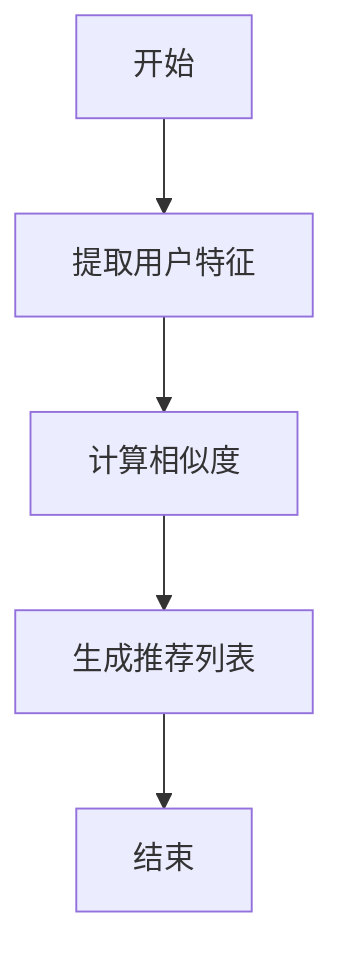
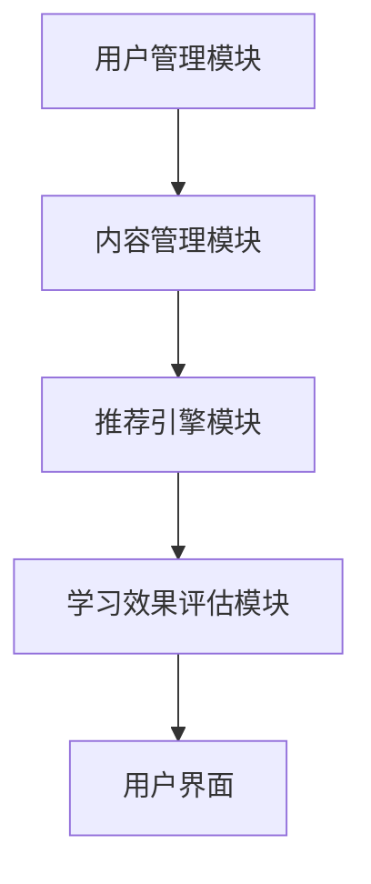
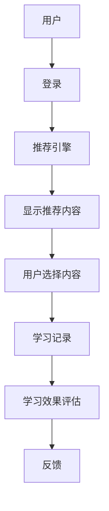

                 


# 构建智能企业合规培训系统：基于角色的个性化学习内容生成

> **关键词**: 智能企业合规培训系统, 基于角色的个性化学习, 企业合规培训, 人工智能推荐算法, 系统架构设计

> **摘要**: 本文详细探讨了构建智能企业合规培训系统的方法，重点介绍了基于角色的个性化学习内容生成的理论、算法实现及系统架构设计。通过分析企业合规培训的现状与挑战，提出了一种基于角色的个性化学习模型，并结合推荐算法和系统架构设计，展示了如何实现高效、精准的合规培训内容生成。文章最后结合实际案例，探讨了系统的实现细节和应用价值。

---

## 第一部分: 智能企业合规培训系统概述

### 第1章: 企业合规培训的背景与挑战

#### 1.1 企业合规培训的背景介绍
- **合规培训的定义与重要性**  
  合规培训是指企业为员工提供与法律法规、行业标准、企业内部政策相关的知识培训，以确保员工在工作中遵守相关规范。合规培训不仅是企业合规经营的基石，也是避免法律风险的重要手段。

- **企业合规培训的传统模式与不足**  
  传统合规培训模式通常采用统一的课程和内容，难以满足不同岗位、不同职责员工的个性化需求。这种一刀切的方式导致培训效果差，员工参与度低，培训成本高昂。

- **智能化合规培训的需求与趋势**  
  随着人工智能技术的快速发展，企业开始寻求更加智能化、个性化的合规培训方式。通过智能化系统，企业可以高效地为不同角色的员工提供针对性的学习内容，提升培训效果。

#### 1.2 个性化学习与角色定位的关联
- **个性化学习的定义与特点**  
  个性化学习是指根据学习者的个性特征、知识水平、学习目标等因素，提供定制化的学习内容和学习路径。个性化学习的核心在于“因材施教”，注重学习者的个体差异。

- **基于角色的个性化学习的意义**  
  在企业合规培训中，不同岗位的员工承担不同的职责，所需掌握的合规知识也不同。例如，财务人员需要了解财务合规知识，而法务人员则需要熟悉法律合规知识。基于角色的个性化学习能够确保员工仅学习与其职责相关的知识，提升学习效率。

- **合规培训中角色定位的必要性**  
  角色定位是实现个性化学习的基础。通过明确员工的岗位职责和角色特征，系统可以精准匹配学习内容，避免无效学习。

#### 1.3 智能企业合规培训系统的概念
- **智能化合规培训系统的定义**  
  智能化合规培训系统是一种基于人工智能技术的在线培训平台，能够根据员工的角色特征、学习需求和知识水平，自动生成个性化的学习内容和学习计划。

- **系统的核心功能与目标**  
  系统的核心功能包括：角色识别、学习需求分析、内容生成、学习效果评估等。目标是为员工提供高效、精准的合规培训，降低培训成本，提升员工合规意识和能力。

- **系统的预期效益与价值**  
  通过智能化合规培训系统，企业可以显著提升培训效果，降低培训成本，同时增强员工的学习体验和满意度。

#### 1.4 本章小结
本章介绍了企业合规培训的背景与挑战，重点探讨了个性化学习与角色定位的关联，提出了基于角色的个性化学习模型，并阐述了智能化合规培训系统的概念和价值。

---

## 第二部分: 基于角色的个性化学习模型

### 第2章: 基于角色的个性化学习模型

#### 2.1 基于角色的个性化学习模型概述
- **模型的定义与核心要素**  
  基于角色的个性化学习模型是一种通过分析员工的角色特征（如岗位职责、知识水平、学习需求等）来生成个性化学习内容的模型。模型的核心要素包括角色识别、内容匹配和学习效果评估。

- **模型的输入、输出与处理流程**  
  模型的输入包括员工的岗位信息、历史学习数据、知识水平等；输出是个性化学习内容和学习计划。处理流程包括角色识别、内容生成、学习效果评估等环节。

- **模型的适用范围与限制**  
  该模型适用于需要基于角色进行个性化学习的企业合规培训场景，但目前仍存在数据不足、模型复杂度高等限制。

#### 2.2 角色定位与学习需求分析
- **角色定位的分类与特征**  
  角色定位可以根据岗位职责、知识水平、学习目标等因素进行分类。例如，岗位职责可以分为管理层、技术岗、行政岗等。

- **学习需求的分析方法**  
  学习需求分析可以通过问卷调查、历史学习数据、岗位要求等方式获取。系统需要结合这些数据，分析员工的知识缺口和学习偏好。

- **学习需求与角色定位的关系**  
  学习需求与角色定位密切相关。不同角色的员工需要学习的内容不同，系统需要根据角色特征匹配学习内容。

#### 2.3 基于角色的学习内容生成策略
- **内容生成的基本原则**  
  内容生成需要遵循精准性、个性化、动态调整等原则。系统需要确保生成的内容与员工的角色特征和学习需求高度匹配。

- **内容生成的流程与步骤**  
  内容生成流程包括：需求分析、内容筛选、内容整合、内容优化等步骤。

- **内容生成的优化方法**  
  系统可以通过机器学习算法优化内容生成过程，例如利用协同过滤、基于内容的推荐算法等。

#### 2.4 本章小结
本章详细介绍了基于角色的个性化学习模型，探讨了角色定位与学习需求分析的关系，提出了内容生成的策略和优化方法。

---

## 第三部分: 智能企业合规培训系统的算法原理

### 第3章: 智能企业合规培训系统的算法原理

#### 3.1 推荐算法的核心原理
- **协同过滤推荐算法**  
  协同过滤是一种基于用户行为数据的推荐算法，通过计算用户之间的相似度，推荐相似用户的偏好内容。公式如下：
  $$ sim(i,j) = \frac{\sum_{k} (r_{i,k} - \bar{r_i})(r_{j,k} - \bar{r_j})}{\sqrt{\sum_{k} (r_{i,k} - \bar{r_i})^2} \cdot \sqrt{\sum_{k} (r_{j,k} - \bar{r_j})^2}} $$

- **基于内容的推荐算法**  
  基于内容的推荐算法通过分析内容的特征，推荐与用户兴趣相似的内容。公式如下：
  $$ sim(i,j) = \sum_{k} w_k \cdot (f_{i,k} - f_{j,k}) $$

- **混合推荐算法的优势与应用**  
  混合推荐算法结合了协同过滤和基于内容的推荐算法的优势，能够提升推荐的准确性和多样性。

#### 3.2 基于角色的推荐算法实现
- **角色特征提取与表示**  
  系统需要提取员工的角色特征，例如岗位职责、知识水平、学习偏好等。

- **基于角色的相似度计算**  
  系统通过计算员工之间的相似度，推荐相似角色的员工所学习的内容。

- **推荐结果的生成与优化**  
  系统根据相似度计算结果，生成个性化推荐内容，并通过优化算法提升推荐的精准性。

#### 3.3 算法实现的数学模型
- **协同过滤算法的数学公式**  
  协同过滤算法通过计算用户之间的相似度，推荐相似用户的偏好内容。公式如下：
  $$ sim(i,j) = \frac{\sum_{k} (r_{i,k} - \bar{r_i})(r_{j,k} - \bar{r_j})}{\sqrt{\sum_{k} (r_{i,k} - \bar{r_i})^2} \cdot \sqrt{\sum_{k} (r_{j,k} - \bar{r_j})^2}} $$

- **基于内容的推荐算法的数学公式**  
  基于内容的推荐算法通过分析内容的特征，推荐与用户兴趣相似的内容。公式如下：
  $$ sim(i,j) = \sum_{k} w_k \cdot (f_{i,k} - f_{j,k}) $$

#### 3.4 算法实现的流程图


#### 3.5 本章小结
本章详细介绍了智能企业合规培训系统的算法原理，重点探讨了协同过滤和基于内容的推荐算法，并通过流程图展示了算法实现的步骤。

---

## 第四部分: 系统架构与设计

### 第4章: 系统架构与设计

#### 4.1 系统架构设计
- **系统架构的总体设计**  
  系统架构设计包括前端和后端两部分。前端包括用户界面和交互功能，后端包括数据存储、算法处理和接口服务。

- **系统模块划分与功能描述**  
  系统模块包括用户管理模块、内容管理模块、推荐引擎模块和学习效果评估模块。

- **系统架构的优缺点分析**  
  系统架构设计需要考虑扩展性、可维护性和性能优化等问题。

#### 4.2 系统功能设计
- **用户管理模块**  
  用户管理模块负责员工信息的录入、管理与维护。

- **内容管理模块**  
  内容管理模块负责合规知识的录入、分类与管理。

- **推荐引擎模块**  
  推荐引擎模块负责根据员工角色和学习需求生成个性化推荐内容。

- **学习效果评估模块**  
  学习效果评估模块负责评估员工的学习效果，并提供反馈和改进建议。

#### 4.3 系统架构图


#### 4.4 系统接口设计
- **接口设计原则**  
  系统接口设计需要遵循 RESTful 原则，确保接口的可扩展性和可维护性。

- **系统交互流程图**  
  系统交互流程图展示了用户与系统之间的交互过程，包括登录、内容推荐、学习记录等步骤。



#### 4.5 本章小结
本章详细介绍了智能企业合规培训系统的架构设计，包括模块划分、功能设计和系统架构图。

---

## 第五部分: 项目实战

### 第5章: 项目实战

#### 5.1 环境配置
- **开发环境**  
  开发环境包括 Python 3.8+, Jupyter Notebook, MySQL 数据库等。

- **安装必要的库**  
  需要安装的库包括：pandas、numpy、scikit-learn、flask 等。

#### 5.2 核心代码实现
- **用户特征提取代码**  
  ```python
  import pandas as pd
  # 读取用户数据
  user_data = pd.read_csv('users.csv')
  # 提取用户特征
  user_features = user_data[['role', 'knowledge_level', 'preferences']]
  ```

- **推荐算法实现代码**  
  ```python
  from sklearn.metrics.pairwise import cosine_similarity
  # 计算相似度矩阵
  similarity_matrix = cosine_similarity(user_features)
  ```

- **内容生成代码**  
  ```python
  import numpy as np
  # 根据相似度生成推荐内容
  def generate_recommendations(similarity_matrix, content):
      recommended_content = []
      for i in range(len(similarity_matrix)):
          top_indices = np.argsort(similarity_matrix[i])[-3:]
          recommended_content.append(content[top_indices])
      return recommended_content
  ```

#### 5.3 实际案例分析
- **案例背景**  
  某企业需要为不同岗位的员工生成个性化合规培训内容。

- **案例分析与解读**  
  系统根据员工的岗位职责和知识水平，生成个性化学习内容，并通过学习效果评估模块反馈学习效果。

#### 5.4 本章小结
本章通过实际案例分析，展示了智能企业合规培训系统的实现过程和应用价值。

---

## 第六部分: 最佳实践与总结

### 第6章: 最佳实践与总结

#### 6.1 最佳实践 tips
- **数据质量管理**  
  确保数据的准确性和完整性，避免因数据问题影响推荐效果。

- **模型优化与调参**  
  定期优化推荐算法，提升推荐的精准性和多样性。

- **用户反馈与迭代**  
  根据用户反馈不断优化系统功能和学习内容。

#### 6.2 系统小结
智能企业合规培训系统通过基于角色的个性化学习内容生成，显著提升了企业合规培训的效果和效率。系统结合推荐算法和系统架构设计，为企业提供了一种高效、精准的合规培训解决方案。

#### 6.3 注意事项
- 系统上线前需要进行充分的测试和验证。
- 系统运行过程中需要定期维护和更新。

#### 6.4 拓展阅读
- 推荐阅读相关领域的书籍和论文，例如《推荐系统实战》、《机器学习实战》等。

---

## 作者：AI天才研究院/AI Genius Institute & 禅与计算机程序设计艺术 /Zen And The Art of Computer Programming

---

以上是《构建智能企业合规培训系统：基于角色的个性化学习内容生成》的技术博客文章的完整目录和内容框架。每一章节都详细阐述了相关的核心概念、算法原理、系统架构设计和项目实战内容，帮助读者全面理解并掌握构建智能企业合规培训系统的方法和技巧。

