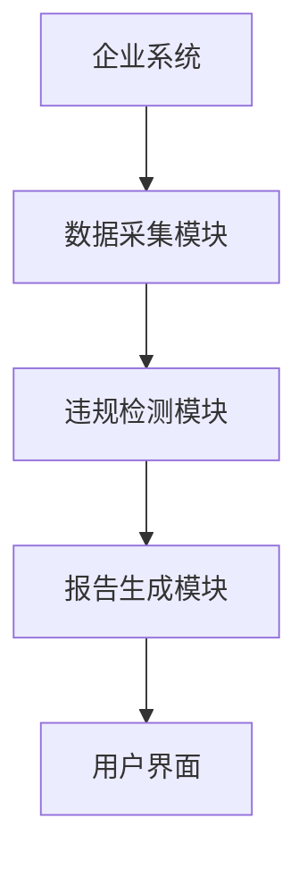

                 


# 构建智能企业合规监控系统：实时违规检测与自动报告生成

## 关键词：企业合规监控、实时违规检测、自动报告生成、智能系统、机器学习、系统架构设计

## 摘要：  
随着企业数字化转型的深入，合规性管理变得越来越复杂和重要。企业合规监控系统需要实时检测潜在违规行为，并自动生成报告以提高效率。本文详细讲解了构建智能企业合规监控系统的各个方面，包括核心概念、算法原理、系统架构设计、项目实战及最佳实践，帮助读者全面理解和掌握如何构建高效可靠的合规监控系统。

---

## 第一部分: 智能企业合规监控系统概述

### 第1章: 企业合规监控系统背景与需求

#### 1.1 合规监控的定义与重要性
合规监控是指通过技术手段对企业行为进行实时监督，确保其符合相关法律法规和企业内部政策。  
- **合规监控的重要性**：  
  - 保障企业合法运营，避免法律风险。  
  - 提高企业透明度，增强信任。  
  - 优化内部流程，提升效率。  

#### 1.2 智能合规监控的必要性
传统的合规监控依赖人工检查，效率低、成本高。智能监控通过技术手段实现自动化，提升效率和准确性。  
- **智能化的优势**：  
  - 实时检测，快速响应。  
  - 数据分析能力强，支持复杂场景。  
  - 自动化报告生成，节省人力。  

#### 1.3 实时违规检测与自动报告的核心价值
- **实时检测**：  
  - 及时发现潜在问题，避免事态扩大。  
  - 提高问题解决的时效性。  
- **自动报告**：  
  - 格式统一，内容详尽。  
  - 支持多种格式输出，便于后续处理。  

#### 1.4 本章小结
本章介绍了企业合规监控的背景、智能化的必要性以及实时违规检测与自动报告的核心价值，为后续内容打下基础。

---

## 第二部分: 核心概念与联系

### 第2章: 智能合规监控系统的核心要素

#### 2.1 数据源与采集
- **数据源**：  
  - 系统日志、交易记录、用户行为数据等。  
  - 数据采集需要实时性、准确性和全面性。  
- **数据预处理**：  
  - 清洗、转换、标准化。  

#### 2.2 违规检测算法
- **基于规则的检测**：  
  - 通过预定义的规则匹配异常行为。  
- **基于机器学习的分类**：  
  - 使用训练好的模型识别潜在违规行为。  
- **基于深度学习的NLP**：  
  - 分析文本数据，识别敏感信息。  

#### 2.3 自动报告生成
- **报告格式**：  
  - 支持PDF、邮件等多种格式。  
- **报告内容**：  
  - 违规事件描述、影响分析、解决建议。  

#### 2.4 核心概念对比表
| 核心概念 | 属性特征 |
|----------|----------|
| 数据源   | 实时性、多样性、准确性 |
| 违规检测 | 精准性、实时性、可扩展性 |
| 自动报告 | 格式化、及时性、可定制性 |

#### 2.5 系统实体关系图


#### 2.6 本章小结
本章详细分析了智能合规监控系统的核心要素，包括数据源、违规检测算法和自动报告生成，并通过对比表和实体关系图展示了它们之间的联系。

---

## 第三部分: 算法原理与实现

### 第3章: 违规检测算法原理与实现

#### 3.1 机器学习分类算法
- **算法流程**：  
  ```mermaid
  graph TD
      A[数据预处理] --> B[特征提取]
      B --> C[模型训练]
      C --> D[模型预测]
  ```

- **代码实现**：  
  ```python
  import pandas as pd
  from sklearn.model_selection import train_test_split
  from sklearn.linear_model import LogisticRegression

  # 数据加载与预处理
  data = pd.read_csv('data.csv')
  X = data[['feature1', 'feature2']]
  y = data['label']

  # 数据划分
  X_train, X_test, y_train, y_test = train_test_split(X, y, test_size=0.2)

  # 模型训练
  model = LogisticRegression()
  model.fit(X_train, y_train)

  # 模型预测
  y_pred = model.predict(X_test)
  ```

- **数学公式**：  
  逻辑回归的损失函数为：  
  $$ L = -\frac{1}{m} \sum_{i=1}^{m} [y^{(i)} \log(h(x^{(i)})) + (1 - y^{(i)}) \log(1 - h(x^{(i)}))] $$  
  其中，$$ h(x) = \frac{1}{1 + e^{-\beta x}} $$ 是sigmoid函数。

#### 3.2 深度学习模型
- **模型选择**：  
  使用LSTM处理序列数据，识别异常交易。  
- **代码示例**：  
  ```python
  import tensorflow as tf
  from tensorflow.keras import layers

  model = tf.keras.Sequential([
      layers.LSTM(64, input_shape=(None, 1)),
      layers.Dense(1, activation='sigmoid')
  ])
  model.compile(loss='binary_crossentropy', optimizer='adam', metrics=['accuracy'])
  model.fit(X_train, y_train, epochs=10, batch_size=32)
  ```

#### 3.3 本章小结
本章详细讲解了违规检测的算法原理，包括机器学习和深度学习的实现，以及代码示例和数学公式的推导。

---

## 第四部分: 系统分析与架构设计

### 第4章: 系统功能与架构设计

#### 4.1 系统功能设计
- **功能模块**：  
  - 数据采集模块：实时采集数据。  
  - 违规检测模块：分析数据，识别违规行为。  
  - 报告生成模块：自动生成报告。  
  - 用户界面模块：展示结果，提供交互。  

#### 4.2 系统架构设计


#### 4.3 接口设计与交互
- **API接口**：  
  - 数据采集接口：`POST /api/data`  
  - 检测结果接口：`GET /api/results`  
- **交互流程**：  
  ```mermaid
  sequenceDiagram
      participant 用户
      participant API Gateway
      participant 数据采集模块
      participant 违规检测模块
      participant 报告生成模块
      用户 -> API Gateway: 发送数据
      API Gateway -> 数据采集模块: 数据采集
      数据采集模块 -> 违规检测模块: 检测请求
      违规检测模块 -> 报告生成模块: 生成报告
      报告生成模块 -> 用户: 返回报告
  ```

#### 4.4 本章小结
本章详细设计了系统的功能模块、架构和接口，展示了系统的整体流程和模块之间的交互关系。

---

## 第五部分: 项目实战

### 第5章: 项目实战与案例分析

#### 5.1 环境安装与配置
- **工具安装**：  
  - Python、TensorFlow、Kafka、MongoDB。  
- **依赖管理**：  
  使用`pip install`安装所需库。

#### 5.2 核心功能实现
- **数据采集**：  
  使用Kafka进行实时数据采集。  
- **违规检测**：  
  实现一个基于逻辑回归的检测模块。  
- **报告生成**：  
  使用模板生成HTML格式的报告。

#### 5.3 代码实现与解读
```python
# 数据采集代码
from kafka import KafkaConsumer

consumer = KafkaConsumer('compliance-topic')
for message in consumer:
    print(f"收到数据: {message.value}")

# 违规检测代码
from sklearn.linear_model import LogisticRegression

model = LogisticRegression()
model.fit(X_train, y_train)
predictions = model.predict(X_test)

# 报告生成代码
from jinja2 import Template

template = Template('''
<!DOCTYPE html>
<html>
<head>
    <title>违规报告</title>
</head>
<body>
    <h1>违规事件列表</h1>
    
        <div>
            <h2>{{ event.time }}</h2>
            <p>{{ event.description }}</p>
        </div>
    
</body>
</html>
''')
report = template.render(events=event_list)
```

#### 5.4 案例分析与总结
通过一个实际案例，展示系统如何实时检测违规行为并生成报告。分析过程中强调了系统的高效性和可靠性。

#### 5.5 本章小结
本章通过实际项目实战，展示了如何安装环境、实现核心功能，并通过案例分析巩固了所学知识。

---

## 第六部分: 最佳实践与总结

### 第6章: 最佳实践与总结

#### 6.1 最佳实践
- **数据安全**：确保数据的隐私性和安全性。  
- **模型优化**：定期更新模型，提升检测准确率。  
- **系统维护**：定期检查系统，确保稳定运行。  

#### 6.2 小结
通过本文的讲解，读者可以全面掌握智能企业合规监控系统的构建方法，包括理论知识和实践技能。

#### 6.3 注意事项
- 系统上线前需进行充分测试。  
- 注意数据的实时性和准确性。  
- 定期优化系统，提升性能。  

#### 6.4 拓展阅读
- 推荐阅读《机器学习实战》和《微服务架构设计》。

---

## 作者：AI天才研究院 & 禅与计算机程序设计艺术

---

### 总结
本文详细讲解了构建智能企业合规监控系统的各个方面，从背景需求到算法实现，再到系统架构和项目实战，帮助读者全面掌握相关知识。希望本文能为企业的合规监控提供有价值的参考和指导。

