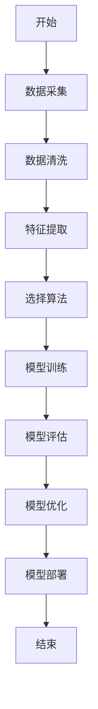
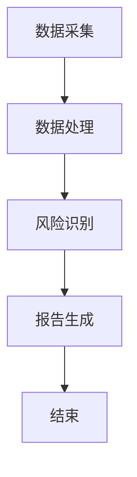
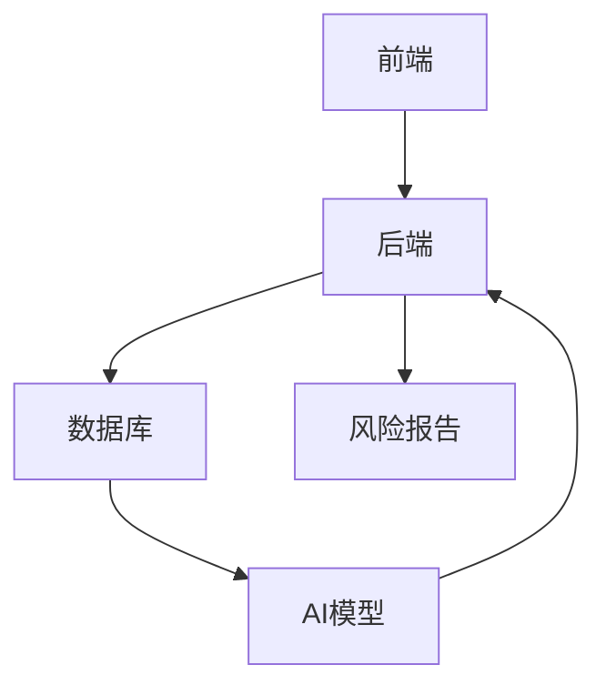
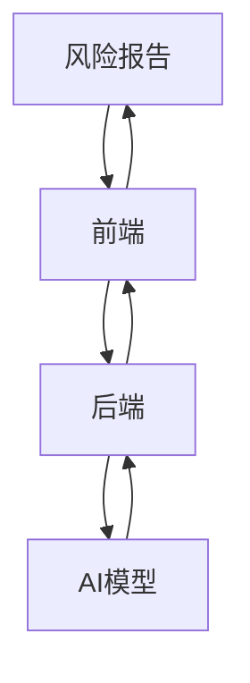

                 


# 构建智能企业合规管理平台：AI辅助风险识别

## 关键词
企业合规管理，人工智能，风险识别，系统架构，Python实现，机器学习

## 摘要
随着企业规模的不断扩大和全球化进程的加速，合规管理成为企业运营中的核心问题。本文将探讨如何利用人工智能技术构建智能企业合规管理平台，通过AI辅助风险识别，帮助企业有效管理和降低经营风险。文章详细介绍了企业合规管理的基本概念、AI技术在合规管理中的应用、构建智能合规管理平台的意义，以及相关的系统设计和实现方案。通过本文，读者可以深入了解如何利用AI技术提升企业合规管理的效率和准确性。

---

## 第一部分: 企业合规管理与AI技术概述

### 第1章: 企业合规管理概述

#### 1.1 企业合规管理的基本概念
企业合规管理是指企业在经营过程中，依据相关法律法规、行业标准和企业内部规章制度，对自身行为进行规范和监督，以确保企业合法合规经营的过程。合规管理的核心在于防范法律风险、经营风险和道德风险。

- **合规管理的定义**：合规管理是企业为了确保其行为符合相关法律法规和行业标准而采取的一系列措施。
- **合规管理的核心要素**：
  1. 法律法规的遵循
  2. 风险评估与控制
  3. 内部监督与审计
  4. 员工培训与意识提升

- **合规管理的边界与外延**：合规管理不仅包括企业的外部行为，还包括内部流程、员工行为等。其外延涉及法律、财务、税务、反腐败、数据隐私等多个领域。

#### 1.2 企业合规管理的背景与挑战
随着全球化和数字化的快速发展，企业面临的合规风险日益复杂。企业需要应对的法律法规越来越多，合规管理的难度也越来越大。

- **当前企业合规管理的现状**：
  1. 合规管理日益受到企业重视
  2. 合规管理的范围不断扩大
  3. 合规管理的技术手段逐步多样化

- **合规管理中的主要问题**：
  1. 数据量大，难以高效处理
  2. 合规要求复杂，难以全面覆盖
  3. 人工审核效率低，容易出错
  4. 数据隐私和安全风险

- **企业合规管理的痛点与难点**：
  - 数据分散，难以统一管理
  - 合规要求更新快，难以及时响应
  - 人工审核成本高，效率低

#### 1.3 AI技术在企业合规管理中的作用
人工智能技术的快速发展为企业合规管理提供了新的解决方案。

- **AI技术的基本概念**：人工智能是指计算机系统能够执行类似于人类智能的任务，如学习、推理、识别和决策等。
- **AI在合规管理中的应用场景**：
  1. 风险识别与评估
  2. 自动化合规审查
  3. 数据隐私保护
  4. 反洗钱（AML）和反腐败（CTR）监控
- **AI辅助合规管理的优势与劣势**：
  - **优势**：
    1. 高效性：AI能够快速处理大量数据，提高合规审查效率
    2. 准确性：AI算法能够识别潜在风险，降低人为错误
    3. 实时性：AI可以实时监控企业行为，及时发现违规行为
  - **劣势**：
    1. 技术复杂性：AI系统需要大量的数据和技术支持
    2. 成本高：AI系统的开发和维护成本较高
    3. 法律风险：AI系统的误判可能导致法律纠纷

---

### 第2章: AI辅助风险识别的核心概念

#### 2.1 风险识别的基本原理
风险识别是合规管理中的关键步骤，通过识别潜在风险，企业可以采取相应的措施进行防范。

- **风险识别的定义**：风险识别是指识别潜在的法律、财务、操作和声誉风险的过程。
- **风险识别的关键步骤**：
  1. 数据采集：收集与企业经营相关的数据，包括合同、财务数据、员工行为数据等
  2. 数据预处理：清洗数据，去除噪声，确保数据质量
  3. 风险评估：通过数据分析和模型预测，识别潜在风险
  4. 风险分类：根据风险的性质和严重程度进行分类

- **风险识别的分类与特征**：
  1. 按风险类型分类：法律风险、财务风险、操作风险、声誉风险
  2. 按风险来源分类：内部风险、外部风险
  3. 风险特征：潜在性、不确定性、可量化性

#### 2.2 AI辅助风险识别的原理
AI技术可以通过机器学习算法，从大量数据中学习模式，识别潜在风险。

- **数据采集与处理**：
  - 数据源：企业内部数据（如财务数据、合同、员工行为数据）和外部数据（如法律法规、市场数据）
  - 数据清洗：去除无效数据，填补缺失值，标准化数据
  - 数据特征提取：提取与风险相关的特征，如合同金额、交易频率、员工行为模式等

- **风险识别模型的构建**：
  - 选择算法：根据数据类型和风险特征选择合适的算法，如决策树、随机森林、神经网络等
  - 模型训练：使用训练数据对模型进行训练，调整模型参数
  - 模型评估：通过测试数据评估模型的准确率、召回率、F1分数等指标

- **模型的训练与优化**：
  - 超参数调优：通过网格搜索等方法优化模型参数
  - 模型集成：通过集成学习（如投票、堆叠）提高模型性能
  - 模型部署：将训练好的模型部署到生产环境，实时监控风险

---

#### 2.3 AI辅助风险识别的流程图



---

## 第三部分: AI辅助风险识别的算法原理

### 第3章: 基于机器学习的AI辅助风险识别

#### 3.1 基于规则的AI算法
- **基于规则的算法**：通过预定义的规则进行风险识别，如检查合同金额是否超过某个阈值。
- **优缺点**：
  - 优点：简单易懂，规则明确
  - 缺点：难以应对复杂和动态变化的合规要求

#### 3.2 基于统计学习的AI算法
- **统计学习算法**：如逻辑回归、随机森林等，通过统计分析识别风险。
- **优缺点**：
  - 优点：能够处理非线性关系，适合复杂数据
  - 缺点：需要大量数据支持，模型解释性较差

#### 3.3 基于深度学习的AI算法
- **深度学习算法**：如神经网络、LSTM等，能够处理复杂和非结构化的数据。
- **优缺点**：
  - 优点：能够处理复杂模式，适合自然语言处理和图像识别等任务
  - 缺点：需要大量数据和计算资源，模型解释性较差

---

## 第四部分: 系统分析与架构设计

### 第4章: 智能合规管理平台系统架构

#### 4.1 系统功能设计
- **功能模块**：
  1. 数据采集模块：负责采集企业内部和外部数据
  2. 数据处理模块：对数据进行清洗和特征提取
  3. 风险识别模块：基于机器学习算法识别潜在风险
  4. 报告生成模块：生成风险报告和合规建议

- **系统功能流程图**



#### 4.2 系统架构设计
- **系统架构**：
  1. 前端架构：采用React框架，提供用户友好的界面
  2. 后端架构：采用Spring Boot框架，提供API接口
  3. 数据库设计：采用关系型数据库（如MySQL）和非关系型数据库（如MongoDB）结合

- **系统架构图**



#### 4.3 系统接口设计
- **主要接口**：
  1. 数据采集接口：用于采集企业数据
  2. 风险识别接口：用于调用AI模型进行风险识别
  3. 报告生成接口：用于生成风险报告

#### 4.4 系统交互流程图



---

## 第五部分: 项目实战

### 第5章: 实战篇

#### 5.1 环境安装与配置
- **安装Python**：安装Python 3.8以上版本
- **安装依赖库**：安装numpy、pandas、scikit-learn、tensorflow等库
  ```bash
  pip install numpy pandas scikit-learn tensorflow
  ```

#### 5.2 系统核心实现
- **数据处理代码**：
  ```python
  import pandas as pd
  import numpy as np

  # 数据加载
  data = pd.read_csv('data.csv')
  # 数据清洗
  data.dropna(inplace=True)
  # 特征提取
  features = data[['合同金额', '交易频率', '员工行为模式']]
  labels = data['风险标签']
  ```

- **模型训练代码**：
  ```python
  from sklearn.ensemble import RandomForestClassifier
  from sklearn.model_selection import train_test_split

  # 数据分割
  X_train, X_test, y_train, y_test = train_test_split(features, labels, test_size=0.2)
  # 模型训练
  model = RandomForestClassifier()
  model.fit(X_train, y_train)
  # 模型评估
  accuracy = model.score(X_test, y_test)
  print(f'模型准确率：{accuracy}')
  ```

- **风险识别代码**：
  ```python
  import joblib
  # 模型保存
  joblib.dump(model, 'risk_model.pkl')
  # 风险识别
  new_data = pd.read_csv('new_data.csv')
  new_features = new_data[['合同金额', '交易频率', '员工行为模式']]
  predictions = model.predict(new_features)
  print(f'预测结果：{predictions}')
  ```

#### 5.3 实际案例分析
- **案例背景**：某企业存在合同金额异常的情况，需要识别潜在的财务风险。
- **数据分析**：通过数据分析发现，部分合同金额远高于行业平均水平，可能存在虚增收入的风险。
- **风险识别**：AI模型识别出异常合同，并生成风险报告。
- **合规建议**：企业应加强合同管理，完善内部审计机制，防止财务造假。

#### 5.4 项目总结
- **项目成果**：
  1. 实现了AI辅助风险识别功能
  2. 提高了合规管理的效率和准确性
  3. 降低了企业的经营风险

---

## 第六部分: 最佳实践与拓展

### 第6章: 最佳实践与小结

#### 6.1 最佳实践
- **数据质量管理**：确保数据的准确性和完整性
- **模型优化**：定期更新模型，提高模型的准确率
- **系统安全**：加强系统安全防护，防止数据泄露
- **员工培训**：加强对员工的合规培训，提高员工的合规意识

#### 6.2 小结
通过本文的介绍，读者可以了解到如何利用AI技术构建智能企业合规管理平台，实现AI辅助风险识别。本文详细讲解了企业合规管理的基本概念、AI技术的应用、系统设计和实现方案，并通过实际案例展示了AI辅助风险识别的应用场景和效果。

#### 6.3 注意事项
- **数据隐私**：在处理数据时，必须遵守数据隐私保护相关法律法规
- **模型解释性**：在选择模型时，应考虑模型的解释性，避免误判
- **系统维护**：定期维护系统，确保系统的稳定性和安全性

#### 6.4 拓展阅读
- **推荐书籍**：
  1. 《机器学习实战》
  2. 《Python机器学习》
  3. 《企业合规管理实务》
- **推荐课程**：
  1. 机器学习基础
  2. Python编程
  3. 合规管理与风险控制

---

## 作者：AI天才研究院/AI Genius Institute & 禅与计算机程序设计艺术 /Zen And The Art of Computer Programming

---

这篇文章详细介绍了如何利用AI技术构建智能企业合规管理平台，从理论到实践，从系统设计到项目实现，为读者提供了全面的指导。通过本文的学习，读者可以掌握AI辅助风险识别的核心技术，提升企业的合规管理能力。

