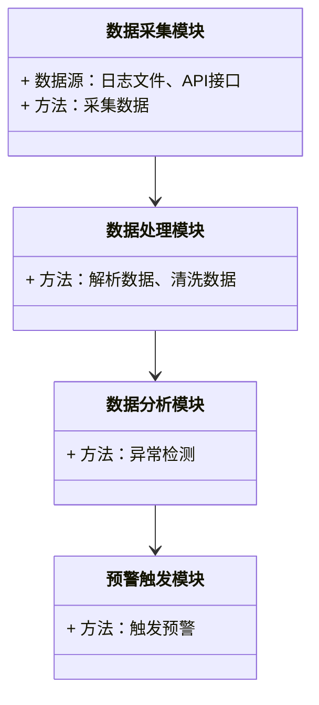
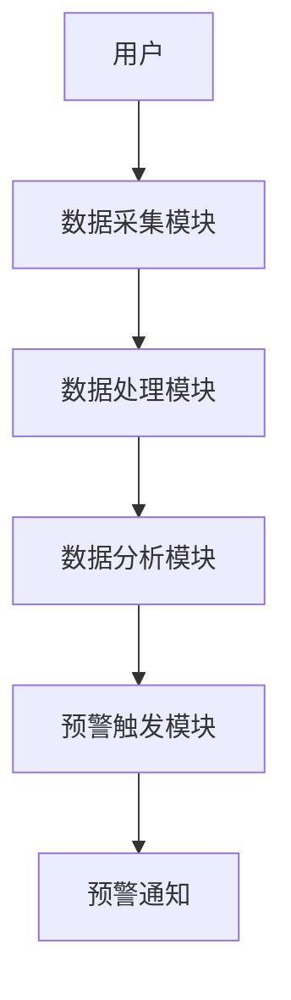

                 


# 构建智能企业合规管理系统：实时监控与预警机制

## 关键词：智能合规管理，实时监控，预警机制，企业风险管理，数据流处理，异常检测

## 摘要：  
在数字化转型的背景下，企业合规管理面临着前所未有的挑战。为了提高合规效率、降低风险，智能企业合规管理系统应运而生。本文详细探讨了构建智能企业合规管理系统的必要性，介绍了实时监控与预警机制的核心概念、算法原理、系统架构设计以及项目实战，最后总结了最佳实践和未来发展方向。

---

# 第1章：企业合规管理的背景与挑战

## 1.1 合规管理的定义与重要性

### 1.1.1 合规管理的定义  
合规管理是指企业按照相关法律法规、行业标准和内部规章制度，确保业务操作合法、合规的过程。它是企业风险管理的重要组成部分，涵盖了数据安全、隐私保护、反腐败、反洗钱等多个方面。

### 1.1.2 企业合规管理的重要性  
合规管理不仅是企业合法经营的基础，也是提升企业信誉和竞争力的关键。通过合规管理，企业可以有效规避法律风险，减少经济损失，同时增强客户信任和品牌价值。

### 1.1.3 合规管理的核心要素  
合规管理的核心要素包括：  
1. **政策与制度**：制定符合法律法规的内部政策和操作流程。  
2. **组织架构**：设立专门的合规管理部门，明确职责分工。  
3. **监控与审计**：通过监控和审计发现和纠正违规行为。  
4. **培训与教育**：定期对员工进行合规培训，提高全员合规意识。  

---

## 1.2 企业合规管理的现状与挑战

### 1.2.1 传统合规管理的局限性  
传统合规管理主要依赖人工检查和事后审计，存在效率低、成本高、覆盖面窄等问题。例如，企业可能无法及时发现和处理潜在的违规行为，导致风险积累和损失扩大。

### 1.2.2 数字化时代的合规管理挑战  
随着企业数字化转型的推进，数据量激增，业务复杂度上升，合规管理的难度也随之增加。例如，数据隐私保护、跨境数据流动、第三方风险管理等都给企业合规管理带来了新的挑战。

### 1.2.3 实时监控与预警机制的必要性  
为了应对数字化时代的合规管理挑战，企业需要引入实时监控与预警机制，通过技术手段实现对关键业务流程的实时监测，快速识别和处理违规行为。

---

## 1.3 智能企业合规管理系统的意义

### 1.3.1 提高合规管理效率  
智能企业合规管理系统通过自动化监控和预警，大幅提高了合规管理的效率，减少了人工干预和重复劳动。

### 1.3.2 降低合规风险  
实时监控与预警机制能够及时发现和处理潜在的违规行为，有效降低企业的合规风险。

### 1.3.3 企业数字化转型的助力  
智能企业合规管理系统不仅帮助企业应对数字化转型带来的挑战，还为其提供了数据驱动的决策支持，助力企业实现高效、合规的数字化运营。

---

# 第2章：实时监控与预警机制的核心概念

## 2.1 实时监控的定义与实现

### 2.1.1 实时监控的定义  
实时监控是指通过技术手段，对企业的关键业务流程、数据和行为进行实时监测，及时发现异常或违规行为。

### 2.1.2 实时监控的主要技术  
实时监控的主要技术包括：  
1. **数据流处理**：实时采集和处理业务数据流。  
2. **异常检测**：通过算法识别数据中的异常模式。  
3. **事件触发**：当检测到异常时，触发相应的预警或处理机制。  

### 2.1.3 实时监控与企业合规管理的关系  
实时监控是企业合规管理的重要组成部分，它通过实时监测企业的各项业务活动，确保所有操作符合相关法规和内部政策。

---

## 2.2 预警机制的原理与实现

### 2.2.1 预警机制的定义  
预警机制是指在实时监控的基础上，根据设定的阈值和规则，对潜在风险进行预警，并采取相应的应对措施。

### 2.2.2 预警机制的实现步骤  
1. **设定阈值**：根据企业的合规要求，设定各项指标的预警阈值。  
2. **异常检测**：通过算法实时检测数据中的异常值。  
3. **触发预警**：当检测到异常时，向相关人员发送预警通知。  

### 2.2.3 预警机制与企业合规管理的结合  
预警机制能够将合规管理从传统的被动响应转变为主动预防，帮助企业及时应对潜在风险，降低违规的可能性。

---

## 2.3 合规管理与实时监控的关联

### 2.3.1 合规管理的实时性要求  
合规管理不仅需要事前预防，还需要实时监测和动态调整，以应对不断变化的法规和市场环境。

### 2.3.2 实时监控在合规管理中的作用  
实时监控能够帮助企业快速发现和处理违规行为，确保所有业务操作始终符合合规要求。

### 2.3.3 预警机制在合规管理中的应用  
通过预警机制，企业可以提前识别潜在风险，采取措施进行干预，避免违规行为的发生。

---

# 第3章：实时监控与预警机制的算法原理

## 3.1 数据流处理算法

### 3.1.1 数据流处理的基本原理  
数据流处理是指对实时数据流进行采集、解析和处理的过程。其核心是高效地处理大规模数据流，确保实时监控的准确性。

### 3.1.2 数据流处理的实现步骤  
1. **数据采集**：通过API或日志采集实时数据。  
2. **数据解析**：对采集到的数据进行解析和结构化处理。  
3. **数据存储**：将处理后的数据存储到数据库中，供后续分析使用。  

### 3.1.3 数据流处理的优化方法  
1. **流式处理框架**：使用Flink、Kafka等流式处理框架，提高数据处理的效率。  
2. **分布式计算**：采用分布式计算技术，提升数据处理能力。  

---

## 3.2 异常检测算法

### 3.2.1 异常检测的定义与分类  
异常检测是指通过算法识别数据中的异常值或异常模式。常见的异常检测方法包括基于统计的方法和基于机器学习的方法。

### 3.2.2 基于统计的异常检测算法  
- **Z-score方法**：通过计算数据点与均值的偏离程度来判断异常值。  
- **IQR方法**：基于四分位数的异常检测方法。  

### 3.2.3 基于机器学习的异常检测算法  
- **孤立森林（Isolation Forest）**：一种基于树结构的异常检测算法。  
- **自动编码器（Autoencoder）**：通过训练模型重构数据，识别异常点。  

---

## 3.3 预警触发机制

### 3.3.1 预警触发的条件设定  
根据企业的合规要求，设定各项指标的预警阈值。例如，当某个业务指标的异常率超过阈值时，触发预警。

### 3.3.2 预警触发的实现逻辑  
1. **异常检测**：通过算法检测数据中的异常值。  
2. **阈值判断**：将检测到的异常值与设定的阈值进行比较。  
3. **触发预警**：当异常值超过阈值时，向相关人员发送预警通知。  

### 3.3.3 预警触发的优化策略  
1. **动态阈值调整**：根据历史数据和业务变化，动态调整预警阈值。  
2. **多维度预警**：从多个维度进行预警，避免漏报或误报。  

---

# 第4章：系统架构设计

## 4.1 系统模块划分

### 4.1.1 数据采集模块  
负责实时采集企业的业务数据，包括日志、交易记录等。

### 4.1.2 数据处理模块  
对采集到的数据进行解析、清洗和结构化处理，为后续分析提供数据支持。

### 4.1.3 数据分析模块  
利用异常检测算法对处理后的数据进行分析，识别潜在的异常或违规行为。

### 4.1.4 预警触发模块  
根据分析结果，触发相应的预警机制，并将预警信息发送给相关人员。

---

## 4.2 系统架构设计

### 4.2.1 领域模型类图  


### 4.2.2 系统架构图  


---

## 4.3 系统接口设计

### 4.3.1 数据采集接口  
- **输入**：数据源（日志文件、API接口）  
- **输出**：结构化数据  

### 4.3.2 异常检测接口  
- **输入**：结构化数据  
- **输出**：异常检测结果  

---

# 第5章：项目实战

## 5.1 环境安装

### 5.1.1 安装Python环境  
```bash
python --version
pip install --upgrade pip
```

### 5.1.2 安装依赖库  
```bash
pip install numpy pandas scikit-learn pyflink
```

---

## 5.2 核心代码实现

### 5.2.1 数据采集模块  
```python
import pyflink
from pyflink.datastream import StreamExecutionEnvironment
from pyflink.table import TableConfig, Schema, DataTypes

env = StreamExecutionEnvironment.get_execution_environment()
env.set_parallelism(1)

# 定义数据源
source = env.add_source(...)

# 定义数据处理逻辑
# (略去具体实现)
```

### 5.2.2 数据分析模块  
```python
from sklearn.ensemble import IsolationForest

# 初始化孤立森林模型
model = IsolationForest(n_estimators=100, random_state=42)

# 训练模型
model.fit(X_train)

# 预测异常值
y_pred = model.predict(X_test)
```

### 5.2.3 预警触发模块  
```python
import logging

def trigger_alarm(threshold, anomaly_score):
    if anomaly_score > threshold:
        logging.info("触发预警：异常值超过阈值")
    else:
        logging.info("未触发预警")

trigger_alarm(0.95, 0.96)
```

---

## 5.3 案例分析

### 5.3.1 案例背景  
某企业发现其财务数据中存在异常交易，可能涉及 fraudulent activities。

### 5.3.2 数据分析  
通过孤立森林算法检测出异常交易记录。

### 5.3.3 预警触发  
系统自动触发预警，并通知财务部门进行进一步调查。

---

## 5.4 项目总结

通过本项目，我们成功实现了智能企业合规管理系统的实时监控与预警机制。系统能够高效地采集、处理和分析数据，并在检测到异常时及时触发预警，帮助企业在数字化转型中更好地应对合规挑战。

---

# 第6章：总结与展望

## 6.1 最佳实践 tips

1. **数据质量**：确保数据的准确性和完整性，避免因数据问题导致误报或漏报。  
2. **模型优化**：定期更新和优化异常检测模型，提高预警的准确率。  
3. **人员培训**：加强相关人员的培训，确保能够正确理解和处理预警信息。  

## 6.2 小结  
智能企业合规管理系统通过实时监控与预警机制，帮助企业实现了合规管理的自动化和智能化，有效降低了合规风险，提高了管理效率。

## 6.3 注意事项  
1. 遵守相关法律法规，确保系统的合规性。  
2. 加强数据安全保护，防止数据泄露和滥用。  
3. 定期进行系统维护和升级，确保系统的稳定运行。  

## 6.4 拓展阅读  
1. 《大数据安全与隐私保护》  
2. 《机器学习在金融领域的应用》  
3. 《企业风险管理与内部控制》  

---

# 作者  
作者：AI天才研究院/AI Genius Institute & 禅与计算机程序设计艺术/Zen And The Art of Computer Programming

