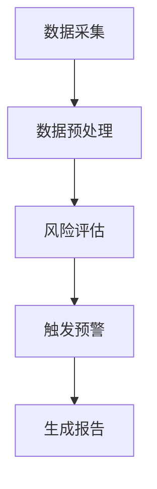
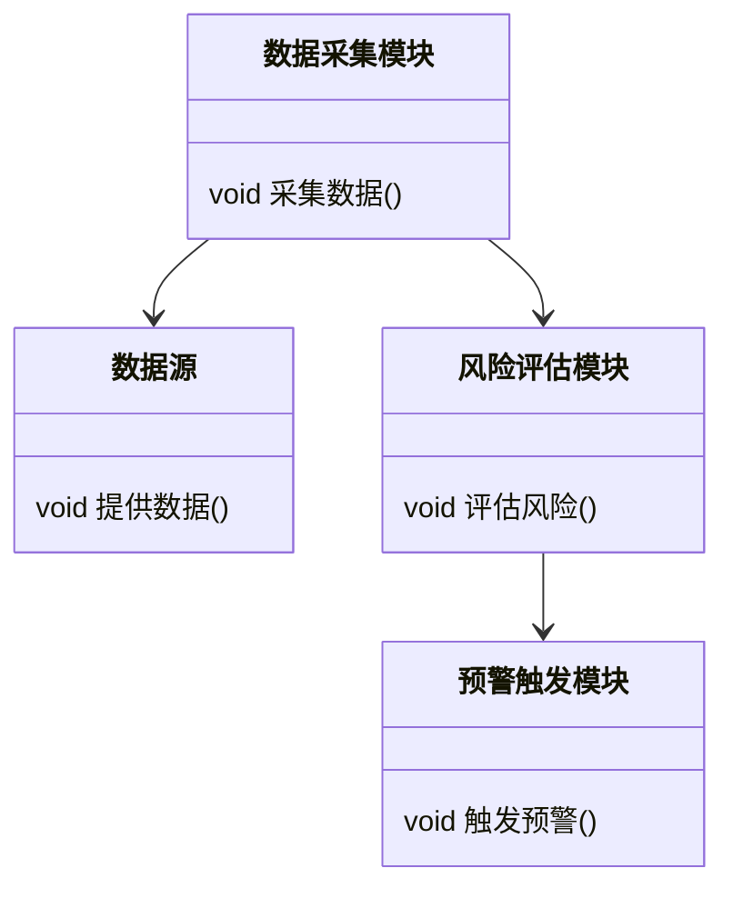
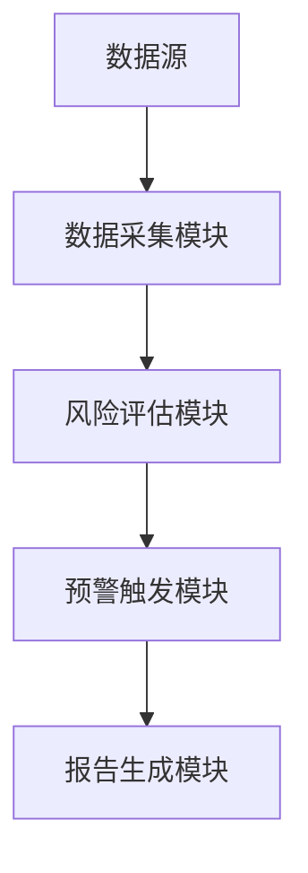
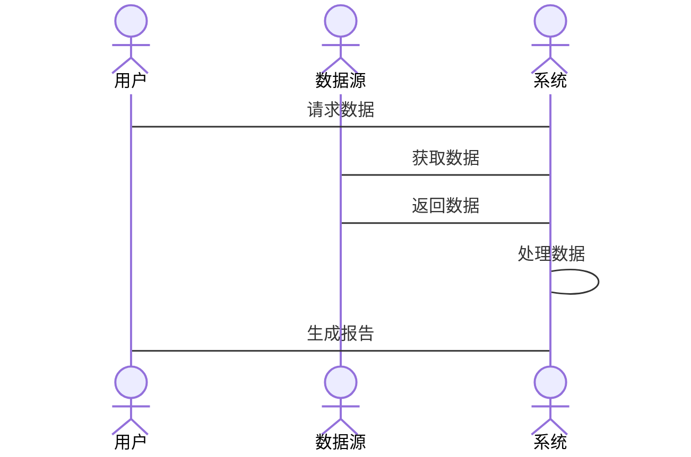

                 


# 第三章: 实时监控与预警机制的算法原理

## 3.1 实时监控的算法流程
### 3.1.1 数据采集与处理
### 3.1.2 数据分析与风险评估
### 3.1.3 风险预警触发

## 3.2 预警机制的数学模型
### 3.2.1 风险评分模型
$$ R = \sum_{i=1}^{n} w_i \cdot x_i $$
### 3.2.2 预警阈值设定
$$ T = \alpha \cdot \text{max}(R) + (1-\alpha) \cdot \text{min}(R) $$$

## 3.3 算法流程图


## 3.4 本章小结

# 第四章: 系统分析与架构设计方案

## 4.1 问题场景介绍
### 4.1.1 数据采集问题
### 4.1.2 风险评估准确性
### 4.1.3 预警机制的有效性

## 4.2 系统功能设计
### 4.2.1 数据采集模块
### 4.2.2 风险评估模块
### 4.2.3 预警触发模块
### 4.2.4 报告生成模块

## 4.3 领域模型类图


## 4.4 系统架构设计
### 4.4.1 分层架构
### 4.4.2 微服务架构
### 4.4.3 可扩展性设计

## 4.5 系统架构图


## 4.6 系统接口设计
### 4.6.1 数据接口
### 4.6.2 风险评估接口
### 4.6.3 预警触发接口

## 4.7 系统交互序列图


## 4.8 本章小结

# 第五章: 项目实战

## 5.1 环境安装与配置
### 5.1.1 安装Python
### 5.1.2 安装依赖库
### 5.1.3 配置开发环境

## 5.2 系统核心实现
### 5.2.1 数据采集模块实现
```python
def collect_data():
    # 数据采集逻辑
    pass
```
### 5.2.2 风险评估模块实现
```python
def assess_risk():
    # 风险评估逻辑
    pass
```
### 5.2.3 预警触发模块实现
```python
def trigger_alarm():
    # 预警触发逻辑
    pass
```

## 5.3 代码应用解读与分析
### 5.3.1 数据处理流程
### 5.3.2 风险评估算法
### 5.3.3 预警机制实现

## 5.4 实际案例分析
### 5.4.1 案例背景
### 5.4.2 数据分析过程
### 5.4.3 预警触发与处理

## 5.5 项目小结
### 5.5.1 项目成果
### 5.5.2 经验总结
### 5.5.3 改进方向

## 5.6 本章小结

# 第六章: 最佳实践与注意事项

## 6.1 小结
### 6.1.1 核心内容回顾
### 6.1.2 关键点总结

## 6.2 注意事项
### 6.2.1 数据安全
### 6.2.2 系统稳定性
### 6.2.3 风险评估准确性

## 6.3 拓展阅读
### 6.3.1 合规管理相关书籍
### 6.3.2 实时监控技术资料
### 6.3.3 预警机制研究论文

## 6.4 本章小结

# 附录: 参考文献与工具清单

## 附录A: 参考文献
### 1. 书籍
### 2. 论文
### 3. 网站资源

## 附录B: 工具清单
### 1. 开发工具
### 2. 依赖管理工具
### 3. 测试工具

## 附录C: 代码仓库地址

# 结束语: 致谢

---

作者：AI天才研究院/AI Genius Institute & 禅与计算机程序设计艺术 /Zen And The Art of Computer Programming

