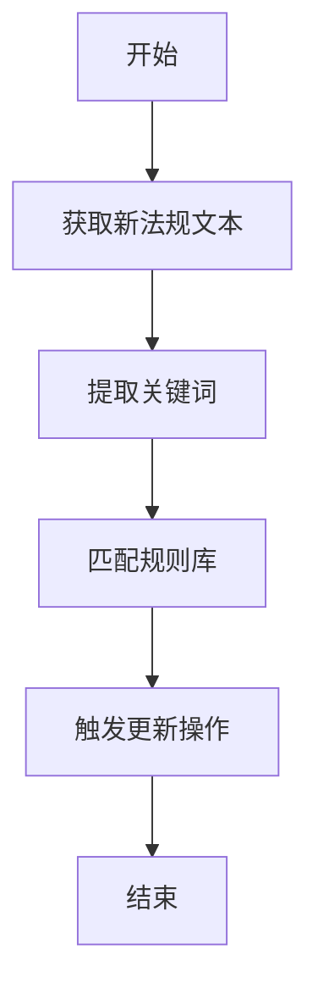
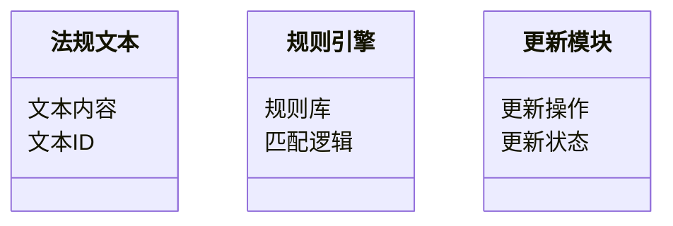
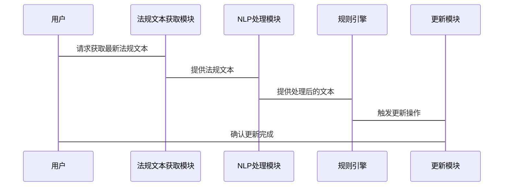

                 


# 构建智能企业合规管理系统：法规变更追踪与自动化更新

**关键词：** 企业合规管理，法规变更，智能系统，自然语言处理，规则引擎，自动化更新

**摘要：** 本文详细探讨了构建智能企业合规管理系统的必要性与技术实现。通过分析法规变更对企业的影响，介绍了基于NLP和规则引擎的自动化更新技术，展示了系统设计与实现，并提供了实际案例以验证系统的有效性。

---

## 第一部分：企业合规管理的背景与挑战

### 第1章：企业合规管理的背景与问题背景

#### 1.1 合规管理的核心概念

合规管理是确保企业行为符合相关法律法规和行业标准的系统性工作。随着法律法规的不断变化，传统的人工合规管理方式效率低下，容易出现疏漏。

**1.1.1 合规管理的定义与内涵**

合规管理指的是企业通过建立制度、流程和机制，确保其经营行为符合相关法律法规和监管要求。其内涵包括制度建设、风险评估、监控执行等多个方面。

**1.1.2 企业合规管理的重要性**

合规管理是企业合法经营的基础，直接影响企业的声誉、法律责任和经营成本。良好的合规管理有助于企业规避法律风险，提升市场竞争力。

**1.1.3 合规管理的边界与外延**

合规管理的边界在于企业内部制度与外部法律法规的结合，外延则包括从具体业务领域的合规到整体企业治理的合规。

#### 1.2 法规变更的挑战

**1.2.1 法规变更的复杂性**

法律法规的变更频率高、内容复杂，往往涉及多个领域，对企业的影响深远。企业需要及时识别和响应这些变化，否则可能导致合规失败。

**1.2.2 企业合规管理的痛点**

传统合规管理依赖人工处理，效率低、成本高，难以应对频繁的法规变更。同时，人工处理容易出现疏漏，导致合规风险。

**1.2.3 法规变更对企业的影响**

法规变更可能影响企业的业务模式、运营流程和财务报告。未能及时适应变更可能导致罚款、诉讼甚至业务中断。

### 第2章：智能企业合规管理的核心概念

#### 2.1 智能企业合规管理的定义

智能合规管理是利用人工智能技术，通过自动化手段实现对法规变更的实时追踪和更新，确保企业行为始终符合相关法律法规。

**2.1.1 智能合规管理的特征**

- **自动化**：系统自动获取、分析和更新法规内容。
- **智能化**：利用AI技术进行智能匹配和推送。
- **实时性**：及时响应法规变化，减少合规风险。

#### 2.2 智能合规管理与传统合规管理的对比

**2.2.1 核心概念的对比分析**

| 特性        | 传统合规管理              | 智能合规管理              |
|-------------|---------------------------|---------------------------|
| 处理方式     | 人工为主                  | 自动化与智能化结合         |
| 效率         | 较低                      | 高                        |
| 成本         | 高                        | 低                        |
| 响应时间     | 较长                      | 短                        |

**2.2.2 优缺点分析**

智能合规管理的优势在于高效、精准和低成本，但其依赖于技术实现，可能面临数据隐私和系统稳定性等问题。

---

## 第二部分：智能企业合规管理的技术基础

### 第3章：法规变更追踪的技术基础

#### 3.1 自然语言处理（NLP）技术

**3.1.1 NLP在法规文本分析中的应用**

自然语言处理技术用于解析法规文本的语义，提取关键信息。例如，使用分词技术将法规文本分解为关键词，便于后续处理。

**3.1.2 常见的NLP技术与工具**

- **分词工具**：如jieba，用于中文分词。
- **实体识别**：识别法规文本中的实体，如人名、组织名等。
- **句法分析**：理解句子结构，帮助解析法规内容。

#### 3.2 规则引擎与自动化技术

**3.2.1 规则引擎的原理与应用**

规则引擎通过预定义的规则匹配输入数据，触发相应的操作。在合规管理中，规则引擎用于匹配法规变更与企业业务的关联性。

**3.2.2 自动化更新的实现机制**

自动化更新基于规则引擎，当检测到法规变更时，系统自动触发更新流程，确保企业行为符合新法规。

### 第4章：法规变更追踪的算法原理

#### 4.1 基于NLP的法规文本相似度计算

**4.1.1 文本相似度计算的数学模型**

余弦相似度是一种常用的文本相似度计算方法，公式如下：

$$ \text{余弦相似度} = \frac{\vec{A} \cdot \vec{B}}{|\vec{A}| |\vec{B}|} $$

其中，$\vec{A}$和$\vec{B}$分别表示两个文本的向量表示。

**4.1.2 使用余弦相似度的计算公式**

例如，文本A和文本B的相似度计算如下：

$$ \text{相似度} = \frac{2 + 3 + 4}{\sqrt{2^2 + 3^2 + 4^2} \times \sqrt{5^2 + 6^2 + 7^2}} $$

#### 4.2 基于规则引擎的自动化更新算法

**4.2.1 规则匹配的条件判断逻辑**

规则引擎通过预定义的规则匹配输入数据，触发相应的操作。例如，当检测到某法规变更时，系统自动触发更新操作。

**4.2.2 算法流程图**

使用Mermaid绘制的流程图如下：



---

## 第三部分：智能企业合规管理系统的架构设计

### 第5章：系统功能设计

#### 5.1 领域模型设计

**5.1.1 实体关系图**

使用Mermaid绘制的类图如下：



### 第6章：系统架构设计

#### 6.1 系统架构图

使用Mermaid绘制的系统架构图如下：


### 第7章：系统接口设计

#### 7.1 接口设计

系统提供以下接口：

- **获取法规文本接口**：从指定来源获取最新法规文本。
- **NLP处理接口**：对法规文本进行分词、实体识别等处理。
- **规则匹配接口**：将处理后的文本与规则库进行匹配，触发更新操作。

### 第8章：系统交互设计

#### 8.1 交互流程图

使用Mermaid绘制的序列图如下：



---

## 第四部分：项目实战

### 第9章：环境安装与配置

#### 9.1 环境要求

- 操作系统：Windows 10或更高版本，或Linux系统。
- Python版本：3.6或更高版本。
- 安装必要的库：jieba、spaCy、flask等。

### 第10章：核心功能实现

#### 10.1 NLP文本处理实现

```python
import jieba

def process_regulation(text):
    words = jieba.lcut(text)
    return words
```

#### 10.2 规则引擎实现

```python
from flask import Flask

app = Flask(__name__)

@app.route('/update', methods=['POST'])
def update_rule():
    # 处理更新逻辑
    return 'Update completed'
```

### 第11章：系统测试与优化

#### 11.1 功能测试

- 测试法规文本获取是否成功。
- 测试NLP处理是否准确。
- 测试规则匹配是否触发更新操作。

#### 11.2 性能优化

- 使用缓存技术优化NLP处理速度。
- 优化规则引擎的匹配效率。

### 第12章：案例分析与解读

#### 12.1 实际案例分析

分析某企业合规管理系统的实际应用，展示系统如何处理法规变更。

#### 12.2 代码实现解读

解读核心代码的功能和实现逻辑，帮助读者理解系统的工作原理。

---

## 第五部分：总结与扩展

### 第13章：总结与最佳实践

#### 13.1 总结

智能企业合规管理系统通过NLP和规则引擎技术，实现了法规变更的自动化追踪和更新，显著提升了合规管理的效率和准确性。

#### 13.2 最佳实践

- 定期更新规则库，确保系统适应最新的法规变化。
- 结合企业实际需求，定制化系统功能。

### 第14章：注意事项与未来展望

#### 14.1 注意事项

- 数据隐私保护：确保处理的法规文本和企业数据符合隐私保护要求。
- 系统稳定性：确保系统在高并发情况下的稳定性。

#### 14.2 未来展望

未来，随着AI技术的进步，智能合规管理系统将更加智能化和自动化，为企业提供更全面的合规管理支持。

---

## 作者：AI天才研究院/AI Genius Institute & 禅与计算机程序设计艺术/Zen And The Art of Computer Programming

---

通过以上结构，文章详细讲解了构建智能企业合规管理系统的各个方面，从背景分析到技术实现，再到项目实战，为读者提供了全面的知识和实践指导。

