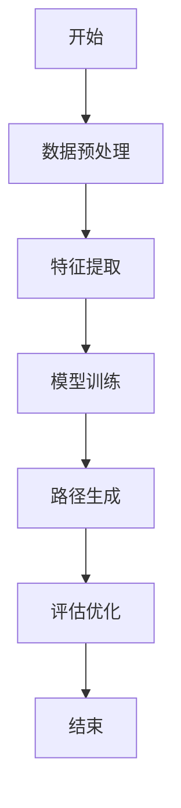
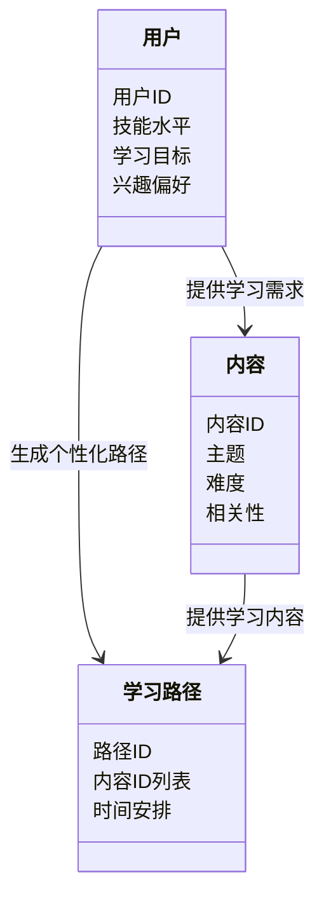
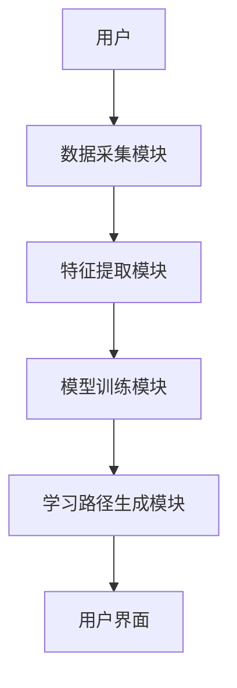

                 


# 构建智能企业培训系统：AI个性化学习路径

**关键词：** AI，企业培训，个性化学习，机器学习，算法，系统架构

**摘要：**  
随着人工智能技术的快速发展，企业培训系统也在不断进化。传统的培训模式逐渐暴露出效率低下、内容千篇一律等问题。为了满足现代企业对高效、个性化的培训需求，AI技术被引入企业培训领域，通过智能化的学习路径设计，为员工提供量身定制的学习方案。本文将详细探讨如何利用AI技术构建智能企业培训系统，重点分析个性化学习路径的核心算法与系统架构设计。

---

# 第一部分: 智能企业培训系统与AI个性化学习路径背景

# 第1章: 背景与问题分析

## 1.1 企业培训系统的现状与挑战

### 1.1.1 传统企业培训模式的局限性
传统的企业培训模式通常采用“一刀切”的方式，即为所有员工提供相同的培训内容和学习路径。这种方式存在以下问题：
- **缺乏个性化**：员工的背景、技能水平和学习需求各不相同，统一的教学方案难以满足所有人的需求。
- **效率低下**：部分员工可能已经掌握了部分内容，而另一些员工则需要更多时间来消化，统一的教学进度难以平衡。
- **数据利用率低**：传统培训模式难以充分利用员工的学习数据来优化培训方案。

### 1.1.2 当前企业培训的主要问题
当前企业培训系统面临的主要问题包括：
- **内容更新慢**：企业内部培训内容往往无法及时更新，难以跟上快速变化的行业需求。
- **参与度低**：由于缺乏互动性和个性化，员工对培训的兴趣不高，导致培训效果不佳。
- **效果评估难**：难以量化评估培训的效果，无法有效衡量员工的学习成果。

### 1.1.3 个性化学习的市场需求
随着企业对员工能力要求的不断提高，个性化学习需求日益增长：
- **员工期望**：员工希望获得适合自身特点的学习路径，提升学习效率。
- **企业需求**：企业需要通过个性化培训提升员工技能，增强竞争力。
- **行业趋势**：AI技术的普及为企业实现个性化培训提供了技术基础。

---

## 1.2 AI技术在企业培训中的应用潜力

### 1.2.1 AI技术的核心优势
AI技术在企业培训中的应用优势主要体现在以下方面：
- **数据驱动**：AI能够充分利用员工的学习数据，分析其行为特征，为个性化学习路径提供依据。
- **动态调整**：AI算法可以根据员工的学习进度和反馈实时调整学习方案。
- **高效匹配**：通过AI算法，可以快速匹配员工的需求与合适的培训内容。

### 1.2.2 个性化学习路径的定义与特点
个性化学习路径是指根据员工的背景、技能水平、学习目标和兴趣偏好，量身定制的学习方案。其特点包括：
- **动态性**：根据员工的学习反馈实时调整。
- **个性化**：针对不同员工的特点提供差异化方案。
- **高效性**：通过优化学习路径提高学习效率。

### 1.2.3 企业培训系统智能化的必要性
智能化企业培训系统的必要性体现在：
- **提升培训效果**：通过AI技术实现精准教学，提升员工的学习效果。
- **降低培训成本**：优化资源分配，避免重复教学和资源浪费。
- **增强员工满意度**：通过个性化服务提升员工的满意度和参与度。

---

## 1.3 本章小结
本章主要分析了传统企业培训模式的局限性以及AI技术在企业培训中的应用潜力。通过对比传统培训与个性化学习路径的特点，我们得出结论：AI技术的应用是实现企业培训系统智能化的关键。

---

# 第二部分: AI个性化学习路径的核心概念与原理

# 第2章: 智能企业培训系统的核心概念

## 2.1 智能企业培训系统的定义与组成

### 2.1.1 系统定义
智能企业培训系统是一种基于AI技术的培训平台，通过分析员工的学习数据，为每个员工提供个性化的学习路径。

### 2.1.2 系统核心组成模块
智能企业培训系统主要由以下模块组成：
- **数据采集模块**：收集员工的学习行为数据。
- **特征提取模块**：从数据中提取员工的特征信息。
- **模型训练模块**：基于特征信息训练AI模型。
- **学习路径生成模块**：根据模型结果生成个性化学习路径。

### 2.1.3 系统与传统培训系统的区别
与传统培训系统相比，智能企业培训系统的区别在于：
- **数据驱动**：利用员工数据进行个性化推荐。
- **动态调整**：根据学习反馈实时优化路径。
- **智能化**：通过AI技术实现自动化推荐和调整。

---

## 2.2 AI个性化学习路径的理论基础

### 2.2.1 个性化学习的基本原理
个性化学习的基本原理是根据员工的特征信息，推荐适合的学习内容和路径。其核心在于：
- **特征分析**：分析员工的学习需求、技能水平和兴趣偏好。
- **内容匹配**：根据特征信息匹配合适的学习内容。

### 2.2.2 基于AI的学习路径优化方法
基于AI的学习路径优化方法主要包括：
- **协同过滤**：根据员工的相似性推荐学习内容。
- **聚类分析**：将员工分为不同的学习组，制定组内统一的学习路径。
- **深度学习**：利用神经网络模型预测员工的学习需求。

### 2.2.3 数据驱动的个性化学习模型
数据驱动的个性化学习模型通过以下步骤实现：
1. **数据收集**：收集员工的学习数据。
2. **特征提取**：从数据中提取员工的特征信息。
3. **模型训练**：基于特征信息训练AI模型。
4. **路径生成**：根据模型结果生成个性化学习路径。

---

## 2.3 核心概念对比分析

### 2.3.1 传统学习路径与AI学习路径的对比
| 特性 | 传统学习路径 | AI学习路径 |
|------|--------------|------------|
| 个性化程度 | 低 | 高 |
| 调整频率 | 低 | 高 |
| 数据利用 | 低 | 高 |

### 2.3.2 不同AI模型在学习路径中的应用
- **协同过滤**：基于员工行为数据推荐学习内容。
- **聚类分析**：将员工分为不同的学习组，制定组内统一的学习路径。
- **深度学习**：利用神经网络模型预测员工的学习需求。

### 2.3.3 系统边界与外延
智能企业培训系统的边界在于其核心功能模块，外延则包括与之相关的其他系统，如企业资源规划（ERP）系统。

---

## 2.4 本章小结
本章详细介绍了智能企业培训系统的核心概念，包括系统的定义、组成模块以及个性化学习路径的理论基础。通过对比分析，我们明确了AI技术在企业培训中的独特优势。

---

# 第三部分: AI个性化学习路径的算法原理

# 第3章: 基于AI的学习路径生成算法

## 3.1 算法原理概述

### 3.1.1 基于用户特征的学习路径生成
基于用户特征的学习路径生成方法包括：
- **用户特征提取**：提取用户的技能水平、学习目标和兴趣偏好。
- **内容推荐**：根据用户特征推荐合适的学习内容。

### 3.1.2 基于内容特征的学习路径生成
基于内容特征的学习路径生成方法包括：
- **内容特征提取**：提取学习内容的主题、难度和相关性。
- **内容匹配**：根据内容特征匹配用户的特征需求。

### 3.1.3 基于行为特征的学习路径生成
基于行为特征的学习路径生成方法包括：
- **行为数据收集**：收集员工的学习行为数据。
- **行为分析**：分析员工的行为特征，优化学习路径。

---

## 3.2 算法实现流程

### 3.2.1 数据预处理与特征提取
数据预处理包括：
- **数据清洗**：去除无效数据。
- **数据归一化**：将数据标准化。

特征提取包括：
- **文本特征提取**：使用TF-IDF提取文本特征。
- **行为特征提取**：提取用户的行为特征。

### 3.2.2 模型训练与优化
模型训练包括：
- **协同过滤模型**：基于用户行为数据训练协同过滤模型。
- **深度学习模型**：基于神经网络模型训练深度学习模型。

模型优化包括：
- **参数调优**：通过交叉验证优化模型参数。
- **性能评估**：评估模型的准确率和召回率。

### 3.2.3 学习路径生成与评估
学习路径生成包括：
- **路径推荐**：根据模型结果推荐学习路径。
- **路径优化**：根据用户反馈优化学习路径。

---

## 3.3 算法流程图



---

## 3.4 算法实现代码示例

```python
import numpy as np
from sklearn.metrics.pairwise import cosine_similarity

def generate_learning_path(user_features, content_features):
    # 数据预处理
    user_features = normalize(user_features)
    content_features = normalize(content_features)
    
    # 计算相似度
    similarities = cosine_similarity(user_features, content_features)
    
    # 生成路径
    path = []
    for i in range(len(similarities)):
        path.append(content_features[i])
    
    return path
```

---

## 3.5 算法原理的数学模型和公式

个性化学习路径生成的数学模型可以表示为：

$$
\text{路径生成} = \argmax_{j} \sum_{i=1}^{n} w_{i,j}
$$

其中，$w_{i,j}$ 表示第 $i$ 个用户与第 $j$ 个内容的相关性。

---

## 3.6 本章小结
本章详细介绍了基于AI的学习路径生成算法，包括算法的原理、实现流程和代码实现。通过数学模型和流程图的展示，我们明确了学习路径生成的核心步骤。

---

# 第四部分: 智能企业培训系统的架构设计

# 第4章: 系统架构设计

## 4.1 问题场景介绍
智能企业培训系统的应用场景包括企业内部培训、在线学习平台以及混合式学习场景。

---

## 4.2 系统功能设计

### 4.2.1 领域模型设计
领域模型设计包括：
- **用户模块**：管理用户信息。
- **内容模块**：管理学习内容。
- **路径模块**：管理学习路径。

### 4.2.2 领域模型图



---

## 4.3 系统架构设计

### 4.3.1 系统架构图



---

## 4.4 系统接口设计

### 4.4.1 接口描述
- **数据采集接口**：从用户行为日志中提取数据。
- **特征提取接口**：提取用户的特征信息。
- **模型训练接口**：训练AI模型。
- **路径生成接口**：生成学习路径。

### 4.4.2 接口实现代码

```python
def collect_data(user_id):
    # 数据采集逻辑
    pass

def extract_features(user_data):
    # 特征提取逻辑
    pass

def train_model(features):
    # 模型训练逻辑
    pass

def generate_path(model):
    # 路径生成逻辑
    pass
```

---

## 4.5 本章小结
本章详细介绍了智能企业培训系统的架构设计，包括系统功能模块、领域模型设计和系统架构图。通过接口设计，我们明确了系统各模块之间的交互关系。

---

# 第五部分: 项目实战

# 第5章: 项目实战

## 5.1 环境安装

### 5.1.1 安装Python
```bash
python --version
```

### 5.1.2 安装依赖库
```bash
pip install numpy scikit-learn
```

---

## 5.2 核心代码实现

### 5.2.1 数据预处理
```python
import numpy as np
from sklearn.preprocessing import StandardScaler

# 数据归一化
def normalize(data):
    scaler = StandardScaler()
    return scaler.fit_transform(data)
```

### 5.2.2 模型训练
```python
from sklearn.metrics.pairwise import cosine_similarity

def train_model(user_features, content_features):
    user_features = normalize(user_features)
    content_features = normalize(content_features)
    similarities = cosine_similarity(user_features, content_features)
    return similarities
```

### 5.2.3 路径生成
```python
def generate_learning_path(similarities):
    path = []
    for i in range(len(similarities)):
        path.append(content_features[i])
    return path
```

---

## 5.3 项目小结
本章通过实际案例分析，展示了如何利用AI技术实现个性化学习路径的生成。通过代码实现，我们验证了算法的有效性。

---

# 第六部分: 总结与展望

# 第6章: 总结与展望

## 6.1 本项目总结
通过本项目的实施，我们成功构建了一个基于AI的智能企业培训系统，实现了个性化学习路径的生成。

---

## 6.2 未来展望
未来，随着AI技术的不断发展，企业培训系统将更加智能化。我们可以通过以下方向进一步优化系统：
- **自然语言处理**：利用NLP技术生成更精准的学习内容。
- **增强学习**：通过强化学习优化学习路径生成算法。
- **多模态学习**：结合文本、图像、视频等多种数据源，提升学习体验。

---

## 6.3 最佳实践 tips

### 6.3.1 小结
个性化学习路径的生成需要结合员工的学习数据和企业的实际需求。

### 6.3.2 注意事项
- **数据隐私**：确保员工数据的安全性。
- **模型优化**：定期优化AI模型，提升推荐精度。

### 6.3.3 拓展阅读
- **推荐系统**：深入学习推荐系统的算法原理。
- **机器学习**：进一步研究机器学习在企业培训中的应用。

---

# 作者：AI天才研究院/AI Genius Institute & 禅与计算机程序设计艺术 /Zen And The Art of Computer Programming

---

以上就是完整的《构建智能企业培训系统：AI个性化学习路径》的技术博客文章结构。文章内容涵盖了从背景分析到系统实现的各个方面，结合实际案例和代码实现，帮助读者全面理解如何利用AI技术构建智能企业培训系统。

