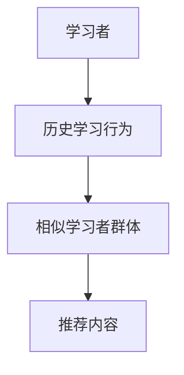
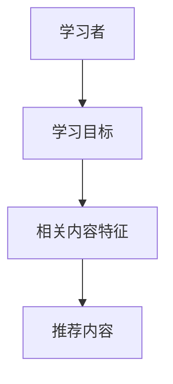
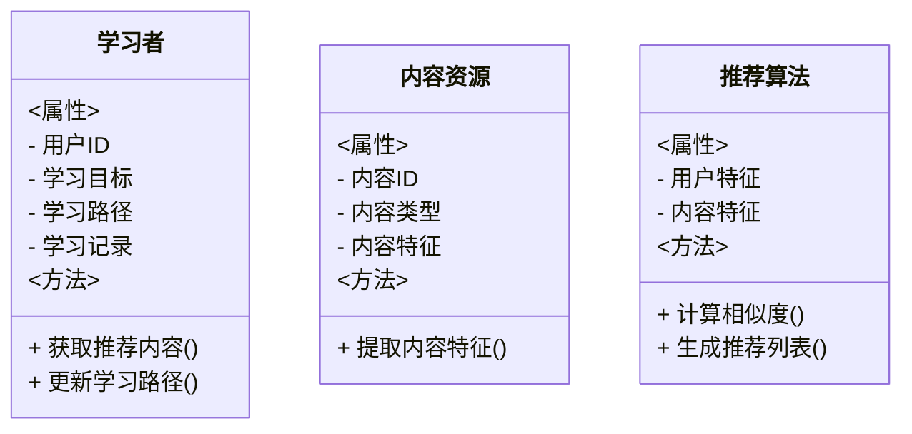
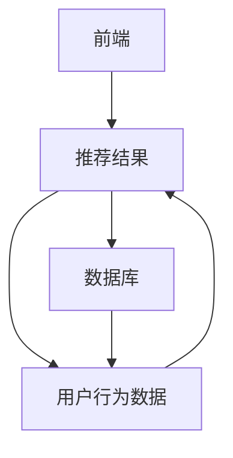

                 


# 构建智能企业培训系统：个性化学习路径与内容推荐

---

## 关键词：个性化学习路径，内容推荐，企业培训系统，推荐算法，系统架构设计，人工智能

---

## 摘要：本文详细探讨了如何利用人工智能技术构建智能企业培训系统，重点分析了个性化学习路径与内容推荐的核心原理、算法实现及系统架构设计。文章从问题背景出发，结合实际案例，深入解读了基于协同过滤和内容推荐的算法原理，并通过系统架构设计展示了如何实现高效的内容推荐与个性化学习路径规划。最后，通过项目实战和最佳实践，为读者提供了一套完整的解决方案。

---

## 第一部分: 智能企业培训系统概述

## 第1章: 个性化学习路径与内容推荐的背景与意义

### 1.1 企业培训系统的现状与挑战

#### 1.1.1 传统企业培训系统的局限性
- **内容单一化**：传统培训系统通常提供固定的课程，难以满足不同员工的学习需求。
- **学习路径固定化**：缺乏对学习者个性化需求的动态调整，导致学习效果不佳。
- **推荐算法简单化**：传统的推荐算法通常基于规则或简单的统计方法，推荐精准度有限。

#### 1.1.2 个性化学习需求的兴起
- **员工职业发展需求多样化**：现代员工的职业目标和学习需求各不相同，需要个性化的学习路径。
- **企业培训资源碎片化**：企业内部的学习资源通常分散在不同的平台或部门，难以有效整合。
- **学习者行为数据的可用性**：通过收集和分析学习者的行为数据，可以更好地理解其学习需求。

#### 1.1.3 智能化培训系统的必要性
- **提高学习效率**：通过智能化推荐，学习者可以快速找到最适合的学习资源。
- **降低企业培训成本**：个性化推荐可以减少无效学习，提高培训资源的利用率。
- **提升学习体验**：智能化的推荐算法能够为学习者提供更符合其兴趣和需求的内容。

### 1.2 问题背景与问题描述

#### 1.2.1 学习者需求多样性
- 学习者有不同的职业目标、知识水平和学习风格，需要个性化的学习路径。
- 学习者的行为数据（如学习时间、学习进度、偏好等）是个性化推荐的重要依据。

#### 1.2.2 内容资源的碎片化
- 企业内部的学习资源通常分散在不同的平台或部门，缺乏统一的管理。
- 内容资源的形式多样，包括视频、文档、课程等，难以统一处理。

#### 1.2.3 系统推荐的精准性问题
- 传统的推荐算法难以应对复杂的个性化需求，推荐结果可能不够精准。
- 系统需要实时处理大量的学习者行为数据，对推荐算法的实时性和准确性提出了更高的要求。

### 1.3 问题解决与边界外延

#### 1.3.1 个性化学习路径的核心目标
- 根据学习者的需求和行为数据，动态生成适合其学习目标的路径。
- 学习路径需要考虑学习者的知识水平、学习风格和时间安排。

#### 1.3.2 内容推荐的边界与范围
- 推荐的内容需要与学习者的当前学习目标相关。
- 推荐的内容需要考虑学习者的兴趣和偏好，避免推荐无关的内容。

#### 1.3.3 系统实现的关键要素
- 数据采集：收集学习者的行为数据、知识水平数据等。
- 数据处理：对数据进行清洗、特征提取和建模。
- 推荐算法：基于机器学习的推荐算法，如协同过滤、基于内容的推荐等。
- 系统架构：设计高效的系统架构，支持实时推荐和动态调整。

### 1.4 概念结构与核心要素

#### 1.4.1 个性化学习路径的构成
- 学习目标：根据学习者的职业目标和知识水平，制定个性化的学习目标。
- 学习资源：推荐适合学习目标的资源，如课程、文档、视频等。
- 学习路径：根据学习目标和资源，制定个性化的学习路径。

#### 1.4.2 内容推荐的核心要素
- 推荐算法：基于学习者的行为数据和内容特征，生成推荐列表。
- 推荐结果：推荐的内容需要与学习者的当前需求高度相关。
- 推荐策略：根据学习者的行为和反馈，动态调整推荐策略。

#### 1.4.3 系统整体架构
- 前端：用户界面，展示推荐内容和学习路径。
- 后端：处理学习者的行为数据，运行推荐算法，生成推荐结果。
- 数据库：存储学习者的行为数据、内容资源等。

---

## 第2章: 核心概念与联系

### 2.1 个性化学习路径的原理

#### 2.1.1 基于用户特征的学习路径生成
- **用户特征**：包括学习者的知识水平、职业目标、学习风格等。
- **算法实现**：通过聚类分析或决策树算法，根据用户特征生成学习路径。
- **示例**：假设学习者A的目标是成为数据分析师，系统会根据其当前的知识水平推荐相关的数据分析课程。

#### 2.1.2 基于内容特征的学习路径优化
- **内容特征**：包括课程的知识点、难度、形式等。
- **算法实现**：通过内容分析技术提取内容特征，优化学习路径。
- **示例**：根据学习者的学习目标，推荐适合其知识水平的课程。

#### 2.1.3 基于行为特征的学习路径调整
- **行为特征**：包括学习者的学习时间、学习进度、偏好等。
- **算法实现**：通过实时监测学习者的行为数据，动态调整学习路径。
- **示例**：如果学习者在某个知识点上花费了较长时间，系统会调整后续的学习内容，增加相关知识点的推荐。

### 2.2 内容推荐的核心原理

#### 2.2.1 基于协同过滤的推荐算法
- **协同过滤**：基于用户之间的相似性，推荐相似用户的喜欢的内容。
- **实现步骤**：
  1. 收集用户的行为数据，计算用户之间的相似度。
  2. 根据相似用户的偏好，推荐当前用户可能感兴趣的内容。
- **示例**：如果用户A和用户B的相似度较高，且用户B喜欢课程X，那么系统会推荐课程X给用户A。

#### 2.2.2 基于内容的推荐算法
- **内容分析**：通过文本挖掘、自然语言处理等技术，提取内容的特征。
- **实现步骤**：
  1. 提取内容的特征，如关键词、主题等。
  2. 根据学习者的兴趣和需求，推荐与内容特征匹配的内容。
- **示例**：如果学习者对“机器学习”感兴趣，系统会推荐所有与“机器学习”相关的课程。

#### 2.2.3 混合推荐模型
- **混合推荐**：结合协同过滤和基于内容的推荐，利用两者的优点，提高推荐的精准度。
- **实现步骤**：
  1. 计算用户之间的相似度，生成协同过滤推荐。
  2. 提取内容特征，生成基于内容的推荐。
  3. 根据学习者的偏好，对两者推荐结果进行加权融合，生成最终的推荐列表。

### 2.3 核心概念对比分析

#### 2.3.1 用户特征与内容特征对比
| 特征类型 | 用户特征 | 内容特征 |
|----------|----------|----------|
| 数据来源 | 学习者的行为数据 | 内容资源的属性数据 |
| 数据类型 | 结构化数据（如学习时间、偏好） | 文本数据（如课程描述） |
| 处理方法 | 聚类分析、决策树 | 文本挖掘、自然语言处理 |

#### 2.3.2 不同推荐算法的优缺点对比
| 算法类型 | 协同过滤 | 基于内容的推荐 |
|----------|----------|----------|
| 优点 | 推荐结果与用户偏好高度相关 | 推荐结果与内容特征高度相关 |
| 缺点 | 对新用户的冷启动问题 | 对内容特征提取的准确性依赖较高 |
| 适用场景 | 用户行为数据充足 | 内容特征明确 |

#### 2.3.3 系统架构的可扩展性对比
| 系统架构 | 单点架构 | 分布式架构 |
|----------|----------|----------|
| 优点 | 实现简单，成本低 | 高可用性，高扩展性 |
| 缺点 | 可能成为性能瓶颈 | 实现复杂，成本高 |
| 适用场景 | 系统规模小 | 系统规模大，用户数量多 |

---

## 第3章: 算法原理与数学模型

### 3.1 个性化学习路径推荐算法

#### 3.1.1 基于协同过滤的推荐算法

##### 算法流程图


##### Python代码实现
```python
def collaborative_filtering(user_id, user_features):
    # 计算用户之间的相似度
    similarity_matrix = compute_similarity(user_features)
    # 找到与当前用户相似度最高的用户
    similar_users = find_top_k_users(user_id, similarity_matrix)
    # 根据相似用户的偏好推荐内容
    recommended_content = get_recommendations(similar_users)
    return recommended_content
```

##### 数学模型
$$相似度 = \frac{\sum_{i=1}^{n}(r_{ui} - \bar{r}_u)(r_{vi} - \bar{r}_v)}{\sqrt{\sum_{i=1}^{n}(r_{ui} - \bar{r}_u)^2} \sqrt{\sum_{i=1}^{n}(r_{vi} - \bar{r}_v)^2}}$$

其中，$r_{ui}$ 表示用户u对内容i的评分，$\bar{r}_u$ 表示用户u的平均评分。

#### 3.1.2 基于内容的推荐算法

##### 算法流程图


##### Python代码实现
```python
def content_based_recommendation(user_profile, content_features):
    # 提取内容特征
    content_vector = extract_content_features(content_features)
    # 计算内容与用户兴趣的相似度
    similarity_scores = compute_similarity(user_profile, content_vector)
    # 根据相似度排序，返回推荐结果
    recommended_content = sort_and_select(similarity_scores)
    return recommended_content
```

##### 数学模型
$$P(r|c) = \frac{\sum_{i=1}^{n} w_i \cdot s_i}{\sum_{i=1}^{n} w_i}$$

其中，$w_i$ 为内容特征的权重，$s_i$ 为相似度评分。

### 3.2 数学公式

#### 3.2.1 协同过滤算法公式
$$相似度 = \frac{\sum_{i=1}^{n}(r_{ui} - \bar{r}_u)(r_{vi} - \bar{r}_v)}{\sqrt{\sum_{i=1}^{n}(r_{ui} - \bar{r}_u)^2} \sqrt{\sum_{i=1}^{n}(r_{vi} - \bar{r}_v)^2}}$$

#### 3.2.2 基于内容的推荐公式
$$P(r|c) = \frac{\sum_{i=1}^{n} w_i \cdot s_i}{\sum_{i=1}^{n} w_i}$$

---

## 第4章: 系统分析与架构设计方案

### 4.1 问题场景介绍

#### 4.1.1 项目背景
- **项目目标**：构建一个智能企业培训系统，实现个性化学习路径和内容推荐。
- **项目范围**：覆盖企业内部的所有学习资源，支持多平台访问。
- **项目需求**：提高学习效率，降低培训成本，提升学习体验。

#### 4.1.2 项目介绍
- **项目名称**：智能企业培训系统。
- **项目目标**：通过人工智能技术，实现个性化学习路径和内容推荐。
- **项目范围**：包括数据采集、算法实现、系统架构设计等。

### 4.2 系统功能设计

#### 4.2.1 领域模型类图



#### 4.2.2 系统架构设计



#### 4.2.3 系统接口设计

- **API接口**：
  - `/api/recommendation/generate`：生成推荐内容。
  - `/api/learning_path/update`：更新学习路径。

- **交互序列图**

```mermaid
sequenceDiagram
参与者 学习者
参与者 系统
参与者 推荐算法
学习者 -> 系统: 请求推荐内容
系统 -> 推荐算法: 提供用户特征和内容特征
推荐算法 -> 系统: 返回推荐列表
系统 -> 学习者: 展示推荐内容
```

### 4.3 系统实现细节

#### 4.3.1 数据采集与处理
- **数据来源**：学习者的行为数据、内容资源数据。
- **数据处理**：数据清洗、特征提取、建模。

#### 4.3.2 推荐算法实现
- **协同过滤**：基于用户特征的推荐。
- **基于内容的推荐**：基于内容特征的推荐。
- **混合推荐**：结合协同过滤和基于内容的推荐。

#### 4.3.3 系统优化
- **性能优化**：分布式架构、缓存机制。
- **用户体验优化**：实时推荐、个性化界面。

---

## 第5章: 项目实战

### 5.1 环境安装

#### 5.1.1 安装Python
```bash
# 安装Python
sudo apt-get install python3 python3-pip
```

#### 5.1.2 安装依赖库
```bash
pip install numpy scikit-learn pandas
```

### 5.2 系统核心实现

#### 5.2.1 数据预处理
```python
import pandas as pd

# 读取数据
data = pd.read_csv('learning_data.csv')

# 数据清洗
data.dropna(inplace=True)
```

#### 5.2.2 推荐算法实现
```python
from sklearn.metrics.pairwise import cosine_similarity

def collaborative_filtering(user_id, data):
    # 计算用户之间的相似度
    similarity = cosine_similarity(data[user_id].values.reshape(-1, 1))
    # 找到与当前用户相似度最高的用户
    similar_users = [i for i in range(len(similarity)) if i != user_id]
    # 根据相似用户的偏好推荐内容
    recommended_content = []
    for user in similar_users:
        recommended_content.extend(data[user].dropna().values)
    return recommended_content
```

#### 5.2.3 内容推荐实现
```python
from sklearn.feature_extraction.text import TfidfVectorizer

def content_based_recommendation(text, data):
    vectorizer = TfidfVectorizer()
    tfidf = vectorizer.fit_transform(data['content'])
    # 计算相似度
    similarity_scores = cosine_similarity(tfidf[user_id].reshape(1, -1), tfidf)
    # 根据相似度排序，返回推荐结果
    recommended_content = data['content'].index[similarity_scores.argsort()[0]]
    return recommended_content
```

### 5.3 案例分析与代码解读

#### 5.3.1 案例分析
- **案例背景**：某企业希望为员工提供个性化的学习路径和内容推荐。
- **数据来源**：员工的学习记录、课程内容等。
- **算法实现**：基于协同过滤和基于内容的推荐算法，生成推荐列表。

#### 5.3.2 代码解读
- **数据预处理**：读取数据、清洗数据。
- **推荐算法实现**：协同过滤和基于内容的推荐算法。
- **结果展示**：生成推荐列表，展示给学习者。

### 5.4 项目小结

#### 5.4.1 实践总结
- **实现难度**：协同过滤和基于内容的推荐算法相对简单，但混合推荐模型的实现较为复杂。
- **性能优化**：需要考虑系统的实时性和推荐结果的精准度。

#### 5.4.2 经验教训
- **数据质量**：数据的准确性和完整性对推荐结果的精准度影响较大。
- **算法选择**：需要根据具体需求选择合适的推荐算法。

---

## 第6章: 最佳实践

### 6.1 小结

#### 6.1.1 系统架构设计的关键点
- **模块化设计**：系统的各个模块相对独立，便于维护和扩展。
- **分布式架构**：支持大规模数据处理和高并发访问。
- **实时推荐**：根据学习者的行为数据，实时生成推荐结果。

### 6.2 注意事项

#### 6.2.1 数据隐私问题
- **数据加密**：确保学习者的行为数据和内容资源的安全性。
- **访问控制**：严格控制系统的访问权限，防止数据泄露。

#### 6.2.2 算法优化
- **模型调优**：通过交叉验证等方法，优化推荐算法的性能。
- **特征工程**：提取更有意义的特征，提高推荐的精准度。

### 6.3 拓展阅读

#### 6.3.1 推荐系统领域
- **深度学习推荐系统**：基于神经网络的推荐算法，如DNN、GCN等。
- **强化学习推荐系统**：通过强化学习优化推荐策略。

#### 6.3.2 系统架构设计
- **微服务架构**：将系统分解为多个微服务，提高系统的灵活性和可扩展性。
- **Serverless架构**：利用云函数实现系统的动态扩展。

---

## 作者：AI天才研究院/AI Genius Institute & 禅与计算机程序设计艺术/Zen And The Art of Computer Programming

---

**本文为技术博客文章，转载请注明出处。**

