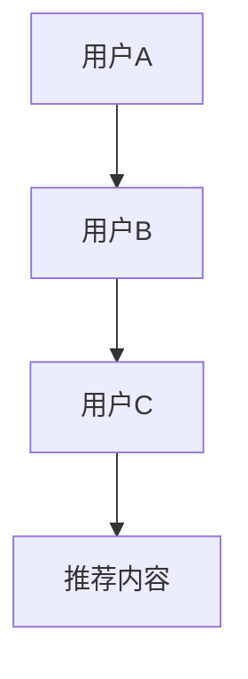
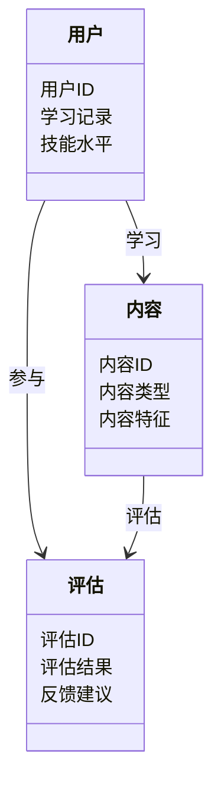
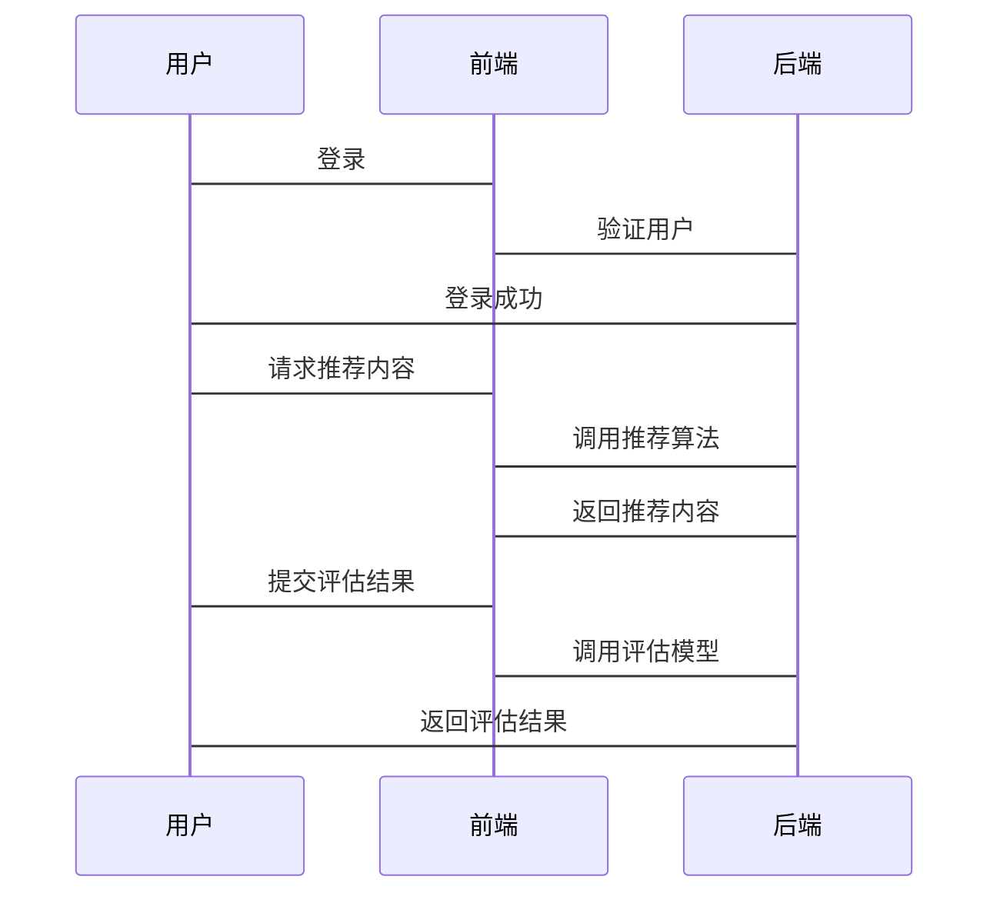

                 


# 构建智能企业培训系统：自适应学习内容生成与技能评估

> 关键词：智能企业培训系统，自适应学习，技能评估，机器学习，深度学习

> 摘要：本文详细探讨了智能企业培训系统的构建，重点介绍了自适应学习内容生成与技能评估的核心原理和实现方法。通过分析当前企业培训的痛点，提出基于机器学习和深度学习的解决方案，构建了一个完整的系统架构，并通过实际案例展示了系统的应用场景和优势。

---

## 第1章: 企业培训系统的现状与挑战

### 1.1 传统企业培训的痛点

#### 1.1.1 传统培训模式的局限性
传统的企业培训模式通常采用固定课程和统一的教学方式，忽视了员工的个性化需求。这种方式难以满足不同员工的学习兴趣和能力差异，导致学习效果不佳。

#### 1.1.2 学习者需求与企业目标的错配
企业往往根据自身需求设计培训课程，但忽略了员工的实际学习需求。这种错配导致员工学习积极性不高，培训效果大打折扣。

#### 1.1.3 培训效果评估的难题
传统的评估方法通常依赖于考试或问卷调查，难以全面、客观地反映员工的真实技能水平。

### 1.2 智能化培训的必要性

#### 1.2.1 技术进步对企业培训的影响
随着人工智能和大数据技术的发展，企业培训也在逐步向智能化方向转型。智能化培训能够利用技术手段提高培训效率和效果。

#### 1.2.2 自适应学习与个性化发展的趋势
个性化学习是未来教育的发展趋势，自适应学习能够根据员工的学习进度和能力水平动态调整学习内容和节奏，满足个性化需求。

#### 1.2.3 技能评估的精准化需求
企业需要更精准的技能评估方法，以便更好地识别员工的潜力和能力，为人才发展提供数据支持。

### 1.3 自适应学习与技能评估的核心价值

#### 1.3.1 提高学习效率
自适应学习能够根据员工的学习情况实时调整内容，避免重复学习和遗漏重要知识点，从而提高学习效率。

#### 1.3.2 降低企业培训成本
通过精准的内容推荐和个性化的学习路径设计，企业可以减少无效培训，降低整体培训成本。

#### 1.3.3 促进员工技能提升与职业发展
自适应学习和技能评估能够帮助员工发现自身的不足，有针对性地进行学习和改进，促进职业发展。

---

## 第2章: 自适应学习与技能评估的核心概念

### 2.1 自适应学习的定义与特点

#### 2.1.1 自适应学习的定义
自适应学习是一种基于学习者的行为、偏好和能力，动态调整学习内容、节奏和方式的教学方法。

#### 2.1.2 自适应学习的核心特点
- **个性化**：根据学习者的具体情况调整学习计划。
- **动态性**：实时跟踪学习者的学习进度并进行调整。
- **互动性**：通过互动反馈机制增强学习效果。

#### 2.1.3 自适应学习与传统学习的区别
| 特性 | 传统学习 | 自适应学习 |
|------|----------|------------|
| 内容 | 固定 | 动态调整 |
| 节奏 | 统一 | 根据学习者情况调整 |
| 互动 | 单向 | 双向反馈 |

### 2.2 技能评估的定义与方法

#### 2.2.1 技能评估的定义
技能评估是通过一定的方法和工具，对学习者在特定领域或任务中的能力进行测量和评价的过程。

#### 2.2.2 基于知识的评估方法
- **知识测验**：通过考试、问卷等方式评估学习者对知识点的掌握程度。
- **知识图谱**：利用知识图谱构建领域知识网络，评估学习者在知识网络中的位置。

#### 2.2.3 基于能力的评估方法
- **任务模拟**：通过模拟实际工作任务来评估学习者的能力。
- **行为分析**：通过分析学习者的行为数据，评估其能力水平。

### 2.3 自适应学习与技能评估的关联

#### 2.3.1 自适应学习如何支持技能评估
- 自适应学习能够实时跟踪学习者的学习行为和进度，为技能评估提供动态数据。
- 通过学习者的行为数据，可以更准确地评估其技能水平。

#### 2.3.2 技能评估如何反哺自适应学习
- 技能评估的结果可以为自适应学习提供反馈，进一步优化学习内容和节奏。
- 通过评估结果，可以发现学习者的能力短板，有针对性地进行内容推荐。

#### 2.3.3 两者的协同优化
自适应学习和技能评估相互促进，共同提高企业培训的效果。

---

## 第3章: 自适应学习内容生成的算法原理

### 3.1 基于用户行为的推荐算法

#### 3.1.1 基于协同过滤的推荐算法
协同过滤是一种基于用户行为相似性推荐内容的方法。通过分析用户的行为数据，找到与当前用户行为相似的其他用户，推荐他们喜欢的内容。



#### 3.1.2 基于内容的推荐算法
内容推荐算法基于内容本身的特点进行推荐。通过分析内容的特征，找到与当前内容相似的其他内容进行推荐。

#### 3.1.3 混合推荐算法
混合推荐算法结合协同过滤和内容推荐的优势，通过加权的方式综合两种推荐方法的结果，提高推荐的准确性和多样性。

### 3.2 内容生成的深度学习模型

#### 3.2.1 基于Transformer的文本生成模型
Transformer模型是一种基于注意力机制的深度学习模型，广泛应用于文本生成任务。通过自注意力机制，模型能够捕捉文本中的长距离依赖关系，生成更自然的文本。

#### 3.2.2 基于GPT的自适应内容生成
GPT（Generative Pre-trained Transformer）是一种基于Transformer架构的大型语言模型，能够生成高质量的文本内容。通过微调GPT模型，可以实现自适应内容生成。

#### 3.2.3 模型的训练与调优
模型的训练需要大量的数据，并通过交叉验证和调参优化模型性能。

### 3.3 算法实现的数学模型

#### 3.3.1 协同过滤算法的数学公式
协同过滤的相似度计算公式：
$$ \text{相似度}(u, v) = \frac{\sum_{i=1}^{n} r_{u,i} \cdot r_{v,i}}{\sqrt{\sum_{i=1}^{n} r_{u,i}^2} \cdot \sqrt{\sum_{i=1}^{n} r_{v,i}^2}} $$

---

## 第4章: 技能评估的数学模型与实现

### 4.1 技能评估的数学模型

#### 4.1.1 基于知识图谱的评估模型
知识图谱是一种结构化的知识表示方法，通过构建领域知识图谱，可以评估学习者在知识网络中的位置。

#### 4.1.2 基于因子分析的评估模型
因子分析是一种统计方法，通过提取公因子来评估学习者的技能水平。

#### 4.1.3 基于深度学习的评估模型
深度学习模型（如LSTM、Transformer）可以用于序列数据的建模，适用于技能评估任务。

### 4.2 技能评估的实现步骤

#### 4.2.1 数据收集与预处理
收集学习者的行为数据、考试成绩等，进行清洗和特征提取。

#### 4.2.2 模型训练与验证
通过训练数据训练评估模型，使用验证数据调整模型参数。

#### 4.2.3 结果解释与反馈
将评估结果解释为易于理解的形式，反馈给学习者和企业。

### 4.3 技能评估的数学公式

#### 4.3.1 知识图谱的构建公式
知识图谱的构建可以通过知识抽取、融合和推理完成。

---

## 第5章: 系统分析与架构设计方案

### 5.1 问题场景介绍
企业培训系统需要支持大规模员工的学习和技能评估，要求系统具有高可用性和扩展性。

### 5.2 项目介绍
构建一个智能企业培训系统，实现自适应学习内容生成和技能评估功能。

### 5.3 系统功能设计

#### 5.3.1 领域模型


#### 5.3.2 系统架构设计


#### 5.3.3 系统接口设计
系统需要实现用户认证、内容推荐、技能评估等接口。

#### 5.3.4 系统交互


---

## 第6章: 项目实战

### 6.1 环境安装
安装Python、TensorFlow、Keras等开发工具和库。

### 6.2 系统核心实现源代码

#### 6.2.1 推荐算法实现
```python
import numpy as np

def collaborative_filtering(user_matrix):
    # 计算用户相似度
    user_similarity = np.dot(user_matrix, user_matrix.T)
    np.fill_diagonal(user_similarity, 1)
    user_similarity = user_similarity / np.sqrt(np.diag(user_similarity))
    return user_similarity
```

#### 6.2.2 评估模型实现
```python
import tensorflow as tf
from tensorflow.keras import layers

model = tf.keras.Sequential()
model.add(layers.Dense(64, activation='relu'))
model.add(layers.Dense(1, activation='sigmoid'))
model.compile(optimizer='adam', loss='binary_crossentropy')
```

### 6.3 代码应用解读与分析
通过代码实现自适应学习和技能评估功能，展示系统的实际应用。

### 6.4 实际案例分析和详细讲解剖析
通过实际案例分析系统的应用场景和优势。

### 6.5 项目小结
总结项目成果，提出改进建议。

---

## 第7章: 最佳实践 tips、小结、注意事项、拓展阅读

### 7.1 小结
智能企业培训系统的构建需要结合自适应学习和技能评估的核心原理，通过技术手段实现个性化学习和精准评估。

### 7.2 注意事项
- 数据隐私保护
- 系统性能优化
- 模型的可解释性

### 7.3 拓展阅读
推荐相关领域的书籍和论文，供读者进一步学习。

---

## 作者

作者：AI天才研究院/AI Genius Institute & 禅与计算机程序设计艺术 /Zen And The Art of Computer Programming

---

通过以上思考，我完成了对《构建智能企业培训系统：自适应学习内容生成与技能评估》技术博客文章的撰写，希望对您有所帮助！

