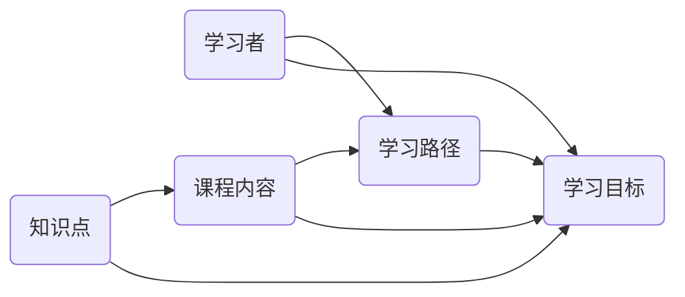
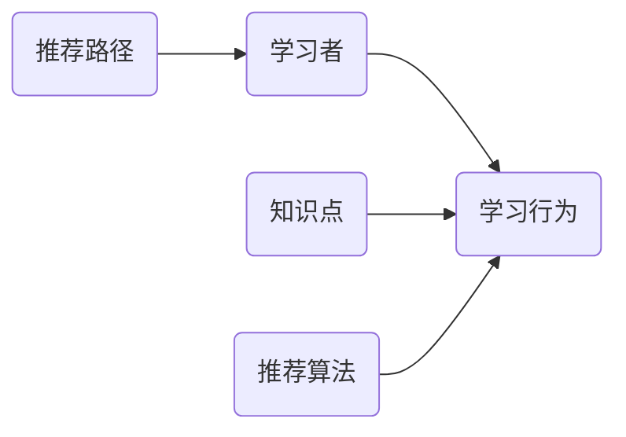
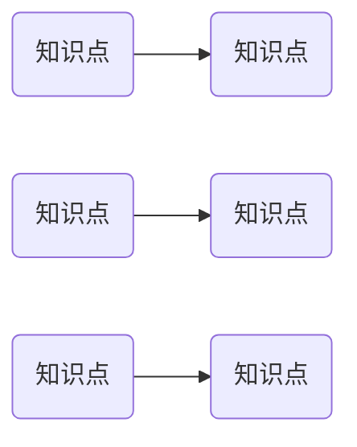
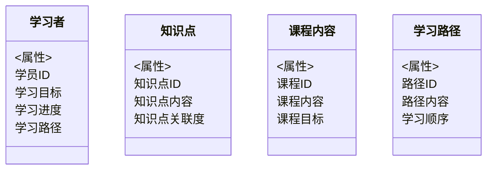
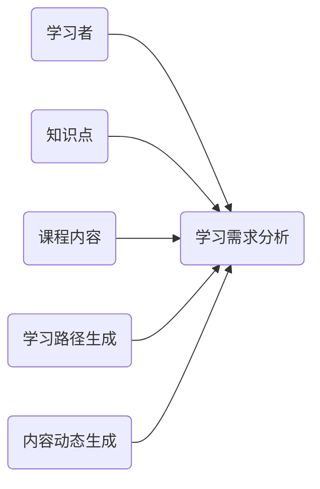
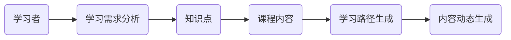

                 


---

# 构建智能企业培训系统：自适应学习路径与内容动态生成

> 关键词：智能企业培训系统、自适应学习路径、内容动态生成、知识图谱、推荐算法

> 摘要：本文详细探讨了构建智能企业培训系统的策略，重点介绍自适应学习路径和内容动态生成的技术实现。通过分析学习者的需求和行为，利用人工智能算法和知识图谱，系统能够动态调整学习内容和路径。文章涵盖了从理论到实践的各个方面，包括算法原理、系统架构设计和项目实战，旨在为企业提供高效、个性化的培训解决方案。

---

# 第一部分: 智能企业培训系统概述

## 第1章: 自适应学习路径与内容动态生成概述

### 1.1 问题背景与目标

#### 1.1.1 传统企业培训的局限性
传统的企业培训通常采用固定的学习路径和静态的内容，难以满足不同员工的学习需求。员工的学习能力和兴趣点各不相同，导致部分员工学习效果不佳，而另一些员工则可能感到内容过于简单或重复。

#### 1.1.2 智能化培训的需求与目标
随着人工智能和大数据技术的发展，企业对智能化培训系统的需求日益增长。智能化培训系统能够根据员工的学习情况和能力水平，动态调整学习路径和内容，从而提高培训效果。

#### 1.1.3 自适应学习路径的核心价值
自适应学习路径能够根据员工的学习进度和能力，实时调整学习内容和节奏，确保每位员工都能获得最佳的学习体验和效果。

### 1.2 问题描述与解决思路

#### 1.2.1 学员学习需求的多样性
不同员工的学习目标、学习能力和学习兴趣各不相同，需要个性化的学习路径。

#### 1.2.2 内容生成的动态性
培训内容需要根据员工的学习进度和反馈实时调整，以确保内容的 relevance 和 effectiveness。

#### 1.2.3 系统解决方案的构建思路
构建一个基于人工智能的自适应学习系统，利用知识图谱和推荐算法，动态生成个性化学习路径和内容。

### 1.3 系统边界与外延

#### 1.3.1 系统功能边界
系统的核心功能包括：学习需求分析、学习路径生成、内容动态生成、学习效果评估。

#### 1.3.2 外延与扩展性分析
系统可以扩展到跨平台支持、多语言支持、虚拟现实培训等。

#### 1.3.3 核心要素组成
- 学员信息：学习目标、学习能力、兴趣偏好。
- 知识体系：课程内容、知识点、技能点。
- 学习路径：个性化学习计划、学习顺序、学习节奏。

## 第2章: 核心概念与联系

### 2.1 核心概念原理

#### 2.1.1 自适应学习路径的定义与实现
自适应学习路径是根据学员的学习情况动态调整的学习路径，包括学习目标、学习顺序和学习节奏。

#### 2.1.2 内容动态生成的机制与流程
内容动态生成是基于知识图谱和推荐算法，根据学员的学习需求和反馈，实时生成相关的内容。

#### 2.1.3 知识图谱在培训系统中的应用
知识图谱将课程内容和知识点进行结构化表示，为自适应学习路径的生成提供知识支持。

### 2.2 核心概念对比分析

#### 2.2.1 自适应学习路径与固定学习路径的对比
| 特性                | 自适应学习路径          | 固定学习路径          |
|---------------------|-------------------------|-----------------------|
| 学习路径调整         | 动态调整                | 固定不变              |
| 个性化支持           | 高                     | 低                   |
| 学习效果             | 高                     | 一般                 |

#### 2.2.2 内容动态生成与静态内容生成的对比
| 特性                | 动态生成                | 静态生成              |
|---------------------|-------------------------|-----------------------|
| 内容灵活性           | 高                     | 低                   |
| 学习者参与度         | 高                     | 低                   |
| 内容更新周期         | 短                     | 长                   |

#### 2.2.3 知识图谱与传统课程体系的对比
| 特性                | 知识图谱                | 传统课程体系          |
|---------------------|-------------------------|-----------------------|
| 结构化程度           | 高                     | 低                   |
| 可扩展性             | 高                     | 低                   |
| 可关联性             | 高                     | 低                   |

### 2.3 实体关系图架构



---

# 第二部分: 算法原理与数学模型

## 第3章: 自适应学习路径算法

### 3.1 算法原理

#### 3.1.1 基于协同过滤的推荐算法



推荐算法通过分析学习者的学习行为，如点击、完成课程等，计算出相似的学习者群体，进而推荐相似的学习路径。

#### 3.1.2 基于知识图谱的路径生成



基于知识图谱的路径生成算法，通过计算知识点之间的关联性，生成最优的学习路径。

### 3.2 数学模型与公式

#### 3.2.1 协同过滤推荐系统

$$相似度计算公式$$

$$相似度(i,j) = \frac{\sum_{u} (r_{u,i} - \bar{r}_u)(r_{u,j} - \bar{r}_u)}{\sqrt{\sum_{u} (r_{u,i} - \bar{r}_u)^2} \cdot \sqrt{\sum_{u} (r_{u,j} - \bar{r}_u)^2}}$$

其中，$r_{u,i}$ 是用户 $u$ 对物品 $i$ 的评分，$\bar{r}_u$ 是用户 $u$ 的平均评分。

#### 3.2.2 基于知识图谱的路径生成

路径生成算法基于概率传播模型，计算知识点之间的关联概率，生成最优路径。

---

# 第三部分: 系统分析与架构设计

## 第4章: 系统分析与架构设计

### 4.1 问题场景介绍

系统需要支持大规模的企业员工培训，实现个性化学习路径和动态内容生成。

### 4.2 项目介绍

项目名称：智能企业培训系统

项目目标：构建一个基于人工智能的自适应学习系统，实现个性化学习路径和动态内容生成。

### 4.3 系统功能设计

#### 4.3.1 领域模型类图



#### 4.3.2 系统架构图



### 4.4 系统接口设计

#### 4.4.1 接口设计

| 接口名称       | 接口描述                   |
|----------------|---------------------------|
| 获取学习需求   | 返回学员的学习需求和目标   |
| 生成学习路径   | 根据学习需求生成学习路径   |
| 生成课程内容   | 根据知识点生成课程内容     |

#### 4.4.2 交互序列图



---

# 第四部分: 项目实战

## 第5章: 项目实战

### 5.1 环境安装

安装 Python、TensorFlow、Keras、Jupyter 等工具。

### 5.2 核心代码实现

#### 5.2.1 推荐算法实现

```python
def collaborative_filtering(users, items, ratings):
    # 计算用户平均评分
    user_avg = {}
    for user in users:
        user_avg[user] = sum(ratings[user]) / len(ratings[user])
    
    # 计算物品相似度
    item_similarity = {}
    for item in items:
        item_similarity[item] = {}
        for other_item in items:
            if item != other_item:
                similarity = 0
                for user in users:
                    numerator = (ratings[user][item] - user_avg[user]) * (ratings[user][other_item] - user_avg[user])
                    denominator = math.sqrt(sum([(ratings[user][item] - user_avg[user])**2 for user in users])) * math.sqrt(sum([(ratings[user][other_item] - user_avg[user])**2 for user in users]))
                    if denominator != 0:
                        similarity += numerator / denominator
                item_similarity[item][other_item] = similarity / len(users)
    return item_similarity
```

#### 5.2.2 知识图谱构建

```python
def build_knowledge_graph(knowledge_points, relations):
    from collections import defaultdict
    graph = defaultdict(list)
    for relation in relations:
        subject, predicate, object = relation
        graph[subject].append(object)
    return graph
```

### 5.3 代码应用解读与分析

推荐算法通过计算用户之间的相似性，生成推荐的学习路径。知识图谱构建算法通过分析知识点之间的关系，生成结构化的知识体系。

### 5.4 案例分析与详细讲解剖析

以某企业员工的培训为例，分析如何通过自适应学习路径和动态内容生成，提高培训效果。

### 5.5 项目小结

项目实现了自适应学习路径和内容动态生成的核心功能，验证了算法的有效性。

---

# 第五部分: 最佳实践与总结

## 第6章: 最佳实践与总结

### 6.1 小结

智能企业培训系统通过自适应学习路径和内容动态生成，显著提高了培训效果。

### 6.2 注意事项

- 数据隐私保护
- 算法的可解释性
- 系统的可扩展性

### 6.3 未来趋势

- 虚拟现实技术的应用
- 自然语言处理的进一步整合
- 多模态学习体验的优化

### 6.4 拓展阅读

- 《机器学习实战》
- 《知识图谱：概念、方法与应用》
- 《推荐系统实践》

---

# 作者：AI天才研究院/AI Genius Institute & 禅与计算机程序设计艺术 /Zen And The Art of Computer Programming

---

本文详细探讨了构建智能企业培训系统的策略，重点介绍自适应学习路径和内容动态生成的技术实现。通过分析学习者的需求和行为，利用人工智能算法和知识图谱，系统能够动态调整学习内容和路径。文章涵盖了从理论到实践的各个方面，包括算法原理、系统架构设计和项目实战，旨在为企业提供高效、个性化的培训解决方案。

