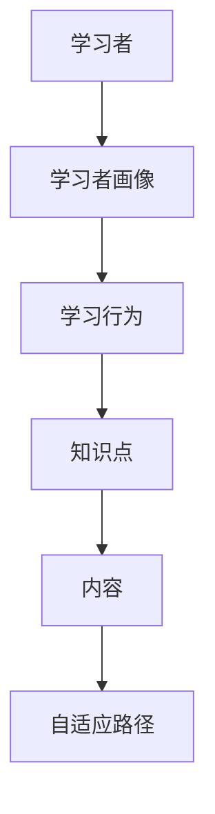
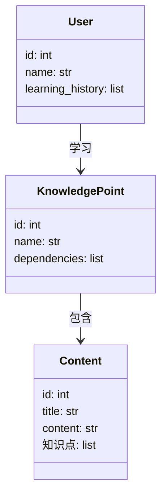

                 


# 构建智能企业培训系统：自适应学习路径与内容生成

> 关键词：智能企业培训系统、自适应学习路径、内容生成、AI算法、自然语言处理

> 摘要：本文详细探讨了构建智能企业培训系统的各个方面，重点分析了自适应学习路径和内容生成的关键技术。通过结合AI算法和自然语言处理技术，提出了一种基于用户画像和知识点图谱的自适应学习路径生成方法，并设计了相应的系统架构。文章还提供了具体的实现方案和项目实战案例，为读者提供了一个完整的构建智能企业培训系统的参考。

---

## 第一部分: 智能企业培训系统的背景与核心概念

### 第1章: 问题背景与需求分析

#### 1.1 传统企业培训的痛点
在传统的企业培训模式中，学习者和企业都面临着诸多挑战：
- **学习者视角**：学习内容千篇一律，无法满足个性化需求；学习路径固定，难以根据个人掌握情况调整。
- **企业视角**：培训资源浪费严重，难以精准匹配员工需求；培训效果难以量化，难以评估投入产出比。

#### 1.2 自适应学习路径的必要性
自适应学习路径能够根据学习者的知识水平、学习习惯和兴趣偏好，动态调整学习内容和顺序，从而实现个性化的学习体验。

#### 1.3 内容生成的技术挑战
- **知识点的结构化表示**：需要将零散的知识点组织成有逻辑的知识图谱。
- **内容生成的多样性与准确性**：需要确保生成的内容既准确又多样化，以满足不同学习者的个性化需求。
- **AI技术的深度应用**：通过自然语言处理和机器学习技术，实现智能内容生成。

#### 1.4 问题解决的边界与外延
- **问题解决范围**：主要解决个性化学习路径规划和智能化内容生成问题。
- **外延扩展**：未来可以扩展至跨语言学习、多模态内容生成等领域。

---

## 第2章: 核心概念与系统架构

#### 2.1 自适应学习路径的核心要素
- **学习者画像**：通过收集学习者的行为数据和知识水平，构建学习者画像。
- **知识点图谱**：将知识点组织成图结构，便于路径规划和内容生成。
- **个性化推荐算法**：基于学习者画像和知识点图谱，生成个性化的学习路径。

#### 2.2 内容生成的关键技术
- **自然语言处理技术**：用于知识点提取和内容生成。
- **知识图谱构建**：将知识点组织成有逻辑的知识图谱。
- **生成模型优化**：通过强化学习和对抗训练，提升内容生成的质量。

#### 2.3 系统架构的模块划分
- **用户模块**：负责收集学习者的行为数据和需求。
- **内容模块**：负责知识点提取和内容生成。
- **算法模块**：负责学习路径生成和优化。

#### 2.4 ER实体关系图


---

## 第三部分: 自适应学习路径与内容生成算法

### 第3章: 自适应学习路径算法原理

#### 3.1 基于马尔可夫链的路径生成
- **状态定义**：每个知识点视为一个状态。
- **转移概率**：根据知识点之间的依赖关系，计算转移概率。
- **知识点依赖关系**：通过有向图表示知识点之间的依赖关系。

#### 3.2 马尔可夫链的实现流程
1. **知识点图谱构建**：
   - 收集知识点，构建知识点之间的依赖关系。
2. **状态转移矩阵计算**：
   - 计算知识点之间的转移概率。
3. **学习路径生成**：
   - 根据当前知识点，生成下一个知识点。

#### 3.3 算法实现代码示例
```python
import numpy as np

def build_knowledge_graph(knowledge_points):
    graph = {}
    for point in knowledge_points:
        graph[point] = []
    # 添加依赖关系
    graph['基础概念'].append('高级理论')
    return graph

def compute_transition_probability(graph):
    transition = {}
    total = 0
    for node in graph:
        count = len(graph[node])
        total += count
        for neighbor in graph[node]:
            if neighbor not in transition:
                transition[neighbor] = 0
            transition[neighbor] += 1
    for node in transition:
        transition[node] /= total
    return transition

knowledge_points = ['基础概念', '高级理论', '实践案例']
graph = build_knowledge_graph(knowledge_points)
transition = compute_transition_probability(graph)
```

---

### 第4章: 基于预训练模型的内容生成算法

#### 4.1 基于预训练模型的生成方法
- **输入特征提取**：提取知识点特征和学习者特征。
- **生成模型训练**：基于预训练模型，微调生成模型。
- **内容生成优化**：通过强化学习优化生成内容的质量。

#### 4.2 内容生成流程
1. **知识点提取**：
   - 从学习者画像中提取目标知识点。
2. **内容生成**：
   - 基于知识点，生成多样化的学习内容。

#### 4.3 生成模型优化代码示例
```python
import torch
import torch.nn as nn

class ContentGenerator(nn.Module):
    def __init__(self, input_dim, output_dim):
        super(ContentGenerator, self).__init__()
        self.fc = nn.Linear(input_dim, output_dim)

    def forward(self, x):
        return self.fc(x)

# 初始化模型
input_dim = 100
output_dim = 200
generator = ContentGenerator(input_dim, output_dim)

# 训练模型
criterion = nn.MSELoss()
optimizer = torch.optim.Adam(generator.parameters(), lr=0.001)

# 假设输入x和目标y
x = torch.randn(1, input_dim)
y = torch.randn(1, output_dim)

# 前向传播
output = generator(x)

# 计算损失
loss = criterion(output, y)

# 反向传播和优化
optimizer.zero_grad()
loss.backward()
optimizer.step()
```

---

## 第四部分: 系统架构设计

### 第5章: 系统功能设计

#### 5.1 领域模型设计


#### 5.2 系统架构设计


---

## 第五部分: 项目实战

### 第6章: 环境搭建与核心实现

#### 6.1 环境搭建
- 安装Python和相关库：
  ```bash
  pip install numpy torch networkx
  ```

#### 6.2 核心代码实现
```python
import numpy as np
import networkx as nx

class AdaptiveLearningPath:
    def __init__(self, knowledge_graph):
        self.graph = knowledge_graph
        self.nodes = list(self.graph.nodes())

    def compute_transition_probabilities(self):
        self.transition = {}
        total = 0
        for node in self.nodes:
            count = len(self.graph[node])
            total += count
            for neighbor in self.graph[node]:
                if neighbor not in self.transition:
                    self.transition[neighbor] = 0
                self.transition[neighbor] += 1
        for node in self.transition:
            self.transition[node] /= total

    def generate_path(self, start_node):
        path = [start_node]
        while True:
            current_node = path[-1]
            if current_node not in self.transition:
                break
            next_node = np.random.choice(list(self.transition[current_node].keys()), p=list(self.transition[current_node].values()))
            path.append(next_node)
            if len(path) > 10:
                break
        return path

knowledge_graph = nx.DiGraph()
knowledge_graph.add_nodes_from(['基础', '中级', '高级'])
knowledge_graph.add_edges_from([('基础', '中级'), ('中级', '高级')])
alp = AdaptiveLearningPath(knowledge_graph)
alp.compute_transition_probabilities()
path = alp.generate_path('基础')
print(path)
```

---

### 第7章: 测试与优化

#### 7.1 测试用例
- 测试知识点图谱的构建
- 测试路径生成的准确性
- 测试内容生成的多样性

#### 7.2 优化方向
- 增强模型的可解释性
- 提高内容生成的质量
- 优化算法的运行效率

---

## 第六部分: 总结与展望

### 第8章: 总结

#### 8.1 核心总结
- 自适应学习路径的核心在于动态调整学习内容和顺序。
- 内容生成的关键在于知识点的结构化表示和AI技术的深度应用。

#### 8.2 注意事项
- 确保数据质量和隐私安全
- 定期更新知识点图谱
- 及时优化算法模型

### 第9章: 未来展望

#### 9.1 技术发展
- 引入更多AI技术，如强化学习、生成式AI
- 探索多模态内容生成

#### 9.2 应用场景
- 拓展至更多行业
- 支持跨语言学习

---

## 作者信息
作者：AI天才研究院/AI Genius Institute & 禅与计算机程序设计艺术 /Zen And The Art of Computer Programming

