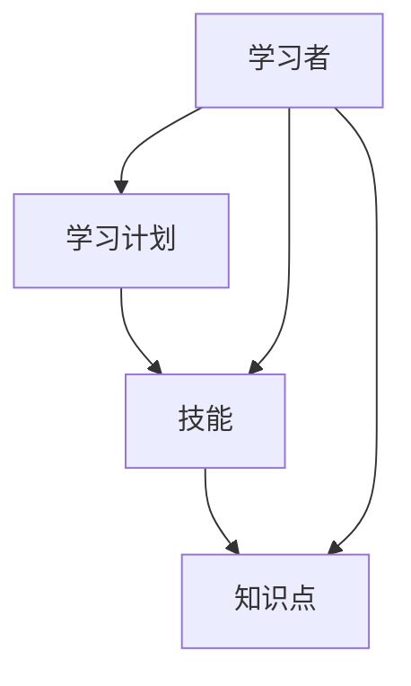
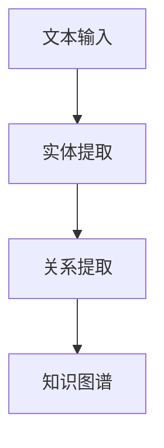
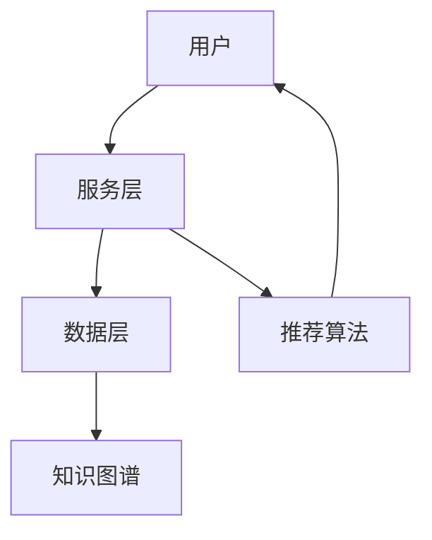

                 


# 构建智能企业学习管理系统：个性化技能发展

> 关键词：企业学习管理系统、个性化技能发展、人工智能、推荐算法、知识图谱、系统架构设计

> 摘要：本文将探讨如何构建一个智能企业学习管理系统，以实现个性化技能发展为目标。通过分析学习者的行为数据，利用人工智能技术，构建个性化学习路径和知识图谱，从而为学习者提供高效的技能提升方案。本文将详细阐述系统的背景、核心概念、算法原理、系统架构设计以及项目实战，帮助读者全面理解如何利用AI技术构建智能企业学习管理系统。

---

## 第一部分：背景介绍与核心概念

### 第1章：智能企业学习管理系统的背景与需求

#### 1.1 学习管理系统的发展历程
- **从传统LMS到智能LMS的演进**  
  传统学习管理系统（LMS）如Moodle、Blackboard等，主要功能包括课程管理、作业提交、成绩记录等。然而，随着企业对员工技能提升的需求增加，传统LMS无法满足个性化学习的需求。  
- **个性化学习的需求驱动**  
  企业对员工的技能要求日益多样化，员工的学习需求也因人而异。传统的“一刀切”式学习方案已无法满足个性化发展的需求。  
- **企业学习管理的新趋势**  
  基于人工智能的学习管理系统正在成为主流，通过分析学习者的行为数据，系统能够动态调整学习路径，提供个性化的学习建议。

#### 1.2 人工智能在企业学习中的应用
- **AI如何赋能企业学习**  
  AI技术可以通过分析学习者的行为数据，预测其学习需求，推荐适合的学习资源，并实时调整学习计划。  
- **个性化技能发展的核心问题**  
  如何通过AI技术实现个性化学习路径的设计？如何构建动态的知识图谱？如何评估学习者的学习效果？  
- **智能学习管理系统的边界与外延**  
  智能学习管理系统不仅关注学习资源的管理，更注重学习者的行为分析和个性化推荐。

#### 1.3 本章小结
本章介绍了智能企业学习管理系统的背景与发展，重点阐述了AI技术在企业学习中的应用价值，并提出了个性化技能发展的核心问题。

---

### 第2章：智能企业学习管理系统的核心概念

#### 2.1 系统核心要素与组成
- **学习者画像**  
  基于学习者的历史行为数据，构建其兴趣、能力、学习风格等画像。  
- **技能评估模型**  
  利用机器学习算法评估学习者当前的技能水平。  
- **个性化学习路径**  
  根据学习者画像和技能评估结果，动态生成个性化学习路径。  
- **知识图谱构建**  
  将知识点及其之间的关系表示为图结构，便于推荐和学习路径规划。

#### 2.2 核心概念属性对比表
| 核心概念     | 属性                 | 描述                                                                 |
|--------------|----------------------|----------------------------------------------------------------------|
| 学习者画像   | 兴趣                 | 学习者对哪些知识点感兴趣                                           |
|              | 能力                 | 学习者当前的技能水平                                               |
|              | 学习风格             | 喜欢结构化学习还是项目式学习                                       |
| 技能评估模型 | 精准度               | 模型对学习者技能水平的预测准确性                                   |
|              | 反馈速度             | 评估结果的实时性                                                   |

#### 2.3 ER实体关系图


#### 2.4 本章小结
本章详细介绍了智能企业学习管理系统的核心概念，包括学习者画像、技能评估模型、个性化学习路径和知识图谱，并通过对比表和ER图展示了各概念之间的关系。

---

## 第二部分：算法原理与数学模型

### 第3章：个性化推荐算法

#### 3.1 基于协同过滤的推荐算法
- **用户协同过滤原理**  
  通过分析用户的行为数据，找到与当前用户行为相似的用户，推荐这些用户喜欢的学习资源。  
- **物品协同过滤原理**  
  分析学习资源之间的相似性，推荐与当前学习资源相似的其他资源。  
- **混合协同过滤的实现**  
  结合用户协同过滤和物品协同过滤，提高推荐的准确性和多样性。

#### 3.2 基于深度学习的推荐模型
- **神经网络协同过滤（Neural Collaborative Filtering）**  
  使用深度学习模型学习用户和资源的嵌入向量，计算两者之间的相似度。  
- **多层感知机（MLP）推荐模型**  
  通过多层感知机模型对用户和资源的特征进行非线性变换，生成推荐结果。  
- **注意力机制在推荐中的应用**  
  在推荐模型中引入注意力机制，关注重要的特征信息。

#### 3.3 推荐算法的数学模型
- **协同过滤的数学公式**
  $$相似度计算：sim(i,j) = \frac{\sum_{k} r_{ik} r_{jk}}{\sqrt{\sum_{k} r_{ik}^2} \sqrt{\sum_{k} r_{jk}^2}}$$

- **神经网络协同过滤模型**
  $$P(i) = \text{embedding}(i) \times W$$
  $$Q(j) = \text{embedding}(j) \times W^T$$
  $$score(i,j) = P(i) \cdot Q(j)$$

---

### 第4章：知识图谱构建与自然语言处理

#### 4.1 知识图谱构建算法
- **基于规则的抽取**  
  根据知识图谱的结构，制定规则从文本中提取知识点和关系。  
- **基于统计的抽取**  
  使用统计方法分析文本中的实体和关系，构建知识图谱。  
- **基于深度学习的抽取**  
  利用预训练语言模型（如BERT）提取文本中的实体和关系。

#### 4.2 自然语言处理模型在学习管理系统中的应用
- **文本分类**  
  对学习资源进行分类，便于推荐和检索。  
- **文本摘要**  
  对学习资源进行摘要，帮助学习者快速了解内容。  
- **问答系统**  
  提供学习者对知识点的疑问解答。

#### 4.3 知识图谱的构建流程


#### 4.4 本章小结
本章介绍了知识图谱的构建算法和自然语言处理模型在学习管理系统中的应用，展示了如何通过技术手段构建动态的知识图谱。

---

## 第三部分：系统分析与架构设计

### 第5章：系统分析与架构设计

#### 5.1 问题场景介绍
- **学习者需求**  
  学习者希望获得个性化的学习路径和推荐资源。  
- **企业需求**  
  企业希望提升员工技能，优化培训成本。

#### 5.2 系统功能设计
- **学习者画像模块**  
  收集学习者的行为数据，构建学习者画像。  
- **技能评估模块**  
  利用机器学习算法评估学习者技能水平。  
- **个性化推荐模块**  
  根据学习者画像和技能评估结果，推荐学习资源和学习路径。  
- **知识图谱模块**  
  构建知识点之间的关系图，支持动态调整学习路径。

#### 5.3 系统架构设计


#### 5.4 接口设计与交互流程
- **接口设计**  
  提供API接口，供外部系统调用学习管理系统的功能。  
- **交互流程**  
  学习者登录系统，系统根据其行为数据生成个性化学习路径，学习者选择资源进行学习，系统实时更新学习者画像和技能评估结果。

#### 5.5 本章小结
本章从系统架构的角度，详细分析了智能企业学习管理系统的功能和架构设计，展示了如何通过技术手段实现个性化技能发展。

---

## 第四部分：项目实战

### 第6章：项目实战

#### 6.1 环境安装与配置
- **Python环境搭建**  
  安装Python 3.8及以上版本。  
- **依赖库安装**  
  使用pip安装numpy、pandas、scikit-learn、tensorflow等库。

#### 6.2 系统核心实现
- **学习者画像模块实现**  
  ```python
  import numpy as np
  from sklearn.preprocessing import StandardScaler

  def build Learner_Profile(data):
      scaler = StandardScaler()
      processed_data = scaler.fit_transform(data)
      return processed_data
  ```

- **推荐算法实现**  
  ```python
  import numpy as np
  from sklearn.metrics.pairwise import cosine_similarity

  def collaborative_filtering(user_matrix):
      similarity = cosine_similarity(user_matrix)
      return similarity
  ```

#### 6.3 案例分析与代码解读
- **案例分析**  
  以某企业员工的学习数据为例，展示如何通过代码实现个性化推荐。  
- **代码解读**  
  解释代码的功能和实现逻辑，帮助读者理解如何在实际项目中应用。

#### 6.4 本章小结
本章通过实际项目案例，展示了如何在Python环境中实现智能企业学习管理系统的核心功能。

---

## 第五部分：最佳实践

### 第7章：最佳实践与总结

#### 7.1 项目小结
- **技术总结**  
  介绍了如何利用AI技术构建智能企业学习管理系统，包括学习者画像、技能评估、个性化推荐和知识图谱构建。  
- **实践总结**  
  强调了数据的重要性，推荐算法的实现和系统架构设计的关键性。

#### 7.2 注意事项
- **数据隐私问题**  
  在处理学习者数据时，必须遵守相关隐私保护法规。  
- **模型优化问题**  
  需要不断优化推荐算法和知识图谱构建模型，提升系统的准确性和效率。

#### 7.3 拓展阅读
- **推荐论文**  
  推荐几篇关于个性化推荐和知识图谱构建的经典论文，供读者深入学习。  
- **技术博客**  
  推荐一些技术博客和开源项目，帮助读者进一步了解相关技术。

#### 7.4 本章小结
本章总结了项目的实施过程，提出了注意事项和拓展阅读的方向，帮助读者进一步深入学习。

---

## 作者信息

作者：AI天才研究院/AI Genius Institute & 禅与计算机程序设计艺术 /Zen And The Art of Computer Programming

---

通过以上思考和撰写过程，我们可以看到构建智能企业学习管理系统需要结合人工智能、机器学习和知识图谱等多种技术手段。希望本文能够为读者提供一个全面的视角，帮助他们在实际项目中实现个性化技能发展。

