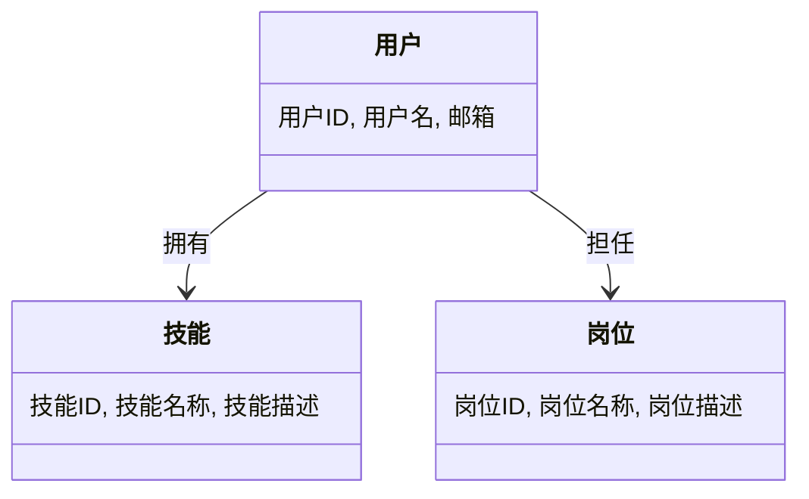
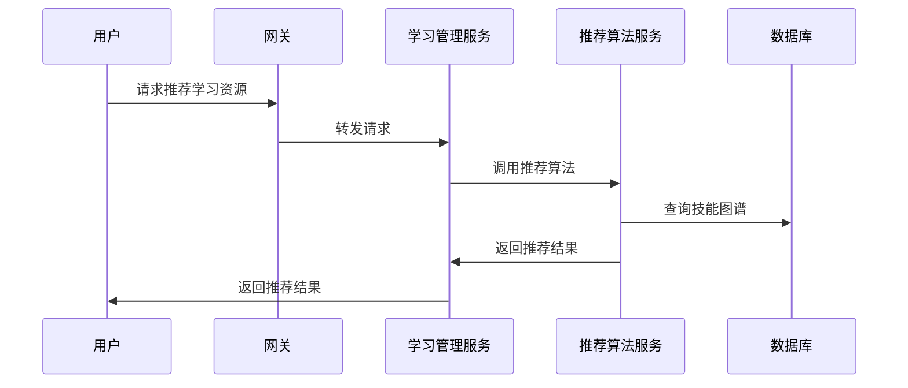

                 


# 构建智能企业学习管理系统：技能图谱与个性化发展规划

> 关键词：企业学习管理，技能图谱，个性化学习，AI技术，推荐算法，系统架构

> 摘要：本文详细探讨了如何利用人工智能技术构建智能企业学习管理系统，重点介绍了技能图谱的构建与应用、个性化学习规划的算法原理以及系统的整体架构设计。通过结合实际案例和项目实战，本文为读者提供了从理论到实践的全面指导，帮助企业在数字化转型中提升学习管理效率和员工发展效果。

---

# 第1章 企业学习管理的现状与挑战

## 1.1 传统企业学习管理的局限性

### 1.1.1 传统学习管理模式的弊端
传统的企业学习管理模式通常依赖于固定的学习路径和统一的课程安排，难以满足员工个性化的发展需求。这种模式往往忽视了员工的个体差异，导致学习效果不佳，员工积极性下降。

### 1.1.2 企业学习效率与员工发展的矛盾
在企业中，学习管理的核心目标是提升员工技能和企业竞争力。然而，传统模式下，学习资源分散，缺乏系统性，员工难以找到适合自己的学习路径，导致学习效率低下。

### 1.1.3 个性化学习需求的缺失
随着企业对员工能力要求的不断提高，员工对个性化学习的需求日益增长。传统模式无法满足员工根据自身职业发展需求选择学习内容的需求，这成为企业学习管理中的一个痛点。

---

## 1.2 智能化学习管理的必要性

### 1.2.1 AI技术对企业学习管理的赋能
人工智能技术（如自然语言处理、机器学习）的引入，为学习管理的智能化提供了技术支持。通过AI算法，企业可以实现个性化学习推荐、学习效果评估等功能。

### 1.2.2 技能图谱在企业学习中的应用
技能图谱是一种将企业所需技能和知识进行结构化表示的方法。通过构建技能图谱，企业可以清晰地了解员工技能现状，并制定针对性的学习计划。

### 1.2.3 个性化学习规划的潜力与价值
个性化学习规划能够根据员工的岗位需求、职业目标和学习偏好，制定专属的学习路径。这不仅提升了员工的学习积极性，还为企业培养了更具竞争力的人才。

---

## 1.3 本章小结
本章分析了传统企业学习管理的局限性，并提出了智能化学习管理的必要性。通过引入AI技术和技能图谱，企业可以实现个性化学习规划，从而提升学习效率和员工发展效果。

---

# 第2章 技能图谱的构建与分析

## 2.1 技能图谱的定义与特点

### 2.1.1 技能图谱的定义
技能图谱是一种将企业所需技能和知识进行结构化表示的图谱。它通过节点和边的形式，描述技能之间的关系、技能与岗位的匹配关系等。

### 2.1.2 技能图谱的核心特征
- **结构化**：将技能、知识、岗位等元素进行结构化建模。
- **动态性**：技能图谱可以根据企业需求和市场变化进行动态更新。
- **可视化**：通过图谱形式直观展示技能之间的关联关系。

### 2.1.3 技能图谱与知识图谱的区别
技能图谱侧重于技能之间的关系，而知识图谱侧重于知识点之间的关系。技能图谱更关注岗位需求和员工能力匹配。

---

## 2.2 技能图谱的构建方法

### 2.2.1 数据采集与处理
- **数据来源**：包括企业岗位描述、员工简历、学习资源等。
- **数据清洗**：去除重复、冗余和无效数据。
- **数据标注**：对技能进行标准化处理。

### 2.2.2 技能节点与关系的建模
- **技能节点**：表示具体的技能或知识点。
- **技能关系**：描述技能之间的关联，例如“依赖”、“包含”等。

### 2.2.3 技能图谱的可视化
通过图数据库（如Neo4j）和可视化工具（如Gephi），可以将技能图谱以图形化形式展示，便于理解和分析。

---

## 2.3 技能图谱的应用场景

### 2.3.1 人才招聘中的技能匹配
在招聘过程中，企业可以通过技能图谱快速匹配符合岗位需求的候选人。

### 2.3.2 员工培训中的技能分析
通过对员工技能图谱的分析，企业可以识别员工的技能缺口，并制定针对性的培训计划。

### 2.3.3 技能提升路径的设计
技能图谱可以帮助员工制定个性化的学习路径，确保其技能提升与职业目标一致。

---

## 2.4 本章小结
本章详细介绍了技能图谱的定义、构建方法及其应用场景。通过技能图谱，企业可以更好地进行人才管理和学习规划。

---

# 第3章 个性化学习规划的理论与方法

## 3.1 个性化学习规划的定义

### 3.1.1 个性化学习的内涵
个性化学习是指根据员工的个体特点、职业目标和学习需求，制定专属的学习计划。

### 3.1.2 学习规划的核心要素
- **学习目标**：明确员工需要掌握的技能。
- **学习路径**：根据技能图谱推荐的学习顺序。
- **学习资源**：包括课程、视频、文档等。

### 3.1.3 个性化学习与传统学习的区别
个性化学习注重个体差异，而传统学习注重统一性。个性化学习通过技术手段实现精准推荐，而传统学习则依赖固定的学习路径。

---

## 3.2 个性化学习规划的算法基础

### 3.2.1 基于用户行为的推荐算法
- **协同过滤**：根据用户行为相似性推荐学习资源。
- **基于内容的推荐**：根据学习资源的内容相似性推荐。

### 3.2.2 基于技能图谱的关联规则
- **技能关联规则挖掘**：发现技能之间的关联关系。
- **路径规划算法**：根据技能图谱推荐学习路径。

### 3.2.3 个性化学习路径的动态调整
根据员工的学习反馈和技能提升情况，动态调整学习路径。

---

## 3.3 个性化学习规划的实现步骤

### 3.3.1 用户需求分析
- **岗位需求分析**：明确员工的岗位技能要求。
- **员工画像构建**：通过数据分析，构建员工的技能画像。

### 3.3.2 技能图谱匹配
- **技能需求匹配**：将员工技能与岗位需求进行匹配。
- **学习资源匹配**：根据技能图谱推荐学习资源。

### 3.3.3 学习计划生成与优化
- **学习路径生成**：根据技能图谱生成学习路径。
- **学习计划优化**：根据员工反馈优化学习计划。

---

## 3.4 本章小结
本章详细介绍了个性化学习规划的理论基础和实现方法，强调了技能图谱在个性化学习中的重要作用。

---

# 第4章 基于技能图谱的推荐算法

## 4.1 技能图谱推荐算法概述

### 4.1.1 基于内容的推荐
- **算法原理**：根据学习资源的内容相似性进行推荐。
- **优缺点**：优点是推荐结果准确，缺点是计算成本高。

### 4.1.2 基于协同过滤的推荐
- **算法原理**：根据用户行为相似性进行推荐。
- **优缺点**：优点是计算效率高，缺点是推荐结果可能存在偏差。

### 4.1.3 混合推荐算法
- **算法原理**：结合内容推荐和协同过滤的优点。
- **优缺点**：推荐结果更准确，但计算复杂度较高。

---

## 4.2 技能图谱推荐算法的实现

### 4.2.1 数据预处理与特征提取
- **数据清洗**：去除无效数据。
- **特征提取**：提取技能、岗位等特征。

### 4.2.2 技能关联规则的挖掘
- **关联规则挖掘**：发现技能之间的关联关系。
- **规则存储**：将挖掘结果存储在数据库中。

### 4.2.3 推荐结果的生成与优化
- **推荐生成**：根据技能图谱生成推荐结果。
- **结果优化**：根据用户反馈优化推荐结果。

---

## 4.3 技能图谱推荐算法的优化

### 4.3.1 基于深度学习的推荐改进
- **深度学习模型**：如神经网络协同过滤模型。
- **优缺点**：推荐结果更准确，但需要大量数据和计算资源。

### 4.3.2 稀疏性问题的解决
- **解决方法**：引入正则化技术，减少模型过拟合。

### 4.3.3 实时推荐的实现
- **实时推荐**：基于流数据处理技术，实现实时推荐。

---

## 4.4 本章小结
本章详细介绍了基于技能图谱的推荐算法，包括算法原理、实现步骤和优化方法。通过这些方法，可以实现更精准的学习资源推荐。

---

# 第5章 个性化学习规划的算法实现

## 5.1 个性化学习规划的算法框架

### 5.1.1 基于用户画像的个性化推荐
- **用户画像构建**：通过数据分析构建员工的技能画像。
- **推荐算法**：基于用户画像推荐学习资源。

### 5.1.2 基于技能图谱的路径规划
- **路径规划算法**：根据技能图谱推荐学习路径。
- **动态调整**：根据学习反馈动态调整路径。

---

## 5.2 个性化学习规划的数学模型

### 5.2.1 用户画像构建的数学模型
$$ \text{用户画像} = \sum_{i=1}^{n} w_i \cdot s_i $$
其中，$w_i$ 是技能 $s_i$ 的权重。

### 5.2.2 技能图谱匹配的数学公式
$$ \text{匹配度} = \sum_{i=1}^{m} \text{sim}(s_i, t_i) $$
其中，$s_i$ 是员工技能，$t_i$ 是岗位需求，$\text{sim}(s_i, t_i)$ 是技能相似度。

### 5.2.3 学习路径优化的算法模型
$$ \text{优化路径} = \argmin_{p} \sum_{i=1}^{k} \text{cost}(p_i) $$
其中，$p$ 是学习路径，$p_i$ 是路径中的第 $i$ 步，$\text{cost}(p_i)$ 是路径的成本。

---

## 5.3 本章小结
本章详细介绍了个性化学习规划的算法框架和数学模型，为实现精准的学习推荐提供了理论基础。

---

# 第6章 系统分析与架构设计方案

## 6.1 问题场景介绍
企业学习管理系统需要支持技能图谱构建、个性化学习推荐、学习效果评估等功能。

## 6.2 系统功能设计

### 6.2.1 领域模型设计


### 6.2.2 系统架构设计


### 6.2.3 系统接口设计
- **API接口**：
  - `GET /skills`：获取所有技能
  - `POST /recommend`：推荐学习资源
  - `PUT /learning_plan`：更新学习计划

### 6.2.4 系统交互设计


---

## 6.3 本章小结
本章通过系统分析和架构设计，为智能企业学习管理系统的实现提供了技术基础。

---

# 第7章 项目实战：智能企业学习管理系统开发

## 7.1 环境安装

### 7.1.1 开发环境
- **操作系统**：Linux/Mac/Windows
- **编程语言**：Python 3.8+
- **依赖库**：Neo4j, Flask, scikit-learn

### 7.1.2 安装步骤
```bash
pip install neo4j flask scikit-learn
```

---

## 7.2 系统核心实现

### 7.2.1 技能图谱构建
```python
from neo4j import GraphDatabase

def create_skill_graph(neo4j_uri, neo4j_user, neo4j_password):
    driver = GraphDatabase.driver(neo4j_uri, auth=(neo4j_user, neo4j_password))
    session = driver.session()
    session.run("CREATE (s:Skill {name: 'Python'})")
    session.run("CREATE (s:Skill {name: '数据挖掘'})")
    session.close()
```

### 7.2.2 个性化推荐算法
```python
from sklearn.metrics.pairwise import cosine_similarity

def recommend_resources(user_profile, skill_graph):
    resource_embeddings = skill_graph.transform(user_profile)
    similarity_scores = cosine_similarity(resource_embeddings)
    return similarity_scores.argsort(axis=1)[:, ::-1]
```

---

## 7.3 实际案例分析

### 7.3.1 案例背景
某企业希望提升员工的“数据挖掘”技能，构建个性化学习计划。

### 7.3.2 学习资源推荐
根据技能图谱推荐学习资源：数据挖掘基础、机器学习算法、Python编程。

### 7.3.3 学习路径优化
根据员工反馈动态调整学习路径，确保学习效果最大化。

---

## 7.4 本章小结
本章通过项目实战，详细介绍了智能企业学习管理系统的开发过程，包括环境安装、核心代码实现和实际案例分析。

---

# 第8章 总结与展望

## 8.1 最佳实践 Tips

### 8.1.1 技能图谱构建
- 数据来源要多样化，确保图谱的全面性。
- 定期更新图谱，保持其准确性。

### 8.1.2 个性化学习规划
- 根据员工反馈动态调整学习计划。
- 结合企业实际需求进行定制化开发。

### 8.1.3 系统优化
- 优化推荐算法，提升推荐效率。
- 加强系统安全性，保护用户隐私。

---

## 8.2 小结
本文从理论到实践，详细探讨了智能企业学习管理系统的构建方法。通过技能图谱和个性化学习规划，企业可以实现高效的学习管理，提升员工能力。

---

## 8.3 注意事项

### 8.3.1 数据隐私
在处理用户数据时，必须遵守相关法律法规，保护用户隐私。

### 8.3.2 系统稳定性
确保系统的高可用性，避免因技术问题影响学习过程。

### 8.3.3 用户体验
优化系统界面和操作流程，提升用户体验。

---

## 8.4 拓展阅读

### 8.4.1 推荐算法
- 《推荐系统实战：从零到部署》
- 《深度学习推荐算法：原理与实践》

### 8.4.2 技能图谱
- 《知识图谱构建与应用：方法与案例》
- 《技能图谱在企业中的应用：实践分享》

---

# 作者：AI天才研究院/AI Genius Institute & 禅与计算机程序设计艺术 /Zen And The Art of Computer Programming

---

**本文为AI天才研究院原创文章，转载请注明出处。**

