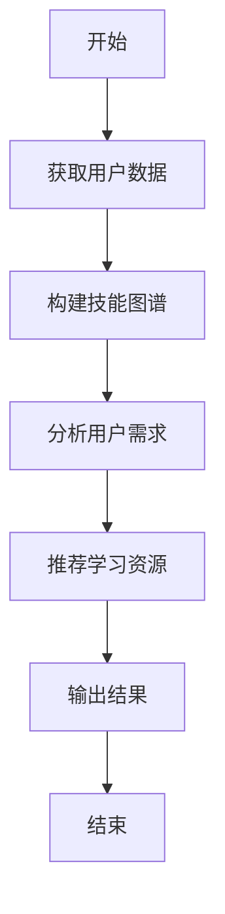
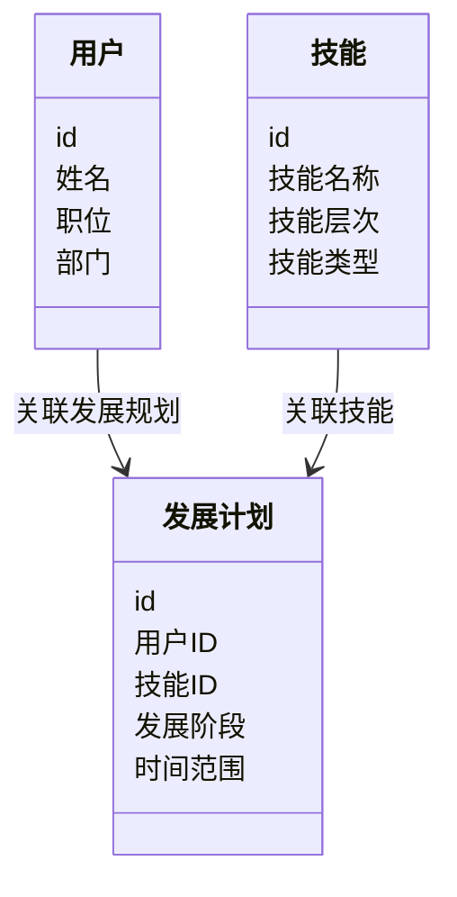

                 


# 构建智能企业学习管理系统：技能图谱与个性化发展规划的融合

> 关键词：企业学习管理系统、技能图谱、个性化发展、推荐算法、系统架构设计

> 摘要：本文详细探讨了如何构建一个智能企业学习管理系统，通过技能图谱与个性化发展的融合，实现员工学习的智能化和个性化。文章从背景、核心概念、算法原理、系统架构、项目实战到总结，全面分析了构建该系统的各个方面，为企业的学习管理提供了新的思路和解决方案。

---

# 第一部分：智能企业学习管理系统的背景与核心概念

## 第1章：智能企业学习管理系统的背景介绍

### 1.1 问题背景与问题描述

#### 1.1.1 传统企业学习管理的痛点
- **学习资源分散**：企业内部的学习资源分散在不同的平台和系统中，员工难以找到合适的资源。
- **学习路径不清晰**：员工缺乏明确的学习路径，难以系统地提升技能。
- **个性化不足**：传统学习管理系统难以根据员工的个性化需求推荐学习内容。
- **数据孤岛**：企业内部数据分散，难以形成统一的学习数据池。

#### 1.1.2 技能图谱与个性化发展的必要性
- **技能图谱**：通过构建技能图谱，可以将企业的核心技能和岗位需求清晰地展示出来，帮助员工了解自己的技能差距。
- **个性化发展**：通过个性化发展计划，可以根据员工的当前技能水平、职业目标和岗位需求，推荐合适的学习资源和路径。

#### 1.1.3 智能化学习管理系统的目标
- 提供智能化的学习资源推荐。
- 根据员工的技能水平和职业目标，制定个性化的发展计划。
- 帮助企业提升员工的技能水平，增强企业的竞争力。

### 1.2 问题解决与边界

#### 1.2.1 技能图谱与个性化发展的解决方案
- 构建企业技能图谱，明确各岗位的核心技能和技能层次。
- 根据员工的技能水平和职业目标，推荐个性化的发展路径。
- 提供智能化的学习资源推荐，帮助员工快速找到合适的学习内容。

#### 1.2.2 系统的边界与外延
- **边界**：系统仅关注员工的学习管理，不涉及其他管理系统（如绩效管理、薪酬管理）。
- **外延**：系统可以与企业的其他系统（如HR系统、知识管理系统）进行集成，形成更完善的企业学习生态。

#### 1.2.3 核心要素与组成结构
- **核心要素**：技能图谱、个性化发展计划、学习资源库、推荐算法、学习效果评估。
- **组成结构**：用户模块、技能模块、发展计划模块、推荐算法模块、评估模块。

### 1.3 本章小结
本章介绍了智能企业学习管理系统的背景，分析了传统系统存在的问题，并提出了技能图谱与个性化发展的解决方案。通过构建技能图谱和个性化发展计划，可以实现学习资源的智能化推荐和员工技能的全面提升。

---

## 第2章：技能图谱与个性化发展的核心概念

### 2.1 核心概念与原理

#### 2.1.1 技能图谱的定义与构建
- **技能图谱**：将企业的核心技能和岗位需求以图谱的形式展示，图谱中的节点代表技能，边表示技能之间的关系。
- **构建过程**：
  1. 确定企业的核心技能和岗位需求。
  2. 建立技能之间的关系，如“依赖关系”、“并列关系”。
  3. 使用图数据库（如Neo4j）存储和展示技能图谱。

#### 2.1.2 个性化发展的定义与实现
- **个性化发展**：根据员工的技能水平、职业目标和岗位需求，制定个性化的学习计划。
- **实现过程**：
  1. 收集员工的基本信息（如技能水平、职业目标）。
  2. 分析技能图谱，找到员工技能差距。
  3. 根据技能差距推荐学习资源和路径。

#### 2.1.3 两者的融合原理
- **融合原理**：通过技能图谱明确企业需求，根据员工的个性化需求推荐学习资源，实现技能提升的闭环。

### 2.2 核心概念属性对比

| 属性 | 技能图谱 | 个性化发展 |
|------|---------|------------|
| 定义 | 显示企业核心技能和岗位需求的图谱 | 根据员工需求制定个性化学习计划 |
| 构建 | 基于企业战略和岗位需求 | 基于员工技能水平和职业目标 |
| 目标 | 为企业提供技能管理依据 | 为员工提供学习指导 |
| 数据来源 | 企业战略、岗位需求 | 员工技能水平、学习偏好 |

### 2.3 ER实体关系图

```mermaid
erd
    title 技能图谱与个性化发展 ER 图
    User {
        id
        姓名
        职位
        部门
    }
    Skill {
        id
        技能名称
        技能层次
        技能类型
    }
    DevelopmentPlan {
        id
        用户ID
        技能ID
        发展阶段
        时间范围
    }
    User --> DevelopmentPlan: 关联发展规划
    Skill --> DevelopmentPlan: 关联技能
```

### 2.4 本章小结
本章详细讲解了技能图谱和个性化发展的核心概念，通过对比分析和ER图展示了两者的关系。技能图谱帮助企业明确需求，个性化发展根据员工需求制定学习计划，两者的融合实现了智能化学习管理。

---

## 第3章：技能图谱与个性化发展的算法原理

### 3.1 算法原理概述

#### 3.1.1 基于协同过滤的推荐算法
- **协同过滤**：通过分析用户的行为和偏好，推荐相似用户的资源。
- **实现步骤**：
  1. 收集用户的行为数据（如点击、购买）。
  2. 计算用户之间的相似度（如余弦相似度）。
  3. 根据相似用户的偏好推荐资源。

#### 3.1.2 基于内容的推荐算法
- **内容推荐**：根据资源的内容特征进行推荐。
- **实现步骤**：
  1. 提取资源的内容特征（如关键词、标签）。
  2. 计算资源之间的相似度。
  3. 根据用户的历史行为推荐相似资源。

#### 3.1.3 混合推荐模型
- **混合推荐**：结合协同过滤和内容推荐的优点，提高推荐的准确性和多样性。
- **实现步骤**：
  1. 同时使用协同过滤和内容推荐算法。
  2. 根据实验结果调整权重。
  3. 输出综合推荐结果。

### 3.2 算法流程图



### 3.3 算法实现代码

```python
import pandas as pd
from sklearn.metrics.pairwise import cosine_similarity

# 示例数据：用户-技能矩阵
userskills = pd.DataFrame({
    '用户ID': [1, 2, 3],
    '技能ID': [1, 2, 1],
    '技能水平': [0.8, 0.6, 0.9]
})

# 计算用户之间的相似度
user_similarity = cosine_similarity(userskills[['技能水平']], userskills[['技能水平']])

# 基于协同过滤的推荐算法
def recommend(user_id, similarity_matrix, userskills):
    # 找到与目标用户最相似的用户
    similar_users = [i for i in range(len(similarity_matrix[user_id])) if i != user_id]
    similar_users.sort(key=lambda x: similarity_matrix[user_id][x], reverse=True)
    
    # 根据相似用户的技能推荐
    recommendations = []
    for user in similar_users:
        recommendations.extend(userskills[userskills['用户ID'] == user]['技能ID'].tolist())
    return recommendations

# 示例推荐
print(recommend(1, user_similarity, userskills))
```

### 3.4 本章小结
本章介绍了技能图谱与个性化发展中的推荐算法，包括协同过滤、内容推荐和混合推荐模型。通过算法流程图和代码示例，详细讲解了如何实现智能化推荐。

---

## 第4章：技能图谱与个性化发展的系统架构设计

### 4.1 系统功能设计

#### 4.1.1 领域模型


#### 4.1.2 系统架构设计
```mermaid
archi
    title 技能图谱与个性化发展系统架构图
    网络层 --> 应用层: 提供API接口
    应用层 --> 数据层: 访问数据库
    数据层 --> 技能图谱数据库: 存储技能关系
    数据层 --> 用户数据库: 存储用户信息
    应用层 --> 推荐算法模块: 执行推荐算法
    推荐算法模块 --> 界面层: 展示推荐结果
```

### 4.2 系统接口设计

#### 4.2.1 API接口
- `/api/users`：获取用户信息。
- `/api/skills`：获取技能信息。
- `/api/recommend`：推荐学习资源。

### 4.3 系统交互设计

```mermaid
sequenceDiagram
    用户 -> 界面层: 请求推荐
    界面层 -> 应用层: 调用推荐算法
    应用层 -> 数据层: 获取用户数据
    数据层 -> 技能图谱数据库: 获取技能关系
    推荐算法模块 -> 用户数据库: 获取用户信息
    推荐算法模块 -> 返回推荐结果
    界面层 -> 用户: 展示推荐结果
```

### 4.4 本章小结
本章详细讲解了系统的架构设计，包括功能模块、架构图和接口设计。通过系统架构设计，可以实现技能图谱与个性化发展的融合，为用户提供智能化的学习管理服务。

---

## 第5章：技能图谱与个性化发展的项目实战

### 5.1 环境安装与配置

#### 5.1.1 安装依赖
- 安装Python和相关库（如pandas、numpy、scikit-learn）。
- 安装图数据库（如Neo4j）。

#### 5.1.2 安装步骤
1. 安装Python：`python --version`。
2. 安装依赖：`pip install pandas numpy scikit-learn`。
3. 安装Neo4j：从官网下载安装包，按照提示安装。

### 5.2 系统核心实现

#### 5.2.1 技能图谱构建

```python
from neo4j import GraphDatabase

# 连接Neo4j数据库
driver = GraphDatabase.driver("bolt://localhost:7687", auth=("neo4j", "password"))

# 创建技能节点
def create_skill_nodes(driver, skills):
    session = driver.session()
    for skill in skills:
        session.run("CREATE (s:Skill {name: $name, level: $level})", name=skill['name'], level=skill['level'])
    session.close()

# 创建用户节点
def create_user_nodes(driver, users):
    session = driver.session()
    for user in users:
        session.run("CREATE (u:User {id: $id, name: $name})", id=user['id'], name=user['name'])
    session.close()

# 创建用户-技能关系
def create_user_skill_relationships(driver, user_skill_pairs):
    session = driver.session()
    for pair in user_skill_pairs:
        session.run("MATCH (u:User {id: $u_id}), (s:Skill {name: $s_name}) CREATE (u)-[r:HAS_SKILL]->(s)", u_id=pair['u_id'], s_name=pair['s_name'])
    session.close()

# 示例数据
skills = [
    {'name': 'Python', 'level': '初级'},
    {'name': '数据挖掘', 'level': '中级'},
    {'name': '机器学习', 'level': '高级'}
]

users = [
    {'id': 1, 'name': '小明'},
    {'id': 2, 'name': '小红'}
]

user_skill_pairs = [
    {'u_id': 1, 's_name': 'Python'},
    {'u_id': 2, 's_name': '数据挖掘'}
]

# 执行创建
create_skill_nodes(driver, skills)
create_user_nodes(driver, users)
create_user_skill_relationships(driver, user_skill_pairs)

driver.close()
```

#### 5.2.2 个性化发展计划

```python
from sklearn.metrics.pairwise import cosine_similarity

# 示例数据：用户技能矩阵
userskills = pd.DataFrame({
    '用户ID': [1, 2, 3],
    '技能ID': [1, 2, 1],
    '技能水平': [0.8, 0.6, 0.9]
})

# 计算用户之间的相似度
user_similarity = cosine_similarity(userskills[['技能水平']], userskills[['技能水平']])

# 基于协同过滤的推荐算法
def recommend(user_id, similarity_matrix, userskills):
    # 找到与目标用户最相似的用户
    similar_users = [i for i in range(len(similarity_matrix[user_id])) if i != user_id]
    similar_users.sort(key=lambda x: similarity_matrix[user_id][x], reverse=True)
    
    # 根据相似用户的技能推荐
    recommendations = []
    for user in similar_users:
        recommendations.extend(userskills[userskills['用户ID'] == user]['技能ID'].tolist())
    return recommendations

# 示例推荐
print(recommend(1, user_similarity, userskills))
```

### 5.3 案例分析与项目总结

#### 5.3.1 案例分析
- **案例背景**：某企业希望提升员工的数据分析能力。
- **技能图谱**：构建数据分析相关的技能图谱，包括数据清洗、数据可视化、统计分析等。
- **个性化发展计划**：根据员工的技能水平和职业目标，推荐学习资源和路径。

#### 5.3.2 项目总结
- **成功经验**：通过技能图谱和个性化发展计划，提升了员工的学习效率和技能水平。
- **问题与挑战**：数据质量和算法准确性需要进一步优化。
- **改进建议**：引入更复杂的学习推荐算法，如深度学习模型。

### 5.4 本章小结
本章通过项目实战，详细讲解了技能图谱与个性化发展的实现过程，包括环境配置、系统实现和案例分析。通过实际案例，验证了系统的可行性和有效性。

---

## 第6章：总结与展望

### 6.1 总结

通过构建技能图谱和个性化发展计划，可以实现企业学习管理的智能化和个性化。技能图谱帮助企业明确需求，个性化发展根据员工需求推荐学习资源，两者的融合实现了学习资源的精准推荐和员工技能的全面提升。

### 6.2 展望

未来，技能图谱与个性化发展将更加智能化和个性化。随着AI技术的发展，推荐算法将更加精准，学习管理系统将更加智能化。同时，技能图谱和个性化发展将与其他管理系统（如绩效管理、薪酬管理）进行集成，形成更完善的企业学习生态。

### 6.3 最佳实践与注意事项

- **数据质量**：确保数据的准确性和完整性，避免数据孤岛。
- **算法优化**：根据实际需求优化推荐算法，提高推荐的准确性和多样性。
- **用户体验**：注重用户体验，提供友好的交互界面和便捷的学习路径。

### 6.4 本章小结
本章总结了全文的主要内容，并展望了未来的发展方向。通过技能图谱与个性化发展的融合，企业学习管理将更加智能化和个性化。

---

## 作者信息

**作者：AI天才研究院/AI Genius Institute & 禅与计算机程序设计艺术 /Zen And The Art of Computer Programming**

---

**全文结束**

---

**感谢您的阅读！**

