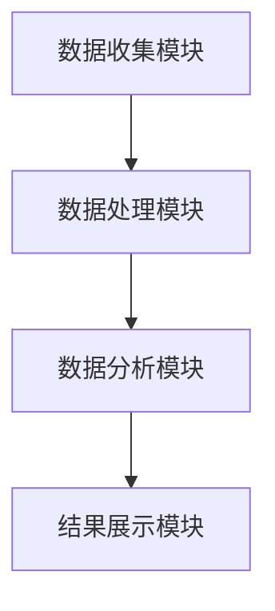
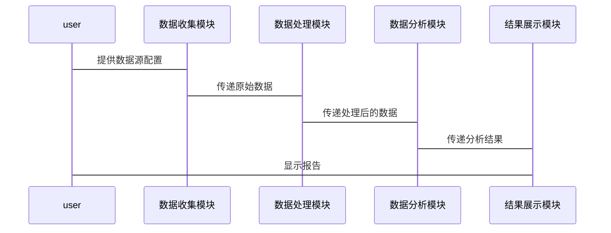

                 


# 构建智能企业市场调研系统：自动化数据收集与分析

## 关键词：智能市场调研系统，自动化数据收集，数据分析算法，系统架构设计，企业市场调研

## 摘要：本文详细探讨了如何构建一个智能企业市场调研系统，重点介绍了自动化数据收集与分析的关键技术。通过系统化的分析和设计，结合实际案例，展示了如何利用先进的算法和架构来提高市场调研的效率和准确性，为企业决策提供强有力的支持。

---

# 第1章 问题背景与需求分析

## 1.1 问题背景

### 1.1.1 传统市场调研的痛点

传统的企业市场调研依赖人工数据收集和分析，效率低下且容易出错。企业需要面对海量数据，手动整理和分析耗时且成本高昂，难以满足快速变化的市场需求。

### 1.1.2 数据爆炸时代的挑战

随着互联网的普及，数据量呈指数级增长。企业需要处理来自不同渠道的结构化和非结构化数据，这对数据处理能力提出了更高的要求。

### 1.1.3 企业市场调研的自动化需求

为了应对数据爆炸和市场变化的快速性，企业需要自动化数据收集和智能化分析工具，以提高市场调研的效率和准确性。

## 1.2 问题描述

### 1.2.1 数据收集的复杂性

数据来源多样，包括社交媒体、问卷调查、竞争对手分析等，数据格式和结构各不相同，增加了数据收集的难度。

### 1.2.2 数据分析的效率瓶颈

传统数据分析依赖人工经验，难以快速提取有用信息。面对海量数据，人工分析的效率无法满足现代企业的需求。

### 1.2.3 市场变化的实时性要求

市场变化迅速，企业需要实时获取最新的市场动态，以便及时调整策略。传统市场调研方法难以满足实时性要求。

## 1.3 问题解决

### 1.3.1 自动化数据收集的实现

通过爬虫技术、API接口等方式实现自动化数据收集，覆盖多种数据来源，提高数据收集效率。

### 1.3.2 智能化数据分析的方法

利用机器学习算法对数据进行自动分析，提取关键信息，生成 actionable insights。

### 1.3.3 系统化市场调研的解决方案

构建一个智能化的市场调研系统，整合数据收集、处理、分析和展示功能，提供全面的市场洞察。

## 1.4 系统边界与外延

### 1.4.1 系统功能的边界

系统主要关注数据收集与分析，不涉及企业内部的其他业务系统。

### 1.4.2 系统应用的范围

适用于企业市场部门、咨询公司等需要进行市场调研的场景。

### 1.4.3 系统与其他模块的交互

系统可以通过 API 接口与其他企业系统（如 CRM、ERP）进行数据交互，提供更全面的市场分析。

## 1.5 核心概念与组成

### 1.5.1 核心概念的定义

智能企业市场调研系统是一个集成化的平台，利用自动化技术收集数据，并通过智能化算法进行分析，为决策者提供实时市场洞察。

### 1.5.2 系统组成要素

- 数据收集模块：负责从不同来源获取数据。
- 数据处理模块：对收集的数据进行清洗和预处理。
- 数据分析模块：利用算法对数据进行建模和分析。
- 结果展示模块：以可视化形式呈现分析结果。

### 1.5.3 系统架构的核心逻辑

系统通过模块化设计，实现数据流的高效处理和分析，最终生成可操作的市场报告。

---

# 第2章 核心概念与系统联系

## 2.1 核心概念原理

### 2.1.1 数据收集模块的原理

数据收集模块通过爬虫技术、API接口等方式，从多种数据源（如社交媒体、新闻网站）获取原始数据。

### 2.1.2 数据分析模块的原理

数据分析模块利用机器学习算法，对数据进行特征提取、分类、聚类等处理，生成有意义的洞察。

### 2.1.3 结果展示模块的原理

结果展示模块通过数据可视化技术，将分析结果以图表、报告等形式呈现，便于用户理解和决策。

## 2.2 核心概念属性对比

| 概念       | 数据收集模块 | 数据分析模块 | 结果展示模块 |
|------------|--------------|--------------|--------------|
| 功能       | 收集数据      | 分析数据      | 展示结果     |
| 输入       | 原始数据      | 处理后的数据 | 分析结果     |
| 输出       | 结构化数据    | 洞察报告      | 可视化图表    |

## 2.3 ER实体关系图

```mermaid
erDiagram
    customer[客户] {
        id : int
        name : string
        industry : string
    }
    market_survey[市场调研] {
        survey_id : int
        customer_id : int
        survey_date : date
        report_status : status
    }
    survey_data[数据源] {
        data_id : int
        source_type : string
        data_content : text
    }
    relationship[关系] {
        customer -> market_survey : 进行市场调研
        market_survey -> survey_data : 使用数据源
    }
```

---

# 第3章 算法原理与实现

## 3.1 数据预处理算法

### 3.1.1 数据清洗

数据清洗是数据预处理的重要步骤，包括去除重复数据、处理缺失值、去除异常值等。

### 3.1.2 数据转换

数据转换包括数据格式转换、标准化、归一化等，以便后续分析。

## 3.2 特征提取算法

### 3.2.1 TF-IDF

TF-IDF 是一种常用的文本特征提取方法，用于计算关键词的重要性。

$$ TF-IDF(t, d) = TF(t, d) \times IDF(t) $$

### 3.2.2 主成分分析（PCA）

PCA 是一种降维技术，用于提取数据的主要特征。

$$ Y = X \times P $$

## 3.3 分类与聚类算法

### 3.3.1 支持向量机（SVM）

SVM 是一种常用的分类算法，适用于线性可分的数据。

$$ \text{max} \, \frac{1}{2} \|w\|^2 $$
$$ \text{subject to} \, y_i(w \cdot x_i + b) \geq 1 $$

### 3.3.2 K-means 聚类

K-means 是一种无监督学习算法，用于将数据分成 K 个簇。

$$ \text{目标函数} = \sum_{i=1}^k \sum_{x_j \in C_i} (x_j - \mu_i)^2 $$

## 3.4 算法实现

### 3.4.1 数据预处理代码

```python
import pandas as pd
from sklearn.preprocessing import StandardScaler

# 数据清洗
data = pd.read_csv('raw_data.csv')
data = data.drop_duplicates()
data = data.dropna()

# 数据转换
scaler = StandardScaler()
data_scaled = scaler.fit_transform(data)
```

### 3.4.2 特征提取代码

```python
from sklearn.feature_extraction.text import TfidfVectorizer

vectorizer = TfidfVectorizer()
tfidf = vectorizer.fit_transform(documents)
```

### 3.4.3 分类与聚类代码

```python
from sklearn.svm import SVC
from sklearn.cluster import KMeans

# 分类
model = SVC()
model.fit(X_train, y_train)

# 聚类
clusters = KMeans(n_clusters=3).fit_predict(X)
```

---

# 第4章 系统分析与架构设计

## 4.1 系统架构设计

### 4.1.1 系统组成

系统由数据收集模块、数据处理模块、数据分析模块和结果展示模块组成。

### 4.1.2 系统架构图



### 4.1.3 关键接口设计

- 数据收集模块提供 API 接口，接收数据源配置。
- 数据分析模块提供 REST API，供其他模块调用分析结果。
- 结果展示模块提供 Web 接口，供用户查看报告。

## 4.2 系统交互设计

### 4.2.1 交互流程

用户通过 Web 界面配置数据源，系统自动收集数据，分析后生成报告，用户可以在界面上查看结果。

### 4.2.2 交互图



---

# 第5章 项目实战与分析

## 5.1 项目环境搭建

### 5.1.1 安装依赖

使用 Python 和相关库（如 requests、pandas、scikit-learn）搭建开发环境。

## 5.2 系统核心实现

### 5.2.1 数据收集代码

```python
import requests

def collect_data(url):
    response = requests.get(url)
    return response.text
```

### 5.2.2 数据分析代码

```python
from sklearn.decomposition import PCA

def analyze_data(data):
    pca = PCA(n_components=2)
    principal_components = pca.fit_transform(data)
    return principal_components
```

## 5.3 实际案例分析

### 5.3.1 案例背景

某企业需要分析竞争对手的市场动态，使用系统进行数据收集和分析。

### 5.3.2 数据分析结果

系统生成竞争对手的产品趋势、市场份额等报告，帮助企业制定市场策略。

---

# 第6章 扩展与优化

## 6.1 系统优化建议

### 6.1.1 数据安全

加强数据加密和访问控制，确保数据隐私。

### 6.1.2 模型优化

引入更先进的机器学习模型，如深度学习算法，提高分析精度。

## 6.2 未来发展趋势

智能市场调研系统将更加智能化、自动化，结合自然语言处理和大数据技术，提供更全面的市场洞察。

## 6.3 注意事项

在系统设计和实现过程中，需要注意数据来源的合法性、模型的可解释性以及系统的可扩展性。

---

# 第7章 总结与展望

## 7.1 内容回顾

本文详细介绍了智能企业市场调研系统的构建过程，涵盖数据收集、分析、展示等关键环节。

## 7.2 未来展望

随着人工智能技术的不断发展，市场调研系统将更加智能化，为企业决策提供更强大的支持。

---

# 作者

作者：AI天才研究院/AI Genius Institute  
联系方式：[email protected]  
GitHub：[GitHub Repository](https://github.com/ai-genius-institute)  

---

通过本文的详细讲解，读者可以全面了解如何构建一个高效的智能企业市场调研系统，并将其应用于实际业务中，提升企业的市场竞争力。

