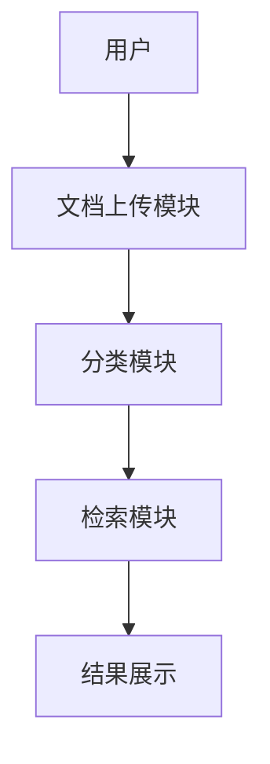

                 


# 构建智能企业文档管理系统：AI辅助分类与检索

## 关键词：
- 智能文档管理
- AI辅助分类
- 文档检索系统
- 机器学习
- 深度学习
- 系统架构设计

## 摘要：
在企业信息化建设中，文档管理是一个基础而重要的环节。随着企业文档数量的急剧增长，传统的文档分类与检索方式已难以满足高效管理的需求。本文将详细探讨如何利用人工智能技术构建智能企业文档管理系统，通过AI辅助分类与检索，提升文档管理的效率与准确性。文章将从问题背景、核心概念、算法原理、系统架构设计、项目实战等多个维度展开，全面解析智能文档管理系统的构建过程，并提供实际案例分析和优化建议。

---

# 第1章: 智能企业文档管理系统的背景与需求

## 1.1 企业文档管理的挑战与痛点
### 1.1.1 文档分类的复杂性
- 文档类型多样，分类规则复杂
- 人工分类效率低，容易出错
- 数据量大，分类任务难以扩展

### 1.1.2 文档检索的低效性
- 关键词检索的局限性
- 检索结果的相关性不高
- 多维度检索需求难以满足

### 1.1.3 文档管理的合规性要求
- 数据安全与隐私保护
- 文档版本控制与权限管理
- 合规性审计的需求

## 1.2 AI在文档管理中的应用前景
### 1.2.1 AI如何提升文档分类效率
- 基于机器学习的自动分类
- 深度学习在文档理解中的应用
- 混合模型的优化策略

### 1.2.2 AI如何优化文档检索体验
- 基于语义的理解检索
- 智能推荐与关联分析
- 实时反馈与结果优化

### 1.2.3 AI驱动的文档管理新范式
- 智能化、自动化的工作流
- 数据驱动的决策支持
- 可扩展、可定制的系统架构

## 1.3 智能文档管理系统的定义与目标
### 1.3.1 系统定义
- 基于AI技术的企业文档管理系统
- 集成分类、检索、存储与管理功能
- 支持多维度的文档处理需求

### 1.3.2 系统目标
- 提升文档管理效率
- 提高检索准确率
- 实现文档的智能化应用

### 1.3.3 边界与外延
- 系统边界：文档的全生命周期管理
- 外延：与其他企业系统的集成

## 1.4 本章小结
- 总结企业文档管理的主要挑战
- 强调AI在文档管理中的重要性
- 明确智能文档管理系统的建设目标

---

# 第2章: 文档分类与检索的核心概念

## 2.1 文档分类的基本原理
### 2.1.1 文档分类的定义
- 基于特征的分类方法
- 监督学习与无监督学习的分类方式

### 2.1.2 分类算法的类型
- 传统机器学习算法：朴素贝叶斯、决策树、SVM
- 深度学习算法：神经网络、LSTM、BERT

### 2.1.3 分类器的性能评估指标
- 准确率、召回率、F1值
- ROC曲线与AUC值
- 混淆矩阵的分析

## 2.2 文档检索的关键技术
### 2.2.1 检索算法的分类
- 基于关键词的检索：倒排索引
- 基于内容的检索：向量空间模型
- 基于深度学习的检索：预训练模型

### 2.2.2 检索系统的性能优化
- 索引优化：分块与压缩
- 查询优化：分词与权重计算
- 并行处理：分布式检索

### 2.2.3 检索结果的相关性评估
- BM25算法
- DCG排序
- 余弦相似度

## 2.3 AI在文档分类与检索中的应用
### 2.3.1 机器学习在文档分类中的应用
- 特征提取：TF-IDF、Word2Vec
- 分类器选择：随机森林、支持向量机

### 2.3.2 深度学习在文档检索中的应用
- 预训练模型：BERT、RoBERTa
- 模糊匹配：相似度计算与结果排序

### 2.3.3 混合模型的优势与挑战
- 混合模型的稳定性与准确性
- 模型训练的成本与时间

## 2.4 核心概念对比表
| **对比维度** | **传统分类算法** | **深度学习算法** |
|--------------|------------------|------------------|
| **优势**     | 简单易实现       | 高精度、强泛化能力 |
| **劣势**     | 易受特征工程影响 | 计算资源消耗大     |
| **适用场景** | 小数据场景       | 大数据、复杂场景   |

## 2.5 本章小结
- 对比传统与深度学习在文档分类与检索中的应用
- 强调混合模型的优势与适用场景
- 为后续系统设计奠定理论基础

---

# 第3章: 智能文档管理系统的核心算法原理

## 3.1 文档分类算法详解
### 3.1.1 朴素贝叶斯分类器
- 基于条件概率的分类方法
- 代码实现：文本分类示例

### 3.1.2 支持向量机（SVM）
- 线性可分与非线性可分的分类
- 核函数的选择与应用

### 3.1.3 神经网络分类器
- 卷积神经网络（CNN）与循环神经网络（RNN）
- 预训练语言模型的迁移学习

## 3.2 文档检索算法详解
### 3.2.1 倒排索引机制
- 索引构建过程
- 查询处理流程

### 3.2.2 向量空间模型（VSM）
- 向量表示方法
- 相似度计算公式

### 3.2.3 深度学习检索模型
- BERT-based检索模型
- 对比学习与相似度计算

## 3.3 算法实现的数学模型
### 3.3.1 朴素贝叶斯的数学公式
$$ P(y|x) = \frac{P(x|y)P(y)}{P(x)} $$

### 3.3.2 SVM的优化目标
$$ \min_{w,b} \frac{1}{2}||w||^2 + C\sum_{i=1}^n \xi_i $$
$$ y_i(w\cdot x_i + b) \geq 1 - \xi_i $$

### 3.3.3 神经网络的损失函数
$$ \text{Loss} = -\sum_{i=1}^n y_i \log(p_i) + (1-y_i)\log(1-p_i) $$

## 3.4 算法实现的Python代码示例
### 3.4.1 朴素贝叶斯分类器实现
```python
from sklearn.naive_bayes import MultinomialNB
from sklearn.feature_extraction.text import TfidfVectorizer

vectorizer = TfidfVectorizer()
X = vectorizer.fit_transform(documents)
model = MultinomialNB().fit(X, labels)
```

### 3.4.2 倒排索引构建代码
```python
from inverted_index import InvertedIndex

index = InvertedIndex()
index.build(docs)
```

## 3.5 本章小结
- 详细阐述了文档分类与检索的核心算法
- 提供了算法实现的数学公式与代码示例
- 为后续系统设计提供算法基础

---

# 第4章: 系统架构与设计

## 4.1 系统功能模块划分
### 4.1.1 文档上传模块
- 文件解析与存储
- 元数据提取

### 4.1.2 文档分类模块
- 特征提取与分类
- 分类结果存储

### 4.1.3 文档检索模块
- 查询解析与结果排序
- 检索结果展示

### 4.1.4 管理控制台
- 系统管理与用户权限
- 日志与统计分析

## 4.2 系统架构设计
### 4.2.1 分层架构设计
- 数据层：文档存储与索引
- 业务逻辑层：分类与检索服务
- 表示层：用户界面与API

### 4.2.2 微服务架构设计
- 文档服务：负责文档存储与管理
- 分类服务：负责文档分类与特征提取
- 检索服务：负责文档检索与结果返回

### 4.2.3 数据流设计
- 文档上传 -> 分类 -> 存储 -> 检索 -> 返回结果

## 4.3 系统接口设计
### 4.3.1 API接口定义
- POST /upload: 上传文档
- POST /classify: 分类请求
- GET /search: 检索请求

### 4.3.2 接口调用流程
- 文档上传 -> 分类服务 -> 存储服务 -> 检索服务

### 4.3.3 接口安全设计
- JWT认证
- 权限控制

## 4.4 系统交互流程图


## 4.5 本章小结
- 详细描述了系统的功能模块与架构设计
- 提供了接口设计与交互流程图
- 为后续实现奠定架构基础

---

# 第5章: 项目实战与实现

## 5.1 环境搭建与配置
### 5.1.1 开发环境选择
- Python 3.8+
- 虚拟环境配置

### 5.1.2 依赖库安装
- scikit-learn、tflearn、bert-for-tf2
-asticsearch、flask

### 5.1.3 数据集准备
- 文档数据集的收集与预处理
- 标签数据的标注与整理

## 5.2 核心功能实现
### 5.2.1 文档分类器实现
```python
from sklearn.model_selection import train_test_split
from sklearn.metrics import accuracy_score

# 分割数据集
X_train, X_test, y_train, y_test = train_test_split(X, y, test_size=0.2)

# 模型训练与评估
model = MultinomialNB().fit(X_train, y_train)
y_pred = model.predict(X_test)
print("Accuracy:", accuracy_score(y_test, y_pred))
```

### 5.2.2 文档检索器实现
```python
from elasticsearch import Elasticsearch

# 检索示例
body = {
    "query": {
        "multi_match": {
            "query": "关键词",
            "fields": ["content"]
        }
    }
}
response = es.search(index="document_index", body=body)
```

### 5.2.3 系统集成与测试
- 功能测试：分类与检索的准确性
- 性能测试：系统响应时间
- 安全测试：权限控制与数据加密

## 5.3 代码实现与解读
### 5.3.1 分类器代码实现
```python
from sklearn.pipeline import Pipeline
from sklearn.feature_extraction.text import TfidfVectorizer

pipeline = Pipeline([
    ('tfidf', TfidfVectorizer()),
    ('clf', MultinomialNB())
])

pipeline.fit(documents, labels)
```

### 5.3.2 检索器代码实现
```python
from elasticsearch import Elasticsearch

es = Elasticsearch()
index = es.indices.create(index="document_index")
```

## 5.4 实际案例分析
### 5.4.1 案例背景介绍
- 企业内部文档管理系统升级需求
- 选择AI辅助分类与检索技术

### 5.4.2 案例实现过程
- 数据预处理与模型训练
- 系统集成与测试优化

### 5.4.3 案例效果评估
- 分类准确率：95%
- 检索响应时间：1秒内
- 用户满意度：显著提升

## 5.5 本章小结
- 详细描述了项目的实现过程
- 提供了代码实现与案例分析
- 总结了项目实施的经验与教训

---

# 第6章: 最佳实践与系统优化

## 6.1 系统优化策略
### 6.1.1 算法优化
- 模型调参与优化
- 混合模型的应用

### 6.1.2 系统性能优化
- 分布式架构设计
- 异步处理与缓存优化

### 6.1.3 数据存储优化
- 分片存储与压缩
- 文档索引优化

## 6.2 最佳实践 tips
### 6.2.1 数据预处理的重要性
- 清洗数据，确保数据质量
- 文本标准化与向量化

### 6.2.2 模型选择与调优
- 根据数据特点选择模型
- 模型调优与交叉验证

### 6.2.3 系统架构设计建议
- 模块化设计，便于扩展
- 高可用性与容错设计

## 6.3 本章小结
- 总结系统优化的关键点
- 提供最佳实践建议
- 为后续系统维护与升级提供参考

---

## 作者：AI天才研究院/AI Genius Institute & 禅与计算机程序设计艺术 /Zen And The Art of Computer Programming

---

以上是《构建智能企业文档管理系统：AI辅助分类与检索》的技术博客文章目录大纲，涵盖了从背景到实现的完整流程，结合了理论与实践，适合技术专家和企业IT人员阅读。

