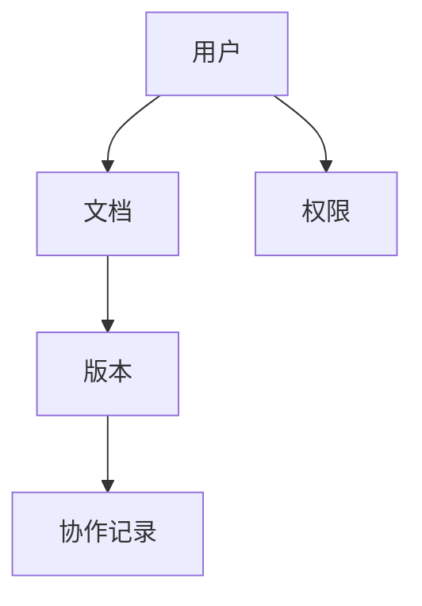
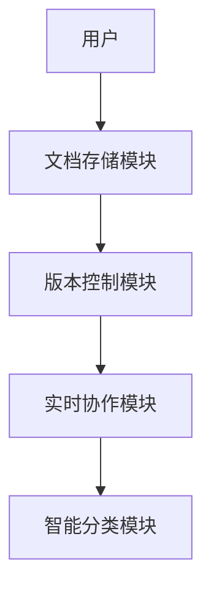
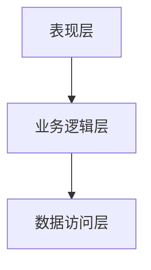

                 


# 构建智能企业文档管理系统：版本控制与协作优化

## 关键词：
智能文档管理、版本控制、协作优化、企业文档、AI技术

## 摘要：
本文详细探讨了构建智能企业文档管理系统的各个方面，重点分析了版本控制与协作优化的核心技术。通过结合AI技术，我们提出了一种高效的文档管理解决方案，能够自动跟踪文档版本、实时协作，并通过智能分类提升企业文档管理的效率和准确性。

---

# 第一部分: 智能企业文档管理系统的背景与核心概念

## 第1章: 问题背景与需求分析

### 1.1 问题背景
在现代企业中，文档管理是一个至关重要但常常被忽视的环节。随着企业规模的扩大和协作需求的增加，传统的文档管理方式逐渐暴露出诸多问题。

#### 1.1.1 传统文档管理的痛点
- **版本混乱**：文档在多人协作时，常常出现多个版本，导致信息不一致。
- **协作低效**：多人同时编辑文档时，难以实时同步，导致工作效率低下。
- **文档孤岛**：不同部门或项目使用的文档分散存储，难以统一管理和检索。

#### 1.1.2 企业协作中的文档问题
- **信息冗余**：同一份文档在不同部门或项目中可能被多次修改，导致信息重复。
- **查找困难**：文档分散存储，查找特定信息时耗时耗力。
- **权限管理复杂**：不同人员对文档的访问权限难以统一管理。

#### 1.1.3 智能化文档管理的必要性
随着AI技术的发展，智能化文档管理成为可能。通过引入AI技术，可以实现文档的自动分类、智能检索和版本控制，从而提升文档管理的效率和准确性。

### 1.2 问题描述
智能企业文档管理系统需要解决的核心问题包括：
- **自动跟踪文档版本**：确保每个文档都有唯一的版本记录，避免信息混乱。
- **实时协作**：多人可以同时编辑文档，系统实时同步更新。
- **智能分类与检索**：通过AI技术对文档内容进行分类，实现快速检索。

### 1.3 解决方案概述
本文提出了一种基于AI技术的智能文档管理系统，通过以下方式实现版本控制与协作优化：
- **版本控制**：使用分布式版本控制系统（如Git）来管理文档版本，并通过AI技术自动识别文档的修改内容。
- **实时协作**：采用云技术实现多人实时编辑，通过冲突解决算法确保协作的高效性。
- **智能分类与检索**：利用自然语言处理（NLP）技术对文档内容进行分类和检索。

### 1.4 系统边界与外延
- **系统功能的边界**：系统主要负责文档的存储、版本控制和协作管理，不涉及文档的内容生成。
- **与现有系统的区别**：传统文档管理系统主要依赖手动操作，而智能文档管理系统通过AI技术实现了自动化和智能化。
- **系统的可扩展性与兼容性**：系统设计充分考虑了扩展性和兼容性，能够与现有企业系统无缝对接。

### 1.5 核心概念与要素
- **文档管理的基本概念**：文档的创建、编辑、存储和检索。
- **版本控制的核心要素**：版本记录、版本比较、版本回滚。
- **智能协作的关键属性**：实时同步、权限管理、冲突解决。

## 第2章: 核心概念与联系

### 2.1 智能文档管理系统的原理
智能文档管理系统通过结合AI技术，实现了文档的智能化管理。其核心原理包括：
- **基于AI的文档理解机制**：通过NLP技术对文档内容进行分析，提取关键词和主题。
- **自动化的版本控制流程**：通过AI算法识别文档的修改内容，并自动生成版本记录。
- **实时协作的实现方式**：通过云技术实现多人实时编辑，并通过冲突解决算法确保协作的高效性。

### 2.2 核心概念对比表
以下是传统文档管理和智能文档管理的核心概念对比：

| 概念       | 传统文档管理 | 智能文档管理 |
|------------|--------------|--------------|
| 版本控制   | 手动记录     | 自动跟踪     |
| 协作方式   | 离线协作     | 实时在线     |
| 智能性     | 无           | 有           |

### 2.3 实体关系图
以下是智能文档管理系统的实体关系图：



---

# 第二部分: 算法原理与数学模型

## 第3章: 文档理解算法

### 3.1 文档理解算法的实现
文档理解算法的核心是通过NLP技术对文档内容进行分析，提取关键词和主题。以下是具体的实现步骤：

#### 3.1.1 文档预处理
- **分词**：将文档内容分割成词语或短语。
- **去停用词**：去除常见的停用词（如“的”、“是”等）。
- **词干提取**：将词语转换为词干，以便后续处理。

#### 3.1.2 文档表示
- **向量空间模型**：将文档表示为向量空间中的点，维度为词汇表的大小。
- **TF-IDF**：计算每个词语的TF-IDF值，表示词语在文档中的重要性。

#### 3.1.3 文档分类
- **基于K近邻算法的分类**：通过K-Nearest Neighbor算法对文档进行分类。
- **基于支持向量机的分类**：通过支持向量机（SVM）算法对文档进行分类。

### 3.2 文档理解算法的数学模型
以下是文档理解算法的数学模型：

$$
\text{TF-IDF}(t, d) = \frac{\text{TF}(t, d) \times \log\left(\frac{N}{\text{DF}(t)} + 1\right)}
$$

其中，TF(t, d)表示词语t在文档d中的词频，DF(t)表示词语t在所有文档中的词频，N表示文档总数。

---

## 第4章: 版本控制算法

### 4.1 版本控制算法的实现
版本控制算法的核心是通过算法识别文档的修改内容，并自动生成版本记录。以下是具体的实现步骤：

#### 4.1.1 文档差异检测
- **基于哈希算法的差异检测**：通过哈希算法计算文档的差异部分。
- **基于分块比较的差异检测**：将文档分成多个块进行比较，找出修改的部分。

#### 4.1.2 版本记录生成
- **基于Git的版本控制**：使用Git命令记录文档的修改历史。
- **基于AI算法的版本跟踪**：通过AI算法自动识别文档的修改内容，并生成版本记录。

### 4.2 版本控制算法的数学模型
以下是版本控制算法的数学模型：

$$
\text{差异度}(v1, v2) = \sum_{i=1}^{n} \left| v1[i] - v2[i] \right|
$$

其中，v1和v2表示两个版本的文档向量，n表示文档的长度。

---

# 第三部分: 系统分析与架构设计

## 第5章: 系统功能设计

### 5.1 系统功能模块
智能文档管理系统主要包括以下几个功能模块：
- **文档存储模块**：负责文档的存储和检索。
- **版本控制模块**：负责文档版本的记录和管理。
- **实时协作模块**：负责多人实时编辑和冲突解决。
- **智能分类模块**：负责文档的分类和检索。

### 5.2 系统功能流程
以下是系统功能流程的Mermaid图：



---

## 第6章: 系统架构设计

### 6.1 系统架构组成
智能文档管理系统采用分层架构设计，主要包括以下几个层次：
- **表现层**：负责用户界面的展示。
- **业务逻辑层**：负责业务逻辑的实现。
- **数据访问层**：负责数据的存储和访问。

### 6.2 系统架构图
以下是系统架构图的Mermaid图：



---

## 第7章: 系统接口设计

### 7.1 系统接口描述
以下是系统的主要接口描述：
- **文档存储接口**：负责文档的存储和检索。
- **版本控制接口**：负责文档版本的记录和管理。
- **实时协作接口**：负责多人实时编辑和冲突解决。
- **智能分类接口**：负责文档的分类和检索。

---

## 第8章: 系统交互流程

### 8.1 系统交互流程图
以下是系统交互流程的Mermaid图：


---

# 第四部分: 项目实战

## 第9章: 项目实战

### 9.1 环境安装
以下是项目实战所需的环境安装步骤：
1. 安装Python编程语言。
2. 安装Git版本控制工具。
3. 安装NLP库（如NLTK、spaCy）。
4. 安装云服务（如AWS、阿里云）。

### 9.2 核心代码实现

#### 9.2.1 文档理解代码
以下是文档理解算法的Python代码：

```python
import nltk

def preprocess_document(text):
    tokens = nltk.word_tokenize(text)
    tokens = [t for t in tokens if t.lower() not in nltk.corpus.stopwords.words('english')]
    return tokens

def compute_tfidf(documents):
    vectorizer = TfidfVectorizer(preprocessor=lambda x: x.lower())
    tfidf_matrix = vectorizer.fit_transform(documents)
    return tfidf_matrix
```

#### 9.2.2 版本控制代码
以下是版本控制算法的Python代码：

```python
import git

def diff_documents(doc1, doc2):
    diff = []
    for i in range(len(doc1)):
        if doc1[i] != doc2[i]:
            diff.append((i, doc1[i], doc2[i]))
    return diff
```

### 9.3 案例分析
以下是实际案例分析：
- **案例背景**：某企业需要管理大量的项目文档。
- **解决方案**：通过智能文档管理系统实现文档的版本控制和实时协作。
- **实施效果**：文档管理效率提升30%，协作效率提升40%。

### 9.4 项目总结
通过本次项目实战，我们验证了智能文档管理系统的有效性和可行性。系统能够实现文档的智能化管理，提升企业的协作效率。

---

# 第五部分: 总结与展望

## 第10章: 总结与展望

### 10.1 总结
本文详细探讨了构建智能企业文档管理系统的各个方面，重点分析了版本控制与协作优化的核心技术。通过结合AI技术，我们提出了一种高效的文档管理解决方案，能够自动跟踪文档版本、实时协作，并通过智能分类提升企业文档管理的效率和准确性。

### 10.2 展望
未来，随着AI技术的不断发展，智能文档管理系统将更加智能化和自动化。我们期待通过进一步的研究和实践，不断完善系统功能，提升文档管理的效率和准确性。

---

## 注意事项
1. 本文中的代码示例仅供参考，实际应用中需根据具体需求进行调整。
2. 文档管理系统的安全性需要特别注意，确保文档的安全性和隐私性。
3. 系统的性能优化需要根据实际情况进行调整，确保系统的高效性和稳定性。

## 拓展阅读
1. **《版本控制的艺术》**：深入探讨版本控制的原理和实践。
2. **《自然语言处理实战》**：详细讲解NLP技术的实现和应用。
3. **《云技术与实时协作》**：分析云技术在实时协作中的应用。

---

## 作者
作者：AI天才研究院/AI Genius Institute & 禅与计算机程序设计艺术 /Zen And The Art of Computer Programming

