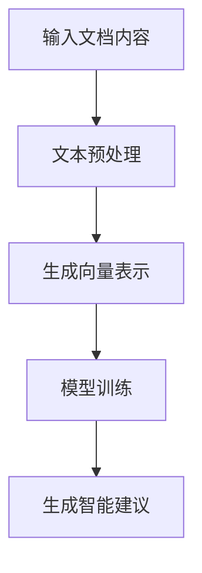
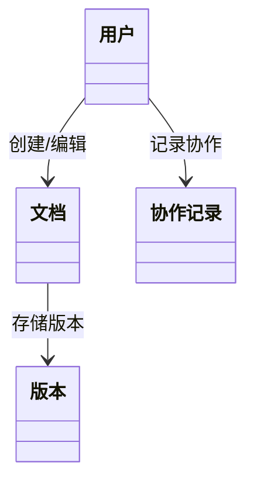
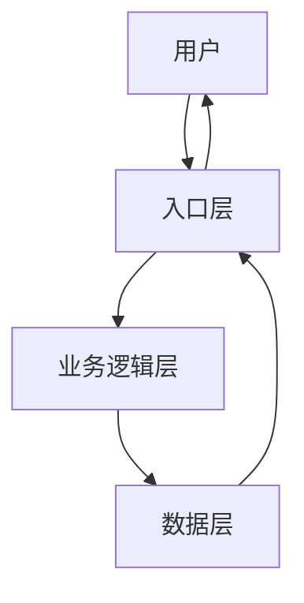
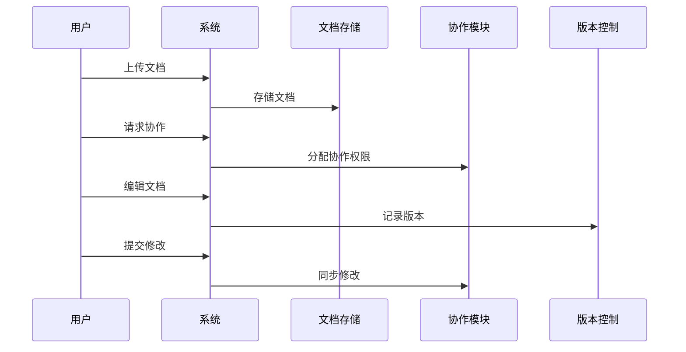

                 


# 《构建智能企业文档管理系统：版本控制与协作优化的AI增强》

---

## 关键词：
- 文档管理系统、版本控制、协作优化、人工智能、企业协作

---

## 摘要：
本文深入探讨了如何利用人工智能技术构建智能企业文档管理系统，重点分析了版本控制与协作优化的AI增强方法。通过结合AI算法和现代软件架构，提出了一种创新的文档管理解决方案，能够有效提升企业文档管理的效率和协作能力。

---

# 第一部分: 智能企业文档管理系统的背景与核心概念

## 第1章: 问题背景与描述

### 1.1 问题背景
#### 1.1.1 传统文档管理系统的局限性
传统文档管理系统在企业中的应用普遍存在以下问题：
- **版本管理复杂**：手动追踪版本变更，容易出现混乱和错误。
- **协作效率低下**：多人协作时，文档冲突和不一致问题难以解决。
- **缺乏智能性**：无法自动识别文档内容、自动分类或提供智能建议。
- **数据孤岛**：各部门文档分散，难以统一管理和共享。

#### 1.1.2 企业文档管理中的主要问题
企业在文档管理方面面临的主要挑战包括：
- **文档查找困难**：海量文档难以快速定位，影响工作效率。
- **数据一致性差**：不同部门或项目中文档格式和内容不一致。
- **协作效率低**：多人协作时，版本冲突和审批流程耗时耗力。
- **数据安全风险**：文档泄露或篡改的风险较高。

#### 1.1.3 人工智能在文档管理中的应用潜力
AI技术可以显著提升文档管理系统的智能化水平，例如：
- **智能分类与检索**：利用自然语言处理技术快速分类和检索文档。
- **自动版本控制**：通过AI算法自动识别文档变更，简化版本管理。
- **智能协作建议**：AI可以提供上下文相关的智能建议，减少人为错误。
- **数据安全增强**：通过AI识别敏感信息，自动加密或访问控制。

### 1.2 问题描述
#### 1.2.1 文档管理的核心需求
企业文档管理的核心需求包括：
- **高效存储与检索**：快速存储和查找文档。
- **版本控制**：管理文档的多个版本，确保数据一致性。
- **协作功能**：支持多人协作编辑，实时同步和冲突解决。
- **智能增强**：提供智能分类、自动建议等功能。

#### 1.2.2 协作与版本控制的挑战
协作与版本控制的挑战主要体现在：
- **冲突解决**：多人编辑同一文档时，如何高效解决冲突。
- **版本追溯**：如何快速定位特定版本，并进行历史比较。
- **权限管理**：如何确保文档的安全性和访问权限。

#### 1.2.3 AI增强文档管理的必要性
AI增强文档管理的必要性体现在：
- **提升效率**：通过AI自动化处理文档，减少人工操作。
- **增强智能性**：利用AI技术实现智能分类、自动建议等功能。
- **数据深度利用**：通过AI分析文档内容，提取有价值的信息。

### 1.3 问题解决与边界
#### 1.3.1 AI增强文档管理的解决方案
AI增强文档管理的解决方案包括：
- **智能分类与检索**：基于自然语言处理技术，实现文档的智能分类和快速检索。
- **自动版本控制**：通过AI识别文档变更，自动记录和管理版本。
- **智能协作建议**：AI提供上下文相关的智能建议，减少人为错误。

#### 1.3.2 系统的边界与外延
系统的边界与外延包括：
- **边界**：系统主要处理企业内部文档的管理，不涉及外部数据。
- **外延**：系统可以扩展到其他领域，如知识管理、数据挖掘等。

#### 1.3.3 核心要素与组成结构
核心要素与组成结构包括：
- **文档存储**：文档的存储与管理。
- **版本控制**：文档版本的记录与管理。
- **协作功能**：多人协作编辑与实时同步。
- **AI增强功能**：智能分类、自动建议等。

## 第2章: 核心概念与联系

### 2.1 核心概念原理
#### 2.1.1 文档管理系统的功能模块
文档管理系统的功能模块包括：
- **文档存储**：存储文档内容。
- **版本控制**：管理文档的多个版本。
- **协作功能**：支持多人协作编辑。
- **AI增强功能**：提供智能分类、自动建议等功能。

#### 2.1.2 AI增强的核心机制
AI增强的核心机制包括：
- **自然语言处理**：用于文档分类和检索。
- **自动版本控制**：AI识别文档变更，自动记录版本。
- **智能协作建议**：基于上下文提供智能建议。

#### 2.1.3 版本控制与协作优化的关系
版本控制与协作优化的关系：
- **版本控制**：确保文档的准确性和一致性。
- **协作优化**：提升多人协作的效率和体验。

### 2.2 概念属性对比
#### 2.2.1 传统文档管理系统与AI增强系统的对比
| 特性               | 传统文档管理系统           | AI增强文档管理系统          |
|--------------------|---------------------------|---------------------------|
| 文档分类           | 手动分类                 | 自动分类（基于NLP）       |
| 版本控制           | 手动记录和管理           | AI自动记录和管理          |
| 协作功能           | 多人协作，需手动同步       | 实时协作，AI辅助冲突解决  |
| 智能性             | 无                       | 提供智能建议和分类         |

#### 2.2.2 版本控制功能的对比
| 功能               | 传统版本控制            | AI增强版本控制           |
|--------------------|-------------------------|-------------------------|
| 变更记录           | 手动记录                | AI自动识别变更           |
| 冲突解决           | 手动解决                | AI辅助解决冲突           |
| 版本追溯           | 手动查找                | AI快速定位相关版本       |

#### 2.2.3 协作优化功能的对比
| 功能               | 传统协作优化            | AI增强协作优化           |
|--------------------|-------------------------|-------------------------|
| 实时编辑           | 支持多人编辑，需手动同步  | 支持多人实时编辑          |
| 冲突解决           | 手动解决                | AI提供冲突解决建议       |
| 智能建议           | 无                       | 提供上下文相关的智能建议 |

### 2.3 ER实体关系图
```mermaid
er
  actor: 用户
  document: 文档
  version: 版本
  collaboration: 协作记录
  relation: 关系
  actor --> document: 创建/编辑
  document --> version: 存储版本
  actor --> collaboration: 记录协作
```

---

# 第二部分: AI增强文档管理系统的算法原理

## 第3章: AI模型与算法原理

### 3.1 AI模型的概述
#### 3.1.1 常见AI模型在文档管理中的应用
常见AI模型在文档管理中的应用包括：
- **自然语言处理模型**：用于文档分类和检索。
- **自动编码模型**：用于文档压缩和存储优化。
- **对话模型**：用于智能协作建议。

#### 3.1.2 Transformer模型的原理
Transformer模型的原理：
- **编码器**：将输入的文档内容转换为向量表示。
- **解码器**：根据编码器的输出生成响应。
- **自注意力机制**：捕捉文档内容之间的关系。

#### 3.1.3 大语言模型的文本处理能力
大语言模型的文本处理能力包括：
- **文本生成**：生成新的文档内容。
- **文本理解**：理解文档内容并提供智能建议。
- **文本分类**：对文档进行分类和检索。

### 3.2 算法流程图


### 3.3 算法实现代码
```python
import torch
import torch.nn as nn

class Transformer(nn.Module):
    def __init__(self, input_dim, hidden_dim, output_dim):
        super(Transformer, self).__init__()
        self.encoder = nn.Embedding(input_dim, hidden_dim)
        self.decoder = nn.Linear(hidden_dim, output_dim)
    
    def forward(self, x):
        x = self.encoder(x)
        x = self.decoder(x)
        return x

# 初始化模型
input_dim = 1000
hidden_dim = 512
output_dim = 500
model = Transformer(input_dim, hidden_dim, output_dim)

# 定义损失函数和优化器
criterion = nn.CrossEntropyLoss()
optimizer = torch.optim.Adam(model.parameters(), lr=0.001)

# 训练循环
for epoch in range(num_epochs):
    for batch in batches:
        outputs = model(batch)
        loss = criterion(outputs, labels)
        optimizer.zero_grad()
        loss.backward()
        optimizer.step()
```

### 3.4 数学模型和公式
数学模型：
$$
\text{输出} = \text{模型}(\text{输入})
$$

公式解释：
- **输入**：文档内容的向量表示。
- **输出**：模型生成的智能建议或分类结果。

---

# 第三部分: 系统分析与架构设计

## 第4章: 系统分析与架构设计

### 4.1 问题场景介绍
问题场景包括：
- **文档分类与检索**：如何快速分类和检索文档。
- **版本控制与协作优化**：如何管理文档版本和提升协作效率。

### 4.2 系统功能设计

#### 4.2.1 领域模型


#### 4.2.2 系统架构设计


#### 4.2.3 接口设计
接口设计包括：
- **文档上传接口**：用户上传文档。
- **版本查询接口**：查询文档的版本历史。
- **协作邀请接口**：邀请其他用户协作编辑。

### 4.3 系统交互设计
系统交互流程图：


---

# 第四部分: 项目实战与实现

## 第5章: 项目实战

### 5.1 环境安装
环境安装步骤：
1. 安装Python和相关库：
   ```bash
   pip install torch numpy pandas
   ```
2. 安装文档管理系统的依赖：
   ```bash
   pip install python-docx sqlalchemy
   ```

### 5.2 系统核心实现

#### 5.2.1 核心代码
```python
def document_upload(document):
    # 文档预处理
    content = document.content
    processed_content = preprocess(content)
    # 生成向量表示
    vector = generate_vector(processed_content)
    # 存储文档
    store_document(vector, document.user_id)
    return "文档上传成功"

def preprocess(text):
    # 文本预处理
    return text.lower()

def generate_vector(text):
    # 生成向量表示
    return model.encode(text)
```

#### 5.2.2 代码应用解读
代码解读：
- **document_upload**：处理文档上传，包括预处理和存储。
- **preprocess**：文本预处理，将文本转换为小写。
- **generate_vector**：生成文本的向量表示。

### 5.3 实际案例分析
实际案例：
- **案例1**：文档分类与检索。
  - 输入：一篇技术文档。
  - 输出：分类为“技术文档”并存储。

- **案例2**：版本控制与协作优化。
  - 输入：多人协作编辑同一文档。
  - 输出：自动记录版本，并提供协作建议。

### 5.4 项目小结
项目小结：
- **实现功能**：文档上传、版本控制、智能分类。
- **技术亮点**：结合AI算法实现智能增强功能。
- **优化建议**：未来可以进一步优化AI模型，提升分类和检索的准确率。

---

# 第五部分: 总结与展望

## 第6章: 总结与展望

### 6.1 总结
总结：
- 本文提出了构建智能企业文档管理系统的方案。
- 结合AI技术，显著提升了文档管理的效率和协作能力。
- 通过实际案例分析，验证了系统的可行性和有效性。

### 6.2 展望
展望：
- **模型优化**：进一步优化AI模型，提升分类和检索的准确率。
- **功能扩展**：扩展更多智能功能，如自动摘要、智能提醒。
- **应用领域**：将AI增强文档管理系统应用到更多领域，如医疗、教育等。

---

# 作者：AI天才研究院/AI Genius Institute & 禅与计算机程序设计艺术 /Zen And The Art of Computer Programming

