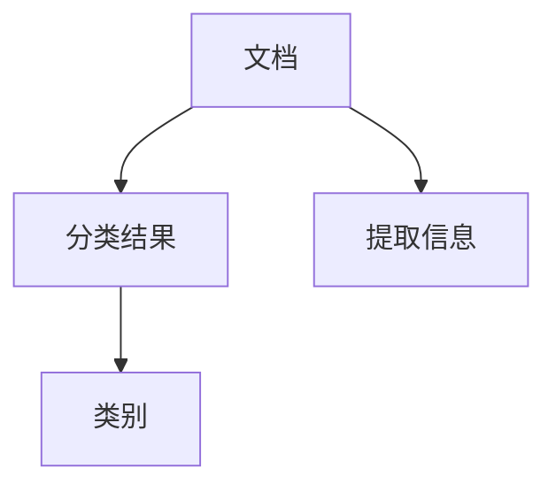
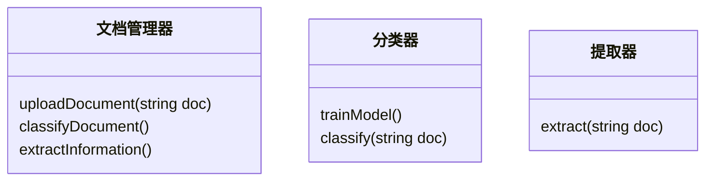
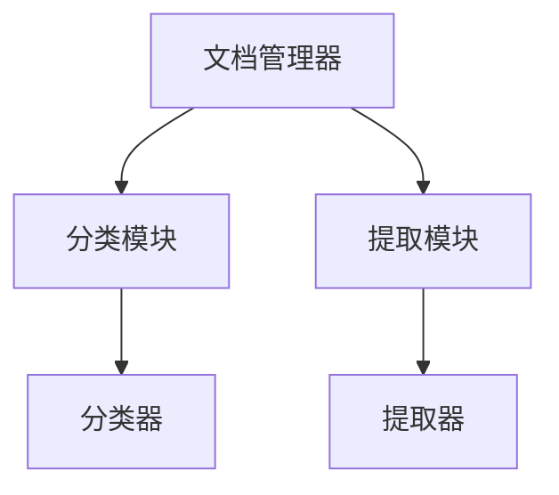

                 


# 构建智能企业文档管理系统：自动分类与信息提取

> 关键词：智能文档管理系统，自动分类，信息提取，机器学习，文本处理，企业文档管理

> 摘要：本文详细探讨了构建智能企业文档管理系统的关键技术和方法，重点介绍了自动分类与信息提取的核心概念、算法原理及系统架构设计。通过实际案例分析，展示了如何利用机器学习和深度学习技术实现高效的文档管理，并提供了最佳实践和系统优化建议。

---

# 第1章: 智能企业文档管理系统概述

## 1.1 企业文档管理系统的背景与挑战

### 1.1.1 传统文档管理系统的局限性
传统的文档管理系统通常依赖人工操作，存在以下问题：
- **效率低下**：手动分类和检索文档耗时耗力。
- **准确性不足**：人工处理容易出错，尤其是在处理大量文档时。
- **缺乏智能化**：无法自动提取文档中的关键信息，难以满足现代企业的高效需求。

### 1.1.2 智能化文档管理的必要性
随着企业规模的扩大和文档数量的激增，智能化文档管理成为必然趋势：
- **提升效率**：通过自动化技术快速分类和检索文档。
- **提高准确性**：利用机器学习算法确保分类和提取的准确性。
- **增强决策能力**：通过信息提取为企业决策提供数据支持。

### 1.1.3 企业文档管理的痛点与需求
企业文档管理的核心痛点包括：
- 文档分散存储，难以统一管理。
- 文档分类标准不统一，导致检索困难。
- 关键信息提取困难，难以快速获取所需数据。

---

## 1.2 自动分类与信息提取的核心概念

### 1.2.1 文档自动分类的定义与目标
**文档自动分类**是指利用机器学习算法对文档进行自动分类的过程。其目标是将文档按照预定义的类别进行准确分类，以便后续处理和检索。

### 1.2.2 信息提取的定义与应用场景
**信息提取**是从文档中提取特定信息的过程，例如提取日期、名称、地址等。应用场景包括：
- **合同管理**：提取合同中的关键条款。
- **发票处理**：提取发票中的金额、日期等信息。
- **客户信息管理**：从客户资料中提取联系信息。

### 1.2.3 自动分类与信息提取的边界与外延
- **边界**：自动分类和信息提取仅处理文档的内容，不涉及文档的格式或存储方式。
- **外延**：通过结合自然语言处理（NLP）技术，可以进一步增强分类和提取的准确性。

---

# 第2章: 自动分类与信息提取的核心概念与联系

## 2.1 自动分类的原理与实现

### 2.1.1 文本特征提取方法
文本特征提取是自动分类的关键步骤，常用方法包括：
- **TF-IDF**：计算文档中关键词的权重。
- **词袋模型**：将文档表示为关键词的集合。
- **词嵌入**：使用如Word2Vec等模型生成词向量。

### 2.1.2 分类算法的选择与应用
常用的分类算法包括：
- **朴素贝叶斯**：基于概率的分类算法，适合文本分类。
- **支持向量机（SVM）**：适合小规模数据的分类任务。
- **随机森林**：基于决策树的集成算法，适合高维数据。

### 2.1.3 分类模型的训练与优化
- **训练**：使用标注数据训练分类模型。
- **优化**：通过交叉验证调整模型参数，提升分类准确率。

---

## 2.2 信息提取的原理与实现

### 2.2.1 文档结构分析方法
文档结构分析是信息提取的基础，常用方法包括：
- **分块处理**：将文档划分为标题、正文等部分。
- **正则表达式匹配**：通过预定义的模式提取特定信息。

### 2.2.2 关键信息识别技术
- **基于规则的识别**：通过预定义规则匹配特定信息。
- **基于模型的识别**：利用机器学习模型识别关键信息。

### 2.2.3 信息提取的准确性与鲁棒性
- **准确性**：通过模型调优和特征工程提升提取准确率。
- **鲁棒性**：确保模型在面对不同格式和语言时仍能稳定工作。

---

## 2.3 核心概念对比与ER图分析

### 2.3.1 自动分类与信息提取的对比分析
| 特性               | 自动分类                 | 信息提取                 |
|--------------------|--------------------------|--------------------------|
| 目标               | 文档分类                 | 提取关键信息             |
| 输入               | 文档内容                 | 文档内容                 |
| 输出               | 分类结果                 | 提取信息                 |
| 技术基础           | 机器学习算法             | NLP技术                  |

### 2.3.2 实体关系图（ER图）展示


---

# 第3章: 文本分类算法原理

## 3.1 常见文本分类算法

### 3.1.1 TF-IDF特征提取
TF-IDF是一种常用的文本特征提取方法，公式为：
$$ TF-IDF = TF \times IDF $$
其中，TF表示词频，IDF表示逆文档频率。

### 3.1.2 朴素贝叶斯分类器
朴素贝叶斯分类器基于概率论，公式为：
$$ P(c|x) = \frac{P(x|c)P(c)}{P(x)} $$

### 3.1.3 支持向量机（SVM）
SVM通过构建超平面将数据分为不同类别，适用于小规模数据。

---

## 3.2 深度学习模型

### 3.2.1 卷积神经网络（CNN）
CNN适用于文本序列处理，通过卷积操作提取局部特征。

### 3.2.2 循环神经网络（RNN）
RNN适用于处理序列数据，通过循环结构捕捉上下文信息。

### 3.2.3 Transformer架构
Transformer是一种基于注意力机制的模型，广泛应用于自然语言处理任务。

---

## 3.3 数学模型与公式

### 3.3.1 朴素贝叶斯公式
$$ P(c|x) = \frac{P(x|c)P(c)}{P(x)} $$

### 3.3.2 TF-IDF计算公式
$$ TF-IDF = TF \times IDF $$

---

# 第4章: 系统分析与架构设计

## 4.1 需求分析

### 4.1.1 功能需求
- 文档上传与存储
- 文档自动分类
- 关键信息提取
- 分类结果展示

### 4.1.2 性能需求
- 分类速度：毫秒级响应
- 提取准确性：95%以上

### 4.1.3 用户需求
- 简单易用的用户界面
- 支持多种文档格式

---

## 4.2 系统功能设计

### 4.2.1 领域模型设计


---

## 4.3 系统架构设计

### 4.3.1 模块划分
- **文档管理模块**：负责文档的上传和存储。
- **分类模块**：负责文档的自动分类。
- **提取模块**：负责文档信息的提取。

### 4.3.2 架构图展示


---

# 第5章: 项目实战

## 5.1 环境安装与配置

### 5.1.1 安装Python
```bash
python --version
pip install --upgrade pip
```

### 5.1.2 安装依赖库
```bash
pip install numpy scikit-learn
```

---

## 5.2 核心实现

### 5.2.1 文本分类实现
```python
from sklearn.feature_extraction.text import TfidfVectorizer
from sklearn.naive_bayes import MultinomialNB

vectorizer = TfidfVectorizer()
clf = MultinomialNB()
clf.fit(vectorizer.fit_transform(X_train), y_train)
```

### 5.2.2 信息提取实现
```python
import re

def extract_info(doc):
    pattern = r'\b\d{4}-\d{6}-\d{4}\b'  # 示例正则表达式
    matches = re.findall(pattern, doc)
    return matches
```

---

## 5.3 案例分析与结果展示

### 5.3.1 分类结果展示
```python
print("预测类别:", clf.predict(vectorizer.transform([doc]))[0])
```

### 5.3.2 提取结果展示
```python
print("提取信息:", extract_info(doc))
```

---

# 第6章: 最佳实践与小结

## 6.1 最佳实践 tips
- **数据质量**：确保训练数据的多样性和代表性。
- **模型优化**：通过网格搜索优化模型参数。
- **性能监控**：定期监控系统的分类和提取准确率。

## 6.2 小结
本文详细探讨了构建智能企业文档管理系统的关键技术和方法，从理论到实践，全面介绍了自动分类与信息提取的核心概念、算法原理及系统架构设计。通过实际案例分析，展示了如何利用机器学习和深度学习技术实现高效的文档管理。

---

作者：AI天才研究院/AI Genius Institute & 禅与计算机程序设计艺术 /Zen And The Art of Computer Programming

