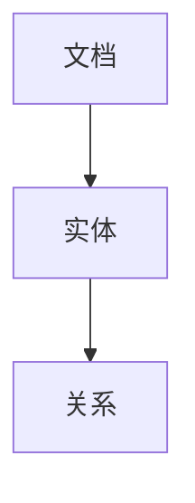
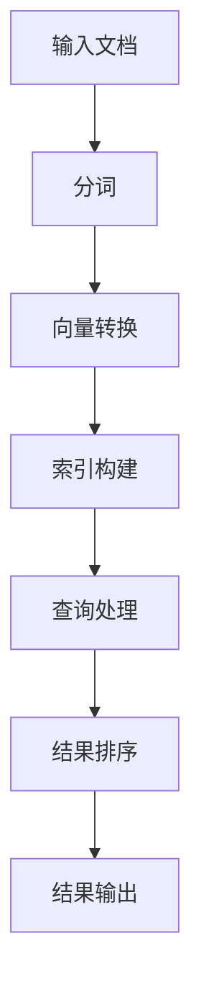
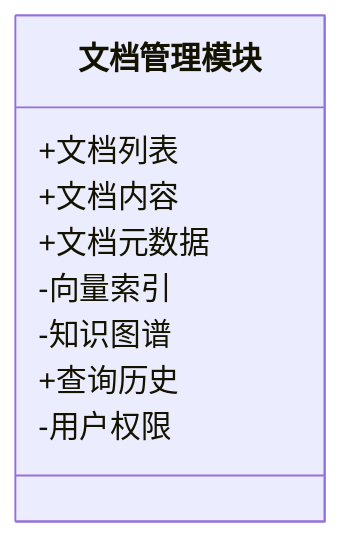
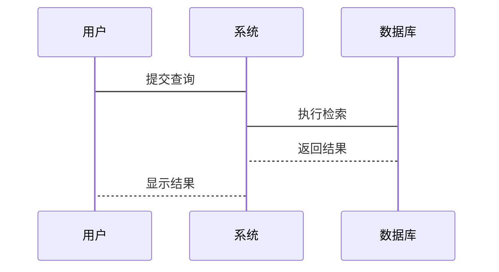

                 


```
# 构建智能企业文档管理系统：语义检索与知识链接

> 关键词：智能文档管理、语义检索、知识图谱、企业信息化、知识链接

> 摘要：随着企业信息化的深入发展，文档管理系统的智能化需求日益迫切。本文从问题背景出发，详细探讨了构建智能企业文档管理系统的必要性，重点分析了语义检索与知识链接的核心原理，结合实际案例，展示了系统的架构设计与实现方案。通过本文的阐述，读者能够全面理解如何利用先进的技术手段，提升企业文档管理的效率与价值。

---

# 第1章: 问题背景与需求分析

## 1.1 企业文档管理的现状与挑战

### 1.1.1 传统文档管理的痛点
传统的文档管理系统通常依赖关键字匹配进行检索，这种方式在面对非结构化数据时显得力不从心。例如，用户搜索“项目计划书”时，系统可能返回大量不相关的文档，因为这些文档虽然包含关键字，但语义并不匹配。此外，文档之间的孤立性也是一个问题，缺乏有效的关联分析，难以支持跨文档的知识推理。

### 1.1.2 数字化转型中的文档管理需求
在企业数字化转型的背景下，文档管理系统需要具备更强的智能化能力。企业希望系统能够理解文档内容，自动提取关键词、实体和关系，并能够基于上下文进行智能检索和关联推荐。这不仅提高了文档管理的效率，还为企业知识的复用和传承提供了有力支持。

### 1.1.3 语义检索与知识链接的重要性
语义检索能够通过理解文档内容的语义进行精确匹配，而知识链接则通过构建文档之间的关联关系，实现跨文档的知识整合。这两者的结合使得文档管理系统能够从“被动存储”转变为“主动服务”，显著提升企业的知识管理水平。

## 1.2 问题描述与目标设定

### 1.2.1 文档管理系统的功能需求
- 文档上传与存储
- 文档预处理（分词、实体识别）
- 语义检索
- 知识图谱构建
- 文档关联分析

### 1.2.2 语义检索的核心问题
如何通过语义理解实现文档的智能检索，解决传统关键字检索的低效问题。

### 1.2.3 知识链接的目标与价值
构建文档之间的语义关联，支持跨文档的知识推理和关联查询。

## 1.3 问题解决的技术路径

### 1.3.1 语义检索的关键技术
- 基于向量的语义检索
- 大模型语义理解
- 知识图谱辅助检索

### 1.3.2 知识图谱的构建方法
- 实体识别与关系抽取
- 知识图谱存储与查询

### 1.3.3 企业文档管理的智能化转型
通过引入语义检索和知识图谱技术，实现文档管理的智能化和知识化。

## 1.4 系统的边界与外延

### 1.4.1 系统边界定义
系统专注于文档的语义检索和知识关联，不涉及文档的生成和版本控制。

### 1.4.2 外延功能分析
- 与企业CRM、ERP等系统的集成
- 第三方API接口的开发

### 1.4.3 系统与其他模块的交互
通过API接口，系统可以与其他企业系统进行数据交互，实现更广泛的功能覆盖。

## 1.5 核心概念与组成结构

### 1.5.1 核心概念的定义
- 文档：企业中的各类电子文件
- 实体：文档中的关键概念
- 关系：实体之间的关联

### 1.5.2 概念属性对比表

| 概念 | 属性 | 描述 |
|------|------|------|
| 文档 | 类型 | PDF、Word、PPT等 |
| 实体 | 名称 | 公司名称、项目名称等 |
| 关系 | 类型 | 属于、包含、相关 |

### 1.5.3 实体关系图（Mermaid）



---

# 第2章: 语义检索的原理与算法

## 2.1 语义检索的基本原理

### 2.1.1 传统检索与语义检索的对比

| 特性 | 传统检索 | 语义检索 |
|------|----------|----------|
| 基础 | 关键字匹配 | 语义理解 |
| 优势 | 实现简单 | 精度高 |
| 劣势 | 精度低 | 实现复杂 |

### 2.1.2 基于向量的语义检索

#### 向量表示方法
- 词嵌入（Word Embedding）
- 句子嵌入（Sentence Embedding）

#### 余弦相似度公式
$$\text{余弦相似度} = \frac{\vec{A} \cdot \vec{B}}{|\vec{A}| |\vec{B}|}$$

### 2.1.3 余弦相似度的计算流程



## 2.2 知识图谱的构建与应用

### 2.2.1 知识图谱的构建流程

1. 实体识别：通过NLP技术从文档中提取实体。
2. 关系抽取：识别实体之间的关系。
3. 知识存储：将实体和关系存储到图数据库中。
4. 图谱查询：支持基于图的查询操作。

### 2.2.2 实体识别与关系抽取

#### 实体识别示例
输入文档：公司与客户签订了一份新合同。
输出实体：公司、客户、合同。

#### 关系抽取示例
输入实体：公司、客户。
输出关系：公司与客户签订合同。

### 2.2.3 基于知识图谱的语义检索

#### 检索流程
1. 输入查询关键词。
2. 通过知识图谱进行关联查询。
3. 返回相关文档。

## 2.3 基于大模型的语义理解

### 2.3.1 大模型在语义理解中的作用
- 提供强大的语义表示能力
- 支持复杂的上下文理解

### 2.3.2 余弦相似度的计算流程


### 2.3.3 大模型的训练与优化
- 预训练模型（如BERT）
- 置信度优化
- 多任务学习

## 2.4 算法流程图（Mermaid）


## 2.5 代码实现示例

### 2.5.1 环境安装
```bash
pip install numpy
pip install scikit-learn
```

### 2.5.2 核心代码
```python
import numpy as np
from sklearn.metrics.pairwise import cosine_similarity

def compute_cosine_similarity(doc1, doc2):
    vec1 = np.array(doc1)
    vec2 = np.array(doc2)
    return cosine_similarity(vec1.reshape(1, -1), vec2.reshape(1, -1))[0][0]

# 示例文档向量
doc1_vec = [0.1, 0.2, 0.3]
doc2_vec = [0.4, 0.5, 0.6]

similarity = compute_cosine_similarity(doc1_vec, doc2_vec)
print(f"相似度：{similarity}")
```

---

# 第3章: 系统分析与架构设计

## 3.1 系统功能设计

### 3.1.1 领域模型（Mermaid类图）



### 3.1.2 系统架构设计（Mermaid架构图）

```mermaid
docker
    image Service
        label User Interface
        expose 80
        env PORT=80
    image Web
        label Web Server
        expose 8080
        env PORT=8080
    image DB
        label Database
        expose 5432
        env PORT=5432
    link Service->Web: HTTP
    link Web->DB: PostgreSQL
```

### 3.1.3 系统接口设计
- 文档上传接口：`POST /upload`
- 文档检索接口：`GET /search`
- 知识图谱构建接口：`POST /knowledge-graph`

### 3.1.4 系统交互流程（Mermaid序列图）



---

# 第4章: 项目实战

## 4.1 实践环境安装

### 4.1.1 Python环境
```bash
python --version
pip install numpy
pip install scikit-learn
pip install spacy
```

### 4.1.2 数据库安装
```bash
brew install postgresql
createdb document_db
```

## 4.2 核心代码实现

### 4.2.1 文档预处理代码

```python
import spacy

nlp = spacy.load("en_core_web_sm")

def process_document(text):
    doc = nlp(text)
    entities = [ent.text for ent in doc.ents]
    return entities

text = "Apple is a company based in California."
entities = process_document(text)
print(f"提取的实体：{entities}")
```

### 4.2.2 知识图谱构建代码

```python
from networkx import Graph

def build_knowledge_graph(documents):
    graph = Graph()
    for doc in documents:
        entities = extract_entities(doc)
        for ent in entities:
            graph.add_node(ent)
    return graph

def extract_entities(text):
    # 使用NLP模型提取实体
    pass

documents = ["Document 1", "Document 2"]
graph = build_knowledge_graph(documents)
print(f"构建的知识图谱：{graph.nodes}")
```

## 4.3 实际案例分析

### 4.3.1 案例背景
- 行业：医疗
- 数据：临床试验报告
- 目标：构建医疗知识图谱

### 4.3.2 案例实现

```python
import spacy

nlp = spacy.load("en_core_medical_sm")

def process_medical_document(text):
    doc = nlp(text)
    entities = [ent.text for ent in doc.ents]
    return entities

text = "The patient has a history of diabetes."
entities = process_medical_document(text)
print(f"提取的医疗实体：{entities}")
```

## 4.4 项目小结

### 4.4.1 项目成果
- 成功构建医疗知识图谱
- 实现了高效的语义检索

### 4.4.2 经验总结
- 数据质量至关重要
- 模型调优提升性能

### 4.4.3 问题与改进
- 数据标注成本高
- 检索效率有待提升

---

# 第5章: 最佳实践与注意事项

## 5.1 最佳实践 tips

### 5.1.1 数据处理
- 数据清洗：去除冗余信息
- 数据标注：提升实体识别准确率

### 5.1.2 模型优化
- 超参数调优
- 模型压缩

### 5.1.3 系统维护
- 定期更新模型
- 监控系统性能

## 5.2 小结

### 5.2.1 核心知识点回顾
- 语义检索的原理
- 知识图谱的构建方法
- 系统架构设计

### 5.2.2 未来展望
- 多模态检索
- 自动化知识图谱构建

## 5.3 注意事项

### 5.3.1 系统安全性
- 权限控制
- 数据加密

### 5.3.2 系统性能
- 响应时间优化
- 资源利用率提升

## 5.4 拓展阅读

### 5.4.1 推荐书籍
- 《深度学习入门：基于Python的卷积神经网络实现》
- 《自然语言处理入门：基于Python和机器学习的文本处理技术》

### 5.4.2 技术博客
- https://towardsdatascience.com
- https://medium.com/ai

---

# 作者：AI天才研究院 & 禅与计算机程序设计艺术
```

