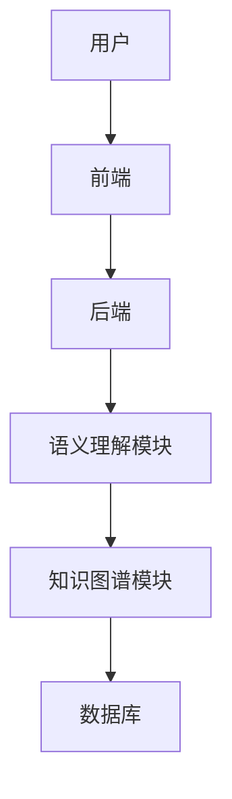
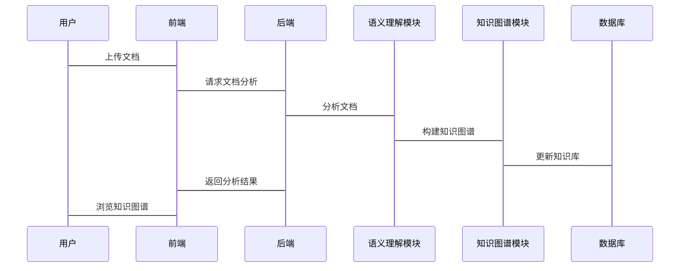

                 


# 构建智能企业文档管理系统：语义理解与知识链接

## 关键词：
- 企业文档管理，语义理解，知识链接，智能系统，文档管理系统

## 摘要：
本文章详细探讨了如何构建一个基于语义理解与知识链接的智能企业文档管理系统。传统文档管理系统在企业中的应用存在诸多痛点，如内容难以语义化理解、知识无法有效关联、信息检索效率低下等。本文通过分析语义理解的核心原理与知识链接的技术实现，提出了一种创新的解决方案。结合大语言模型（如BERT、GPT）的语义分析能力和知识图谱的关联技术，构建了一个智能化的企业文档管理系统。系统设计包括文档上传与存储、语义理解与分析、知识链接与关联、用户界面设计等核心功能模块，并详细阐述了系统架构设计、算法实现、项目实战及最佳实践。

---

# 第一部分: 智能企业文档管理系统概述

## 第1章: 企业文档管理的背景与挑战

### 1.1 传统文档管理系统的局限性
#### 1.1.1 文档管理的痛点与难点
传统文档管理系统主要依赖关键字匹配进行信息检索，难以理解文档的语义内容，导致信息检索效率低下。此外，文档之间的知识关联性较弱，难以支持复杂的业务需求。

#### 1.1.2 文档管理系统的工作原理
传统文档管理系统通常采用文件存储和关键字索引的方式，用户通过输入关键字或简单的查询条件进行文档检索。这种方式无法理解文档内容，也无法进行跨文档的知识关联。

#### 1.1.3 企业文档管理的现状与问题
随着企业规模的扩大和文档数量的激增，传统文档管理系统在处理复杂查询和知识关联方面的能力显得不足，难以满足现代企业的智能化需求。

### 1.2 智能文档管理的提出
#### 1.2.1 什么是智能文档管理系统
智能文档管理系统是一种基于人工智能技术的文档管理解决方案，能够理解文档的语义内容，并通过知识图谱技术实现文档之间的知识关联。

#### 1.2.2 智能文档管理的核心目标
智能文档管理的核心目标是通过语义理解技术，实现文档内容的理解与分析，并通过知识链接技术，构建文档之间的语义关联，提升信息检索和知识管理的效率。

#### 1.2.3 智能文档管理与传统文档管理的区别
| 特性 | 传统文档管理 | 智能文档管理 |
|------|--------------|-------------|
| 数据处理 | 纯文本存储 | 语义化存储 |
| 信息检索 | 关键字匹配 | 语义理解检索 |
| 知识关联 | 无 | 知识图谱关联 |

### 1.3 语义理解与知识链接的重要性
#### 1.3.1 语义理解在文档管理中的作用
语义理解技术能够帮助系统理解文档的内容，从而实现更智能的信息检索和知识管理。

#### 1.3.2 知识链接的定义与价值
知识链接是指将文档中的实体、概念等与外部知识库中的知识进行关联，从而形成一个语义网络，提升知识管理的深度和广度。

#### 1.3.3 语义理解与知识链接的结合
语义理解为知识链接提供了语义基础，而知识链接则为语义理解提供了上下文支持，两者相辅相成，共同提升文档管理的智能化水平。

### 1.4 本章小结
本章主要介绍了传统文档管理系统的局限性，提出了智能文档管理的概念，并详细阐述了语义理解与知识链接在智能文档管理中的重要性。

---

## 第2章: 语义理解与知识链接的核心概念

### 2.1 语义理解的基本原理
#### 2.1.1 什么是语义理解
语义理解是指系统能够理解文本的语义内容，而不仅仅是表面的文字。

#### 2.1.2 语义理解的关键技术
语义理解的关键技术包括自然语言处理（NLP）、词嵌入（Word Embedding）、预训练语言模型（如BERT、GPT）等。

#### 2.1.3 语义理解的实现方法
语义理解可以通过基于规则的语义分析、统计模型和深度学习模型等多种方法实现。

### 2.2 知识链接的概念与特点
#### 2.2.1 知识图谱的定义
知识图谱是一种以图结构形式表示知识的语义网络，节点表示实体或概念，边表示实体之间的关系。

#### 2.2.2 知识链接的核心要素
知识链接的核心要素包括实体识别、关系抽取和语义关联。

#### 2.2.3 知识链接与语义理解的关系
知识链接依赖于语义理解来确定实体之间的关联关系，而语义理解则通过知识链接来提升语义分析的深度。

### 2.3 语义理解与知识链接的对比分析
| 特性 | 语义理解 | 知识链接 |
|------|----------|----------|
| 核心目标 | 理解文本内容 | 建立知识关联 |
| 实现方法 | 语言模型、词嵌入 | 实体识别、关系抽取 |
| 应用场景 | 文本分类、信息提取 | 知识图谱构建、语义检索 |

### 2.4 本章小结
本章详细介绍了语义理解和知识链接的核心概念，分析了两者之间的关系及其在智能文档管理中的作用。

---

## 第3章: 基于大模型的语义理解算法原理

### 3.1 预训练语言模型简介
#### 3.1.1 BERT模型的基本结构
BERT（Bidirectional Encoder Representations from Transformers）是一种基于Transformer的预训练语言模型，通过双向上下文信息进行文本表示。

#### 3.1.2 GPT模型的核心原理
GPT（Generative Pre-trained Transformer）是一种生成式预训练语言模型，通过单向上下文信息进行文本生成。

#### 3.1.3 其他主流模型的对比
| 模型 | BERT | GPT | RoBERTa |
|------|------|------|---------|
| 特点 | 双向结构 | 单向结构 | 增强版BERT |

### 3.2 语义理解的数学模型
#### 3.2.1 语言模型的损失函数
$$ L = -\sum_{i=1}^{n} \log P(w_i | w_{i-1}, ..., w_{i-k}) $$
其中，\( w_i \) 表示第 \( i \) 个词，\( k \) 表示上下文的窗口大小。

#### 3.2.2 BERT模型的预训练目标
$$ \text{MLM}(x) = \log p(x_i | x_{i-1}, ..., x_{i-k}) $$
其中，\( MLM \) 表示遮蔽语言模型（Masked Language Model）。

### 3.3 知识链接的算法流程
#### 3.3.1 知识抽取
通过自然语言处理技术，从文档中抽取实体、关系和概念。

#### 3.3.2 知识融合
将抽取的知识与外部知识库中的知识进行融合，构建知识图谱。

#### 3.3.3 知识推理
通过知识图谱推理，生成新的知识关联。

### 3.4 本章小结
本章详细介绍了基于大模型的语义理解算法原理，包括预训练语言模型的基本结构、语义理解的数学模型以及知识链接的算法流程。

---

## 第4章: 智能文档管理系统架构设计

### 4.1 系统功能设计
#### 4.1.1 文档上传与存储
用户可以通过前端上传文档，系统将文档存储到数据库中。

#### 4.1.2 语义理解与分析
系统对上传的文档进行语义分析，提取文档中的实体、关系和概念。

#### 4.1.3 知识链接与关联
系统将提取的知识与外部知识库中的知识进行关联，构建知识图谱。

#### 4.1.4 用户界面设计
提供友好的用户界面，用户可以通过界面进行文档上传、查询和知识浏览。

### 4.2 系统架构设计
#### 4.2.1 系统架构图


#### 4.2.2 系统接口设计
系统提供RESTful API接口，供前端调用。

#### 4.2.3 系统交互流程


### 4.3 本章小结
本章详细介绍了智能文档管理系统的架构设计，包括系统功能设计、架构图、接口设计和交互流程。

---

## 第5章: 项目实战

### 5.1 环境安装
#### 5.1.1 安装Python
需要安装Python 3.8及以上版本。

#### 5.1.2 安装依赖库
安装必要的依赖库，如TensorFlow、PyTorch、transformers等。

### 5.2 核心代码实现
#### 5.2.1 文档上传与存储
```python
def upload_document(document):
    # 将文档存储到数据库中
    db.document.insert(document)
```

#### 5.2.2 语义理解与分析
```python
def semantic_analysis(document):
    # 使用预训练语言模型进行语义分析
    model = load_model('bert')
    result = model(document)
    return result
```

#### 5.2.3 知识链接与关联
```python
def knowledge_linking(result):
    # 将分析结果与知识库进行关联
    knowledge_graph.update(result)
```

### 5.3 案例分析
#### 5.3.1 文档上传与分析
用户上传一份公司年报，系统对其进行语义分析，提取出公司名称、收入、利润等关键信息。

#### 5.3.2 知识图谱构建
系统将提取的信息与外部知识库（如公司行业数据）进行关联，构建知识图谱。

### 5.4 项目总结
本章通过实际项目实战，详细展示了智能文档管理系统的实现过程，包括环境安装、核心代码实现和案例分析。

---

## 第6章: 最佳实践与小结

### 6.1 本章小结
总结全文，回顾智能文档管理系统的构建过程，强调语义理解与知识链接的重要性。

### 6.2 注意事项
在实际应用中，需要注意数据隐私、模型训练成本、知识图谱的维护等问题。

### 6.3 拓展阅读
建议读者进一步学习自然语言处理、知识图谱和深度学习的相关知识，以深入理解智能文档管理系统的实现细节。

---

## 作者：AI天才研究院/AI Genius Institute & 禅与计算机程序设计艺术 /Zen And The Art of Computer Programming

