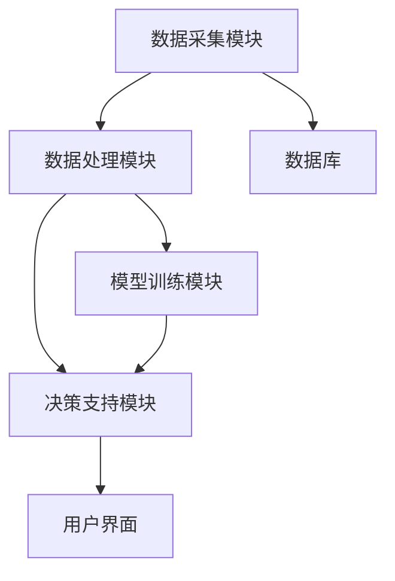

                 


# 构建智能企业知识产权运营平台：AI辅助决策

> 关键词：知识产权管理、人工智能、自然语言处理、机器学习、系统架构设计、算法实现、项目实战

> 摘要：本文详细探讨了如何利用人工智能技术构建智能企业知识产权运营平台，通过自然语言处理和机器学习算法，实现知识产权的智能管理与决策支持。文章从背景介绍、核心概念、系统设计、算法实现、项目实战到最佳实践，全面分析了构建该平台的关键技术与实现细节，为读者提供了从理论到实践的完整指南。

---

## 目录大纲

1. **知识产权与AI辅助决策的背景**
   - 1.1 知识产权的基本概念
   - 1.2 AI在知识产权管理中的应用

2. **AI辅助知识产权管理的核心概念与技术基础**
   - 2.1 自然语言处理（NLP）在知识产权管理中的应用
   - 2.2 机器学习与深度学习在知识产权管理中的应用

3. **系统架构与设计**
   - 3.1 系统功能模块划分
   - 3.2 系统架构图

4. **算法原理与实现**
   - 4.1 专利相似度计算算法
   - 4.2 侵权检测算法

5. **项目实战**
   - 5.1 环境搭建与代码实现
   - 5.2 实际案例分析

6. **最佳实践、小结与展望**

---

## 正文

### 第1章：知识产权与AI辅助决策的背景

#### 1.1 知识产权的基本概念

- **1.1.1 知识产权的定义与范围**
  - 知识产权是法律保护的智力成果，包括专利、商标、版权等。
  - 知识产权管理涉及专利检索、分析、评估、保护等多个方面。

- **1.1.2 知识产权的重要性**
  - 知识产权是企业核心竞争力的重要组成部分。
  - 有效的知识产权管理可以提升企业的市场地位和盈利能力。

- **1.1.3 知识产权管理的挑战**
  - 数据量大、信息分散，难以高效管理。
  - 知识产权侵权风险高，需要实时监控和分析。

#### 1.2 AI在知识产权管理中的应用

- **1.2.1 AI技术如何辅助知识产权管理**
  - 自然语言处理（NLP）用于专利文本分析和检索。
  - 机器学习用于专利分类和侵权预测。

- **1.2.2 当前AI在知识产权领域的应用现状**
  - AI已经应用于专利检索、侵权检测、技术趋势分析等领域。
  - AI技术的引入显著提高了知识产权管理的效率和准确性。

- **1.2.3 AI辅助决策的优势与局限**
  - 优势：高效性、准确性、实时性。
  - 局限：依赖数据质量，需结合人工审核。

---

### 第2章：AI辅助知识产权管理的核心概念与技术基础

#### 2.1 自然语言处理（NLP）在知识产权管理中的应用

- **2.1.1 NLP的基本原理**
  - NLP通过处理文本数据，提取关键词、主题和情感信息。
  - 常用技术包括分词、实体识别、语义分析等。

- **2.1.2 NLP在专利检索中的应用**
  - 使用NLP技术对专利文本进行关键词提取和语义分析。
  - 帮助用户快速找到相关的专利信息。

- **2.1.3 NLP在专利分析中的作用**
  - 通过分析专利文本，识别技术趋势和竞争对手的动态。
  - 支持专利布局和战略制定。

#### 2.2 机器学习与深度学习在知识产权管理中的应用

- **2.2.1 机器学习的基本原理**
  - 机器学习通过训练数据模型，进行分类、回归和聚类分析。
  - 常用算法包括支持向量机（SVM）、随机森林等。

- **2.2.2 深度学习在专利分类中的应用**
  - 使用深度学习模型（如卷积神经网络CNN）进行专利分类。
  - 模型能够自动提取文本特征，提高分类准确性。

- **2.2.3 神经网络在侵权检测中的应用**
  - 构建神经网络模型，识别潜在的侵权专利。
  - 通过对比技术特征，评估侵权可能性。

---

### 第3章：系统架构与设计

#### 3.1 系统功能模块划分

- **3.1.1 数据采集模块**
  - 从专利数据库中获取专利文本数据。
  - 支持多种数据源的接入。

- **3.1.2 数据处理模块**
  - 对专利文本进行清洗、预处理和标注。
  - 使用NLP技术提取关键词和实体。

- **3.1.3 决策支持模块**
  - 提供专利检索、分析和侵权检测功能。
  - 输出分析报告和决策建议。

#### 3.2 系统架构图



---

### 第4章：算法原理与实现

#### 4.1 专利相似度计算算法

- **4.1.1 算法原理**
  - 使用余弦相似度计算专利文本的相似性。
  - 公式：$$\text{similarity}(A, B) = \frac{\vec{A} \cdot \vec{B}}{|\vec{A}| |\vec{B}|}$$

- **4.1.2 代码实现**
  - Python代码示例：
  ```python
  from sklearn.feature_extraction.text import TfidfVectorizer

  def compute_similarity(documents):
      vectorizer = TfidfVectorizer()
      X = vectorizer.fit_transform(documents)
      return (X.T * X).A
  ```

#### 4.2 侵权检测算法

- **4.2.1 算法原理**
  - 使用支持向量机（SVM）进行分类。
  - 训练模型识别侵权专利。

- **4.2.2 代码实现**
  ```python
  from sklearn import svm

  def train_infringement_model(X_train, y_train):
      clf = svm.SVC()
      clf.fit(X_train, y_train)
      return clf
  ```

---

### 第5章：项目实战

#### 5.1 环境搭建与代码实现

- **环境搭建**
  - 安装Python和相关库（scikit-learn、spaCy、Keras）。
  - 配置本地专利数据库。

- **核心代码实现**
  ```python
  import spacy

  nlp = spacy.load("en_core_web_sm")

  def extract_entities(text):
      doc = nlp(text)
      entities = [ent.text for ent in doc.ents]
      return entities
  ```

#### 5.2 实际案例分析

- 案例：某企业的专利检索与侵权分析。
  - 使用NLP提取关键词，检索相关专利。
  - 应用机器学习模型预测侵权风险。

---

### 第6章：最佳实践、小结与展望

#### 6.1 最佳实践

- 数据质量是关键，确保数据清洗和预处理。
- 结合人工审核，避免AI决策的局限性。

#### 6.2 小结

- 本文详细介绍了构建智能企业知识产权运营平台的各个方面，从背景到实现，为读者提供了全面的指导。
- 通过AI技术的应用，显著提升了知识产权管理的效率和准确性。

#### 6.3 展望

- 随着AI技术的不断进步，未来知识产权管理将更加智能化和自动化。
- 结合区块链技术，进一步提升知识产权保护的安全性和可信度。

---

## 作者

作者：AI天才研究院/AI Genius Institute & 禅与计算机程序设计艺术 /Zen And The Art of Computer Programming

---

以上是文章的详细目录和内容概要。如果需要进一步扩展某一章节的内容，请随时告知！

