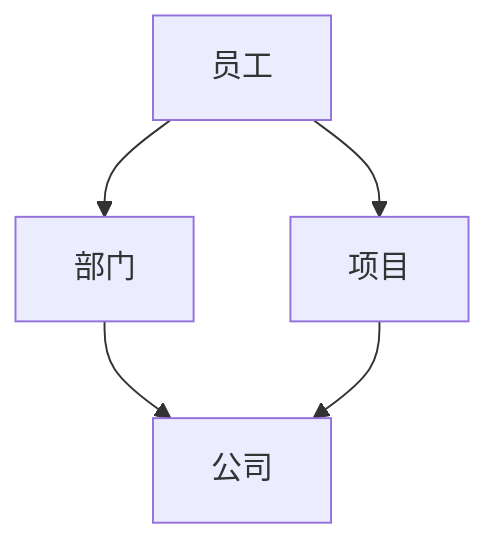
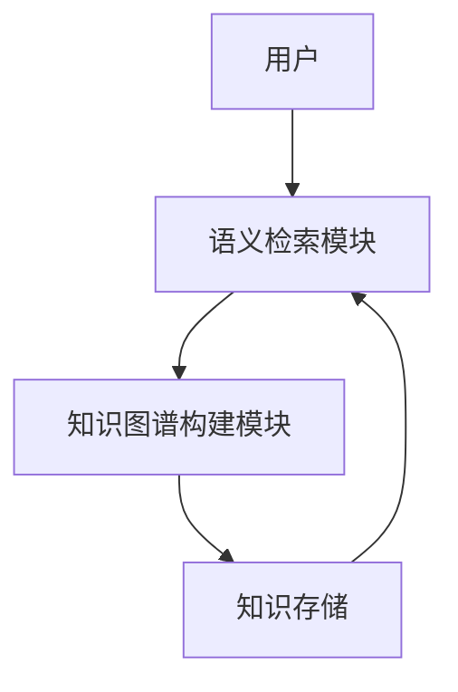

                 


# 构建智能企业知识管理平台：动态知识图谱与语义检索

> 关键词：企业知识管理，动态知识图谱，语义检索，知识图谱构建，语义检索算法，系统架构设计

> 摘要：本文详细探讨了构建智能企业知识管理平台的核心技术，重点介绍了动态知识图谱和语义检索的原理与实现。通过分析知识管理的背景与挑战，动态知识图谱与语义检索的核心概念，以及相关的算法原理，本文为读者提供了从理论到实践的全面指导。结合实际项目案例，深入解析了系统架构设计与实现过程，并提出了最佳实践与未来发展方向。

---

# 第一部分：智能企业知识管理平台的背景与核心概念

## 第1章：企业知识管理的背景与挑战

### 1.1 知识管理的重要性

#### 1.1.1 知识管理的定义与目标
知识管理（Knowledge Management，KM）是指通过系统化的方法，将企业内外部的知识进行采集、整理、存储、分析和应用，以提升企业竞争力和创新能力。其目标是将隐性知识显性化，显性知识系统化，从而实现知识的共享与复用。

#### 1.1.2 传统知识管理的局限性
传统的知识管理方式主要依赖文档管理和简单的信息检索，存在以下问题：
- 知识分散：知识以文档形式分散在各个部门或员工脑中，难以快速检索和共享。
- 更新滞后：知识更新依赖人工操作，难以实时反映企业动态。
- 孤岛效应：不同部门或系统之间的知识无法有效集成和共享。

#### 1.1.3 智能化知识管理的需求
随着企业数字化转型的推进，智能化知识管理成为必然趋势：
- 需要快速响应业务需求，实时更新知识库。
- 需要通过智能化手段（如自然语言处理、机器学习）提升知识的自动化处理能力。
- 需要实现知识的深度理解和关联，支持语义检索。

---

### 1.2 动态知识图谱的背景

#### 1.2.1 知识图谱的定义与特点
知识图谱是一种以图结构形式表示知识的工具，节点表示实体，边表示实体之间的关系。知识图谱的特点包括：
- **结构化**：通过节点和边的明确定义，实现知识的结构化表示。
- **可扩展性**：支持大规模数据的扩展。
- **语义关联**：通过实体关系揭示知识间的隐含联系。

#### 1.2.2 动态知识图谱的演进
动态知识图谱是在静态知识图谱的基础上，增加了实时更新和动态调整的能力。其演进过程如下：
1. **静态知识图谱**：初始版本的知识图谱，基于已知数据构建。
2. **增量式更新**：根据实时数据流，逐步更新知识图谱。
3. **自适应调整**：通过反馈机制，动态优化知识图谱的结构和内容。

#### 1.2.3 动态知识图谱在企业中的应用
动态知识图谱在企业中的应用场景包括：
- **实时数据分析**：快速处理业务数据，更新知识图谱。
- **智能推荐**：基于知识图谱的关联性，提供个性化推荐。
- **风险管理**：通过知识图谱的动态更新，及时发现潜在风险。

---

### 1.3 语义检索的核心价值

#### 1.3.1 传统检索技术的不足
传统检索技术（如基于关键词的检索）存在以下问题：
- **准确性低**：无法理解用户的实际需求，容易返回无关结果。
- **语义理解弱**：无法处理复杂的语义关系。

#### 1.3.2 语义检索的基本原理
语义检索基于自然语言处理技术，通过理解用户查询的语义，匹配最相关的知识。其基本原理包括：
1. **语义解析**：将用户查询转换为语义表示。
2. **知识匹配**：基于知识图谱进行语义匹配。
3. **结果排序**：根据匹配度对结果进行排序。

#### 1.3.3 语义检索在企业中的应用场景
语义检索在企业中的应用场景包括：
- **智能问答**：基于知识图谱提供精准的答案。
- **知识挖掘**：从海量数据中提取有价值的知识。
- **决策支持**：通过语义检索提供实时数据支持。

---

### 1.4 核心概念对比分析

#### 1.4.1 动态知识图谱与静态知识图谱对比
| 特性               | 静态知识图谱               | 动态知识图谱               |
|--------------------|--------------------------|--------------------------|
| 数据更新           | 静态，定期更新            | 动态，实时更新            |
| 知识关联           | 稳定，结构固定            | 灵活，结构可变            |
| 应用场景           | 知识查询、静态分析        | 实时分析、动态调整        |

#### 1.4.2 语义检索与传统检索对比
| 特性               | 传统检索                 | 语义检索                 |
|--------------------|--------------------------|--------------------------|
| 检索依据           | 关键词匹配               | 语义理解                 |
| 准确性             | 低                       | 高                       |
| 应用场景           | 基于关键词的搜索         | 基于语义的理解           |

#### 1.4.3 实体关系图的构建与展示
通过Mermaid图展示实体关系图的构建过程：



---

## 第2章：动态知识图谱与语义检索的核心概念

### 2.1 动态知识图谱的定义与特点

#### 2.1.1 知识图谱的构建过程
知识图谱的构建过程包括以下几个步骤：
1. **数据采集**：从多种数据源（如数据库、文档、日志）获取数据。
2. **知识抽取**：从数据中提取实体和关系。
3. **知识融合**：将多个数据源的知识进行整合，消除冗余和冲突。
4. **知识存储**：将知识以图结构形式存储。

#### 2.1.2 动态知识图谱的动态更新机制
动态知识图谱的更新机制包括：
1. **增量式更新**：仅更新变化的部分，减少计算开销。
2. **实时更新**：根据实时数据流，动态更新知识图谱。
3. **自适应调整**：根据用户反馈，优化知识图谱的结构。

#### 2.1.3 动态知识图谱的核心要素
动态知识图谱的核心要素包括：
- **实体**：知识图谱中的基本单元，表示人、物、概念等。
- **关系**：实体之间的关联，表示实体间的作用或联系。
- **属性**：实体的特征或属性，如“员工的年龄”。
- **时间戳**：记录知识的变化时间，支持版本控制。

---

### 2.2 语义检索的原理与实现

#### 2.2.1 语义检索的基本原理
语义检索的基本原理包括：
1. **语义解析**：将用户查询转换为语义表示。
2. **知识匹配**：基于知识图谱进行语义匹配。
3. **结果排序**：根据匹配度对结果进行排序。

#### 2.2.2 语义检索的关键技术
语义检索的关键技术包括：
- **自然语言处理**：用于语义解析和语义匹配。
- **向量表示**：将实体和关系表示为向量，用于计算相似度。
- **图结构检索**：基于知识图谱的图结构进行检索。

#### 2.2.3 语义检索与知识图谱的结合
语义检索与知识图谱的结合方式包括：
- **基于向量的检索**：将用户查询转换为向量，与知识图谱中的实体向量进行匹配。
- **基于图的检索**：通过遍历知识图谱，找到与用户查询相关的实体。

---

### 2.3 动态知识图谱与语义检索的联系与区别

#### 2.3.1 动态知识图谱与语义检索的联系
1. **动态知识图谱提供语义基础**：语义检索依赖于知识图谱中的语义关联。
2. **实时更新支持动态检索**：动态知识图谱的实时更新能力，保证了语义检索的准确性。

#### 2.3.2 动态知识图谱与语义检索的区别
1. **动态知识图谱关注知识的存储与更新**。
2. **语义检索关注知识的查询与匹配**。

---

### 2.4 核心概念对比分析

#### 2.4.1 动态知识图谱与静态知识图谱对比
| 特性               | 静态知识图谱               | 动态知识图谱               |
|--------------------|--------------------------|--------------------------|
| 数据更新           | 静态，定期更新            | 动态，实时更新            |
| 知识关联           | 稳定，结构固定            | 灵活，结构可变            |

---

## 第3章：动态知识图谱与语义检索的算法原理

### 3.1 动态知识图谱的构建算法

#### 3.1.1 知识抽取算法
知识抽取算法包括：
1. **实体识别**：通过自然语言处理技术，识别文本中的实体。
2. **关系抽取**：通过自然语言处理技术，识别实体之间的关系。

#### 3.1.2 知识融合算法
知识融合算法包括：
1. **实体对齐**：将不同数据源中的实体进行对齐。
2. **关系合并**：将不同数据源中的关系进行合并。

#### 3.1.3 知识图谱动态更新算法
知识图谱动态更新算法包括：
1. **增量式更新**：仅更新变化的部分。
2. **实时更新**：根据实时数据流，动态更新知识图谱。

---

### 3.2 语义检索的算法实现

#### 3.2.1 基于向量的语义检索
基于向量的语义检索算法包括：
1. **向量表示**：将实体和关系表示为向量。
2. **相似度计算**：通过向量相似度计算，找到最相关的实体。

#### 3.2.2 基于图的语义检索
基于图的语义检索算法包括：
1. **图遍历**：通过遍历知识图谱，找到与用户查询相关的实体。
2. **路径分析**：分析实体之间的路径，确定关联性。

---

### 3.3 动态知识图谱与语义检索的协同工作

#### 3.3.1 动态知识图谱的实时更新
动态知识图谱的实时更新流程如下：
1. **数据采集**：从实时数据源采集数据。
2. **知识抽取**：从数据中抽取实体和关系。
3. **知识融合**：将新知识融入知识图谱。
4. **更新存储**：将更新后的内容存储到知识图谱中。

#### 3.3.2 语义检索的实时响应
语义检索的实时响应流程如下：
1. **用户查询**：用户提交查询请求。
2. **语义解析**：将用户查询转换为语义表示。
3. **知识匹配**：基于知识图谱进行语义匹配。
4. **结果返回**：返回最相关的知识。

---

## 第4章：动态知识图谱与语义检索的系统架构设计

### 4.1 系统功能设计

#### 4.1.1 知识图谱构建模块
知识图谱构建模块包括：
1. **数据采集**：从多种数据源采集数据。
2. **知识抽取**：从数据中抽取实体和关系。
3. **知识融合**：将抽取的知识进行融合。
4. **知识存储**：将知识以图结构形式存储。

#### 4.1.2 语义检索模块
语义检索模块包括：
1. **用户查询**：用户提交查询请求。
2. **语义解析**：将用户查询转换为语义表示。
3. **知识匹配**：基于知识图谱进行语义匹配。
4. **结果返回**：返回最相关的知识。

---

### 4.2 系统架构设计

#### 4.2.1 系统架构图
通过Mermaid图展示系统架构图：



---

## 第5章：动态知识图谱与语义检索的项目实战

### 5.1 项目背景与目标

#### 5.1.1 项目背景
某企业希望构建一个智能知识管理平台，以提高知识共享和应用效率。

#### 5.1.2 项目目标
- 实现动态知识图谱的构建与更新。
- 实现语义检索功能，支持智能问答和知识挖掘。

---

### 5.2 项目环境与工具

#### 5.2.1 环境安装
- **Python**：版本3.8及以上。
- **Jieba**：中文分词工具。
- **NetworkX**：图结构处理库。
- **spaCy**：自然语言处理库。

---

### 5.3 项目核心代码实现

#### 5.3.1 知识抽取代码
```python
import jieba

text = "员工张三属于研发部门，参与项目A的研发。"
words = jieba.lcut(text)
print(words)  # 输出: ['员工', '张三', '属于', '研发部门', '，', '参与', '项目A', '的研发']
```

---

### 5.4 项目总结与展望

#### 5.4.1 项目总结
通过本项目，我们成功实现了动态知识图谱的构建与更新，以及语义检索功能。系统具备以下特点：
- **实时更新**：能够实时更新知识图谱，保证知识的准确性。
- **智能检索**：支持语义检索，提供精准的知识匹配。

---

## 第6章：最佳实践与未来展望

### 6.1 最佳实践

#### 6.1.1 知识图谱的构建
- **数据源多样化**：尽可能从多种数据源获取数据。
- **知识抽取准确**：采用多种自然语言处理技术，提高知识抽取的准确性。

#### 6.1.2 语义检索的优化
- **向量表示优化**：采用更高效的向量表示方法，提高检索的准确性。
- **图结构优化**：优化知识图谱的结构，提高检索效率。

---

### 6.2 未来展望

#### 6.2.1 知识图谱的扩展
未来，动态知识图谱将更加智能化，能够自动学习和适应新的知识。

#### 6.2.2 语义检索的增强
语义检索将更加智能化，能够理解更复杂的语义关系，提供更精准的结果。

---

## 结语

构建智能企业知识管理平台是一项复杂的系统工程，需要结合动态知识图谱和语义检索等多种技术。通过本文的详细讲解，读者可以全面了解动态知识图谱与语义检索的核心概念、算法原理和系统架构设计。未来，随着人工智能技术的不断发展，智能企业知识管理平台将更加智能化和高效化。

---

## 作者：AI天才研究院/AI Genius Institute & 禅与计算机程序设计艺术 /Zen And The Art of Computer Programming

