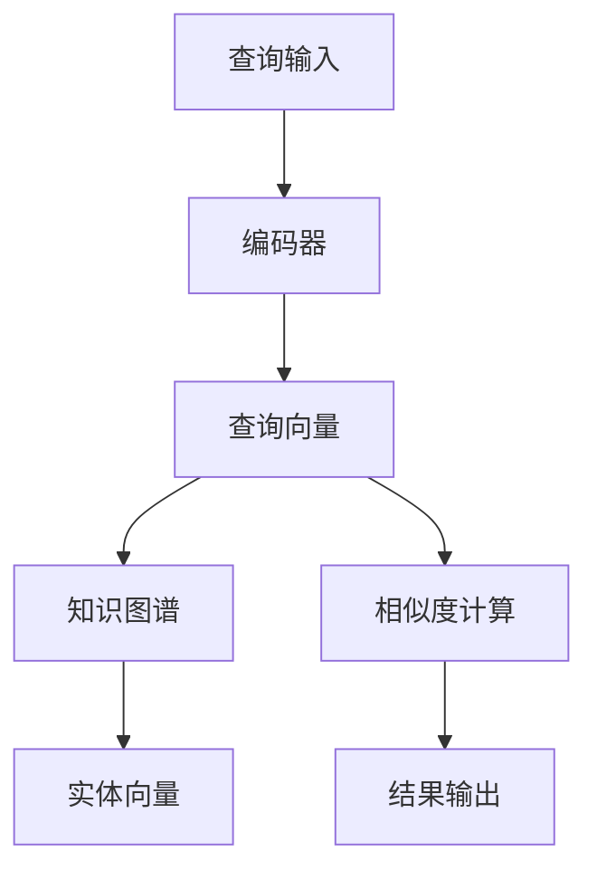

                 


# 构建智能企业知识管理平台：动态知识图谱与语义检索

---

## 关键词：  
知识管理平台、动态知识图谱、语义检索、企业信息化、智能化

---

## 摘要：  
随着企业信息化的快速发展，知识管理平台的构建已成为提升企业竞争力的重要手段。传统的知识管理方式存在信息孤岛、检索效率低等问题，难以满足现代企业的智能化需求。本文将详细探讨如何利用动态知识图谱与语义检索技术，构建智能企业知识管理平台。文章从背景、核心概念、算法原理、系统架构到项目实战，全面解析动态知识图谱与语义检索的应用，为企业知识管理的智能化转型提供理论与实践指导。

---

# 第1章: 知识管理平台的背景与挑战

## 1.1 知识管理平台的背景  
知识管理（Knowledge Management，KM）是指对企业内外部知识的获取、组织、存储、检索和应用的过程。随着企业信息化的发展，知识管理逐渐从传统的文档管理扩展到智能化的知识网络构建。企业希望通过知识管理平台，实现知识的高效共享、快速检索和智能应用，从而提升决策效率和创新能力。

---

## 1.2 企业知识管理的现状与问题  

### 1.2.1 知识孤岛问题  
企业在不同部门、系统中积累了大量的知识资源，但由于缺乏统一的知识管理系统，这些资源往往分散在各个 silo 中，形成“知识孤岛”。例如，销售部门的客户信息、技术部门的产品文档、研发部门的技术方案等，难以实现跨部门的知识共享。

### 1.2.2 信息碎片化问题  
随着企业业务的复杂化，知识资源呈现碎片化特征。例如，员工通过邮件、文档、会议记录等形式产生的大量非结构化数据，难以被系统化地组织和利用。

### 1.2.3 知识检索效率低  
传统的基于关键词的检索方法难以应对复杂的语义需求。例如，用户可能需要找到与某个技术相关的最新研究成果，但传统检索只能返回包含关键词的文档，无法理解用户的真实需求。

---

## 1.3 动态知识图谱与语义检索的提出  

### 1.3.1 动态知识图谱  
动态知识图谱是一种能够实时更新和扩展的知识表示方法，能够反映企业知识的动态变化。它通过实体和关系的动态更新，实现对知识的实时捕获和表达。

### 1.3.2 语义检索技术  
语义检索是一种基于语义理解的检索技术，能够理解用户的查询意图，并返回与之语义相关的结果。它结合了自然语言处理（NLP）和深度学习技术，显著提升了检索的准确性和智能性。

### 1.3.3 两者的结合  
动态知识图谱为语义检索提供了丰富的知识背景，而语义检索则为动态知识图谱的高效利用提供了技术支持。两者的结合能够实现对企业知识的智能化管理与应用。

---

## 1.4 本章小结  
本章从知识管理的背景出发，分析了企业在知识管理中面临的孤岛、碎片化和检索效率低等挑战，并提出了动态知识图谱与语义检索的解决方案。这些技术的结合为企业知识管理的智能化转型提供了理论基础。

---

# 第2章: 动态知识图谱的核心概念  

## 2.1 知识图谱的基本概念  

### 2.1.1 实体与关系  
实体（Entity）是知识图谱的基本单元，表示现实世界中的具体事物或概念。例如，公司、产品、技术等。关系（Relation）描述实体之间的关联，例如“公司A生产产品B”。

### 2.1.2 知识图谱的构建  
知识图谱的构建过程包括数据抽取、实体识别、关系抽取和知识融合等步骤。例如，从企业文档中提取实体及其关系，构建企业的知识网络。

---

## 2.2 动态知识图谱的特点  

### 2.2.1 实时性  
动态知识图谱能够实时更新，确保知识的最新性。例如，当新产品发布时，知识图谱能够快速更新相关实体和关系。

### 2.2.2 可扩展性  
动态知识图谱支持灵活的扩展，能够适应企业知识的动态变化。例如，当企业并购时，知识图谱能够快速整合新的知识资源。

### 2.2.3 自适应性  
动态知识图谱能够根据企业的实际需求，自动调整知识表示的结构和内容。

---

## 2.3 动态知识图谱的核心要素  

### 2.3.1 实体与关系的动态更新  
动态知识图谱通过实时数据流的处理，实现实体和关系的动态更新。例如，从企业CRM系统中实时获取客户信息，更新知识图谱中的客户实体。

### 2.3.2 知识图谱的版本控制  
动态知识图谱需要对每次更新生成版本记录，以便回溯和恢复。例如，当发现某个实体信息错误时，可以回滚到之前的版本。

### 2.3.3 存储与管理  
动态知识图谱需要高效的存储和管理系统，支持大规模数据的快速查询和更新。例如，使用图数据库（如Neo4j）存储知识图谱，并通过分布式计算技术实现高效管理。

---

## 2.4 本章小结  
本章详细介绍了动态知识图谱的核心概念，包括实体与关系、构建方法以及动态更新机制。这些内容为后续章节的语义检索和系统设计奠定了基础。

---

# 第3章: 语义检索技术原理  

## 3.1 语义检索的基本概念  

### 3.1.1 传统检索与语义检索的区别  
传统检索基于关键词匹配，而语义检索基于对查询意图的理解，能够返回与查询语义相关的结果。例如，用户查询“如何优化数据库性能”，语义检索能够理解用户的真实需求，返回相关的技术文档和最佳实践。

---

## 3.2 基于向量的语义检索  

### 3.2.1 向量空间模型  
向量空间模型将文本表示为向量，通过计算向量的相似度来衡量文本的相关性。例如，使用Word2Vec将单词映射为向量，通过余弦相似度计算文本的语义相似性。

### 3.2.2 余弦相似度  
余弦相似度公式：  
$$ \text{相似度} = \frac{\vec{A} \cdot \vec{B}}{|\vec{A}| \cdot |\vec{B}|} $$  
其中，$\vec{A}$和$\vec{B}$分别为两个文本的向量表示。

### 3.2.3 预训练模型的向量表示  
基于预训练语言模型（如BERT、GPT）生成文本的向量表示，能够更准确地捕捉语义信息。例如，使用BERT对查询和文档进行编码，生成向量表示。

---

## 3.3 语义检索的实现方法  

### 3.3.1 基于深度学习的语义检索  
深度学习模型（如DSSM）通过学习查询和文档的语义向量，实现语义检索。例如，使用双塔结构（Dual Embedding Search）模型，分别对查询和文档进行编码，计算相似度。

### 3.3.2 基于图结构的语义检索  
基于图结构的语义检索利用知识图谱中的实体和关系，进行语义推理。例如，通过知识图谱中的路径分析，找到与查询最相关的实体。

### 3.3.3 混合式语义检索  
混合式语义检索结合多种检索方法，例如先使用预训练模型生成向量表示，再结合知识图谱中的语义关系，进行多维度检索。

---

## 3.4 本章小结  
本章详细介绍了语义检索的基本概念、实现方法及其技术优势。语义检索通过理解用户意图，显著提升了知识检索的准确性和智能化水平。

---

# 第4章: 动态知识图谱与语义检索的结合  

## 4.1 动态知识图谱的更新机制  

### 4.1.1 实时数据流的处理  
动态知识图谱通过实时数据流（如日志、传感器数据）的处理，实现实体和关系的动态更新。例如，企业CRM系统实时更新客户信息，知识图谱同步更新客户实体的属性。

### 4.1.2 知识图谱的增量更新  
增量更新是一种高效的知识图谱更新方法，仅对新增或修改的数据进行处理，避免全量更新的开销。例如，当某个客户的信息发生变化时，仅更新相关的实体属性。

### 4.1.3 冲突检测与解决  
动态知识图谱需要检测和解决知识更新中的冲突。例如，当两个部门同时更新同一实体的不同属性时，系统需要通过规则或人工干预解决冲突。

---

## 4.2 语义检索在动态知识图谱中的应用  

### 4.2.1 实时语义检索  
动态知识图谱支持实时语义检索，能够快速响应用户的查询需求。例如，用户查询“最近发布的某个产品的技术文档”，系统实时检索并返回结果。

### 4.2.2 动态知识图谱的自适应检索  
动态知识图谱能够根据企业的动态变化，自适应地调整检索策略。例如，当企业业务扩展时，系统能够自动扩展知识图谱的检索范围。

### 4.2.3 深度语义检索  
深度语义检索利用动态知识图谱中的语义信息，进行更精准的检索。例如，通过知识图谱中的实体关系推理，找到与查询语义最相关的知识节点。

---

## 4.3 本章小结  
本章探讨了动态知识图谱与语义检索的结合方式，分析了动态知识图谱的更新机制以及语义检索的应用场景。这些内容为构建智能企业知识管理平台提供了理论支持和技术指导。

---

# 第5章: 动态知识图谱与语义检索的算法原理  

## 5.1 动态知识图谱构建算法  

### 5.1.1 实体识别与抽取  
实体识别算法（如NER模型）用于从文本中抽取实体。例如，从企业文档中提取公司名称、产品名称等实体。

### 5.1.2 关系抽取与构建  
关系抽取算法（如基于句法树的关系抽取）用于识别实体之间的关系。例如，从文档中抽取“公司A生产产品B”的关系。

---

## 5.2 语义检索算法  

### 5.2.1 基于预训练模型的语义检索  
基于BERT的语义检索模型通过编码查询和文档，计算相似度。例如，使用BERT对查询和文档进行编码，计算余弦相似度。

### 5.2.2 图结构语义检索  
基于图结构的语义检索算法通过知识图谱中的路径分析，进行语义推理。例如，使用图嵌入方法（如TransE、GraphSAGE）对知识图谱进行建模，计算实体之间的语义相似度。

---

## 5.3 算法实现  

### 5.3.1 算法流程图  


### 5.3.2 核心代码实现  
```python
import numpy as np
from sklearn.metrics.pairwise import cosine_similarity

def semantic_search(query, documents):
    # 将查询和文档编码为向量
    query_vec = encode_query(query)
    doc_vecs = encode_documents(documents)
    
    # 计算余弦相似度
    similarity_scores = cosine_similarity(query_vec.reshape(1, -1), doc_vecs)
    
    # 返回相似度最高的结果
    results = np.argsort(similarity_scores, axis=1)[::-1]
    return documents[results[0]]
```

---

## 5.4 本章小结  
本章详细介绍了动态知识图谱构建和语义检索算法的实现方法。通过算法的结合，能够实现对企业知识的智能化管理与检索。

---

# 第6章: 智能企业知识管理平台的系统架构设计  

## 6.1 系统功能设计  

### 6.1.1 知识图谱构建模块  
知识图谱构建模块负责从企业数据源中抽取实体和关系，构建动态知识图谱。例如，从CRM系统中抽取客户信息，构建客户知识图谱。

### 6.1.2 语义检索模块  
语义检索模块负责根据用户的查询，进行语义理解并返回相关知识。例如，用户查询“如何优化数据库性能”，系统返回相关的技术文档和最佳实践。

---

## 6.2 系统架构设计  

### 6.2.1 系统架构图  
```mermaid
graph TD
    User-->Query_Processor: 发起查询
    Query_Processor-->Semantic_Search: 语义检索
    Semantic_Search-->Knowledge_Graph: 查询知识图谱
    Knowledge_Graph-->Result_Processor: 处理结果
    Result_Processor-->User: 返回结果
```

### 6.2.2 接口设计  
系统提供以下接口：  
1. `POST /api/query`: 用户提交查询请求。  
2. `GET /api/entity/{id}`: 获取实体的详细信息。  
3. `PUT /api/graph:update`: 更新知识图谱。  

---

## 6.3 本章小结  
本章详细分析了智能企业知识管理平台的系统架构设计，包括功能模块和系统接口设计。这些设计为后续的项目实现奠定了基础。

---

# 第7章: 项目实战——构建智能企业知识管理平台  

## 7.1 环境搭建  

### 7.1.1 技术选型  
选择适合的技术栈，例如：  
- 知识图谱存储：Neo4j  
- 语义检索：使用预训练模型（如BERT）  
- 前端框架：React  

### 7.1.2 环境安装  
安装必要的软件和库，例如：  
- Python 3.8+  
- PyTorch  
- Neo4j社区版  

---

## 7.2 核心代码实现  

### 7.2.1 知识图谱构建  
```python
import neo4j
from neo4j import GraphDatabase

class KnowledgeGraph:
    def __init__(self, uri, user, password):
        self.driver = GraphDatabase.driver(uri, auth=(user, password))
    
    def add_entity(self, entity_type, entity_name):
        # 添加实体
        with self.driver.session() as session:
            session.run("CREATE (:Entity {type: $type, name: $name})",
                        type=entity_type, name=entity_name)
    
    def add_relation(self, start_entity, relation_type, end_entity):
        # 添加关系
        with self.driver.session() as session:
            session.run("MATCH (a {name: $a}), (b {name: $b}) "
                        "CREATE (a)-[r:$relation_type]->(b)",
                        a=start_entity, b=end_entity, relation_type=relation_type)
```

### 7.2.2 语义检索实现  
```python
from sentence_transformers import SentenceTransformer

model = SentenceTransformer('bert-base-nli-max')

def semantic_search(query, knowledge_base):
    query_embedding = model.encode(query)
    doc_embeddings = [model.encode(doc) for doc in knowledge_base]
    similarity = cosine_similarity([query_embedding], doc_embeddings)
    best_match = np.argmax(similarity)
    return knowledge_base[best_match]
```

---

## 7.3 案例分析  
以某企业为例，构建知识管理平台。通过案例分析，验证系统的可行性和实用性。

---

## 7.4 本章小结  
本章通过项目实战，详细介绍了智能企业知识管理平台的构建过程，包括环境搭建、核心代码实现和案例分析。这些内容为读者提供了实践指导。

---

# 第8章: 最佳实践与小结  

## 8.1 最佳实践  

### 8.1.1 知识图谱的实时更新  
建议企业定期更新知识图谱，确保知识的最新性。例如，每天定时同步 CRM 系统中的客户信息。

### 8.1.2 语义检索的优化  
可以通过预处理和缓存技术，提升语义检索的效率。例如，对高频查询进行缓存，减少重复计算。

### 8.1.3 知识图谱的可视化  
提供知识图谱的可视化界面，帮助用户更好地理解和应用知识。例如，使用Graphviz绘制知识图谱的可视化图。

---

## 8.2 小结与展望  
本文详细探讨了动态知识图谱与语义检索在智能企业知识管理平台中的应用，从背景、核心概念、算法原理到系统设计和项目实战，全面解析了相关技术。未来，随着人工智能和大数据技术的不断发展，知识管理平台将更加智能化和高效化。

---

# 作者：AI天才研究院 & 禅与计算机程序设计艺术

---

**感谢您的耐心阅读！**

