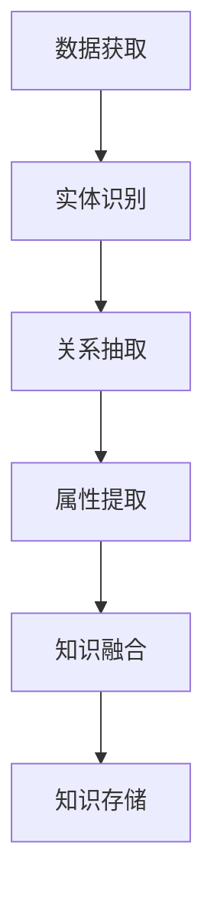
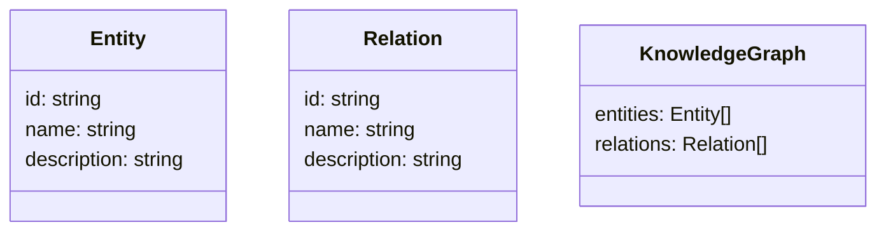
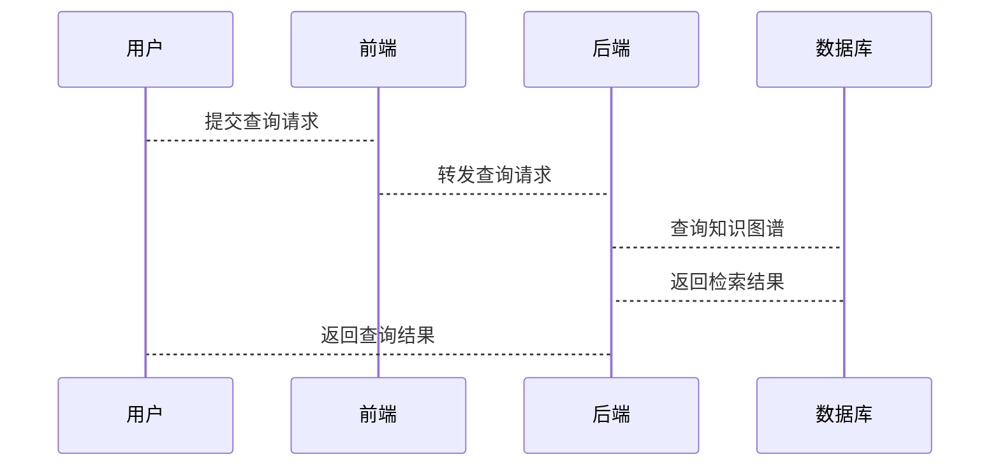

                 


# 构建智能企业知识管理平台：动态知识图谱与语义检索系统

> 关键词：知识图谱，语义检索，动态知识图谱，企业知识管理，智能系统架构

> 摘要：本文详细探讨了构建智能企业知识管理平台的核心技术，重点分析了动态知识图谱与语义检索系统的原理与实现。文章从问题背景出发，系统性地介绍了动态知识图谱的构建方法、语义检索的实现原理，以及如何通过系统架构设计和项目实战来实现高效的智能知识管理。通过本文，读者将深入了解如何利用动态知识图谱和语义检索技术，构建一个智能化、高效率的企业知识管理平台。

---

# 第一部分: 背景介绍

## 第1章: 问题背景与描述

### 1.1 问题背景

#### 1.1.1 知识管理的重要性
在现代企业中，知识管理是提高效率、创新能力和竞争力的关键。企业的核心竞争力往往依赖于对知识的高效管理和利用。传统的企业知识管理方式通常依赖文档存储和简单的关键字检索，这种方式难以应对日益复杂的信息需求。

#### 1.1.2 传统知识管理的局限性
传统知识管理方法存在以下问题：
1. **信息孤岛**：各部门之间的知识无法有效共享和整合。
2. **检索效率低**：基于关键字的检索方式难以理解语义，导致搜索结果不准确。
3. **知识更新慢**：面对动态变化的业务环境，知识更新不够及时。

#### 1.1.3 智能化知识管理的需求
随着人工智能技术的发展，企业对智能化知识管理的需求日益增长。动态知识图谱和语义检索技术能够有效解决传统方法的局限性，为企业提供更高效、更智能的知识管理解决方案。

### 1.2 问题描述

#### 1.2.1 企业知识管理的核心挑战
企业在知识管理过程中面临以下核心挑战：
1. **知识表示**：如何将分散的知识有效地表示为结构化的数据。
2. **知识关联**：如何发现和表示知识之间的关联关系。
3. **动态更新**：如何实时或准实时地更新知识图谱。
4. **语义检索**：如何基于语义进行高效的知识检索。

#### 1.2.2 动态知识图谱的定义
动态知识图谱是一种能够实时或准实时更新的知识表示模型，它通过三元组（实体-关系-实体）的形式，描述现实世界中的实体及其关系，并能够根据实时数据动态更新。

#### 1.2.3 语义检索系统的目标
语义检索系统的目标是通过理解文本的语义含义，提供更准确的相关性检索结果，而不是仅仅依赖关键字匹配。

### 1.3 问题解决与边界

#### 1.3.1 动态知识图谱的解决方案
动态知识图谱通过以下方式解决问题：
1. **实时数据整合**：将企业内外部数据实时整合到知识图谱中。
2. **动态更新机制**：根据数据变化自动更新知识图谱。
3. **语义关联**：通过语义分析技术，发现知识之间的隐含关联。

#### 1.3.2 语义检索系统的边界
语义检索系统的边界包括：
1. **数据范围**：限定于企业内部知识库的数据。
2. **更新频率**：准实时或定时更新。
3. **用户权限**：根据用户权限控制知识检索范围。

#### 1.3.3 知识管理平台的外延
知识管理平台的外延包括：
1. **数据源**：结构化数据、非结构化数据、外部数据。
2. **用户群体**：企业员工、合作伙伴。
3. **应用场景**：内部知识共享、产品设计参考、客户服务支持。

### 1.4 核心要素与组成

#### 1.4.1 知识图谱的三元组模型
知识图谱的核心要素包括：
1. **实体**：知识图谱的基本单元，表示具体的人、事、物。
2. **关系**：实体之间的关联，描述实体间的关系类型。
3. **属性**：实体的描述性信息，如时间、地点等。

#### 1.4.2 语义检索的关键技术
语义检索的关键技术包括：
1. **自然语言处理（NLP）**：用于理解文本语义。
2. **向量表示**：将文本转换为语义向量，用于相似度计算。
3. **图嵌入**：通过图结构学习实体和关系的表示。

#### 1.4.3 平台架构的核心组成
平台架构的核心组成包括：
1. **数据层**：存储原始数据和知识图谱数据。
2. **计算层**：负责知识图谱的构建、更新和语义检索。
3. **应用层**：提供用户交互界面和API接口。

---

# 第二部分: 核心概念与联系

## 第2章: 动态知识图谱与语义检索

### 2.1 核心概念原理

#### 2.1.1 知识图谱的构建原理
知识图谱的构建主要包括以下步骤：
1. **数据获取**：从企业内外部获取结构化和非结构化数据。
2. **实体识别**：通过NLP技术识别文本中的实体。
3. **关系抽取**：提取实体之间的关系。
4. **属性提取**：提取实体的属性信息。
5. **知识融合**：将不同数据源的知识进行整合。

#### 2.1.2 动态知识图谱的更新机制
动态知识图谱的更新机制包括：
1. **实时数据流处理**：对实时数据进行处理并更新知识图谱。
2. **规则驱动更新**：根据预定义的规则自动更新知识图谱。
3. **用户反馈驱动**：根据用户反馈手动或半自动更新知识图谱。

#### 2.1.3 语义检索的实现原理
语义检索的实现原理包括：
1. **文本表示**：将文本转换为语义向量。
2. **相似度计算**：计算查询与候选文本的语义相似度。
3. **排序与推荐**：根据相似度对结果进行排序并推荐。

### 2.2 属性特征对比表

| 特性       | 知识图谱             | 语义检索系统         |
|------------|--------------------|--------------------|
| 核心目标   | 表达知识关联性       | 提供语义相关性搜索   |
| 数据结构   | 三元组（实体-关系-实体） | 文档/实体语义向量   |
| 更新频率   | 动态更新             | 实时或准实时更新    |

### 2.3 ER实体关系图架构

```mermaid
er
    %% 动态知识图谱的实体关系图
    entity(Entity) {
        id: string
        name: string
        description: string
    }
    relation(Relation) {
        id: string
        name: string
        description: string
    }
    entity2relation(Entity2Relation) {
        entityId: string
        relationId: string
        targetId: string
    }
```

---

## 第3章: 算法原理

### 3.1 动态知识图谱构建算法

#### 3.1.1 算法流程



#### 3.1.2 Python代码示例

```python
import networkx as nx

def build_knowledge_graph(text_data):
    G = nx.Graph()
    entities = extract_entities(text_data)
    relations = extract_relations(text_data)
    for entity in entities:
        G.add_node(entity)
    for relation in relations:
        G.add_edge(relation[0], relation[1], relation[2])
    return G
```

#### 3.1.3 数学模型与公式

$$ 知识图谱的表示学习模型：x_i = f(e_i, r_j, e_k) $$

其中，$e_i$ 表示实体 $i$，$r_j$ 表示关系 $j$，$x_i$ 表示实体 $i$ 在关系 $r_j$ 下的表示。

---

## 第4章: 系统分析与架构设计

### 4.1 问题场景介绍

#### 4.1.1 系统总体情况
企业知识管理平台的总体情况包括：
1. **数据来源**：企业内部文档、外部知识库。
2. **用户角色**：企业员工、合作伙伴。
3. **功能需求**：知识检索、知识关联、知识更新。

#### 4.1.2 项目介绍
本项目旨在构建一个基于动态知识图谱的企业知识管理平台，支持实时知识更新和语义检索。

### 4.2 系统功能设计

#### 4.2.1 领域模型



#### 4.2.2 系统架构设计


#### 4.2.3 接口设计
1. **知识图谱构建接口**：提供REST API用于构建和更新知识图谱。
2. **语义检索接口**：提供自然语言查询接口，返回语义相关的知识。

#### 4.2.4 交互流程图



---

## 第5章: 项目实战

### 5.1 环境安装

```bash
pip install networkx
pip install numpy
pip install jieba
```

### 5.2 核心实现

#### 5.2.1 知识图谱构建代码

```python
import jieba
from networkx import *
import matplotlib.pyplot as plt

def extract_entities(text):
    return jieba.lcut(text)

def build_knowledge_graph(text):
    G = Graph()
    entities = extract_entities(text)
    for i in range(len(entities)):
        for j in range(i+1, len(entities)):
            G.add_edge(entities[i], entities[j], relation='关联')
    return G

text = "企业 知识 管理 平台 动态 知识图谱 语义 检索"
graph = build_knowledge_graph(text)
plt.figure(figsize=(8,8))
draw(graph)
plt.show()
```

#### 5.2.2 语义检索实现代码

```python
from sentence_transformers import SentenceTransformer

model = SentenceTransformer('all-MiniLM-L6-v2')
def get_semantic_vector(text):
    return model.encode([text])[0]

query = "什么是知识图谱"
vector = get_semantic_vector(query)
print(vector)
```

### 5.3 实际案例分析

#### 5.3.1 数据分析

| 实体       | 关系         | 目标实体     |
|------------|--------------|--------------|
| 企业       | 是          | 知识图谱     |
| 知识图谱    | 用于         | 语义检索     |

#### 5.3.2 系统实现

```python
def main():
    text = "企业 知识 管理 平台 动态 知识图谱 语义 检索"
    graph = build_knowledge_graph(text)
    plt.figure(figsize=(8,8))
    draw(graph)
    plt.show()

if __name__ == "__main__":
    main()
```

---

## 第6章: 最佳实践、小结、注意事项、拓展阅读

### 6.1 最佳实践

1. **数据质量**：确保数据来源可靠，数据清洗和预处理是关键。
2. **技术选型**：根据需求选择合适的知识图谱构建和语义检索技术。
3. **性能优化**：通过索引优化和缓存机制提升系统性能。

### 6.2 小结
本文详细介绍了构建智能企业知识管理平台的核心技术，包括动态知识图谱的构建方法和语义检索系统的实现原理。通过系统架构设计和项目实战，展示了如何将理论应用于实际。

### 6.3 注意事项

1. **数据隐私**：注意数据隐私和安全问题。
2. **系统扩展性**：确保系统具有良好的扩展性，能够应对数据规模的增加。
3. **用户反馈**：及时收集用户反馈，持续优化系统。

### 6.4 拓展阅读
1. **知识图谱**：深入学习知识图谱的构建和应用。
2. **语义检索**：研究最新的语义检索技术，如基于大语言模型的检索方法。
3. **动态知识图谱**：探索动态知识图谱在其他领域的应用。

---

# 作者：AI天才研究院/AI Genius Institute & 禅与计算机程序设计艺术 /Zen And The Art of Computer Programming

